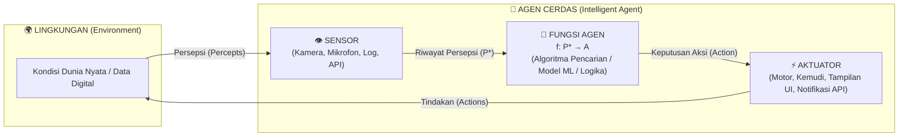
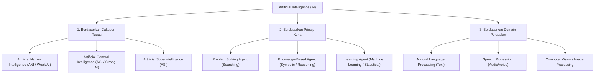
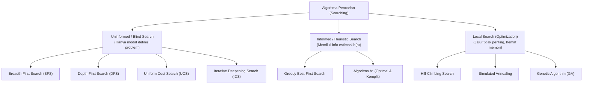
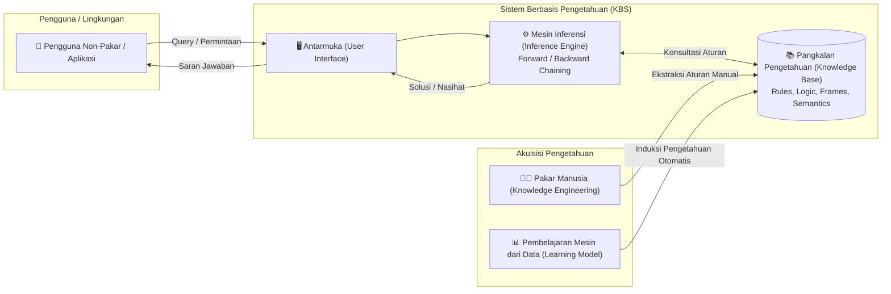
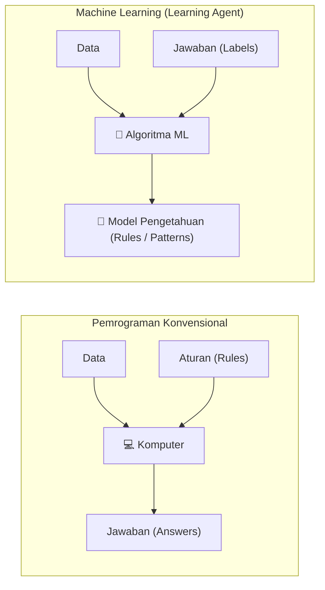
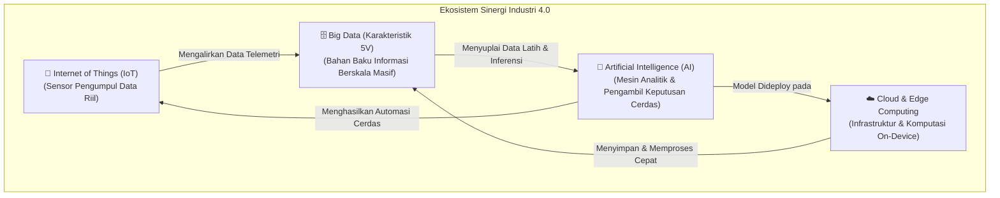
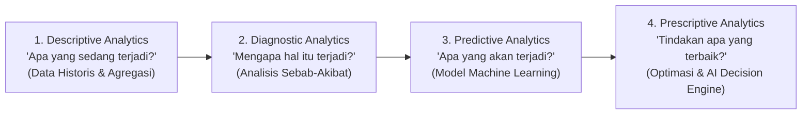
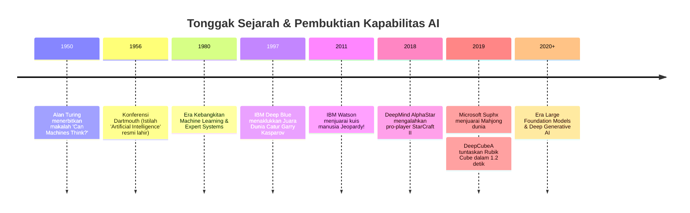
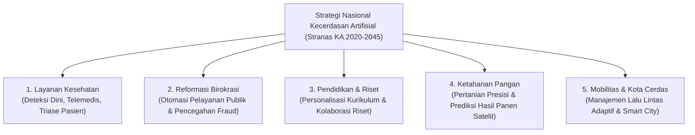

import { Accordion, Accordions } from 'fumadocs-ui/components/accordion';
import { Callout } from 'fumadocs-ui/components/callout';
import { Tab, Tabs } from 'fumadocs-ui/components/tabs';

> **Penyusun Modul:** Mahendar Dwi Payana  
> **Sumber Kurikulum Resmi:** Thematic Academy Digital Talent Scholarship (DTS) 2021 — Badan Penelitian dan Pengembangan SDM Kementerian Komunikasi dan Informatika RI (Kominfo) bekerja sama dengan Tim Pusat AI ITB (PUI-PT AI-VLB)  
> **Tim Penyusun Modul Asal:** Prof. Dwi Hendratmo Widyantoro, Ph.D., Dr. Masayu Leylia Khodra, Dr. Nur Ulfa Maulidevi, Dr. Dessi Puji Lestari, Ir. Windy Gambetta, MBA, Dr. Nugraha Priya Utama, Prof. Ayu Purwarianti, Ph.D.  
> **Acuan Standar Kompetensi:** SKKNI No. 299 Tahun 2020 (Bidang Artificial Intelligence sub bidang Data Science)

---

## 1. Pendahuluan & Informasi Pelatihan

Pertemuan ini meletakkan fondasi konseptual kecerdasan buatan (*Artificial Intelligence* - AI). Di era digitalisasi dan Revolusi Industri 4.0, kecerdasan buatan bukan sekadar tren sesaat (*hype*), melainkan pendorong utama transformasi otomatisasi di berbagai sektor: industri manufaktur, perbankan, kesehatan, hingga tata kelola pemerintahan cerdas (*smart governance*).

### Standar Kompetensi Pembelajaran
* **Tujuan Umum**: Peserta mampu menjelaskan lingkup pelatihan Artificial Intelligence untuk membuat sistem intelijen dari data menggunakan metodologi Data Science sesuai SKKNI.
* **Tujuan Khusus**:
  1. Mampu menjelaskan lingkup dan batasan disiplin ilmu Artificial Intelligence.
  2. Mampu merancang agen cerdas (*Intelligent Agent*) menggunakan kerangka kerja PEAS (*Performance measure, Environment, Actuators, Sensors*) dan mengidentifikasi karakteristik lingkungan tugasnya.
  3. Mampu memetakan taksonomi teknologi AI (berdasarkan *task scope*, prinsip komputasi pemecahan masalah, dan domain aplikasi).
  4. Mampu memahami keterkaitan AI dengan IoT, Cloud/Edge Computing, dan Analitik Big Data.
  5. Mampu mengidentifikasi prioritas Strategi Nasional Kecerdasan Artifisial (Stranas KA) Indonesia serta tantangan etika, privasi, dan transparansi (*Explainable AI*).

---

## 2. Definisi & Paradigma Artificial Intelligence

Kecerdasan Buatan didefinisikan dari berbagai sudut pandang ilmiah. Buku rujukan utama dunia, *Artificial Intelligence: A Modern Approach* (Stuart Russell & Peter Norvig, 2010), mengklasifikasikan definisi AI ke dalam **Empat Kuadran Dimensi**:

<div className="my-6 rounded-2xl border border-border bg-card p-4 shadow-sm sm:p-6">
  <div className="mb-5 text-center">
    <div className="text-sm font-bold text-foreground sm:text-base">
      Empat Sudut Pandang Definisi AI
    </div>
    <div className="text-xs text-muted-foreground">Russell &amp; Norvig, 2010</div>
  </div>

  <div className="grid grid-cols-[auto_1fr_1fr] gap-2 sm:gap-3">
    {/* Header baris */}
    <div />
    <div className="pb-1 text-center text-[10px] font-bold uppercase tracking-wide text-primary sm:text-xs">
      Proses Penalaran (Thinking)
    </div>
    <div className="pb-1 text-center text-[10px] font-bold uppercase tracking-wide text-primary sm:text-xs">
      Manifestasi Perilaku (Acting)
    </div>

    {/* Baris 1: Humanly */}
    <div className="flex items-center justify-center">
      <span
        style={{ writingMode: 'vertical-rl', transform: 'rotate(180deg)' }}
        className="text-[10px] font-bold uppercase tracking-wide text-rose-600 sm:text-xs dark:text-rose-400"
      >
        Menyerupai Manusia (Humanly)
      </span>
    </div>
    <div className="rounded-xl border border-blue-500/30 bg-blue-500/5 p-3 sm:p-4">
      <div className="text-xs font-bold text-blue-700 sm:text-sm dark:text-blue-300">
        Thinking Humanly
      </div>
      <div className="text-[10px] font-medium uppercase tracking-wide text-muted-foreground">
        Cognitive Science
      </div>
      <p className="mt-2 text-[11px] leading-relaxed text-muted-foreground sm:text-xs">
        Membuat komputer berpikir seperti manusia melalui pemodelan ilmu kognitif.
      </p>
      <div className="mt-2 text-[10px] font-semibold text-blue-700/80 sm:text-[11px] dark:text-blue-300/80">
        Contoh: Sistem Kognitif Otak
      </div>
    </div>
    <div className="rounded-xl border border-emerald-500/30 bg-emerald-500/5 p-3 sm:p-4">
      <div className="text-xs font-bold text-emerald-700 sm:text-sm dark:text-emerald-300">
        Acting Humanly
      </div>
      <div className="text-[10px] font-medium uppercase tracking-wide text-muted-foreground">
        Turing Test
      </div>
      <p className="mt-2 text-[11px] leading-relaxed text-muted-foreground sm:text-xs">
        Membuat mesin berperilaku seperti manusia sehingga sulit dibedakan.
      </p>
      <div className="mt-2 text-[10px] font-semibold text-emerald-700/80 sm:text-[11px] dark:text-emerald-300/80">
        Contoh: Uji Imitasi Manusia
      </div>
    </div>

    {/* Baris 2: Rationally */}
    <div className="flex items-center justify-center">
      <span
        style={{ writingMode: 'vertical-rl', transform: 'rotate(180deg)' }}
        className="text-[10px] font-bold uppercase tracking-wide text-rose-600 sm:text-xs dark:text-rose-400"
      >
        Sesuai Standar Rasional (Rationally)
      </span>
    </div>
    <div className="rounded-xl border border-indigo-500/30 bg-indigo-500/5 p-3 sm:p-4">
      <div className="text-xs font-bold text-indigo-700 sm:text-sm dark:text-indigo-300">
        Thinking Rationally
      </div>
      <div className="text-[10px] font-medium uppercase tracking-wide text-muted-foreground">
        Laws of Thought
      </div>
      <p className="mt-2 text-[11px] leading-relaxed text-muted-foreground sm:text-xs">
        Penalaran logis formal (silogisme) untuk menarik kesimpulan yang valid.
      </p>
      <div className="mt-2 text-[10px] font-semibold text-indigo-700/80 sm:text-[11px] dark:text-indigo-300/80">
        Contoh: Logika Inferensi Formal
      </div>
    </div>
    <div className="relative rounded-xl border border-primary/40 bg-primary/10 p-3 ring-1 ring-primary/20 sm:p-4">
      <span className="absolute right-2 top-2 rounded-full bg-primary px-2 py-0.5 text-[9px] font-bold uppercase tracking-wide text-primary-foreground">
        Fokus Utama
      </span>
      <div className="text-xs font-bold text-primary sm:text-sm">
        Acting Rationally
      </div>
      <div className="text-[10px] font-medium uppercase tracking-wide text-muted-foreground">
        Rational Agents
      </div>
      <p className="mt-2 text-[11px] leading-relaxed text-muted-foreground sm:text-xs">
        Agen yang bertindak untuk memaksimalkan ekspektasi ukuran performa.
      </p>
      <div className="mt-2 text-[10px] font-semibold text-primary/80 sm:text-[11px]">
        Contoh: Sistem Cerdas Modern
      </div>
    </div>
  </div>
</div>

### Tabel Komparasi 4 Kuadran Definisi AI

| Dimensi | Berpikir (*Thinking*) | Bertindak (*Acting*) |
| :--- | :--- | :--- |
| **Menyerupai Manusia (*Humanly*)** | **Thinking Humanly (Pendekatan Ilmu Kognitif)**<br />*"Usaha mendebarkan untuk membuat komputer berpikir.. Mesin dengan pikiran, dalam arti harfiah dan utuh."* (Haugeland, 1985)<br />*"Otomatisasi aktivitas yang diasosiasikan dengan pemikiran manusia, seperti pengambilan keputusan, pemecahan masalah, dan pembelajaran."* (Bellman, 1978) | **Acting Humanly (Pendekatan Uji Turing)**<br />*"Seni menciptakan mesin yang melakukan fungsi-fungsi yang membutuhkan kecerdasan ketika dilakukan oleh manusia."* (Kurzweil, 1990)<br />*"Studi tentang cara membuat komputer melakukan hal-hal yang pada saat ini manusia melakukannya secara lebih baik."* (Rich & Knight, 1991) |
| **Rasional (*Rationally*)** | **Thinking Rationally (Hukum Penalaran / Logika)**<br />*"Studi tentang kemampuan mental melalui penggunaan model-model komputasi."* (Charniak & McDermott, 1985)<br />*"Studi tentang komputasi yang memungkinkan sistem untuk mempersepsikan, menalar, dan bertindak."* (Winston, 1992) | **Acting Rationally (Pendekatan Rational Agent)**<br />*"Kecerdasan Komputasional adalah studi tentang perancangan agen-agen cerdas."* (Poole et al., 1998)<br />*"AI berfokus pada perilaku cerdas dalam artefak komputasi."* (Nilsson, 1998) |

<Callout type="info" title="Fokus Utama Sains Komputer & Rekayasa AI Modern">
  Pengembangan AI modern berpusat pada kuadran **Acting Rationally** (*Rational Agent*). Alasannya:
  1. Perilaku manusia sering kali tidak rasional (dipengaruhi bias psikologis, keletihan emosional, dan heuristik jalan pintas yang keliru).
  2. Konsep rasionalitas matematis didefinisikan secara presisi: **mengambil aksi yang memaksimalkan ekspektasi ukuran performa (*expected utility*) berdasarkan riwayat persepsi yang dimiliki**, terlepas dari apakah proses di dalamnya meniru neuron biologis manusia atau murni komputasi aljabar linier.
</Callout>

### Definisi Resmi European Commission (AI HLEG, 2019)
Komisi Uni Eropa melalui *High-Level Expert Group on Artificial Intelligence* merumuskan AI sebagai:
> *"Sistem perangkat lunak (dan perangkat keras) yang dirancang oleh manusia yang, setelah diberi tujuan yang kompleks, bertindak di dunia fisik atau digital dengan mempersepsikan lingkungannya melalui akuisisi data, menafsirkan data yang dikumpulkan, bernalar tentang pengetahuan, atau memproses informasi yang diperoleh dari data ini, dan memutuskan tindakan terbaik yang harus diambil untuk mencapai tujuan yang diberikan."*

---

## 3. Perancangan Agen Cerdas (*Intelligent Agent*) & Kerangka PEAS

Secara fundamental, sistem AI dapat dimodelkan sebagai **Intelligent Agent** (Agen Cerdas) yang beroperasi dalam suatu lingkungan (*Environment*):



### Formulasi Matematis Fungsi Agen
Perilaku agen cerdas diabstraksikan secara matematis ke dalam fungsi pemetaan:

$$
f: P^* \to A
$$

Di mana:
* $P^*$: Urutan lengkap riwayat persepsi (*percept history/sequence*) yang pernah diterima sensor sejak agen pertama kali diaktifkan.
* $A$: Ruang aksi (*action space*) yang tersedia dan dapat dieksekusi oleh aktuator agen.

### Metodologi Perancangan PEAS
Sebelum menulis sebaris kode pun, seorang perekayasa AI (*AI Engineer*) wajib menyusun spesifikasi **PEAS**:
1. **Performance Measure (P)**: Metrik objektif keberhasilan tugas agen (apa indikator suksesnya?).
2. **Environment (E)**: Dunia luar atau ekosistem operasional di mana agen ditempatkan.
3. **Actuators (A)**: Piranti keluaran untuk memanipulasi lingkungan.
4. **Sensors (S)**: Piranti masukan untuk menangkap kondisi lingkungan.

#### Contoh Desain PEAS Nyata

<Tabs items={['Autonomous Taxi Driver', 'Smart Vacuum Cleaner Robot']}>
  <Tab value="Autonomous Taxi Driver">
    * **Performance Measure**: Keamanan berkendara (nol kecelakaan), kecepatan mencapai tujuan, kepatuhan rambu dan regulasi lalu lintas, kenyamanan penumpang, efisiensi bahan bakar/baterai, maksimalisasi profit tarif.
    * **Environment**: Jalan raya beraspal, persimpangan, rambu lampu merah, pejalan kaki, kendaraan lain, kondisi cuaca (hujan/berkabut), penumpang di kabin.
    * **Actuators**: Kemudi setir, pedal gas (akselerator), pedal rem, transmisi persneling, lampu sein, klakson, layar display navigasi.
    * **Sensors**: Kamera resolusi tinggi (RGB), LiDAR, radar ultrasonik (sonar), sensor kecepatan (speedometer), GPS satelit, akselerometer 6-axis, sensor diagnostik mesin OBD-II.
  </Tab>
  <Tab value="Smart Vacuum Cleaner Robot">
    * **Performance Measure**: Tingkat kebersihan lantai (persentase kotoran terhisap), efisiensi konsumsi daya baterai, kecepatan durasi pembersihan, minim benturan terhadap furnitur, tidak terjatuh dari tangga.
    * **Environment**: Lantai keramik/kayu/karpet, dinding ruangan, kaki meja dan kursi, pintu, tangga, rintangan dinamis (hewan peliharaan, kabel berserakan, orang berjalan).
    * **Actuators**: Motor roda penggerak kiri dan kanan, motor penyedot debu (suction fan), sikat sapu berputar (roller brush), dispenser pel air, lampu LED indikator, speaker notifikasi suara.
    * **Sensors**: Sensor inframerah pendeteksi jarak (IR proximity), sensor bumper mekanis, sensor tebing (cliff sensor pencegah jatuh), sensor optik penumpukan debu, sensor gyro / visual SLAM / LIDAR pembuat peta ruangan.
  </Tab>
</Tabs>

---

## 4. Analisis 7 Karakteristik Lingkungan Tugas (*Task Environment*)

Tipe lingkungan secara radikal menentukan pilihan arsitektur dan algoritma sistem AI yang harus digunakan. Russell & Norvig membagi lingkungan tugas menjadi **7 dimensi independen**:

1. **Fully Observable vs. Partially Observable**:
   * *Fully*: Sensor agen memberikan akses komprehensif ke seluruh kondisi lingkungan pada setiap titik waktu (tidak ada informasi yang tersembunyi).
   * *Partially*: Sensor tidak lengkap, terhalang derau (*noisy*), atau ada elemen tak terlihat (seperti kartu lawan dalam poker atau kabut jalan raya).
2. **Deterministic vs. Stochastic**:
   * *Deterministic*: Kondisi masa depan lingkungan sepenuhnya ditentukan oleh kondisi saat ini dan aksi yang dieksekusi agen.
   * *Stochastic*: Mengandung ketidakpastian probabilistik di luar kendali agen. Jika lingkungan bersifat deterministik kecuali karena aksi agen lain yang cerdas, disebut lingkungan **Strategic**.
3. **Episodic vs. Sequential**:
   * *Episodic*: Pengalaman agen dibagi ke dalam episode-episode mandiri. Tindakan pada episode saat ini tidak memengaruhi masa depan (contoh: klasifikasi gambar cacat produk di pabrik).
   * *Sequential*: Tindakan saat ini memengaruhi semua keputusan dan kondisi di masa depan (contoh: catur atau navigasi kendaraan).
4. **Static vs. Dynamic**:
   * *Static*: Lingkungan tidak mengalami perubahan selama agen sedang berpikir (*deliberating*).
   * *Dynamic*: Lingkungan terus berubah selagi agen memproses keputusan. Jika lingkungannya diam tetapi nilai performa agen berkurang seiring berjalannya waktu, disebut **Semi-dynamic** (contoh: catur dengan jam pengatur waktu).
5. **Discrete vs. Continuous**:
   * *Discrete*: Jumlah *state*, pembacaan sensor, dan aksi yang mungkin dilakukan dapat dihitung secara tegas (contoh: petak papan catur 8x8).
   * *Continuous*: Besaran nilai mengalir dalam kontinum riil tak terhingga (contoh: sudut putar kemudi setir, kecepatan laju km/jam, waktu kontinu).
6. **Single-Agent vs. Multi-Agent**:
   * *Single-agent*: Agen beroperasi sendirian menyelesaikan tugas (contoh: menyelesaikan teka-teki Sudoku).
   * *Multi-agent*: Lingkungan memuat agen lain yang perilakunya bisa bersifat kooperatif (bekerja sama) atau kompetitif (bermusuhan/bersaing).
7. **Known vs. Unknown**:
   * *Known*: Agen atau perancang mengetahui aturan main dan hukum kausalitas lingkungan secara sempurna (aturan catur).
   * *Unknown*: Agen harus mengeksplorasi lingkungan untuk memahami hukum dan dampaknya (seperti game baru tanpa tutorial).

### Tabel Matriks Perbandingan Lingkungan

| Karakteristik Lingkungan | Catur dengan Jam (*Chess with Clock*) | Catur tanpa Jam (*Chess without Clock*) | Kemudi Taksi Otonom (*Autonomous Taxi*) | Robot Vacuum Cleaner |
| :--- | :---: | :---: | :---: | :---: |
| **Observabilitas** | Fully Observable | Fully Observable | Partially Observable | Partially Observable |
| **Kepastian State** | Strategic (Deterministik) | Strategic (Deterministik) | Stochastic | Stochastic |
| **Hubungan Waktu** | Sequential | Sequential | Sequential | Sequential |
| **Dinamika Perubahan** | **Semi-dynamic** | **Static** | **Dynamic** | **Dynamic** |
| **Kuantisasi State** | Discrete | Discrete | Continuous | Continuous |
| **Jumlah Agen** | Multi-Agent (Kompetitif) | Multi-Agent (Kompetitif) | Multi-Agent (Campuran) | Single-Agent |
| **Pengetahuan Aturan** | Known | Known | Known / Unknown (Cuaca) | Known |

---

## 5. Taksonomi & Klasifikasi Teknologi Artificial Intelligence

Teknologi AI dikelompokkan berdasarkan 3 sudut pandang: **cakupan tugas**, **prinsip komputasi**, dan **domain persoalan**.



### A. Berdasarkan Cakupan Tugas (*Task Scope*)
1. **Artificial Narrow Intelligence (ANI / Weak AI)**:
   * Dirancang khusus untuk menyelesaikan **satu tugas spesifik** dengan akurasi sangat tinggi.
   * Tidak memiliki kesadaran umum dan tidak dapat mentransfer kemampuannya ke domain lain secara spontan.
   * *Contoh*: Chatbot reservasi tiket pesawat, sistem klasifikasi penyakit kulit, mesin rekomendasi e-commerce, AlphaGo.
2. **Artificial General Intelligence (AGI / Strong AI)**:
   * Mesin komputasi yang memiliki kapasitas intelektual menyeluruh setara manusia, mampu bernalar lintas domain, memecahkan masalah baru tanpa pelatihan awal, dan beradaptasi fleksibel.
3. **Artificial Superintelligence (ASI)**:
   * Entitas hipotesis yang melampaui kemampuan kognitif gabungan seluruh manusia paling jenius dalam sains, kreativitas seni, hingga strategi sosial.

---

### B. Berdasarkan Prinsip Kerja Komputasi

#### 1. Problem Solving Agent (Algoritma Pencarian)
Agen pemecah masalah bekerja ketika **ruang keadaan solusi (*solution state space*) sudah dapat didefinisikan dari awal**. Agen mencari urutan aksi yang menghubungkan keadaan awal menuju tujuan (*goal state*).

* **4 Komponen Formulasi Masalah**:
  1. *Initial State*: Keadaan awal di mana agen mulai beroperasi.
  2. *Operator / Successor Function*: Himpunan aksi yang diizinkan untuk bertransisi dari satu keadaan ke keadaan berikutnya.
  3. *Goal Test*: Kondisi pengecekan apakah keadaan saat ini telah memenuhi kriteria tujuan.
  4. *Path Cost*: Akumulasi biaya jalur (misal: jarak tempuh kilometer, waktu tempuh, atau konsumsi energi).



* **Evaluasi Matematis Algoritma $A^*$ Search**:
  Algoritma $A^*$ mengevaluasi simpul $n$ menggunakan fungsi biaya total:

  $$
  f(n) = g(n) + h(n)
  $$

  * $g(n)$: Biaya nyata yang telah dikeluarkan dari *initial state* menuju simpul $n$.
  * $h(n)$: Estimasi biaya heuristik dari simpul $n$ menuju simpul tujuan (*goal state*). Jika $h(n)$ bersifat *admissible* (tidak pernah melebih-lebihkan biaya riil / tidak *overestimate*), maka $A^*$ dijamin menghasilkan solusi paling optimal (*optimal & complete*).
* **Contoh Kasus**: *Route Planning* (pencarian rute terpendek antar-kota pada GPS) dan *Map Coloring* (pewarnaan wilayah peta tanpa ada wilayah bertetangga yang sewarna menggunakan *Constraint Satisfaction Problem*).

---

#### 2. Knowledge-Based Agent (KBS) & Symbolic AI
Agen berbasis pengetahuan memanfaatkan basis pengetahuan eksplisit untuk memecahkan masalah yang ruang solusinya **belum terdefinisi secara pasti (*ill-structured / non-deterministic*)**. Solusi diturunkan melalui penalaran (*inference engine*).



##### Komparasi: KBS vs. Pemrograman Konvensional

| Dimensi Pembeda | Knowledge-Based System (KBS) | Program Konvensional |
| :--- | :--- | :--- |
| **Karakteristik Masalah** | *Ill-structured problem* (Solusi mengandung ketidakpastian, tujuan belum terdefinisi kaku) | *Well-structured problem* (Solusi eksak, langkah algoritma terstruktur pasti) |
| **Mekanisme Eksekusi** | Pakar mendefinisikan aksi/aturan; urutan eksekusi diputuskan secara dinamis oleh *inference engine/interpreter* | Pemrogram (*programmer*) mendefinisikan langkah aksi sekaligus urutan eksekusi baris-per-baris |
| **Formula Inti** | $\text{KBS} = \text{Metode Pemecahan Masalah} + \text{Domain Knowledge} + \text{Data}$ | $\text{Program Konvensional} = \text{Algoritma} + \text{Struktur Data}$ |

##### 5 Tipe Pengetahuan (*Knowledge Types*)
1. **Declarative Knowledge**: Pengetahuan faktual mengenai konsep, fakta, dan objek di dunia nyata ("tahu apa").
2. **Procedural (Imperative) Knowledge**: Pengetahuan tentang tata cara mengeksekusi sesuatu, mencakup aturan (*rules*), strategi kerja, dan prosedur operasional ("tahu bagaimana").
3. **Meta Knowledge**: Pengetahuan tingkat lanjut yang menjelaskan atau memverifikasi pengetahuan lain (keandalan suatu aturan, batasan domain).
4. **Heuristic Knowledge**: Aturan praktis (*rules of thumb*) yang dirumuskan berdasarkan akumulasi pengalaman masa lalu (efektif secara praktis, meski tanpa pembuktian formal).
5. **Structural Knowledge**: Pengetahuan yang memetakan relasi antar-konsep, seperti hubungan *is-a* (kategori), *kind-of* (varian), atau *part-of* (bagian dari keseluruhan).

##### 4 Teknik Representasi Pengetahuan
* **Production Rules**: Kaidah berformat `IF <kondisi> THEN <aksi/konsekuensi>`. Dieksekusi melalui *Forward Chaining* (bergerak dari fakta masukan ke kesimpulan) atau *Backward Chaining* (bergerak dari hipotesis tujuan ke fakta pendukung).
* **Logical Representation**: Notasi logika formal (*Propositional Logic* dan *First-Order Predicate Logic*). Contoh: $\forall x (\text{Mahasiswa}(x) \to \text{Rajin}(x))$.
* **Semantic Networks**: Graf berarah di mana simpul (*nodes*) merepresentasikan konsep/objek dan busur berlabel (*arcs*) merepresentasikan relasi semantik antar-objek.
* **Frame Representation**: Struktur data berjenjang yang memuat kumpulan *slot* (atribut) dan *filler* (nilai atribut) untuk mendeskripsikan suatu entitas secara komprehensif.

<Callout type="tip" title="Mengapa Symbolic AI Masih Diperlukan di Era Modern?">
  Meskipun Machine Learning statistik sangat dominan, representasi simbolik (*Symbolic AI*) tetap tidak tergantikan dalam hal:
  * **Explanation**: Mampu memberikan runutan pembuktian logis mengapa suatu keputusan diambil (krusial pada vonis hukum dan diagnosis medis).
  * **Planning**: Menyusun urutan langkah bertahap yang harus taat batasan ketat.
  * **Diagnosis**: Menelusuri rantai kegagalan mekanikal kompleks.
  
  Sistem AI terdepan modern mengadopsi pendekatan **Hybrid** (menggabungkan statistical perception + symbolic reasoning), seperti **IBM Watson** dan **Apple Siri**.
</Callout>

---

#### 3. Statistical & Learning Agent (Machine Learning)
Jika pada Symbolic KBS pengetahuan harus dirumuskan secara manual oleh perekayasa pengetahuan (*knowledge engineer*) bersama pakar, pada **Learning Agent**, mesin menginduksi pengetahuan secara otomatis langsung dari data empiris:



* **Mengapa Perlu Pembelajaran (*Why Need Learning?*)**:
  1. *Perancang tidak serba-tahu (*designer lacks omniscience*)*: Manusia tidak dapat mengantisipasi seluruh variasi kondisi di dunia nyata.
  2. *Lingkungan tidak diketahui (*unknown environments*)*: Agen harus mampu beradaptasi terhadap perubahan tren data secara dinamis.
  3. *Kompleksitas persepsi*: Manusia tahu cara membedakan wajah kucing dan anjing dalam tempo milidetik, tetapi tidak mampu menuliskan rumus aturan matematika *if-else* dari jutaan nilai piksel RGB citra secara manual.

##### 3 Paradigma Pembelajaran Mesin
1. **Supervised Learning (Pembelajaran Terawasi)**:
   * Diberikan himpunan data berpasangan masukan-keluaran $(x_i, y_i)$.
   * Tugas agen: Mempelajari fungsi pemetaan $\hat{y} = h(x)$ yang meminimalkan kesalahan prediksi (*error*).
   * *Aplikasi*: Klasifikasi citra medis, regresi estimasi harga properti, deteksi spam.
2. **Unsupervised Learning (Pembelajaran Tak Terawasi)**:
   * Diberikan himpunan data masukan $x_i$ tanpa label target apapun.
   * Tugas agen: Menemukan pola tersembunyi (*latent patterns*), struktur klaster alami, atau kompresi dimensi data.
   * *Aplikasi*: Segmentasi profil nasabah perbankan, deteksi anomali fraud, visualisasi data dimensi tinggi (PCA/t-SNE).
3. **Reinforcement Learning (Pembelajaran Penguatan)**:
   * Agen berinteraksi langsung dengan lingkungan dinamis melalui siklus aksi-persepsi.
   * Tidak ada guru yang memberikan label benar/salah secara langsung; agen hanya menerima umpan balik berupa sinyal penghargaan (*reward*) atau penalti (*punishment*).
   * *Aplikasi*: Robotika otonom, kendali kemudi mandiri, *game AI* (AlphaGo, AlphaStar).

---

### C. Berdasarkan Domain Persoalan Aplikasi

1. **Natural Language Processing (NLP)**:
   * Pengolahan bahasa alami teks manusia yang terbagi atas:
     * *Natural Language Understanding (NLU)*: Pemahaman makna teks, ekstraksi entitas (*Named Entity Recognition*), analisis sentimen, dan klasifikasi topik.
     * *Natural Language Generation (NLG)*: Pembangkitan teks baru, peringkasan dokumen otomatis (*text summarization*), penerjemahan mesin (*machine translation*).
   * Masukan dapat berasal dari teks digital, hasil konversi suara ke teks (*Automatic Speech Recognition* - ASR), dokumen hasil pemindaian *Optical Character Recognition* (OCR), maupun translasi bahasa isyarat.
2. **Speech Processing**:
   * Teknologi pengolahan sinyal gelombang suara manusia, mencakup:
     * *Speech Recognition (ASR)*: Mengubah sinyal akustik suara menjadi transkripsi teks.
     * *Speech Synthesis (Text-to-Speech / TTS)*: Mengubah teks tertulis menjadi ucapan audio alami.
     * *Speaker Recognition (Voice Biometrics)*: Mengenali atau memverifikasi identitas individu dari sidik suaranya (*voice print*).
     * *Paralinguistics*: Menganalisis emosi pembicara (marah, senang, sedih), aksen dialek, dan perkiraan gender.
3. **Computer Vision & Image Processing**:
   * Rekayasa pengenalan visual komputer dari citra 2D maupun video berurutan (*frame-by-frame*).
   * *Aplikasi*: *Face Recognition* (verifikasi identitas), pelacakan jarak sosial dan kerumunan, deteksi penggunaan masker, inspeksi cacat manufaktur otomatis.

---

## 6. AI dalam Revolusi Industri 4.0 & Ekosistem Big Data

Kecerdasan Buatan merupakan inti penggerak Revolusi Industri 4.0 yang berkonvergensi secara sinergis dengan **tiga pilar teknologi lainnya**:



### Karakteristik Big Data: Prinsip 5V
1. **Volume**: Jumlah akumulasi data yang luar biasa besar (terabyte, petabyte, hingga zettabyte) yang melampaui kapasitas basis data relasional konvensional.
2. **Velocity**: Kecepatan aliran data yang dihasilkan dan harus diproses secara seketika (*real-time streaming* per detik atau per milidetik).
3. **Variety**: Keanekaragaman ragam format data: terstruktur (tabel SQL), semi-terstruktur (JSON, XML), dan tidak terstruktur (teks narasi bebas, audio, citra, video).
4. **Veracity**: Tingkat keandalan, kebenaran fakta, integritas, dan kebersihan data dari derau (*noise*).
5. **Value**: Kapasitas konversi data mentah menjadi nilai tambah ekonomi konkret, dampak sosial, efisiensi operasional, dan kepuasan pengguna.

### 4 Unsur Ekosistem Big Data
Aliran data dalam ekosistem perusahaan modern melalui 4 tahapan berurutan:
1. **Data Sources**: Sistem transaksional ERP, CRM, basis data OLAP, sensor IoT, serta aliran media sosial.
2. **Acquisition & Storage**: Pemrosesan *Batch* (terjadwal berkala) dan *Streaming* (aliran seketika) ke dalam media penyimpanan terdistribusi (*Distributed Storage / Data Lake* seperti HDFS, GCS, S3).
3. **Analytics**: Pemodelan statistik, pencarian pola asosiasi/korelasi, *knowledge reasoning*, hingga *Machine Learning, NLP, dan Computer Vision*.
4. **Consumption**: Penyajian luaran kepada pemangku kepentingan dalam bentuk dasbor Business Intelligence (BI), visualisasi analitik grafik, maupun integrasi API ke aplikasi produksi.

### 4 Tingkatan Analitik Data (*Data Analytics Spectrum*)



1. **Descriptive Analytics**: Memberikan ringkasan keadaan operasional saat ini berdasarkan catatan data historis (contoh: laporan tren penjualan bulanan, dasbor KPI).
2. **Diagnostic Analytics**: Menyelidiki akar masalah (*root cause*) mengapa suatu deviasi atau anomali terjadi dengan mengkorelasikan berbagai variabel historis (contoh: diagnosis penyebab lonjakan tingkat *churn* pelanggan di wilayah tertentu).
3. **Predictive Analytics**: Memproyeksikan probabilitas kejadian masa depan berdasarkan pola laten data historis menggunakan algoritma Machine Learning (contoh: estimasi curah hujan, prediksi risiko kredit macet nasabah pinjaman).
4. **Prescriptive Analytics**: Tingkatan tertinggi di mana sistem tidak hanya memprediksi, tetapi juga merekomendasikan opsi tindakan terbaik secara otomatis beserta estimasi konsekuensi tiap opsi (contoh: sistem navigasi GPS yang menyarankan pengalihan rute dinamis untuk menghindari kemacetan mendadak, optimasi alokasi inventaris gudang logistik).

---

## 7. Kronologi Perkembangan AI & Analisis "Why Now?"

### Linimasa Sejarah & Tonggak Kemenangan AI atas Manusia



* **1997 (IBM Deep Blue)**: Membuktikan keunggulan algoritma pencarian heuristik pohon catur dalam ruang pencarian deterministik dengan memeriksa 200 juta posisi bidak per detik.
* **2011 (IBM Watson)**: Menunjukkan keunggulan integrasi NLP, representasi ontologi pengetahuan, dan pencarian bukti terdistribusi untuk memahami pertanyaan teka-teki berbahasa alami manusia secara instan.
* **2018 (DeepMind AlphaStar)**: Mengalahkan atlet profesional dalam game *StarCraft II*. Kemenangan ini sangat monumental karena *StarCraft II* bercirikan lingkungan *partially observable*, ruang aksi kontinu sangat masif, dan keputusan sekuensial jangka panjang.
* **2019 (Microsoft Suphx)**: Menjuarai kompetisi Mahjong, membuktikan kemampuan penalaran AI di bawah lingkungan kompetitif dengan informasi tidak lengkap (*imperfect information*).
* **2019 (DeepCubeA - UCLA)**: Menemukan solusi penyelesaian acakan Kubus Rubik dalam **1,2 detik**, mengungguli catatan waktu tercepat rekor dunia manusia saat itu (3,47 detik).

### Faktor Kunci "Why Now?" (Mengapa AI Meledak Saat Ini?)
Meskipun konsep teoritis kecerdasan buatan telah digagas sejak tahun 1950-an, lonjakan eksponensial baru terjadi dalam satu dekade terakhir karena konvergensi tiga faktor penentu:
1. **Computing Hardware**: Kehadiran akselerator perangkat keras paralel masif seperti **GPU (Graphics Processing Unit)**, **TPU (Tensor Processing Unit)**, dan klaster *Cloud Supercomputing* yang mampu memangkas waktu komputasi pelatihan model jaringan saraf dari berbulan-bulan menjadi hitungan jam.
2. **Algorithm Breakthroughs**: Terobosan algoritma **Deep Learning** (seperti *backpropagation* modern, normalisasi batch, arsitektur *Residual Networks*, mekanisme *Attention & Transformer*) yang mampu mempelajari representasi fitur hierarkis data tanpa rekayasa manual.
3. **Data Availability**: Ledakan ketersediaan data dunia (lebih dari 90% data yang ada di dunia saat ini tercipta hanya dalam beberapa tahun terakhir), didorong oleh pemakaian internet seluler global, sensor IoT, kamera digital, dan transaksi e-commerce.

---

## 8. Penerapan di Indonesia & Strategi Nasional AI (Stranas KA)

Pemerintah Republik Indonesia telah merilis cetak biru resmi **Strategi Nasional Kecerdasan Artifisial (Stranas KA) 2020-2045** untuk mewujudkan visi Indonesia Emas 2045. Dokumen ini menetapkan **5 Bidang Prioritas Utama**:



### Contoh Implementasi Terapan di Indonesia
* **Monitoring Keselamatan Publik**: Pemanfaatan *Computer Vision* kamera CCTV cerdas untuk estimasi kerumunan fisik, pemantauan kepatuhan masker saat krisis kesehatan, dan penelusuran mobilitas warga.
* **Verifikasi eKYC & Biometrik (Dukcapil & Finansial)**:
  * Pengenalan wajah (*Face Recognition*) dan biometrik suara (*Voice Biometrics*) untuk proses *electronic-Know Your Customer* (eKYC) perbankan yang tersinkronisasi dengan data kependudukan nasional (Dukcapil).
  * Menghasilkan otentikasi identitas **10 kali lebih cepat** dibandingkan pencocokan manual konvensional, memangkas biaya operasional, dan ramah aksesibilitas bagi penyandang disabilitas.
* **Digitalisasi Dokumen (OCR & Transkripsi Suara)**:
  * Konversi otomatis dokumen identitas (e-KTP, NPWP, Paspor, SIM), faktur belanja (*invoice*), formulir transaksi, dan akta menjadi data digital terstruktur.
* **Notulensi Rapat Otomatis (*Meeting Analytics - Prosa.ai*)**:
  * Mengintegrasikan teknologi *Automatic Speech Recognition* (ASR) bahasa Indonesia, pemisahan pembicara (*speaker diarization*), dan analitik teks ekstraksi ringkasan notulensi secara langsung (*real-time*).

---

## 9. Tantangan Etika, Regulasi & Masa Depan AI di Indonesia

Meskipun potensi AI sangat revolusioner, Indonesia menghadapi **5 tantangan kritis** yang harus diantisipasi secara komprehensif:

1. **Regulasi & Etika Pemanfaatan**:
   * Kemampuan generatif suara (*speech synthesis*) dan manipulasi video (*deepfake*) berisiko tinggi dimanfaatkan untuk memproduksi konten hoaks, penipuan rekayasa sosial, dan pencemaran nama baik.
   * Diperlukan kerangka regulasi dan pedoman etika AI nasional yang menjamin akuntabilitas pengembang dan kepatuhan hukum.
2. **Privasi & Keamanan Data Pribadi**:
   * Pelatihan model AI membutuhkan volume data sangat masif. Sesuai Undang-Undang Pelindungan Data Pribadi (UU PDP), pengumpulan dan penggunaan data wajib mengantongi izin subjek data, melalui teknik *anonymization*, dan mencegah kebocoran informasi sensitif (*PII*).
3. **Transparansi Keputusan & Explainable AI (XAI)**:
   * Banyak model pembelajaran mesin modern (terutama *Deep Neural Networks*) beroperasi sebagai "kotak hitam" (*Black Box*).
   * Pada ranah kritis (seperti penolakan kredit pinjaman atau diagnosis kanker), sistem AI wajib memiliki pertanggungjawaban ilmiah: *mengapa kesimpulan tersebut diambil?* Kebutuhan auditabilitas ini melahirkan disiplin **Explainable AI**.
4. **Ketersediaan & Bias Data Latih**:
   * Kualitas model AI bergantung pada representasi data latihnya (*"Garbage In, Garbage Out"*).
   * Jika data latih didominasi demografi tertentu, model akan menghasilkan bias diskriminatif terhadap kelompok minoritas. Data latih harus mencerminkan keragaman etnis, bahasa daerah, dan karakteristik sosial masyarakat Indonesia.
5. **Kesenjangan Talenta Digital**:
   * Tanpa ketersediaan talenta digital yang kompeten dalam merancang dan memelihara sistem AI, Indonesia berisiko hanya menjadi target pasar konsumtif bagi teknologi asing.
   * Standardisasi kompetensi melalui **SKKNI No. 299 Tahun 2020** dan program pelatihan intensif seperti Digital Talent Scholarship (DTS) menjadi instrumen strategis penyiapan SDM unggul nasional.

---

## 10. Lembar Tugas & Evaluasi Mandiri (*Assignments*)

Berdasarkan kurikulum modul pelatihan DTS 2021, peserta wajib menyelesaikan tiga proyek evaluasi mandiri berikut:

<Accordions>
  <Accordion title="Tugas 1: Analisis Komparatif Strategi AI Global">
    Pilihlah salah satu dokumen strategi AI nasional dari negara maju (misalnya: *National AI Strategy* Amerika Serikat, *AI Roadmap* Singapura, atau *AI Strategy* Uni Eropa). Buatlah rangkuman kritis komparatif mengenai fokus pendanaan, pilar riset, tata kelola data, dan kerangka etika yang mereka terapkan, serta pelajaran berharga yang dapat diadaptasi oleh Indonesia.
  </Accordion>

  <Accordion title="Tugas 2: Spesifikasi Rancangan PEAS Robot Pembersih Ruangan Cerdas">
    Rancanglah arsitektur agen cerdas untuk robot pembersih ruangan modern (*Smart Cleaning Robot*) dengan menguraikan:
    * **Performance Indicator**: Rumuskan formula skor keberhasilan pembersihan dan efisiensi waktu/daya.
    * **Environment**: Deskripsikan kondisi lingkungan fisik lantai dan rintangan yang dihadapi.
    * **Actuators**: Rinci aktuator motor gerak, sikat, dan modul hisap yang dikendalikan.
    * **Sensors**: Rinci konfigurasi sensor (sonar, bumper, LiDAR, cliff sensor) yang dipasang untuk mempersepsikan lingkungan.
  </Accordion>

  <Accordion title="Tugas 3: Perancangan Solusi AI untuk Mitigasi Krisis / Pandemi">
    Rancanglah satu ide inovasi sistem cerdas yang solutif untuk mengatasi tantangan kesehatan atau mitigasi krisis sosial di masyarakat:
    * Jelaskan deskripsi fungsional dan arsitektur umum teknologi tersebut.
    * Identifikasi dan klasifikasikan teknik utama yang Anda gunakan: apakah berbasis **Searching (Problem Solving Agent)**, **Knowledge-Based System (Symbolic Reasoning)**, atau **Machine Learning (Learning Agent)**? Jelaskan pertimbangan ilmiah di balik pemilihan teknik tersebut!
  </Accordion>
</Accordions>

---

## 11. Implementasi Python: Simulasi Agen Berbasis Aturan vs. Agen Pencarian Sederhana

Berikut adalah contoh kode Python yang mendemonstrasikan perbedaan mendasar antara **Reflex Agent** (sistem aturan sederhana) dan **Problem Solving Agent** (algoritma pencarian rute jalur):

```python
"""
Pertemuan 02: Demonstrasi Komparasi Agen Cerdas
1. Simple Reflex Agent (Kondisi-Aksi)
2. Problem Solving Agent (Pencarian Jalur BFS)

Disusun oleh: Mahendar Dwi Payana
Sumber acuan: Modul DTS 2021 (Tim Pusat AI ITB)
"""

from collections import deque

# ==============================================================================
# 1. SIMPLE REFLEX AGENT (Berdasarkan Persepsi Sesaat)
# ==============================================================================
class ReflexVacuumAgent:
    """
    Agen refleks sederhana untuk pembersih ruangan dua petak (A dan B).
    Fungsi agen memetakan: [Lokasi, Status_Kotoran] -> Aksi
    """
    def __init__(self):
        pass

    def evaluate_action(self, location, status):
        # Aturan kondisi-aksi (Production Rules)
        if status == "DIRTY":
            return "SUCK (Membersihkan Debu)"
        elif location == "A":
            return "RIGHT (Pindah ke Ruang B)"
        elif location == "B":
            return "LEFT (Pindah ke Ruang A)"
        return "NO-OP (Diam)"


# ==============================================================================
# 2. PROBLEM SOLVING AGENT (Pencarian Solusi Graf dengan BFS)
# ==============================================================================
class RouteProblemSolvingAgent:
    """
    Agen pemecah masalah untuk Route Planning antar-kota.
    Mencari urutan aksi optimal dari Initial State ke Goal State.
    """
    def __init__(self, road_map):
        self.road_map = road_map

    def find_shortest_path(self, start_city, goal_city):
        # Antrean untuk Breadth-First Search (BFS)
        queue = deque([(start_city, [start_city])])
        visited = set([start_city])

        while queue:
            current_city, path = queue.popleft()

            # Goal Test
            if current_city == goal_city:
                return path

            # Suksesor / Tetangga
            for neighbor in self.road_map.get(current_city, []):
                if neighbor not in visited:
                    visited.add(neighbor)
                    queue.append((neighbor, path + [neighbor]))

        return None


# ==============================================================================
# EKSEKUSI DEMONSTRASI
# ==============================================================================
if __name__ == "__main__":
    print("=== 1. DEMONSTRASI REFLEX AGENT ===")
    vacuum = ReflexVacuumAgent()
    scenarios = [("A", "DIRTY"), ("A", "CLEAN"), ("B", "DIRTY"), ("B", "CLEAN")]
    
    for loc, stat in scenarios:
        action = vacuum.evaluate_action(loc, stat)
        print(f"Persepsi: [Ruang: {loc}, Kondisi: {stat:<5}] -> Aksi Agen: {action}")

    print("\n=== 2. DEMONSTRASI PROBLEM SOLVING AGENT (ROUTE PLANNING) ===")
    # Peta rute jalan sederhana (Graf tak berarah)
    indonesia_map = {
        "Jakarta": ["Bandung", "Cirebon"],
        "Bandung": ["Jakarta", "Cirebon", "Tasikmalaya"],
        "Cirebon": ["Jakarta", "Bandung", "Semarang"],
        "Tasikmalaya": ["Bandung", "Yogyakarta"],
        "Semarang": ["Cirebon", "Solo", "Surabaya"],
        "Yogyakarta": ["Tasikmalaya", "Solo"],
        "Solo": ["Semarang", "Yogyakarta", "Surabaya"],
        "Surabaya": ["Semarang", "Solo"]
    }

    router = RouteProblemSolvingAgent(indonesia_map)
    asal = "Jakarta"
    tujuan = "Surabaya"
    rute_terpilih = router.find_shortest_path(asal, tujuan)

    print(f"Kota Asal  : {asal}")
    print(f"Kota Tujuan: {tujuan}")
    print(f"Urutan Aksi Rute Terpendek: {' -> '.join(rute_terpilih)}")
```

---

## 12. Referensi Pustaka & Video Pembelajaran

### Daftar Pustaka Utama
1. **Stuart J. Russell & Peter Norvig** (2010). *Artificial Intelligence: A Modern Approach*, 3rd Edition. Upper Saddle River, New Jersey: Prentice-Hall International, Inc.
2. **Ayu Purwarianti, Bambang Riyanto, Dessi Puji Lestari, Intan Muchtadi Alamsyah, Nugraha Priya Utama, Ridwan Sutriadi, Sapto Wahyu Indratno, & Sophi Damayanti** (2021). *Artificial Intelligence di Masa Pandemi*. Bandung: ITB Press.
3. **Kementerian Ketenagakerjaan RI** (2020). *Keputusan Menteri Ketenagakerjaan RI No. 299 Tahun 2020 tentang Penetapan Standar Kompetensi Kerja Nasional Indonesia (SKKNI) Kategori Aktivitas Profesional, Ilmiah dan Teknis Golongan Pokok Aktivitas Konsultasi Manajemen Bidang Artificial Intelligence Subbidang Data Science*.
4. **Badan Pengkajian dan Penerapan Teknologi (BPPT)** (2020). *Strategi Nasional Kecerdasan Artifisial Indonesia 2020-2045*. Jakarta: Kementerian Riset dan Teknologi / BPPT.

### Tautan Kuliah & Video Terpilih (DTS 2021)
* **Pengantar Dasar AI**:
  * [What is Artificial Intelligence? (Introduction)](https://www.youtube.com/watch?v=s9vDgPotU-4)
  * [Artificial Intelligence in 5 Minutes](https://www.youtube.com/watch?v=wfmM5-d0Zh0)
  * [AI Ecosystem & Industrial Revolution 4.0](https://www.youtube.com/watch?v=eUpRwSrwbHY)
* **Perancangan Intelligent Agent & PEAS**:
  * [Structure of Intelligent Agents (Russell & Norvig)](https://www.youtube.com/watch?v=XqAUPrLu8_s)
  * [Task Environment Classification (PEAS)](https://www.youtube.com/watch?v=ehXgvsl8i_I)
  * [Solving Problems by Searching](https://www.youtube.com/watch?v=NqeVTW4DUuU)
* **Knowledge-Based Systems & Reasoning**:
  * [Introduction to Knowledge-Based Systems](https://www.youtube.com/watch?v=P2DVmc4Zf7I)
  * [Inference Engine: Forward vs. Backward Chaining](https://www.youtube.com/watch?v=VhKPNctwInw)
  * [Symbolic AI vs. Machine Learning](https://www.youtube.com/watch?v=7iZWC_NtegM)
