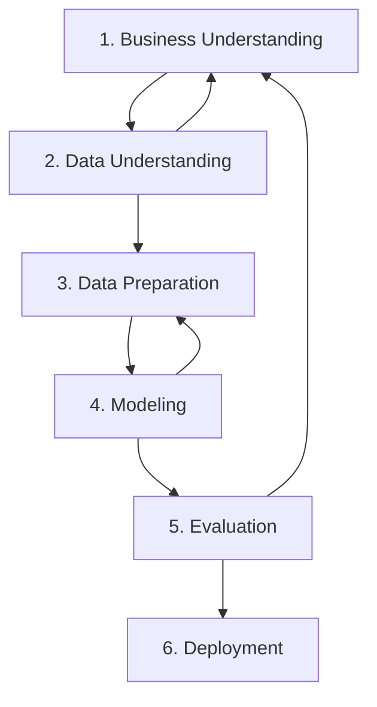

> **Penyusun Modul:** Mahendar Dwi Payana  
> **Acuan Silabus:** DTS Kominfo - STEI ITB (Ir. Windy Gambetta, MBA) & SKKNI No. 299 Tahun 2020

---

## 1. Urgensi Metodologi dalam Proyek Data Science

Studi dari Gartner dan MIT Sloan menunjukkan bahwa lebih dari **80% proyek sains data dan AI gagal mencapai tahap produksi**. Faktor kegagalan terbesar bukan terletak pada algoritma machine learning, melainkan pada:
- Ketiadaan pemahaman masalah bisnis yang jelas (*ill-defined business problems*).
- Kurangnya keterlibatan pemangku kepentingan (*stakeholders*).
- Proses pembersihan dan validasi data yang tidak sistematis.
- Ketiadaan kerangka kerja terstruktur untuk mengulang (*iterative loop*) eksperimen.

Oleh karena itu, penguasaan metodologi sains data menjadi kompetensi fundamental yang membedakan seorang insinyur AI profesional dari sekadar pembuat kode skrip (*script runner*).

---

## 2. Metodologi CRISP-DM (Cross-Industry Standard Process for Data Mining)

CRISP-DM merupakan metodologi proses terbuka (*open standard*) yang paling banyak diadopsi di dunia industri data science internasional.



### 6 Tahapan CRISP-DM:
1. **Business Understanding**:
   - Menentukan tujuan bisnis (*business objectives*) dan kriteria kesuksesan.
   - Menerjemahkan kebutuhan bisnis menjadi sasaran teknis pemodelan data.
   - Menyusun rencana proyek (*project charter*) dan penilaian risiko (*risk assessment*).
2. **Data Understanding**:
   - Mengumpulkan data mentah awal (*initial data collection*).
   - Mengeksplorasi data (*Exploratory Data Analysis / EDA*), mengidentifikasi tipe atribut dan pola distribusi.
   - Memverifikasi kualitas data (menemukan pencilan, ketidaklengkapan, atau anomali data).
3. **Data Preparation**:
   - Memilih baris (*records*) dan kolom (*features*) yang relevan.
   - Melakukan pembersihan data (*data cleansing*): imputasi nilai kosong, normalisasi, dan penanganan inkonsistensi.
   - Membangun atribut baru (*feature engineering*) dan menyatukan beberapa sumber tabel (*data merging*).
   - **Fase ini umumnya menyita 70% - 80% dari total waktu kerja proyek.**
4. **Modeling**:
   - Memilih algoritma pemodelan yang sesuai (Regresi, Klasifikasi, Clustering, ANN).
   - Membagi data menjadi subset *Train, Validation, Test* untuk mencegah bias.
   - Mengatur parameter model (*hyperparameter tuning*) untuk performa optimal.
5. **Evaluation**:
   - Menguji performa model terhadap data uji menggunakan metrik evaluasi yang tepat (Precision, Recall, F1, ROC-AUC, RMSE).
   - Meninjau kembali apakah solusi model telah memenuhi tujuan bisnis awal.
   - Menentukan keputusan: apakah model siap di-deploy atau perlu perbaikan data/fitur kembali.
6. **Deployment**:
   - Merancang arsitektur integrasi model ke sistem produksi (REST API, batch scoring, microservices).
   - Membangun antarmuka web interaktif untuk pengguna akhir.
   - Menyiapkan strategi monitoring performa dan pemeliharaan model berkala (*model drift monitoring*).

---

## 3. Perbandingan Kerangka Kerja: CRISP-DM vs OSEMN vs Microsoft TDSP

| Metodologi | Tahapan Inti | Kekuatan Utama | Cocok Digunakan Untuk |
| :--- | :--- | :--- | :--- |
| **CRISP-DM** | Business → Data Understanding → Preparation → Modeling → Evaluation → Deployment | Berorientasi bisnis yang kuat, iteratif, teruji selama dekade | Proyek industri skala menengah, riset terapan, konsultansi |
| **OSEMN** | **O**btain → **S**crub → **E**xplore → **M**odel → i**N**terpret | Berorientasi alur teknis data scientist perorangan | Eksplorasi analitik cepat, hackathon, riset akademik |
| **Microsoft TDSP** | Business Understanding → Data Acquisition → Modeling → Deployment → Customer Acceptance | Dukungan kolaborasi tim besar, standar struktur repositori kode, integrasi cloud MLOps | Tim enterprise skala besar, lingkungan DevOps modern |

---

## 4. Struktur Direktori Proyek Data Science Standar Industri (Cookiecutter Data Science)

Salah satu ciri profesionalisme dalam data science adalah penataan direktori yang rapi dan terstandarisasi:

<Files>
  <Folder name="data" defaultOpen>
    <File name="raw/ (Data mentah read-only)" />
    <File name="interim/ (Data bersih parsial)" />
    <File name="processed/ (Data siap model)" />
  </Folder>
  <Folder name="notebooks" defaultOpen>
    <File name="01_data_understanding.ipynb" />
    <File name="02_eda_and_cleaning.ipynb" />
    <File name="03_model_training.ipynb" />
  </Folder>
  <Folder name="src" defaultOpen>
    <File name="__init__.py" />
    <File name="data_loader.py" />
    <File name="preprocessing.py" />
    <File name="model_pipeline.py" />
  </Folder>
  <Folder name="models">
    <File name="best_model.joblib" />
  </Folder>
  <File name="requirements.txt" />
  <File name="README.md" />
</Files>

---

## 5. Implementasi Python: Pelacakan Eksperimen Sederhana (*Experiment Tracker*)

Salah satu bagian penting dalam evaluasi pemodelan adalah mencatat setiap iterasi eksperimen secara sistematis:

```python
"""
Sistem Pelacakan Eksperimen Sederhana untuk Siklus CRISP-DM
Disusun oleh: Mahendar Dwi Payana
"""

import json
from datetime import datetime

class ExperimentTracker:
    def __init__(self, experiment_file="experiment_history.json"):
        self.experiment_file = experiment_file
        self.history = []
        
    def log_run(self, model_name, hyperparameters, metrics, notes=""):
        run_data = {
            "run_id": f"EXP-{len(self.history) + 1:03d}",
            "timestamp": datetime.now().isoformat(),
            "model": model_name,
            "hyperparameters": hyperparameters,
            "metrics": metrics,
            "notes": notes
        }
        self.history.append(run_data)
        print(f"Berhasil mencatat {run_data['run_id']} | Model: {model_name} | Akurasi/F1: {metrics.get('f1_score', 'N/A')}")
        
    def show_leaderboard(self):
        print("\n" + "=" * 70)
        print("PAPAN PERINGKAT EKSPERIMEN (LEADERBOARD)")
        print(f"{'Run ID':<10} | {'Model':<20} | {'F1 Score':<10} | {'Catatan'}")
        print("-" * 70)
        for r in self.history:
            f1 = r['metrics'].get('f1_score', 0)
            print(f"{r['run_id']:<10} | {r['model']:<20} | {f1:<10.4f} | {r['notes']}")
        print("=" * 70)

# Contoh penggunaan
if __name__ == "__main__":
    tracker = ExperimentTracker()
    
    # Eksperimen 1: Baseline Model
    tracker.log_run(
        model_name="LogisticRegression",
        hyperparameters={"C": 1.0, "max_iter": 100},
        metrics={"accuracy": 0.81, "f1_score": 0.79},
        notes="Baseline model dengan fitur standar"
    )
    
    # Eksperimen 2: Random Forest dengan Feature Engineering
    tracker.log_run(
        model_name="RandomForestClassifier",
        hyperparameters={"n_estimators": 100, "max_depth": 5},
        metrics={"accuracy": 0.88, "f1_score": 0.86},
        notes="Penambahan fitur rasio numerik"
    )
    
    tracker.show_leaderboard()
```

---

## 6. Latihan Mandiri & Evaluasi

1. Pilih salah satu kasus nyata di organisasi atau lingkungan sekitar Anda (misalnya: prediksi keterlambatan mahasiswa, diagnosis medis awal, atau retensi nasabah).
2. Tuliskan analisis pemetaan proyek tersebut ke dalam 6 fase CRISP-DM lengkap dengan definisi objektif bisnis dan kriteria keberhasilannya.
