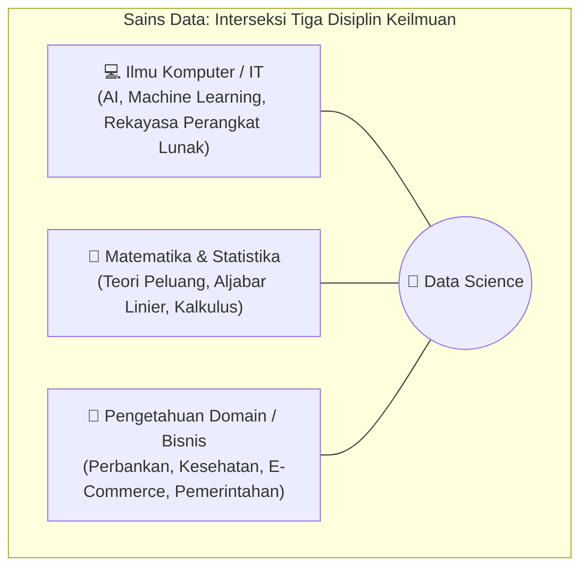
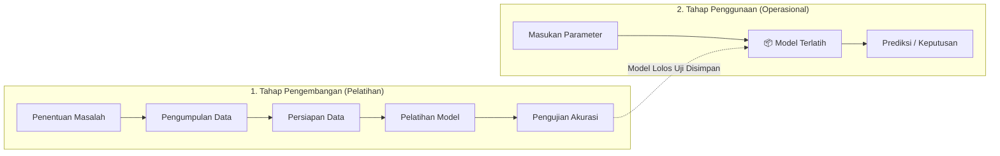
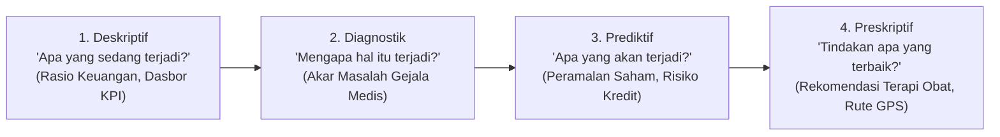
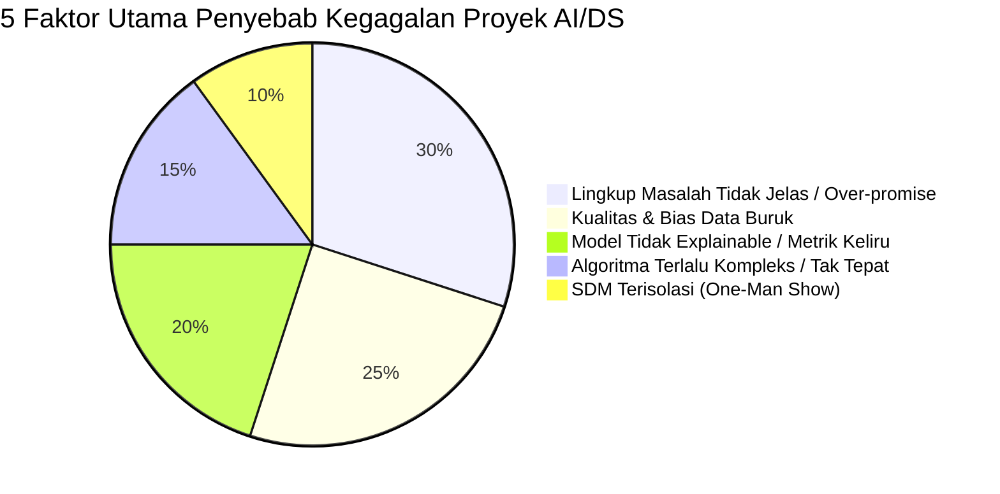
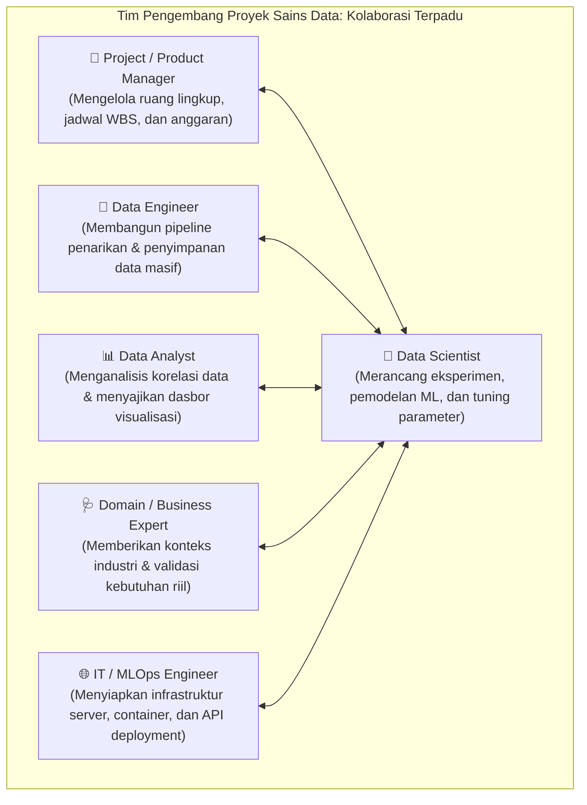
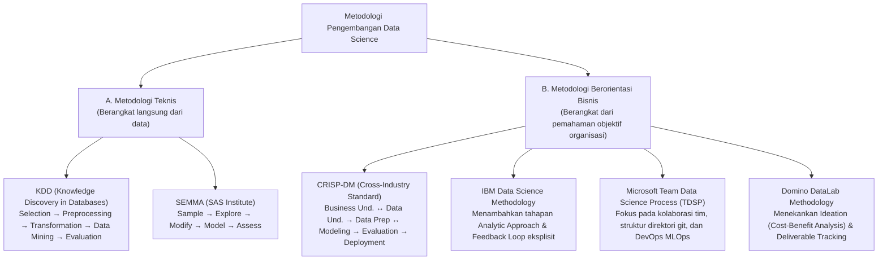
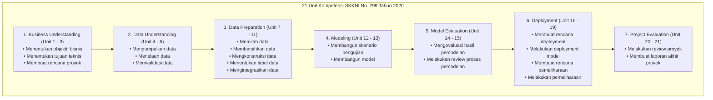
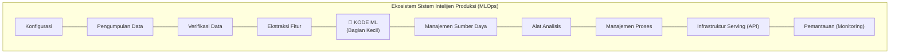

import { Accordion, Accordions } from 'fumadocs-ui/components/accordion';
import { Callout } from 'fumadocs-ui/components/callout';
import { Tab, Tabs } from 'fumadocs-ui/components/tabs';

> **Penyusun Modul:** Mahendar Dwi Payana  
> **Sumber Kurikulum Resmi:** Thematic Academy Digital Talent Scholarship (DTS) 2021 — Badan Penelitian dan Pengembangan SDM Kementerian Komunikasi dan Informatika RI (Kominfo)  
> **Instruktur & Pengembang Modul Asal:** Ir. Windy Gambetta, MBA (Sekolah Teknik Elektro dan Informatika - STEI ITB)  
> **Acuan Standar Kompetensi:** SKKNI No. 299 Tahun 2020 (Bidang Artificial Intelligence sub bidang Data Science)

---

## 1. Urgensi Metodologi dalam Proyek Data Science

Pemanfaatan kecerdasan buatan (*Artificial Intelligence*) dan pembelajaran mesin (*Machine Learning*) saat ini telah menjadi prioritas strategis di berbagai organisasi. Namun, terdapat sebuah kesalahpahaman mendasar yang kerap terjadi di industri:

$$
\mathbf{Pengembangan\ Sistem\ AI\ Berbasis\ Data} \neq \mathbf{Data} + \mathbf{Algoritma\ Machine\ Learning}
$$

Sekadar mengunduh *dataset* dan mengeksekusi algoritma *Machine Learning* tidak menjamin lahirnya sistem intelijen yang berdaya guna dan bernilai bisnis. Tanpa panduan metodologi yang terstruktur, mayoritas proyek sains data berakhir dengan kegagalan.



### Dua Tahap Pemanfaatan Data
Untuk mewujudkan sistem intelijen berbasis data yang andal, proyek dijalankan dalam dua fase besar:
1. **Tahap Pengembangan / Pelatihan (*Training Phase*)**: Proses mengekstraksi pola tersembunyi (*knowledge discovery*) dari kumpulan data historis (basis data relasional atau *Big Data*) dan membekukan pengetahuan tersebut ke dalam suatu artefak model.
2. **Tahap Penggunaan / Operasional (*Inference Phase*)**: Pemanfaatan model yang telah dipasang (*deployed*) ke dalam sistem aplikasi untuk menjawab pertanyaan bisnis secara seketika (*real-time inference*).



---

## 2. Spektrum Kemampuan Sistem & 7 Tugas Analitiks

Sistem intelijen yang dibangun diklasifikasikan berdasarkan spektrum kedewasaan analitis dan sasaran tugas yang diselesaikannya:



### 7 Ragam Tugas Analitiks (*Analytics Tasks*)

| No | Tugas Analitiks | Karakteristik Output | Contoh Kasus Nyata di Industri |
| :---: | :--- | :--- | :--- |
| **1** | **Regresi / Estimasi** | Nilai numerik kontinu | Menaksir nilai wajar harga properti berdasarkan luas dan lokasi; memprediksi pergerakan harga saham esok hari. |
| **2** | **Klasifikasi** | Label kelas/kategori diskret | Menentukan status kelayakan kredit nasabah bank (*Lancar*, *Dalam Perhatian*, *Macet*); mendeteksi apakah suatu perusahaan berisiko bangkrut dalam kurun 2 tahun ke depan. |
| **3** | **Klustering** | Pengelompokan tanpa label | Segmentasi nasabah perbankan berdasarkan pola transaksi dan saldo; pengelompokan riwayat rekam medis pasien yang memiliki kemiripan gejala klinis. |
| **4** | **Asosiasi** | Kumpulan item/kejadian bersamaan | *Market Basket Analysis* (menemukan kombinasi barang ritel yang sering dibeli bersama untuk strategi *cross-selling*); perancangan portofolio investasi saham. |
| **5** | **Deteksi Anomali** | Kasus abnormal langka | Mendeteksi transaksi gesek kartu kredit ilegal (*fraud detection*); mendeteksi penyusupan tidak sah pada lalu lintas jaringan komputer (*intrusion detection*). |
| **6** | **Sequence Mining** | Prediksi urutan aksi berikutnya | Memprediksi langkah navigasi pembeli di platform e-commerce (apakah akan membatalkan belanja atau menuju *checkout*); analisis risiko pemutusan langganan (*churn*). |
| **7** | **Sistem Rekomendasi** | Usulan item berbasis preferensi | Mesin rekomendasi film Netflix, kurasi daftar lagu Spotify, dan rekomendasi produk terkait pada marketplace e-commerce. |

---

## 3. Fakta Empiris: Mengapa Mayoritas Proyek Sains Data Gagal?

Laporan riset industri global menunjukkan realitas yang sangat menantang:
* **Gartner Research**: Lebih dari **85% proyek Big Data dan AI gagal** memberikan dampak bisnis nyata.
* **Gartner 2018**: Sebanyak **80% proyek AI tetap menjadi "alkimia"** (eksperimen terisolasi yang dijalankan oleh segelintir ilmuwan tanpa mampu di-skala-kan ke seluruh organisasi).
* **NewVantage Partners Survey 2019**: **77% eksekutif puncak** menyatakan bahwa adopsi bisnis atas inisiatif Big Data dan AI terus menjadi tantangan utama organisasi mereka.



### 5 Akar Masalah Kegagalan:
1. **Lingkup Masalah (*Problem Scope*)**: Masalah bisnis tidak dirumuskan secara tegas dan terukur. AI kerap dijadikan *jargon* pemasaran sehingga memicu ekspektasi berlebihan (*over-promising*) yang melampaui kemampuan data.
2. **Kualitas Data (*Data Issues*)**: Data tidak tersedia, sampel terbatas, atau kualitasnya buruk (banyak nilai kosong, inkonsistensi penamaan). Tim teknis sering kali tidak memahami arti semantik data di lapangan, serta mengabaikan aspek bias keterwakilan (*sampling bias*).
3. **Model Tidak Tepat (*Model Issues*)**: Model menghasilkan akurasi yang rendah, mengalami *overfitting*, atau bersifat *Black-Box* sehingga tidak dapat dipahami (*lack of explainability*) oleh pimpinan bisnis.
4. **Algoritma Terlalu Rumit (*Algorithm Complexity*)**: Terpaku pada algoritma yang rumit (*sophisticated*) hanya karena tren, padahal model yang lebih sederhana (seperti Regresi Logistik atau Decision Tree) jauh lebih andal dan mudah diaudit.
5. **Sumber Daya Manusia (*Human Resources*)**: Proyek sains data keliru dianggap sebagai pekerjaan perseorangan (*one-man show*). Padahal pengembangan sistem cerdas menuntut kolaborasi erat tim multi-peran:



<Callout type="warn" title="Definisi Formal Metodologi Pengembangan Sains Data">
  Untuk mengatasi risiko kegagalan di atas, proyek sains data wajib mengadopsi metodologi:  
  **"Metoda iteratif yang dipakai untuk menyelesaikan masalah dengan menggunakan data dan pendekatan sains data melalui urutan langkah yang terstandardisasi."**
</Callout>

---

## 4. Taksonomi Metodologi Sains Data di Industri

Secara garis besar, metodologi sains data terbagi menjadi dua mazhab: **Metodologi Teknis** dan **Metodologi Berorientasi Bisnis**.



### A. Metodologi Teknis
* **KDD (Knowledge Discovery in Databases - Fayyad et al., 1996)**: Berfokus pada pemurnian data: *Data $\to$ Selection $\to$ Preprocessing $\to$ Transformation $\to$ Data Mining $\to$ Evaluation/Interpretation*.
* **SEMMA (SAS Institute)**: Siklus berulang terintegrasi: *Sample* (pengambilan cuplikan data representatif), *Explore* (analisis tren dan anomali), *Modify* (rekayasa fitur dan seleksi variabel), *Model* (eksekusi algoritma pembelajaran mesin), dan *Assess* (evaluasi keandalan pola).

### B. Metodologi Berorientasi Bisnis
* **CRISP-DM**: Standar de-facto industri paling populer dengan sifat non-linier dan iteratif.
* **IBM Data Science Methodology**: Menyempurnakan CRISP-DM dengan memisahkan tahap penentuan strategi komputasi (*Analytic Approach*) serta menyematkan lingkar umpan balik (*feedback loop*) dari pengguna operasional.
* **Microsoft TDSP**: Menggabungkan metodologi data science dengan disiplin rekayasa perangkat lunak modern (Git flow, sprint agile, standarisasi repositori Cookiecutter, integrasi pipeline CI/CD Azure ML).
* **Domino DataLab**: Mengedepankan fase awal *Ideation* yang dilengkapi kalkulasi kelayakan finansial (*Cost-Benefit Analysis*) sebelum dana riset dialokasikan.

---

## 5. Pemetaan 21 Unit Kompetensi SKKNI No. 299 Tahun 2020

Pemerintah Republik Indonesia melalui Kementerian Ketenagakerjaan telah mengesahkan **Keputusan Menteri Ketenagakerjaan No. 299 Tahun 2020** tentang Standar Kompetensi Kerja Nasional Indonesia (SKKNI) Bidang Artificial Intelligence Sub-bidang Data Science. 

Standar ini memetakan **21 Unit Kompetensi Kerja** ke dalam 7 fungsi utama yang menjadi cetak biru kurikulum pelatihan ini:



---

## 6. Tujuh Langkah Generik Pengembangan Aplikasi Data Science

Mengacu pada standar SKKNI No. 299 Tahun 2020 dan kurikulum ITB, berikut adalah bedah rinci ketujuh tahapan eksekusi proyek:

### 6.1 Business Understanding (Penentuan Masalah Bisnis)
Tahapan awal untuk memastikan bahwa solusi yang dikembangkan benar-benar menyelesaikan kebutuhan nyata pemangku kepentingan:
* **Perumusan Masalah**: Mengubah problem bisnis kualitatif menjadi rumusan kuantitatif. Contoh: Masalah rasio pinjaman bermasalah (*Non-Performing Loan* / NPL) perbankan yang tinggi diubah menjadi tujuan spesifik: *"Bagaimana memperbaiki penetapan Credit Score calon debitur agar rasio gagal bayar menurun sebesar 15%?"*.
* **Pemetaan Tugas Analitiks**: Memilih apakah masalah NPL diselesaikan melalui pendekatan **Regresi** (menaksir skor kontinu $0-100$) atau **Klasifikasi** (mengelompokkan ke dalam kategori risiko: *Sangat Layak, Layak, Kurang Layak, Ditolak*).
* **Pemilihan Metrik Performansi**: Menetapkan tolok ukur kesuksesan teknis yang selaras dengan bisnis:
  * Regresi: *Root Mean Squared Error* (RMSE), $R^2$ Score, *Mean Absolute Error* (MAE).
  * Klasifikasi: *Precision*, *Recall*, *F1-Score*, *Log-Loss*, *ROC-AUC*.
* **Manajemen & Kelayakan Proyek**:
  * *Cost-Benefit Analysis (CBA)*: Menimbang estimasi biaya personel tim, komputasi cloud, dan akuisisi data terhadap potensi keuntungan penambahan omzet atau mitigasi kerugian risiko.
  * *Situation Assessment*: Mengidentifikasi ketersediaan infrastruktur data internal, regulasi privasi, dan analisis risiko.
  * *Project Plan*: Menyusun rincian rencana kerja (*Work Breakdown Structure* / WBS) beserta linimasa jadwal.

---

### 6.2 Data Understanding (Mendalami & Mengenali Data)
Data yang dikumpulkan harus ditelaah secara menyeluruh sebelum dimanipulasi:
* **Pengumpulan Data**: Menghimpun data dari berbagai sumber (basis data transaksional internal ERP/CRM, file flat CSV/Excel, Web API, open data pemerintah).
* **Telaah Eksploratif (Exploratory Data Analysis - EDA)**:
  * *Analisis Univariat*: Memeriksa statistik deskriptif tiap kolom (rata-rata, median, deviasi standar, sebaran kuartil, dan keberadaan *missing values*).
  * *Analisis Multivariat*: Menyelidiki korelasi antar-fitur dan hubungan antara fitur prediktor terhadap variabel target menggunakan uji statistik (Pearson, Spearman, ANOVA, Chi-Square).
* **Validasi Kualitas Data**:
  * Mengidentifikasi rasio ketimpangan kelas (*Imbalanced Data*). Misalnya pada transaksi kartu kredit, kasus fraud sering kali hanya memiliki perbandingan 1:200 terhadap transaksi sah. Ketimpangan ini harus diantisipasi agar model tidak menghasilkan akurasi semu.
  * Memastikan data bebas dari bias demografis (gender, suku, agama) untuk menjamin asas keadilan (*fairness*).

<Callout type="info" title="Pelajaran Berharga: Survivorship Bias Abraham Wald (PD II)">
  Pada Perang Dunia II, militer AS menganalisis lubang peluru pada pesawat pengebom yang berhasil kembali dari medan tempur. Kerusakan terbanyak terkonsentrasi pada bagian sayap, badan, dan ekor pesawat. Mayoritas perwira menyarankan penambahan pelat baja pada bagian-bagian tersebut.  
  Namun, ahli statistik **Abraham Wald** memberikan analisis jenius sebaliknya: **Pelat baja harus dipasang pada bagian mesin yang justru bersih dari lubang peluru!** Mengapa? Karena pesawat yang tertembak di bagian mesin tidak pernah kembali (jatuh di medan perang) sehingga tidak masuk dalam sampel data pengamatan.  
  *Insight Data Science*: **Memahami data yang tidak ada / mekanisme missing data (Survivorship Bias) sama pentingnya dengan menganalisis data yang tampak di layar.**
</Callout>

---

### 6.3 Data Preparation (Persiapan & Penyiapan Data)
Fase paling intensif yang mengonsumsi 70% hingga 80% total waktu siklus proyek:
1. **Memilih dan Memilah Data**: Membuang baris data duplikat atau kolom yang tidak memiliki relevansi kausalitas terhadap variabel target (misalnya: NIK, nama pasien, atau nomor rekening).
2. **Membersihkan Data (*Data Cleansing*)**:
   * Imputasi nilai kosong (*missing values*) menggunakan rata-rata (*mean*) atau median untuk data numerik, dan modus (nilai terbanyak) untuk data kategorikal.
   * Imputasi berbasis relasi antar-fitur (misal: gaji kosong diisi berdasarkan rata-rata gaji karyawan pada tingkat golongan jabatan yang sama).
3. **Merekonstruksi Data (*Feature Engineering*)**:
   * *Normalisasi & Standardisasi*: Menyamakan skala fitur numerik (Min-Max Scaling $[0, 1]$ atau Z-score Standardization) agar fitur berangka besar tidak mendominasi algoritma gradien.
   * *Transformasi Data*: Mengubah data numerik kontinu ke dalam kelompok interval (*binning/bucketing*), serta mengubah variabel kategorikal menjadi *One-Hot Encoding* / variabel dummy.
   * *Reduksi Dimensi*: Mereduksi multikolinearitas fitur menggunakan teknik *Principal Component Analysis* (PCA).
4. **Integrasi Data (*Data Integration*)**: Menggabungkan (*merge/join*) tabel-tabel data yang terpisah menjadi satu *dataframe* terpadu dengan memastikan konsistensi tipe data dan penanganan kunci relasi (*primary-foreign keys*).

---

### 6.4 Modeling (Pengembangan Model Pembelajaran Mesin)
* **Skenario Pemodelan**:
  * Menyeleksi algoritma yang sesuai karakteristik masalah: *k-Nearest Neighbors (k-NN), Naïve Bayes, Regresi Linier/Logistik, Support Vector Machines (SVM), Decision Tree, Random Forest, hingga Deep Learning*.
  * Membagi data secara ketat menjadi **Data Latih (*Training Set*)** dan **Data Uji (*Testing Set*)** dengan proporsi 80:20 atau 70:30 (menggunakan teknik *Stratified Splitting* untuk data imbalanced).
* **Strategi Eksperimen Parameter**:
  * *Best Guess*: Menentukan parameter awal berdasarkan pengalaman pakar.
  * *One Factor at a Time (OFAT)*: Mengubah satu parameter secara berurutan sembari menahan parameter lain konstan.
  * *Grid Search / Random Search*: Eksplorasi kombinasi hiperparameter secara sistematis untuk menemukan konfigurasi dengan skor validasi silang (*Cross-Validation*) terbaik.

---

### 6.5 Model Evaluation (Evaluasi Model & Peninjauan Proses)
* **Evaluasi Teknis**: Menguji model terhadap data uji (*unseen data*) untuk mengukur apakah model mampu melakukan generalisasi dengan baik atau mengalami *overfitting*. Menerapkan uji hipotesis statistik (*t-test* atau *Wilcoxon signed-rank test*) untuk memverifikasi apakah peningkatan performa model baru bernilai signifikan secara ilmiah dibanding model dasar (*baseline*).
* **Evaluasi Bisnis**: Memastikan luaran model dapat dijelaskan secara transparan kepada manajemen (*Explainable AI*), tidak melanggar rambu kepatuhan hukum (*regulatory compliance*), dan memberikan dampak finansial positif terukur.
* **Evaluasi Proses**: Meninjau kembali seluruh tahapan kerja untuk memastikan tidak ada celah kebocoran data (*data leakage*) sebelum melangkah ke tahap pemasangan di server produksi.

---

### 6.6 Deployment (Pemasangan & Operasionalisasi Model)
* **Pemasangan Model**: Membungkus model biner terlatih (format `.joblib` atau `.onnx`) ke dalam layanan mikro (*microservice*) REST API berbasis FastAPI/Flask atau aplikasi antarmuka web Streamlit.
* **Tantangan Lingkungan Operasional**: Kode *Machine Learning* hanyalah komponen kecil dari keseluruhan ekosistem operasional (*Hidden Technical Debt in ML Systems*):



* **Pemantauan & Degradasi Model**:
  * *Data Skew*: Perbedaan distribusi data di dunia nyata dibandingkan data latih masa lalu.
  * *Model Staleness / Concept Drift*: Perubahan perilaku konsumen dan populasi seiring berjalannya waktu.
  * *Model Retraining & Decommissioning*: Jika performa model turun di bawah ambang batas (*threshold*) yang ditentukan, picu proses pelatihan ulang (*retraining*); atau hentikan pemakaian (*decommission*) jika asumsi masalah bisnis telah usang.

---

### 6.7 Project Evaluation (Evaluasi Proyek & Pelaporan Akhir)
* **Kilas Balik Proyek (*Retrospective*)**: Mendokumentasikan *lesson learned*, kendala teknis yang dihadapi, efektivitas alokasi waktu WBS, dan efisiensi biaya komputasi.
* **Pelaporan Akhir**: Menyusun laporan eksekutif komprehensif bagi jajaran manajemen yang merangkum pencapaian objektif bisnis, dampak efisiensi operasional, dan rekomendasi langkah lanjutan.

---

## 7. Studi Kasus Python: Siklus CRISP-DM pada Data Imunisasi Bayi DKI Jakarta

Berikut adalah implementasi praktis metodologi sains data secara *end-to-end* menggunakan Python. Studi kasus ini mengintegrasikan **dua dataset nyata dari Open Data DKI Jakarta tahun 2016**:
1. **Dataset Capaian Imunisasi (`data-imunisasi-bayi-dki-2016.csv`)**: Jumlah bayi yang menerima berbagai antigen imunisasi di 6 wilayah kota/kabupaten administrasi.
2. **Dataset Target Sasaran Kelahiran (`data-sasaran-bayi-dki-2016.csv`)**: Jumlah target kelahiran bayi hidup per wilayah yang menjadi penyebut (*denominator*) resmi Dinas Kesehatan.

### Skenario Bisnis & Analitiks:
* **Tujuan Bisnis**: Dinas Kesehatan Provinsi DKI Jakarta ingin mengevaluasi pencapaian target nasional *Universal Child Immunization* (UCI $\ge 95\%$) untuk kategori **Imunisasi Dasar Lengkap (IDL)** serta mengidentifikasi wilayah dengan *drop-out rate* tertinggi antara vaksin dosis awal (BCG/HB0) menuju dosis lanjutan (Booster).
* **Tugas Analitiks**: Integrasi data antar-sumber, pembersihan inkonsistensi spasi atribut, rekayasa fitur perhitungan persentase cakupan per wilayah, dan penyusunan rekomendasi intervensi faskes.

```python
"""
Studi Kasus Metodologi Sains Data: Evaluasi Capaian Imunisasi Bayi DKI Jakarta 2016
Siklus Terpadu: Business Understanding -> Data Understanding -> Data Prep -> Modeling -> Evaluation

Disusun oleh: Mahendar Dwi Payana
Acuan: Modul Metodologi Data Science DTS 2021 (Ir. Windy Gambetta, MBA - STEI ITB)
"""

import pandas as pd
import numpy as np

# ==============================================================================
# TAHAP 1 & 2: DATA UNDERSTANDING & PEMUATAN DATASET
# ==============================================================================
print("=" * 80)
print("TAHAP 1 & 2: DATA UNDERSTANDING - PEMUATAN DAN PEMERIKSAAN SKEMA DATASET")
print("=" * 80)

# Dataset 1: Data Capaian Imunisasi (Tahun 2016)
url_imunisasi = "https://mahendartea.github.io/Learn-AI/data/data-imunisasi-bayi-dki-2016.csv"
# Dataset 2: Data Target Sasaran Kelahiran Bayi (Tahun 2016)
url_sasaran = "https://mahendartea.github.io/Learn-AI/data/data-sasaran-bayi-dki-2016.csv"

# Membaca dataset
df_imunisasi = pd.read_csv(url_imunisasi)
df_sasaran = pd.read_csv(url_sasaran)

print("\n1. Struktur Kolom Mentah df_imunisasi:")
print(df_imunisasi.columns.tolist())
print(f"Dimensi data imunisasi : {df_imunisasi.shape[0]} baris, {df_imunisasi.shape[1]} kolom")

print("\n2. Struktur Kolom Mentah df_sasaran:")
print(df_sasaran.columns.tolist())
print(f"Dimensi data sasaran   : {df_sasaran.shape[0]} baris, {df_sasaran.shape[1]} kolom")


# ==============================================================================
# TAHAP 3: DATA PREPARATION (PEMBERSIHAN & INTEGRASI DATA)
# ==============================================================================
print("\n" + "=" * 80)
print("TAHAP 3: DATA PREPARATION - CLEANSING & DATA INTEGRATION")
print("=" * 80)

# 1. Cleansing: Deteksi dan pembersihan whitespace pada nama kolom ('tahun ' -> 'tahun')
df_imunisasi.columns = df_imunisasi.columns.str.strip()
df_sasaran.columns = df_sasaran.columns.str.strip()

# 2. Cleansing: Standarisasi nilai teks (menghilangkan spasi liar pada kategori antigen & wilayah)
df_imunisasi['antigen'] = df_imunisasi['antigen'].str.strip()
df_imunisasi['wilayah'] = df_imunisasi['wilayah'].str.strip()
df_sasaran['wilayah'] = df_sasaran['wilayah'].str.strip()

# 3. Validasi Anomali Data: Pengecekan antigen IPV (Inactivated Polio Vaccine)
ipv_data = df_imunisasi[df_imunisasi['antigen'] == 'IPV']
print("\nTemuan Validasi Kualitas Data (Antigen IPV pada tahun 2016):")
print(ipv_data[['wilayah', 'jumlah_bayi']].to_string(index=False))
print(">> Catatan Domain Expert: Nilai 0 wajar secara historis karena vaksin suntik IPV")
print("   baru dicanangkan secara percontohan di Jakarta Barat pada pertengahan 2016.")

# 4. Integrasi Data: Menggabungkan kedua dataset berdasarkan Tahun dan Wilayah
df_merged = pd.merge(df_imunisasi, df_sasaran, on=['tahun', 'wilayah'], how='inner')
print(f"\nBerhasil mengintegrasikan data. Dimensi gabungan: {df_merged.shape}")


# ==============================================================================
# TAHAP 4: FEATURE ENGINEERING & PEMODELAN POLA (MODELING)
# ==============================================================================
print("\n" + "=" * 80)
print("TAHAP 4: FEATURE ENGINEERING & ANALISIS POLA CAKUPAN")
print("=" * 80)

# 1. Rekayasa Fitur: Menghitung Rasio Persentase Cakupan Imunisasi
# Formula: Cakupan (%) = (Jumlah Bayi Diimunisasi / Target Sasaran Bayi) * 100
df_merged['persentase_cakupan'] = (df_merged['jumlah_bayi'] / df_merged['jumlah_sasaran_bayi']) * 100

# 2. Rekayasa Fitur: Penentuan Status Universal Child Immunization (UCI Target >= 95%)
df_merged['status_uci'] = np.where(
    df_merged['persentase_cakupan'] >= 95.0, 
    'Tercapai (>=95%)', 
    'Belum Tercapai (<95%)'
)

# 3. Pemodelan Tabular: Matriks Pivot Cakupan per Wilayah untuk Antigen Utama
antigen_utama = ['HB0', 'BCG', 'POLIO 1', 'DPT-HB-HIB 1', 'CAMPAK', 'IDL', 'BOOSTER CAMPAK']
pivot_cakupan = df_merged[df_merged['antigen'].isin(antigen_utama)].pivot_table(
    index='wilayah',
    columns='antigen',
    values='persentase_cakupan'
)[antigen_utama].round(2)

print("\nMatriks Persentase Cakupan Imunisasi (%) di DKI Jakarta Tahun 2016:")
print(pivot_cakupan)


# ==============================================================================
# TAHAP 5 & 6: EVALUATION & REKOMENDASI KEBIJAKAN (DEPLOYMENT INSIGHTS)
# ==============================================================================
print("\n" + "=" * 80)
print("TAHAP 5 & 6: EVALUATION & REKOMENDASI STRATEGIS KESEHATAN PUBLIK")
print("=" * 80)

# Filter Evaluasi Capaian Imunisasi Dasar Lengkap (IDL)
evaluasi_idl = df_merged[df_merged['antigen'] == 'IDL'][
    ['wilayah', 'jumlah_bayi', 'jumlah_sasaran_bayi', 'persentase_cakupan', 'status_uci']
].sort_values(by='persentase_cakupan', ascending=False)

print("\nEvaluasi Kinerja Imunisasi Dasar Lengkap (IDL) per Wilayah:")
print(evaluasi_idl.to_string(index=False))

# Analisis Drop-Out Rate (Penurunan dari Campak Dosis Pertama ke Booster Campak)
campak_1 = df_merged[df_merged['antigen'] == 'CAMPAK'].set_index('wilayah')['jumlah_bayi']
booster_campak = df_merged[df_merged['antigen'] == 'BOOSTER CAMPAK'].set_index('wilayah')['jumlah_bayi']
drop_out = ((campak_1 - booster_campak) / campak_1 * 100).round(2)

df_dropout = pd.DataFrame({
    'Campak_Dosis_1': campak_1,
    'Booster_Campak': booster_campak,
    'Drop_Out_Rate (%)': drop_out
})

print("\nAnalisis Fenomena Drop-Out Imunisasi Lanjutan (Campak 1 -> Booster Campak):")
print(df_dropout)

print("\n--- REKOMENDASI STRATEGIS BAGI DINAS KESEHATAN DKI JAKARTA ---")
print("1. Wilayah Prioritas Intervensi: Kepulauan Seribu (86.52%) dan Jakarta Pusat (90.31%)")
print("   membutuhkan penguatan posyandu keliling dan edukasi imunisasi door-to-door.")
print("2. Fenomena Border-Crossing di Jakarta Utara (Cakupan 123.49%): Mengindikasikan adanya")
print("   masuknya bayi dari luar wilayah administratif (misal: perbatasan Kab. Bekasi/Bogor)")
print("   yang memanfaatkan faskes di Jakarta Utara. Alokasi vaksin perlu disesuaikan.")
print("3. Tingginya Drop-Out Booster Campak (>10% di seluruh wilayah): Perlu sistem SMS/WA")
print("   reminder otomatis bagi orang tua ketika anak menginjak usia 18 bulan.")
print("=" * 80)
```

---

## 8. Lembar Tugas & Proyek Pelatihan (*Assignments*)

Mengacu pada instruksi resmi modul DTS 2021:

<Accordions>
  <Accordion title="Tugas 1: Analisis Komparasi Metodologi Teknis vs. Metodologi Bisnis">
    Bandingkan metodologi KDD dan SEMMA dengan CRISP-DM dan Microsoft TDSP. Jelaskan mengapa penempatan tahapan *Business Understanding* di awal proses secara signifikan mampu memitigasi risiko kegagalan proyek sains data sebesar 80%.
  </Accordion>

  <Accordion title="Tugas 2: Diskusi Faktor Keberhasilan & Kegagalan Tahapan Generik">
    Pilihlah salah satu dari 7 tahapan generik (Business Understanding, Data Understanding, Data Preparation, Modeling, Evaluation, Deployment, Project Evaluation). Uraikan secara rinci potensi risiko kegagalan yang dapat terjadi pada tahapan tersebut beserta langkah mitigasi preventifnya.
  </Accordion>

  <Accordion title="Tugas 3: Formulasi 7 Tugas Analitiks pada Konteks Organisasi Nyata">
    Rumuskan satu contoh kasus nyata untuk masing-masing dari 7 jenis tugas analitiks (Regresi, Klasifikasi, Klastering, Asosiasi, Deteksi Anomali, Sequence Mining, Rekomendasi) menggunakan konteks industri tempat Anda bekerja atau institusi perguruan tinggi Anda.
  </Accordion>
</Accordions>

---

## 9. Referensi Pustaka & Tautan Resmi

1. **Kementerian Ketenagakerjaan RI** (2020). *Keputusan Menteri Ketenagakerjaan RI No. 299 Tahun 2020 tentang Penetapan Standar Kompetensi Kerja Nasional Indonesia (SKKNI) Bidang Artificial Intelligence Subbidang Data Science*.
2. **Chapman, P., Clinton, J., Kerber, R., Khabaza, T., Reinartz, T., Shearer, C., & Wirth, R.** (2000). *CRISP-DM 1.0: Step-by-step data mining guide*. SPSS.
3. **Rollins, J. B.** (2015). *Foundational Methodology for Data Science*. IBM Analytics White Paper.
4. **Microsoft Corporation** (2020). *The Team Data Science Process (TDSP) Lifecycle*. Microsoft Azure Architecture Center.
5. **Domino Data Lab** (2019). *The Data Science Lifecycle: A Framework for Managing Data Science Projects*. Domino Whitepaper.
6. **Open Data DKI Jakarta** (2016). *Data Cakupan Imunisasi Bayi dan Sasaran Kelahiran Bayi Menurut Kabupaten/Kota Administrasi di Provinsi DKI Jakarta Tahun 2016*. Dinas Kesehatan Provinsi DKI Jakarta.
