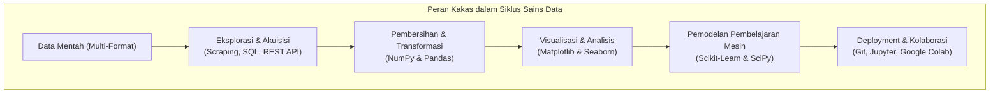
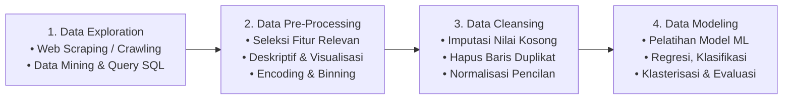
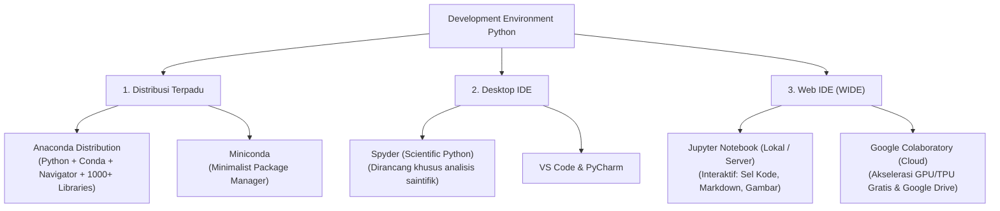
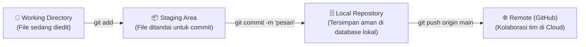
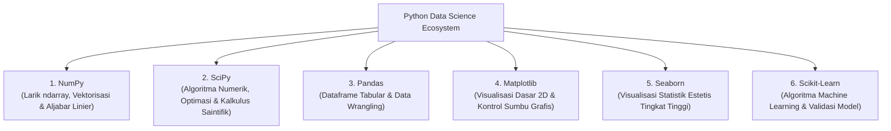
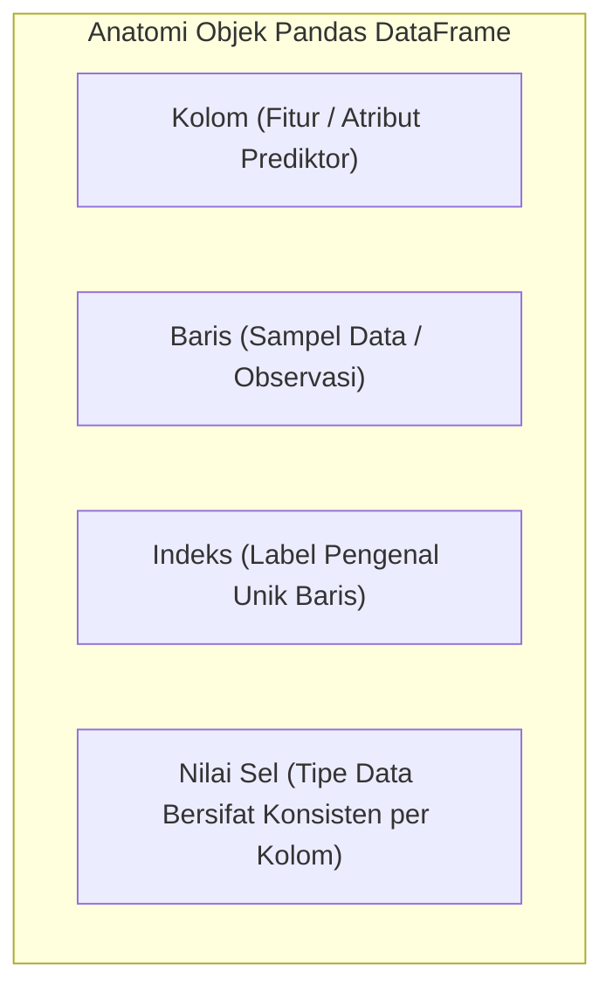

import { Accordion, Accordions } from 'fumadocs-ui/components/accordion';
import { Callout } from 'fumadocs-ui/components/callout';
import { Tab, Tabs } from 'fumadocs-ui/components/tabs';

> **Penyusun Modul:** Mahendar Dwi Payana  
> **Sumber Kurikulum Resmi:** Thematic Academy Digital Talent Scholarship (DTS) 2021 — Badan Penelitian dan Pengembangan SDM Kementerian Komunikasi dan Informatika RI (Kominfo)  
> **Instruktur & Pengembang Modul Asal:** Rizal Dwi Prayogo, S.Si, M.Si, M.Sc (Institut Teknologi Bandung - STEI ITB)  
> **Acuan Standar Kompetensi:** SKKNI No. 299 Tahun 2020 (Bidang Artificial Intelligence sub bidang Data Science)

---

## 1. Pengantar Kakas Proyek Sains Data & Mengapa Python?

Dalam siklus proyek sains data (*data science*), sebagian besar waktu dan energi seorang praktisi dihabiskan untuk pemrosesan, eksplorasi, dan pemodelan data. Memilih perangkat lunak (*tools*) dan bahasa pemrograman yang tepat adalah faktor krusial yang menentukan efisiensi kerja, skalabilitas, dan keberhasilan proyek.



### Sejarah & Karakteristik Bahasa Python
Python diciptakan oleh **Guido van Rossum** pada tahun 1991 sebagai bahasa pemrograman serbaguna (*general-purpose language*) yang bersifat *open-source* dan lintas platform (*cross-platform*: Windows, macOS, Linux).

#### Karakteristik Unggulan Python:
1. **Sintaks Bersih & Sangat Mudah Dibaca (*High Readability*)**: Menghilangkan tanda kurung kurawal `{}` yang berbelit dan titik koma `;`, menggantikannya dengan struktur indentasi spasi yang rapi.
2. **Bahasa Interpreter (*Interpreted Language*)**: Kode dieksekusi baris demi baris secara instan oleh interpreter tanpa memerlukan langkah kompilasi manual ke bahasa mesin (*zero compilation step*), sehingga secara drastis mempersingkat siklus *edit-test-debug*.
3. **Pengetikan Dinamis (*Dynamically Typed*) & Manajemen Memori Otomatis**: Alokasi memori objek dan pembersihan *garbage collection* dikelola otomatis oleh runtime Python.
4. **Bahasa Multiparadigma (*Multi-Paradigm*)**:
   * *Pemrograman Berorientasi Objek (OOP)*: Memudahkan perancangan pipeline model yang modular layaknya Java atau C++.
   * *Pemrograman Fungsional*: Menyediakan fungsi tingkat tinggi (`map`, `filter`, `lambda`, *list comprehensions*).
   * *Interoperabilitas C/C++*: Melalui pustaka seperti *Cython*, kode kritis performa tinggi dapat dipacu hingga menyamai kecepatan komputasi bahasa C.

#### Komparasi Sintaks: Bahasa C vs. Python

<Tabs items={['Bahasa C', 'Bahasa Python']}>
  <Tab value="Bahasa C">
    ```c
    #include <stdio.h>

    int main() {
        printf("Hello World!\n");
        return 0;
    }
    ```
    *Membutuhkan deklarasi pustaka header, fungsi utama `main()`, tanda kurung kurawal `{ }`, titik koma `;`, dan kompilasi manual (`gcc main.c -o main`).*
  </Tab>
  <Tab value="Bahasa Python">
    ```python
    print("Hello World!")
    ```
    *Sangat ringkas, deklaratif, ekspresif, dan langsung dieksekusi di konsol interaktif.*
  </Tab>
</Tabs>

### Adopsi Raksasa Teknologi Dunia & Peluang Karier
Python telah menjadi standar baku (*gold standard*) di perusahaan teknologi dunia:
* **YouTube**: *"Google menjalankan jutaan baris kode Python. Server front-end yang menggerakkan youtube.com dan API YouTube ditulis terutama dalam Python dan melayani jutaan permintaan per detik!"* — Dylan Trotter, Youtube Engineer (2017).
* **Quora**: Memilih Python karena kecepatan iterasi pengembangan dan kemudahan integrasi *unit testing* yang kuat — Adam D'Angelo, CEO Quora (2014).
* **Google, Spotify, Instagram, Netflix, NASA, Uber, Dropbox, IBM, dan Reddit**: Menjadikan Python sebagai tulang punggung arsitektur analitik data, mesin rekomendasi, dan infrastruktur komputasi kecerdasan buatan mereka.
* **Keahlian Paling Dicari di Pasar Kerja**: Berdasarkan survei komprehensif *Towards Data Science*, Python menempati **peringkat pertama (77%)** dalam daftar keahlian sains data yang paling dicari dalam lowongan pekerjaan global, melampaui SQL (59%), R (54%), Apache Spark (26%), dan AWS (26%).

---

## 2. Penerapan Python dalam 4 Fase Proyek Sains Data



1. **Eksplorasi Data (*Data Exploration*)**: Menggali data terstruktur maupun tidak terstruktur dari berbagai sumber melalui teknik penambangan data (*data mining*), *web scraping* (BeautifulSoup, Scrapy), pemanggilan Web API (Requests), hingga query basis data relasional/data warehouse.
2. **Pra-Pemrosesan Data (*Data Pre-processing*)**: Menyelidiki profil sebaran data (distribusi probabilitas), statistika deskriptif, seleksi fitur (*feature selection*), penanganan ketimpangan kelas (*class balancing*), serta transformasi fitur (*categorical encoding, numerical binning*). Prinsip industri: *"Garbage In, Garbage Out"* — data yang belum diproses dengan baik akan menghasilkan model yang gagal.
3. **Pembersihan Data (*Data Cleansing*)**: Memperbaiki kualitas data mentah dengan mengimputasi nilai kosong (*missing values*) menggunakan teknik statistika (rata-rata/mean, median, atau modus), menghapus sampel data baris yang terduplikasi, menyelaraskan format penanggalan (*data formatting*), serta meredam efek data pencilan (*outliers*) melalui normalisasi rentang $[-1, 1]$ atau $[0, 1]$.
4. **Pemodelan Data (*Data Modeling*)**: Melatih data bersih menggunakan algoritma pembelajaran mesin untuk menyelesaikan tugas **Regresi** (memprediksi kenaikan harga saham/komoditas numerik), **Klasifikasi** (memprediksi email spam, deteksi fraud, diagnosis penyakit), atau **Klasterisasi** (segmentasi perilaku pelanggan belanja).

---

## 3. Lingkungan Pengembangan: IDE, WIDE & Ekosistem Git

Untuk mengeksekusi kode Python secara optimal, praktisi data menggunakan kombinasi *Development Environment* yang bervariasi:



### A. Konsep IPython: Lingkungan REPL (*Read-Eval-Print-Loop*)
IPython (*Interactive Python*) memperkenalkan cara kerja interaktif:
* **Read**: Menerima dan membaca baris kode yang dimasukkan pengguna.
* **Eval**: Mengevaluasi dan mengeksekusi kode secara langsung di memori.
* **Print**: Mencetak dan menampilkan hasil keluaran (*output*) seketika.
* **Loop**: Mengulang kembali siklus untuk instruksi berikutnya sembari mempertahankan status variabel di memori.

### B. Web Integrated Development Environment (WIDE)
* **Jupyter Notebook**: Berakar dari pengembangan perangkat lunak matematika SageMath (William Stein, 2005) dan dirilis sebagai versi browser dari IPython pada Desember 2011. Sekarang menjadi bagian dari ekosistem multi-bahasa **Jupyter** (*Julia, Python, R*). Dokumen notebook (`.ipynb`) menggabungkan sel kode yang dapat dieksekusi (*Code*), narasi penjelasan matematis (*Markdown* berformat KaTeX/LaTeX), visualisasi plot grafis, hingga tabel interaktif yang dapat direplikasi secara ilmiah (*reproducible research*).
* **Google Colaboratory (Google Colab)**: Layanan komputasi awan (*cloud notebook*) gratis yang disediakan oleh Google. Menyediakan lingkungan Python siap pakai tanpa instalasi lokal, dilengkapi akses akselerator perangkat keras **GPU (NVIDIA T4/V100)** dan **TPU (Tensor Processing Unit)**, serta integrasi langsung dengan Google Drive dan repositori GitHub.

### C. Kolaborasi & Pelacakan Versi dengan Git & GitHub
Proyek sains data menuntut pelacakan eksperimen dan kolaborasi tim yang rapi menggunakan **Git**:



#### 3 Status Utama Berkas di Git:
1. **Modified**: Anda telah mengubah berkas di direktori kerja, namun perubahannya belum ditandai untuk disimpan ke basis data Git.
2. **Staged**: Anda telah menandai berkas yang dimodifikasi ke dalam *Staging Area* sebagai kandidat cuplikan versi berikutnya.
3. **Committed**: Berkas telah disimpan secara aman dan permanen di basis data repositori lokal Anda.

#### Lembar Contekan Perintah Dasar Git:
```bash
# Inisialisasi repositori lokal baru pada branch main
git init -b main

# Memeriksa status berkas
git status

# Menambahkan berkas ke staging area
git add .

# Menyimpan perubahan dengan pesan deskriptif
git commit -m "feat: implementasi pipeline pembersihan data imunisasi"

# Menghubungkan ke repositori remote di GitHub
git remote add origin https://github.com/mahendartea/Learn-AI.git

# Mengunggah perubahan ke GitHub
git push -u origin main

# Mengambil dan menggabungkan perubahan terbaru dari rekan tim
git pull origin main
```

---

## 4. Pembedahan Mendalam 6 Pustaka Inti Sains Data

Ekosistem Python untuk sains data ditopang oleh enam pilar pustaka utama:



---

### A. NumPy & SciPy: Komputasi Numerik & Saintifik

#### Keterbatasan Fatal Python List Biasa
Dalam Python murni, list dirancang untuk menampung objek heterogen. Namun, operasi matematika per-elemen (*element-wise*) tidak dapat dilakukan secara langsung:

```python
height = [1.84, 1.79, 1.82, 1.90, 1.80]
weight = [66.5, 60.3, 64.7, 89.5, 69.8]

# Mencoba menghitung Indeks Massa Tubuh (BMI) langsung:
bmi = weight / height ** 2
# Output: TypeError: unsupported operand type(s) for ** or pow(): 'list' and 'int'
```

#### Solusi NumPy: Vektorisasi Array Homogen (`ndarray`)
NumPy (*Numerical Python*) mengatasi hal ini dengan mengemas data numerik ke dalam larik homogen berdimensi-$n$ (`ndarray`) yang disimpan dalam blok memori C fisik yang berdampingan (*contiguous memory block*):

```python
import numpy as np

np_height = np.array(height)
np_weight = np.array(weight)

# Perhitungan BMI secara Vektor (Seketika untuk jutaan data!)
# Formula: BMI = Berat / (Tinggi^2)
bmi = np_weight / (np_height ** 2)
print("Indeks Massa Tubuh (BMI):", bmi.round(2))
# Output: array([19.64, 18.82, 19.53, 24.79, 21.54])
```

#### Representasi Multimodal Data Digital di NumPy
Apapun format data dunia nyata, semuanya ditransformasikan menjadi representasi larik numerik sebelum diolah oleh algoritma AI:
* **Citra / Gambar Berwarna (RGB)**: Direpresentasikan sebagai tensor 3 dimensi: bidang Merah (*Red plane*), bidang Hijau (*Green plane*), dan bidang Biru (*Blue plane*). Setiap piksel memiliki intensitas warna $0 - 255$ (0 = hitam pekat, 255 = putih murni) yang kemudian dinormalisasi menjadi skala interval $[0, 1]$.
* **Sinyal Suara / Audio**: Direpresentasikan sebagai larik 1 dimensi runtun waktu (*time-series*) yang mencatat intensitas amplitudo gelombang suara dari mikrofon pada setiap interval frekuensi cuplikan (*sampling rate*).

#### Aljabar Linier & Aturan Broadcasting Matriks
NumPy memungkinkan operasi aritmatika antara dua larik dengan dimensi (*shape*) yang berbeda tanpa perlu menyalin data secara berulang di memori RAM fisik:

$$
\begin{bmatrix} 1 & 2 & 3 \\ 4 & 5 & 6 \\ 7 & 8 & 9 \end{bmatrix} + \begin{bmatrix} 10 & 20 & 30 \end{bmatrix} = \begin{bmatrix} 11 & 22 & 33 \\ 14 & 25 & 36 \\ 17 & 28 & 39 \end{bmatrix}
$$

> **Penjelasan Konseptual Broadcasting:**
> * Matriks pertama berukuran $3 \times 3$.
> * Vektor kedua berukuran $1 \times 3$.
> * Menurut kaidah aljabar matriks murni, penjumlahan ini tidak dapat dilakukan karena dimensinya tidak identik.
> * Namun dengan **NumPy Broadcasting Rule**, larik baris kedua diregangkan (*broadcasted*) secara virtual ke seluruh baris matriks pertama, dieksekusi dengan akselerasi instruksi prosesor C/SIMD tanpa alokasi memori tambahan.

* **SciPy (*Scientific Python*)**: Dibangun di atas NumPy untuk menyediakan algoritma komputasi saintifik tingkat lanjut, meliputi kalkulus integral, diferensial, pemrosesan sinyal digital (*Fourier transform*), aljabar linier teroptimasi, dan pengujian statistika inferensial.

---

### B. Pandas: Pustaka Analisis & Manipulasi Data Tabular

Pandas (*Panel Data*) menyediakan dua struktur objek data utama:
1. **Series**: Larik satu dimensi berlabel yang mampu menampung tipe data apapun.
2. **DataFrame**: Struktur data tabular dua dimensi (menyerupai *spreadsheet* Excel atau tabel basis data SQL) yang dilengkapi indeks baris (*index*) dan label kolom (*columns*).



#### Kemampuan Inti Pandas:
* **Impor & Ekspor Multi-Format**: Membaca dan menulis berkas CSV (`pd.read_csv`), spreadsheet Excel (`pd.read_excel`), query database SQL (`pd.read_sql`), hingga format biner HDF5/Parquet.
* **Pembersihan & Transformasi Data**: Menangani nilai kosong (`dropna`, `fillna`), menyaring baris duplikat (`drop_duplicates`), serta manipulasi teks (*string accessor* `.str`).
* **Pengindeksan Presisi**: Akses seleksi baris dan kolom berbasis label nama (`.loc[]`) maupun berbasis indeks integer numerik (`.iloc[]`).
* **Agregasi & Analisis Relasional**: Operasi pengelompokan canggih (`groupby`), tabel kontingensi multi-dimensi (`pivot_table`), serta penggabungan dataset (`merge`, `join`, `concat`).

---

### C. Matplotlib & Seaborn: Visualisasi Data 2D

* **Matplotlib**: Diciptakan oleh John Hunter pada tahun 2002 sebagai pustaka visualisasi grafik 2D fundamental di Python. Mendukung kontrol penuh terhadap kanvas grafis: pembuatan sumbu (*axes*), diagram garis (*line chart* `plt.plot`), diagram sebar (*scatter plot* `plt.scatter`), dan diagram batang (*bar chart* `plt.bar`).
* **Seaborn**: Dibangun di atas Matplotlib dengan menyediakan antarmuka tingkat tinggi (*high-level interface*) untuk menggambar grafik statistika yang jauh lebih estetis, modern, dan informatif secara otomatis (seperti *Heatmap*, *Boxplot*, *Violinplot*, dan matriks korelasi).

---

### D. Scikit-Learn: Pustaka Pembelajaran Mesin Terlengkap

Scikit-Learn (`sklearn`) mengintegrasikan algoritma pembelajaran mesin komprehensif:
* **Klasifikasi**: *Support Vector Machines (SVM), Decision Tree, Random Forest, Naïve Bayes, k-Nearest Neighbors (k-NN), Logistic Regression*.
* **Regresi**: *Linear Regression, Ridge, Lasso, ElasticNet, SVR*.
* **Klasterisasi**: *K-Means Clustering, DBSCAN, Hierarchical Clustering*.
* **Reduksi Dimensi**: *Principal Component Analysis (PCA), t-SNE*.
* **Seleksi Model & Evaluasi**: *Train-Test Split, K-Fold Cross-Validation, GridSearchCV, Confusion Matrix, ROC-AUC, Classification Report*.

## 5. Praktikum Terpadu & Studi Kasus Python

<Callout type="info" title="Unduh Berkas Praktikum Jupyter Notebook Resmi">
Seluruh kode instruksi praktikum pada sesi ini tersedia dalam bentuk berkas Jupyter Notebook resmi pelatihan yang siap diunduh dan dijalankan di lingkungan lokal (Jupyter Lab / VS Code) maupun Google Colaboratory:
- **Jupyter Notebook Modul 4:** [`Get Started with Python - Modul 4.ipynb`](https://github.com/mahendartea/Learn-AI/blob/main/Get%20Started%20with%20Python%20-%20Modul%204.ipynb)
- **Dataset 1:** [`Tab.csv`](https://mahendartea.github.io/Learn-AI/data/Tab.csv) *(Data Demografi & Luas Wilayah Negara)*
- **Dataset 2:** [`pmp_2020_baru.csv`](https://mahendartea.github.io/Learn-AI/data/pmp_2020_baru.csv) *(Data Rapor Penjaminan Mutu Pendidikan)*
</Callout>

### Hands-on 1: Komputasi Vektor NumPy vs Keterbatasan List Python

Merujuk langsung pada sel kode `Get Started with Python - Modul 4.ipynb`, berikut adalah perbandingan antara list standar Python dan larik NumPy:

```python
# ==========================================
# 1. KETERBATASAN LIST PYTHON BIASA
# ==========================================
height = [1.84, 1.79, 1.82, 1.90, 1.80]
weight = [66.5, 60.3, 64.7, 89.5, 69.8]

# Data heterogen dalam list dapat digabungkan:
famz = ["Abe", 1.84, "Beb", 1.79, "Cory", 1.82, "Dad", 1.90]
print("Koleksi list heterogen:", famz)

try:
    # Menghitung BMI langsung pada list Python:
    bmi = weight / height ** 2
except TypeError as e:
    print(f"\n[Gagal di List Python] TypeError: {e}")
    # Output: unsupported operand type(s) for ** or pow(): 'list' and 'int'

# ==========================================
# 2. SOLUSI VEKTORISASI DENGAN NUMPY ARRAY
# ==========================================
import numpy as np

np_height = np.array(height)
np_weight = np.array(weight)

print("\nTipe objek np_height :", type(np_height)) # <class 'numpy.ndarray'>
print("Tipe objek np_weight :", type(np_weight)) # <class 'numpy.ndarray'>

# Perhitungan element-wise instan tanpa loop:
bmi = np_weight / (np_height ** 2)
print("Hasil Vektorisasi BMI:", bmi.round(2))
# Output: [19.64, 18.82, 19.53, 24.79, 21.54]

# ==========================================
# 3. LARIK 2 DIMENSI (MATRIKS) & DIMENSI
# ==========================================
np_2d = np.array([
    [1, 2, 3, 4, 5],
    [6, 7, 8, 9, 10]
])

print("\nMatriks 2D:\n", np_2d)
print("Dimensi Matriks (Shape):", np_2d.shape) # (2, 5) -> 2 baris, 5 kolom
print("Elemen baris ke-1, kolom ke-3 (index 0, 2):", np_2d[0, 2])
print("Seluruh elemen baris ke-2 (index 1):", np_2d[1, :])

# Konsep Series (1D) dan DataFrame (2D) yang menjadi pondasi Pandas:
arr_series = np.array([1, 2, 3, 4, 5])       # 1D Array -> Mirip Series
arr_df = np.array([[1, 2], [3, 4]])          # 2D Array -> Mirip DataFrame
print("\nBentuk dasar Series 1D:", arr_series.shape)
print("Bentuk dasar DataFrame 2D:", arr_df.shape)
```

---

### Hands-on 2: Analisis Tabular Pandas dengan Dataset `Tab.csv`

Kita menggunakan dataset demografi negara di Asia Tenggara dan Asia Timur yang di-host langsung pada portal kita:

```python
import pandas as pd

# Membaca dataset Tab.csv dari URL publik portal Learn AI
url_tab = "https://mahendartea.github.io/Learn-AI/data/Tab.csv"
Tab = pd.read_csv(url_tab, index_col=0)

print("=== DATASET TABULAR NEGARA (Tab.csv) ===")
print(Tab)

# 1. Mengakses kolom atribut
print("\nKolom Negara  :\n", Tab["Negara"])
print("\nKolom Ibukota :\n", Tab.Ibukota)

# 2. Rekayasa Fitur: Menghitung Kepadatan Penduduk (Jiwa per km^2)
# Populasi dalam jutaan jiwa, Area dalam km^2
Tab["Kepadatan_per_km2"] = ((Tab["Populasi"] * 1_000_000) / Tab["Area"]).round(2)

print("\nTabel Lengkap dengan Fitur Kepadatan Penduduk:")
print(Tab[["Negara", "Populasi", "Area", "Kepadatan_per_km2", "Ibukota"]])
```

---

### Hands-on 3: Visualisasi Tren Mutu Pendidikan SMP Cirebon (`pmp_2020_baru.csv`)

Menggunakan dataset historis Penjaminan Mutu Pendidikan (PMP) SMP Negeri 14 Kota Cirebon periode $2016 - 2020$:

```python
import pandas as pd
import matplotlib.pyplot as plt

# Membaca dataset pmp_2020_baru.csv dari portal Learn AI
url_pmp = "https://mahendartea.github.io/Learn-AI/data/pmp_2020_baru.csv"
df_pmp = pd.read_csv(url_pmp)

print("=== DATASET PENJAMINAN MUTU PENDIDIKAN (PMP) ===")
print(df_pmp[["uraian", "pmp2016", "pmp2018", "pmp2019", "pmp2020"]].head())

# Mengambil baris pertama: Standar Kompetensi Lulusan (SKL)
row_skl = df_pmp.iloc[0]
tahun = ['2016', '2017', '2018', '2019', '2020']
skor_pmp = [
    row_skl['pmp2016'], 
    row_skl['pmp2017'], 
    row_skl['pmp2018'], 
    row_skl['pmp2019'], 
    row_skl['pmp2020']
]

# Visualisasi Tren Skor Mutu Pendidikan dengan Matplotlib
plt.figure(figsize=(8, 4.5))
plt.plot(tahun, skor_pmp, marker='o', color='#2563eb', linewidth=2.5, markersize=8, label="Skor PMP Riil")
plt.title(f"Tren {row_skl['uraian']}\n{row_skl['nama']}", fontsize=12, fontweight='bold')
plt.xlabel("Tahun Evaluasi", fontsize=10)
plt.ylabel("Skor Mutu (Skala 0 - 7)", fontsize=10)
plt.ylim(0, 7.5)
plt.grid(True, linestyle='--', alpha=0.6)
plt.legend()
plt.tight_layout()
plt.show()

# Visualisasi Tren Harga Komparatif (Notebook Modul 4 Sel 46-50)
year = [1980, 1990, 2000, 2010, 2020]
price = [2.5, 7.6, 9.7, 15.8, 22.9]

fig, (ax1, ax2, ax3) = plt.subplots(1, 3, figsize=(14, 4))

# 1. Line Plot (plt.plot)
ax1.plot(year, price, marker='s', color='#0284c7', linewidth=2)
ax1.set_title("1. Line Plot (plt.plot)")
ax1.set_xlabel("Tahun")
ax1.set_ylabel("Harga ($)")
ax1.grid(True, linestyle=':', alpha=0.7)

# 2. Scatter Plot (plt.scatter)
ax2.scatter(year, price, color='#dc2626', s=70, edgecolor='black')
ax2.set_title("2. Scatter Plot (plt.scatter)")
ax2.set_xlabel("Tahun")
ax2.grid(True, linestyle=':', alpha=0.7)

# 3. Bar Plot (plt.bar)
ax3.bar(year, price, width=3.0, color='#16a34a', edgecolor='black', alpha=0.85)
ax3.set_title("3. Bar Plot (plt.bar)")
ax3.set_xlabel("Tahun")
ax3.grid(axis='y', linestyle=':', alpha=0.7)

plt.tight_layout()
plt.show()
```

---

## 6. Lembar Evaluasi & Tugas Praktikum Mandiri

Berdasarkan silabus resmi Thematic Academy DTS 2021:

<Accordions>
  <Accordion title="Tugas 1: Pengerjaan Hands-On Kursus Daring (Python for Data Science)">
    Peserta wajib menyelesaikan modul praktikum interaktif mandiri pada salah satu penyedia kursus daring terakreditasi:
    * Cognitive Class: *Python for Data Science* (`cognitiveclass.ai/courses/python-for-data-science`)
    * DataCamp: *Introduction to Python for Data Science* (`datacamp.com/courses/intro-to-python-for-data-science`)
    * Microsoft Learn: *Build real-world applications with Python* (`docs.microsoft.com/en-us/learn/paths/python-language/`)
    * edX / Microsoft: *Introduction to Python for Data Science (DAT208x)*
  </Accordion>

  <Accordion title="Tugas 2: Eksplorasi Matriks NumPy Berdimensi-3">
    Buatlah skrip Python untuk menghasilkan matriks acak berdimensi $3 \times 4 \times 5$ menggunakan fungsi `np.random.rand()`. Lakukan operasi pemotongan (*slicing*) untuk mengambil sub-matriks pada bidang kedua, serta hitung nilai rata-rata, nilai median, dan deviasi standarnya!
  </Accordion>

  <Accordion title="Tugas 3: Analisis Data Kependudukan & Visualisasi Batang">
    Gunakan dataset `Tab.csv` yang disediakan. Buatlah visualisasi diagram batang horizontal (*horizontal bar chart*) yang membandingkan kepadatan penduduk per km² untuk kelima negara. Berikan anotasi teks yang menyoroti negara dengan kepadatan tertinggi dan terendah!
  </Accordion>
</Accordions>

---

## 7. Referensi Pustaka & Tautan Resmi

1. **Rizal Dwi Prayogo** (2021). *Modul Pelatihan: Tools Proyek Data Science*. Thematic Academy Digital Talent Scholarship 2021, Kementerian Kominfo RI & STEI ITB.
2. **Jake VanderPlas** (2016). *Python Data Science Handbook: Essential Tools for Working with Data*. Sebastopol, CA: O'Reilly Media.
3. **Laura Igual & Santi Seguí** (2017). *Introduction to Data Science: A Python Approach to Concepts, Techniques and Applications*. Springer International Publishing.
4. **Arfika Nurhudatiana** (2019). *Analisis dan Visualisasi Data Dengan Python*. Jakarta: Pintaria.
5. **Kementerian Ketenagakerjaan RI** (2020). *SKKNI No. 299 Tahun 2020 Bidang Keahlian Artificial Intelligence Subbidang Data Science*.
