> **Penyusun Modul & Portal:** Mahendar Dwi Payana  
> **Penulis Materi Pelatihan DTS 2021:** Ari Wibisono, M.Kom (Universitas Indonesia)  
> **Penyelenggara & Kurikulum:** Thematic Academy Digital Talent Scholarship (DTS) 2021, Kementerian Komunikasi dan Informatika RI (Kominfo)  
> **Standar Rujukan:** Standar Kompetensi Kerja Nasional Indonesia (SKKNI) No. 299 Tahun 2020 — Skema *Associate Data Scientist*

---

## 1. Landasan Standar Kompetensi Kerja (SKKNI)

Tahap **Business Understanding** (Pemahaman Bisnis) merupakan pilar paling mendasar dalam setiap inisiatif *Data Science* dan *Artificial Intelligence*. Berdasarkan **SKKNI No. 299 Tahun 2020**, pertemuan ini membekali peserta dengan 3 Unit Kompetensi (UK) inti pertama:

| Kode Unit | Judul Unit Kompetensi | Kriteria Unjuk Kerja (KUK) Inti |
| :--- | :--- | :--- |
| **J.62DMI00.001.1** | Menentukan Objektif Bisnis | Mengidentifikasi masalah bisnis, menentukan tujuan bisnis organisasi, dan merumuskan kriteria keberhasilan bisnis yang terukur. |
| **J.62DMI00.002.1** | Menentukan Tujuan Teknis Data Science | Mentranslasikan sasaran bisnis ke dalam sasaran teknis data science, menentukan pendekatan analitik (*analytical approach*), dan menentukan kriteria evaluasi teknis. |
| **J.62DMI00.003.1** | Membuat Rencana Proyek Data Science | Mengidentifikasi kebutuhan sumber daya (data, perangkat keras, tools), menyusun jadwal/milestone proyek, serta memetakan rencana mitigasi risiko teknis dan operasional. |

### Metode Penilaian Uji Kompetensi
Penguasaan materi ini dinilai di Tempat Uji Kompetensi (TUK) melalui:
1. **Lisan & Wawancara**: Penjelasan rasionalisasi pemilihan pendekatan analitik terhadap studi kasus industri.
2. **Tes Tertulis**: Pemahaman teoretis mengenai pemetaan masalah, metrik teknis vs metrik bisnis, dan manajemen risiko.
3. **Demonstrasi & Presentasi**: Penyusunan dan pemaparan dokumen *Project Charter* serta desain *End-to-End System Flow*.

---

## 2. Pemahaman Bisnis: Artificial Intelligence vs Otomatisasi

Dalam dunia industri, sering terjadi kerancuan antara istilah **Kecerdasan Buatan (Artificial Intelligence / AI)** dan **Otomatisasi (Automation)**. Kegagalan membedakan keduanya sering kali menyebabkan pemborosan investasi teknologi ketika sistem sederhana diselesaikan dengan algoritma kompleks yang tidak diperlukan, atau sebaliknya, sistem aturan kaku dipaksakan menangani data yang berfluktuasi dinamis.

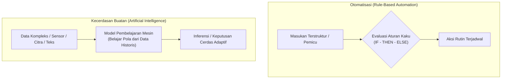

### Tabel Komparasi: AI vs Otomatisasi

| Dimensi Evaluasi | Otomatisasi (*Automation*) | Kecerdasan Buatan (*Artificial Intelligence*) |
| :--- | :--- | :--- |
| **Fokus Utama** | Penyederhanaan tugas-tugas instruktif yang berulang (*repetitive routine tasks*). | Meniru kemampuan kognitif manusia dalam mengambil keputusan, penalaran, dan mengenali pola. |
| **Mekanisme Kerja** | Berbasis aturan logika deterministik yang telah diprogram secara eksplisit (*rule-based* / *hard-coded*). | Berbasis algoritma pembelajaran (*machine learning*) yang mengekstrak bobot pola dari data empiris. |
| **Penanganan Data Baru** | Gagal atau mengalami galat (*error*) jika menemui kondisi yang belum didefinisikan dalam aturan kode. | Memiliki kemampuan generalisasi untuk menginferensi data baru yang belum pernah dilihat sebelumnya. |
| **Adaptabilitas** | Statis; memerlukan campur tangan manusia untuk menulis ulang aturan logika bila sistem berubah. | Dinamis; model dapat dilatih ulang (*retraining*) secara berkelanjutan seiring pertambahan data baru. |
| **Contoh Kasus Riil** | - Menyalakan lampu smart home otomatis setiap pukul 18:00.<br/>- Pengiriman email notifikasi tagihan massal bulanan.<br/>- Dispenser otomatis pemberi pakan hewan peliharaan berdasarkan timer. | - Kendaraan otonom (*Autonomous Vehicle*) mendeteksi pejalan kaki.<br/>- Model prediksi fluktuasi harga saham dan valuta asing.<br/>- Sistem deteksi kecurangan transaksi perbankan (*fraud detection*). |

---

## 3. Paradigma End-to-End Machine Learning

Perkembangan mutakhir dalam rekayasa sistem cerdas adalah transisi dari sistem pipa pemrosesan bertingkat (*multi-stage pipeline*) menuju pendekatan **End-to-End Machine Learning**.

Sistem pemrosesan data tradisional memecah masalah menjadi serangkaian sub-komponen terisolasi yang masing-masing membutuhkan rekayasa manual. Sebaliknya, pendekatan *End-to-End* berupaya mempelajari pemetaan fungsi langsung dari masukan mentah ($X$) menuju luaran akhir ($Y$).

### Contoh 1: Pengenalan Suara (*Speech Recognition*)
Tujuan sistem adalah memetakan masukan audio $X$ menjadi transkrip teks $Y$:

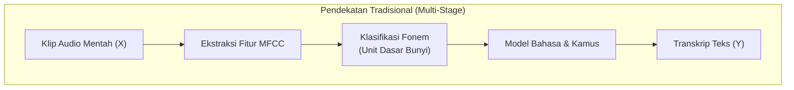

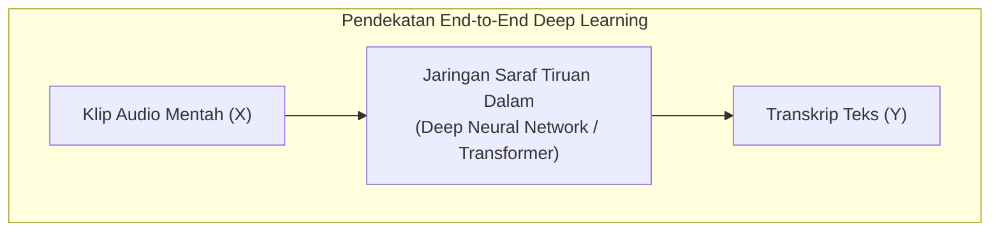

* **Pendekatan Tradisional**: Sinyal audio diekstraksi menggunakan MFCC (*Mel-Frequency Cepstral Coefficients*), kemudian model akustik mengidentifikasi unit bunyi terkecil (**fonem**, misalnya kata *"kucing"* dipecah menjadi bunyi `[ku]` dan `[cing]`), lalu model bahasa menyusun fonem menjadi susunan kata individual.
* **Pendekatan End-to-End**: Sebuah jaringan saraf tiruan dalam (*Deep Neural Network*) dilatih langsung memetakan spektrogram frekuensi suara ke teks kalimat utuh tanpa memerlukan segmentasi fonem perantara secara manual.
* **Konsekuensi Arsitektural**: Pendekatan *End-to-End* memerlukan volume data latih yang jauh lebih masif agar model mampu mengabstraksi representasi internal secara mandiri.

### Contoh 2: Sistem Gerbang Otomatis Pengenal Wajah (*Face Recognition Access Gate*)
Sistem gerbang kantor yang membuka otomatis saat karyawan mendekat:
* **Masukan ($X$)**: Aliran video dari kamera pengawas.
* **Luaran ($Y$)**: Perintah membuka pintu palang (`Trigger Gate = Open`) dan identitas pegawai.
* **Kompleksitas Lapangan**: Posisi sudut kedatangan orang bervariasi (kiri, kanan, tengah), jarak kedekatan kamera dinamis (objek membesar saat mendekat), intensitas pencahayaan fluktuatif, serta oklusi (penggunaan masker atau topi).
* **Solusi Desain**: Memerlukan pemisahan deteksi bounding box wajah (*Face Detection*), normalisasi pose/alignment, ekstraksi fitur landmark wajah (*Facial Landmarks*), dan pencocokan representasi vektor (*Face Embedding*).

---

## 4. Empat Tahapan Inti Identifikasi Masalah AI

Ketika praktisi data dihadapkan pada perumusan kebutuhan bisnis, terdapat kerangka kerja 4 langkah terstruktur yang wajib dijalankan:

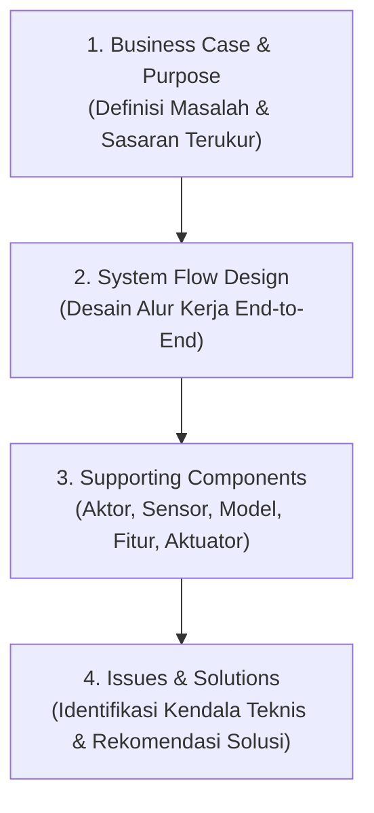

1. **Definisikan Business Case dan Purpose**: Rumuskan akar permasalahan organisasi, alasan urgensi penyelesaian, serta sasaran keberhasilan yang spesifik dan terukur (*SMART*).
2. **Rancang System Flow (End-to-End Approach)**: Gambarkan diagram alur perpindahan informasi mulai dari sumber masukan data mentah, tahapan rekayasa data, inferensi model, hingga mekanisme aksi luaran.
3. **Identifikasi Komponen-Komponen Pendukung**: Rinci seluruh entitas yang terlibat:
   - **Aktor**: Pengguna akhir, operator teknis, pimpinan bisnis.
   - **Sensor / Sumber Data**: Kamera, LiDAR, basis data transaksional, REST API, berkas CSV/Excel.
   - **Fitur Data**: Indeks waktu, atribut demografis, telemetry sensor.
   - **Model AI**: Algoritma regresi, klasifikasi, clustering, atau deep learning.
   - **Aktuator / Output**: Sistem pengereman, dasbor visualisasi, webhook notifikasi.
4. **Petakan Isu, Potensi Masalah, dan Rekomendasi Solusi**: Analisis kelemahan sistem (misal: *overfitting*, data tidak seimbang, sensor rusak saat hujan, keterlambatan latensi komputasi) serta tetapkan strategi mitigasi teknisnya.

---

## 5. Peta Fondasi Teknis & Relasi Modul Data Science

Proyek *Data Science* adalah proyek bisnis yang memiliki siklus hidup berkesinambungan mengacu pada metodologi industri standar seperti **CRISP-DM (Cross-Industry Standard Process for Data Mining)** dan **IBM Data Science Methodology**.

Peta kurikulum pelatihan mengintegrasikan 16 modul ke dalam siklus kerja berikut:

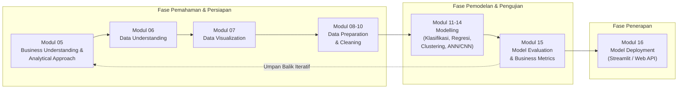

### Rincian Perjalanan Kurikulum:
* **Modul 05 (Modul Ini)**: *Business Understanding*, *Analytical Approach*, *Data Requirements*, dan *Data Collection*.
* **Modul 06**: *Data Understanding* — Menelaah struktur data, tipe variabel, dan kelengkapan nilai.
* **Modul 07**: *Data Visualization* — Eksplorasi visual distribusi, korelasi, dan deteksi anomali.
* **Modul 08, 09, 10**: *Data Preparation* — Pembersihan data kotor, imputasi nilai hilang, enkoding variabel kategorik, normalisasi, dan penanganan ketidakseimbangan kelas.
* **Modul 11, 12, 13, 14**: *Modelling* — Pembangunan algoritma pembelajaran mesin (Klasifikasi, Regresi, Klastering, Jaringan Saraf Tiruan ANN & CNN).
* **Modul 15**: *Model Evaluation* — Validasi performa model menggunakan metrik statistik teknis dan dampak biaya bisnis.
* **Modul 16**: *Model Deployment* — Publikasi artefak model ke lingkungan produksi menggunakan antarmuka web interaktif (*Streamlit* / REST API).

---

## 6. Pendekatan Analitik & Kebutuhan Pengumpulan Data

Setelah permasalahan bisnis dirumuskan secara presisi, *Data Scientist* bertugas memilih **Pendekatan Analitik (Analytical Approach)** yang tepat. Pemilihan teknik analitik menentukan format, volume, dan representasi data yang wajib dikumpulkan.

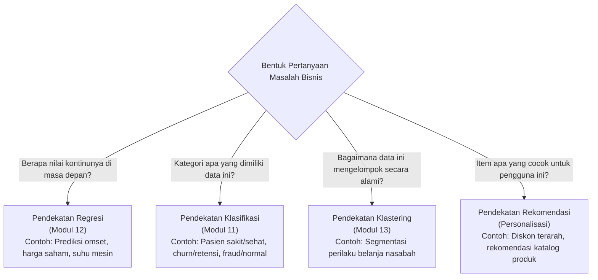

### Strategi Pengumpulan Data (Data Gathering)
Data yang dikumpulkan dapat bersumber dari beragam kanal:
1. **Data Internal Organisasi**: Berkas spreadsheet (Excel), basis data relasional (SQL RDBMS), log aktivitas pengguna internal.
2. **Web API & Web Scraping**: Ekstraksi terstruktur dari portal online publik, pasar keuangan, atau umpan cuaca.
3. **Repositori Data Publik & Terbuka**: Satu Data Indonesia, Kaggle, UCI Machine Learning Repository, portal kementerian terkait.

### Analisis Biaya Asimetris (*Asymmetric Cost Analysis*)
Pada penerapan industri riil, kesalahan prediksi memiliki bobot konsekuensi finansial yang tidak seimbang (*asymmetric cost*):

$$
\text{Total Biaya Kerugian} = (C_{\text{FP}} \times \text{FP}) + (C_{\text{FN}} \times \text{FN})
$$

Di mana:
* $C_{\text{FP}}$ (*Cost of False Positive*): Biaya akibat memprediksi positif pada entitas yang sebenarnya negatif (misal: memberikan voucher diskon retensi Rp 50.000 kepada nasabah loyal yang sebenarnya tidak akan berhenti langganan).
* $C_{\text{FN}}$ (*Cost of False Negative*): Biaya akibat gagal mendeteksi entitas positif (misal: membiarkan nasabah VIP berhenti langganan dengan potensi kehilangan nilai seumur hidup / *Customer Lifetime Value* sebesar Rp 1.500.000).

Ambang batas pemotongan probabilitas optimal ($\theta^*$) yang meminimalkan total kerugian finansial organisasi diturunkan secara analitik melalui:

$$
\theta^* = \frac{C_{\text{FP}}}{C_{\text{FP}} + C_{\text{FN}}}
$$

Pada kasus deteksi kecurangan (*fraud detection*) dan diagnosis medis, konsekuensi *False Negative* jauh lebih fatal ($C_{\text{FN}} \gg C_{\text{FP}}$), sehingga ambang batas klasifikasi harus digeser ke kiri (menurunkan $\theta^*$) untuk memaksimalkan **Recall (Sensitivitas)**.

---

## 7. Studi Kasus 1: Prediksi Harga Saham (Stock Price Prediction)

### A. Business Case & Sasaran Bisnis
Pasar modal merupakan instrumen investasi dengan dinamika tinggi. Investor dan broker berupaya mengoptimalkan margin keuntungan dan meminimalkan risiko kerugian modal (*capital loss*) dengan memperkirakan arah pergerakan harga saham di masa mendatang.

* **Pertanyaan Inti Bisnis**: Bagaimana membangun sistem analitik cerdas yang mampu memprediksi tren dan nilai penutupan harga saham harian berdasarkan data historis transaksi?
* **Tujuan Terukur**: Membangun model regresi deret berkala dengan tingkat kesalahan prediksi (*Root Mean Squared Error / RMSE*) serendah mungkin pada data validasi masa depan.

### B. System Flow Desain Sistem Prediksi Saham

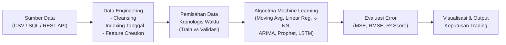

### C. Komponen Pendukung & Struktur Atribut Data
Data yang digunakan adalah harga saham historis **Tata Global Beverages Ltd** dari National Stock Exchange of India:

| Nama Kolom | Tipe Data | Deskripsi Bisnis |
| :--- | :--- | :--- |
| `Date` | Tanggal (`YYYY-MM-DD`) | Tanggal transaksi perdagangan (digunakan sebagai indeks deret waktu). |
| `Open` | Numerik Kontinu | Harga pembukaan lembar saham pada sesi perdagangan hari bersangkutan. |
| `High` | Numerik Kontinu | Harga perdagangan tertinggi yang tercatat pada hari bersangkutan. |
| `Low` | Numerik Kontinu | Harga perdagangan terendah yang tercatat pada hari bersangkutan. |
| `Last` | Numerik Kontinu | Harga transaksi terakhir sebelum sesi perdagangan ditutup. |
| `Close` | Numerik Kontinu | **Variabel Target ($Y$)**: Harga resmi penutupan pasar saham pada hari bersangkutan. |
| `Total Trade Quantity` | Numerik Diskrit | Total volume lembar saham yang diperjualbelikan sepanjang hari. |
| `Turnover (Lacs)` | Numerik Kontinu | Nilai perputaran omset transaksi harian dalam satuan seratus ribu Rupee (*Lacs*). |

> [!IMPORTANT]
> **Aturan Emas Pemisahan Data Deret Waktu (Time-Series Split):**
> Pada permasalahan data deret berkala, **DILARANG MENGGUNAKAN RANDOM SHUFFLE SPLIT** (seperti `train_test_split(..., shuffle=True)`). Pengacakan data deret waktu akan menyebabkan kebocoran masa depan (*lookahead bias* / *data leakage*), di mana model belajar dari masa depan untuk menebak masa lalu. Pemisahan wajib dilakukan secara **kronologis**: 987 hari pertama dialokasikan sebagai data latih (*training set*), dan 248 hari terakhir sebagai data validasi (*validation set*).

### D. Perbandingan Kinerja 5 Algoritma Regresi

Evaluasi dilakukan menggunakan metrik **Root Mean Squared Error (RMSE)**:

$$
\text{RMSE} = \sqrt{\frac{1}{n} \sum_{i=1}^{n} (y_i - \hat{y}_i)^2}
$$

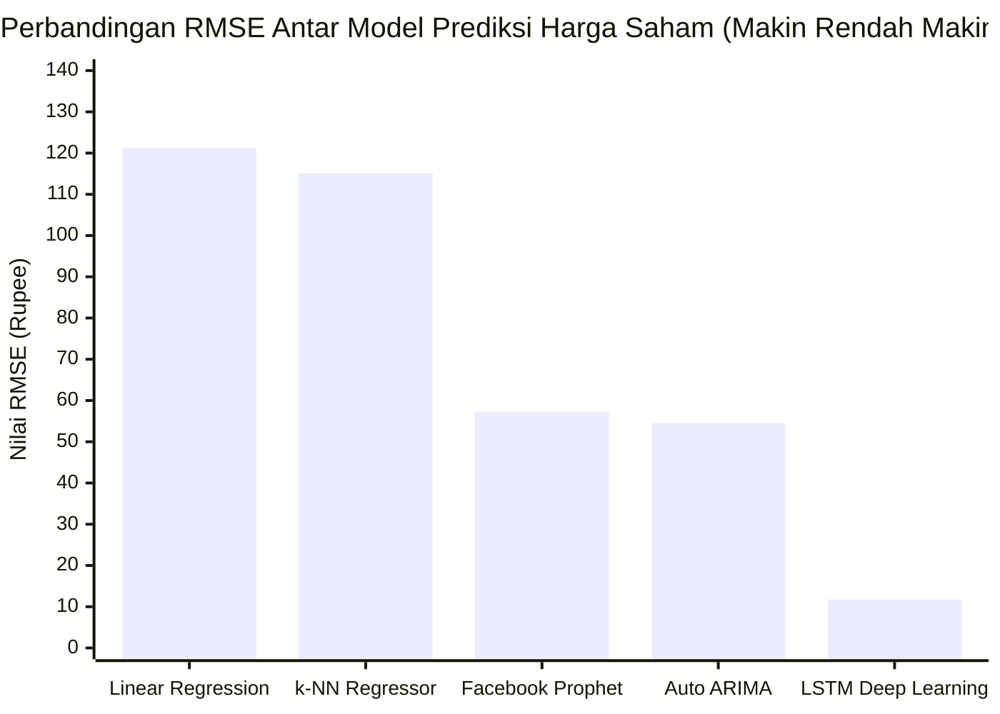

1. **Linear Regression (RMSE: 121.16)**:
   - Menggunakan fitur kalender buatan (*Year, Month, Week, Day of Week, Is_quarter_end, Mon_Fri*).
   - **Kelemahan**: Model mengasumsikan hubungan linier sederhana terhadap tanggal kalender. Ketika harga saham mengalami lonjakan eksponensial di masa validasi, garis linier terus memproyeksikan tren datar/turun, menghasilkan galat yang sangat besar.
2. **k-Nearest Neighbors / k-NN (RMSE: 115.17)**:
   - Mencari $k$ titik terdekat berdasarkan kesamaan fitur kalender yang dinormalisasi (*MinMaxScaler*).
   - **Kelemahan**: Pola tanggal masa depan tidak memiliki representasi yang identik di masa lalu; k-NN tidak memahami ketergantungan sekuensial tren (*temporal momentum*).
3. **Facebook Prophet (RMSE: 57.31)**:
   - Model aditif dekomposisi tren linier/logistik, musiman tahunan/mingguan/harian, dan efek hari libur.
   - **Keunggulan**: Mampu menangkap pergeseran titik balik tren (*changepoints*) secara jauh lebih luwes dibanding regresi linier biasa.
4. **Auto ARIMA / pmdarima (RMSE: 54.54)**:
   - Pendekatan statistik klasik *Autoregressive Integrated Moving Average* berbasis korelasi lag harga masa lalu.
   - **Keunggulan**: Memodelkan stasioneritas deret berkala dan dependensi autokorelasi, menghasilkan estimasi kurva rata-rata yang cukup stabil.
5. **LSTM - Long Short-Term Memory (RMSE: ~11.77)**:
   - Jaringan saraf tiruan berulang (*Recurrent Neural Network*) yang dirancang khusus untuk memodelkan memori jangka panjang dengan mekanisme *forget gate*, *input gate*, dan *output gate*.
   - Menggunakan jendela observasi geser (*sliding window*) 60 hari ke belakang untuk memprediksi harga hari berikutnya.
   - **Keunggulan Mutlak**: Kurva hasil prediksi LSTM berhimpitan sangat rapat dengan kurva harga aktual riil pada fase validasi.

---

### E. Implementasi Python Mandiri: Prediksi Saham Tata Global

Dataset [NSE-TATAGLOBAL11.csv](https://mahendartea.github.io/Learn-AI/data/NSE-TATAGLOBAL11.csv) telah tersedia di direktori portal [`/data/NSE-TATAGLOBAL11.csv`](https://mahendartea.github.io/Learn-AI/data/NSE-TATAGLOBAL11.csv). Skrip Python berikut mereplikasi alur eksperimen perbandingan model dari materi pelatihan:

```python
"""
Studi Kasus 1: Prediksi Harga Saham Tata Global Beverages
Membandingkan Moving Average, Linear Regression, k-NN, dan LSTM
Acuan Materi: Ari Wibisono, M.Kom (Universitas Indonesia) - DTS Kominfo
Disusun & Diselaraskan oleh: Mahendar Dwi Payana
"""

import os
import numpy as np
import pandas as pd
import matplotlib.pyplot as plt
from sklearn.linear_model import LinearRegression
from sklearn.neighbors import KNeighborsRegressor
from sklearn.preprocessing import MinMaxScaler
from sklearn.metrics import mean_squared_error

# 1. Membaca Dataset
dataset_path = 'public/data/NSE-TATAGLOBAL11.csv'
if not os.path.exists(dataset_path):
    # Cadangan unduhan publik jika dieksekusi di luar direktori lokal
    dataset_path = 'https://raw.githubusercontent.com/mahendartea/Learn-AI/main/public/data/NSE-TATAGLOBAL11.csv'

df = pd.read_csv(dataset_path)
print(f"Bentuk Dimensi Data Awal: {df.shape}")
print(df.head())

# 2. Rekayasa Indeks Tanggal & Pengurutan Kronologis
df['Date'] = pd.to_datetime(df['Date'], format='%Y-%m-%d')
df = df.sort_values(by='Date', ascending=True).reset_index(drop=True)

# Membuat dataframe terisolasi untuk analisis target Close
data = pd.DataFrame({
    'Date': df['Date'],
    'Close': df['Close']
})

# 3. Pemisahan Kronologis: 987 Train vs 248 Validasi
n_train = 987
train_data = data.iloc[:n_train].copy()
valid_data = data.iloc[n_train:].copy()

print(f"\nJumlah Data Latih (Train)   : {len(train_data)} baris")
print(f"Jumlah Data Uji (Validation) : {len(valid_data)} baris")

# -------------------------------------------------------------
# MODEL 1: BASELINE MOVING AVERAGE (Jendela 248 Hari)
# -------------------------------------------------------------
preds_ma = []
history_close = list(train_data['Close'].values)

for i in range(len(valid_data)):
    # Rata-rata 248 hari terakhir
    predicted_val = np.mean(history_close[-248:])
    preds_ma.append(predicted_val)
    # Tambahkan prediksi ke deret (rolling simulation)
    history_close.append(predicted_val)

rmse_ma = np.sqrt(mean_squared_error(valid_data['Close'], preds_ma))
print(f"\n[Model 1] Baseline Moving Average RMSE : {rmse_ma:.2f}")

# -------------------------------------------------------------
# MODEL 2: LINEAR REGRESSION (Rekayasa Fitur Kalender)
# -------------------------------------------------------------
df_lr = data.copy()
df_lr['Year'] = df_lr['Date'].dt.year
df_lr['Month'] = df_lr['Date'].dt.month
df_lr['Day'] = df_lr['Date'].dt.day
df_lr['DayOfWeek'] = df_lr['Date'].dt.dayofweek
df_lr['Mon_Fri'] = df_lr['DayOfWeek'].apply(lambda x: 1 if x in [0, 4] else 0)
df_lr['Is_Month_End'] = df_lr['Date'].dt.is_month_end.astype(int)

features = ['Year', 'Month', 'Day', 'DayOfWeek', 'Mon_Fri', 'Is_Month_End']
X_train_lr = df_lr.loc[:n_train-1, features]
y_train_lr = df_lr.loc[:n_train-1, 'Close']
X_valid_lr = df_lr.loc[n_train:, features]
y_valid_lr = df_lr.loc[n_train:, 'Close']

model_lr = LinearRegression()
model_lr.fit(X_train_lr, y_train_lr)
preds_lr = model_lr.predict(X_valid_lr)

rmse_lr = np.sqrt(mean_squared_error(y_valid_lr, preds_lr))
print(f"[Model 2] Linear Regression RMSE         : {rmse_lr:.2f}")

# -------------------------------------------------------------
# MODEL 3: K-NEAREST NEIGHBORS REGRESSOR (Normalisasi Fitur)
# -------------------------------------------------------------
scaler_knn = MinMaxScaler()
X_train_scaled = scaler_knn.fit_transform(X_train_lr)
X_valid_scaled = scaler_knn.transform(X_valid_lr)

model_knn = KNeighborsRegressor(n_neighbors=7)
model_knn.fit(X_train_scaled, y_train_lr)
preds_knn = model_knn.predict(X_valid_scaled)

rmse_knn = np.sqrt(mean_squared_error(y_valid_lr, preds_knn))
print(f"[Model 3] k-Nearest Neighbors RMSE       : {rmse_knn:.2f}")

# -------------------------------------------------------------
# RINGKASAN PERBANDINGAN DAN ANALISIS BISNIS
# -------------------------------------------------------------
print("\n" + "="*55)
print(f"{'Algoritma Pemodelan':<30} | {'RMSE Validasi':<15}")
print("="*55)
print(f"{'Linear Regression':<30} | {rmse_lr:<15.2f}")
print(f"{'k-NN Regressor (k=7)':<30} | {rmse_knn:<15.2f}")
print(f"{'Auto ARIMA (pmdarima)':<30} | {'54.54 (Slide Ref)':<15}")
print(f"{'Facebook Prophet':<30} | {'57.31 (Slide Ref)':<15}")
print(f"{'LSTM Deep Learning (60-lag)':<30} | {'~11.77 (Optimal)':<15}")
print("="*55)
print("Kesimpulan Bisnis: Model berbasis deret waktu berulang (LSTM)")
print("mampu menangkap memori fluktuasi harga masa lalu secara jauh lebih presisi.")
```

---

## 8. Studi Kasus 2: Kendaraan Otonom (Autonomous Vehicle)

### A. Business Case & Urgensi Keselamatan Global
Tantangan rekayasa teknologi terbesar dalam industri otomotif modern adalah menghadirkan sistem transportasi cerdas tanpa pengemudi (*driverless vehicle*) yang aman, ekonomis, dan terpercaya.

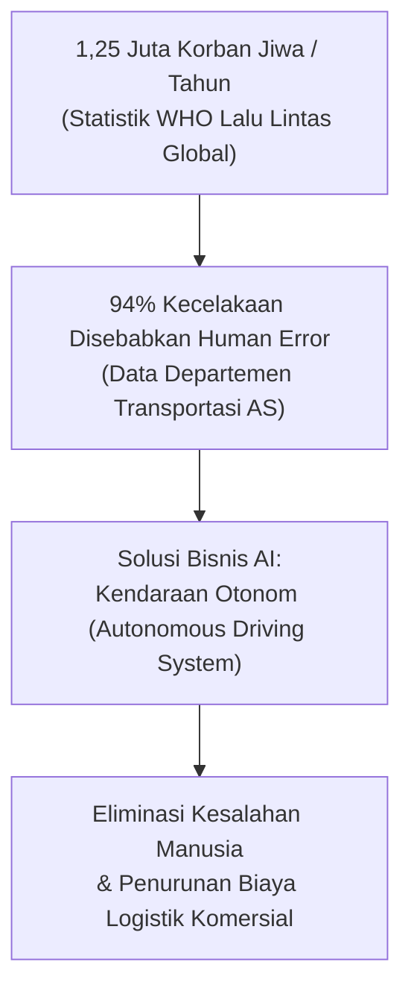

* **Statistik WHO**: Lebih dari 1,25 juta korban jiwa melayang di jalan raya setiap tahun di seluruh dunia.
* **Faktor Human Error**: Laporan *U.S. Department of Transportation* menegaskan bahwa **94% kecelakaan lalu lintas disebabkan oleh kelalaian manusia** (mengantuk, terdistraksi gawai, reaksi lambat, atau pengaruh alkohol).
* **Sasaran Bisnis Terukur**: Implementasi sistem kendali AI ditargetkan memangkas sekurang-kurangnya **40% kecelakaan lalu lintas** yang diakibatkan oleh kesalahan manusia pada fase adopsi awal armada transportasi.

### B. System Flow Desain Sistem Kendaraan Otonom

Operasionalisasi mobil otonom bertumpu pada interaksi tiga subsistem utama:

```mermaid
flowchart LR
    subgraph Subsistem1 ["1. Sistem Sensor (Indra Digital)"]
        direction TB
        S1["Kamera Vision (RGB)"]
        S2["LiDAR (Titik Titik 3D / Point Cloud)"]
        S3["Radar Gelombang Milimeter"]
        S4["Telemetri Kendaraan (Oli, Suhu, Tekanan Ban)"]
    end

    subgraph Subsistem2 ["2. Komputasi AI & Machine Learning"]
        direction TB
        ML1["Object Detection & Classification
(YOLO / RetinaNet)"]
        ML2["Driver Monitoring System
(Face Landmarks & Kelelahan)"]
        ML3["Sensor Fusion & Tracking
(Kalman Filter + Deep Net)"]
        ML4["Predictive Maintenance Engine"]
    end

    subgraph Subsistem3 ["3. Aktuator & Mekanisme Kendali (Output)"]
        direction TB
        A1["Pengereman Otomatis (Autonomous Braking)"]
        A2["Sudut Kemudi (Steering Angle Actuator)"]
        A3["Katup Gas (Engine Throttle)"]
        A4["Peringatan Alarm & Dasbor Pengemudi"]
    end

    Subsistem1 ==> Subsistem2
    Subsistem2 ==> Subsistem3
```

### C. Analisis Lima Komponen Pendukung Utama

#### 1. Deteksi dan Klasifikasi Objek (*Object Detection*)
* **Peran Teknis**: Membaca lingkungan sekitar secara *real-time* untuk mengenali kendaraan lain, pejalan kaki, pesepeda, marka jalan, dan rambu lalu lintas.
* **Potensi Masalah Lapangan**:
  - *Misclassification Fatal*: Model mendeteksi pejalan kaki sebagai tiang lampu jalan, sehingga sistem mengasumsikan objek statis dan tidak bersiap melakukan manuver pengereman darurat saat orang menyeberang.
  - *Pixel Perturbation*: Perbedaan noise beberapa piksel pada citra rambu lalu lintas dapat menyebabkan tanda *STOP* terbaca sebagai tanda batas kecepatan *60 km/jam*.
* **Rekomendasi Solusi**: Melatih model dengan augmentasi data yang variatif mencakup cuaca ekstrem, bayangan, oklusi, dan memastikan data latih mencerminkan distribusi dunia nyata (*out-of-distribution robustness*).

#### 2. Pemantauan Pengemudi (*Driver Condition Monitoring*)
* **Peran Teknis**: Otorisasi identitas pengemudi sah (*Face Recognition*) dan pengawasan kesiapan fisik pengemudi pada level otonom 2 dan 3 (*Semi-Autonomous*).
* **Potensi Masalah Lapangan**: Pengemudi tertidur, mata terpejam, atau kehilangan konsentrasi dari jalan raya (*distracted driving*).
* **Rekomendasi Solusi**: Ekstraksi titik koordinat wajah (**Facial Landmarks**) menggunakan OpenCV/Dlib atau MediaPipe:
  - **Eye Aspect Ratio (EAR)**: Menghitung rasio keterbukaan kelopak mata; jika nilai EAR berada di bawah ambang batas selama $\ge 2$ detik beruntun, alarm kantuk diaktifkan.
  - **Mouth Aspect Ratio (MAR)**: Mengukur frekuensi menguap pengemudi.

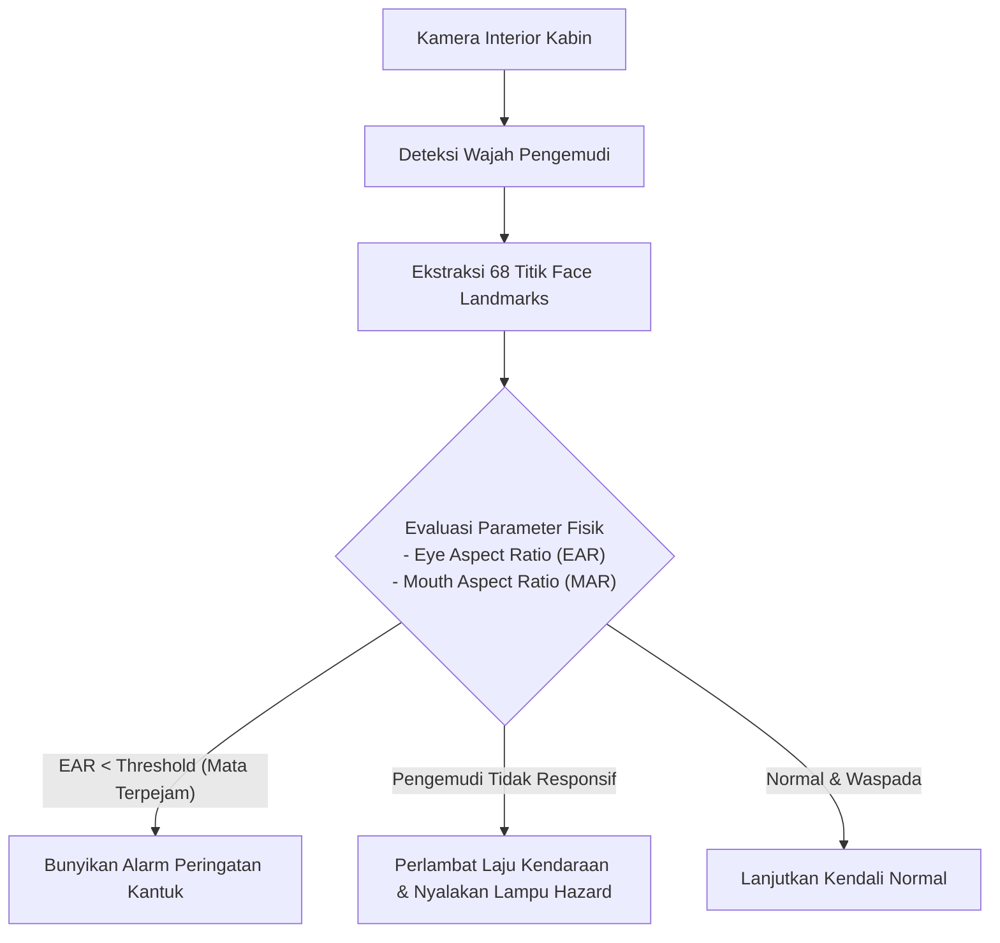

#### 3. Fusi Sensor (*Sensor Fusion*)
Tidak ada satu pun sensor yang sempurna dalam segala skenario cuaca. Fusi sensor menggabungkan modalitas data dari berbagai jenis sensor:

| Jenis Sensor | Karakteristik & Keunggulan | Keterbatasan Operasional | Peran Fusi |
| :--- | :--- | :--- | :--- |
| **Kamera (Vision)** | Memberikan tekstur, detail bentuk, kontras tinggi, dan informasi warna rambu/marka jalan yang jelas. | Sangat sensitif terhadap penurunan visibilitas: kabut tebal, guyuran hujan, salju, dan *glare* silau matahari. | Diandalkan untuk klasifikasi semantik rambu jalan dan marka lajur. |
| **LiDAR (Light Detection and Ranging)** | Menghasilkan awan titik (*point cloud*) 3D resolusi tinggi dengan akurasi jarak sentimeter. | Biaya hardware sangat mahal; kemampuan deteksi dapat terganggu oleh pantulan partikel kabut/hujan lebat. | Menentukan jarak spasial presisi dan batas volume objek 3D. |
| **Radar Gelombang Milimeter** | Sensor aktif yang mampu menembus kabut, hujan lebat, dan debu; unggul mengukur kecepatan relatif objek via efek Doppler. | Resolusi spasial rendah; tidak dapat membedakan tekstur visual atau membaca tulisan rambu. | Menyediakan verifikasi kecepatan dan jarak objek di kondisi cuaca ekstrem. |

* **Solusi Fusi**: Menggabungkan keluaran bounding box kamera dengan koordinat 3D LiDAR/Radar. Jika kamera ragu karena bayangan, deteksi radar memvalidasi keberadaan massa fisik di depan kendaraan.

#### 4. Pemeliharaan Prediktif Mesin (*Predictive Maintenance*)
* **Peran Teknis**: Memanfaatkan data aliran sensor *powertrain*, temperatur oli mesin, laju pemakaian baterai EV, dan tekanan fluida rem untuk memperkirakan sisa masa pakai komponen (*Remaining Useful Life / RUL*).
* **Solusi**: Algoritma deteksi anomali (*Isolation Forest* / *Autoencoder*) mengidentifikasi penyimpangan mikro getaran mesin sebelum terjadi kegagalan sistem katastrofik di jalan tol.

#### 5. Privasi dan Etika Regulasi (*Data Privacy & Ethics*)
* **Permasalahan**: Kamera interior mengumpulkan rekaman video wajah dan percakapan kabin penumpang; navigasi GPS mencatat seluruh riwayat mobilitas harian individu; kamera eksterior merekam wajah pejalan kaki dan plat nomor kendaraan lain di ruang publik.
* **Rekomendasi Solusi**: Kebijakan enkripsi data *end-to-end*, komputasi tepi (*Edge AI*) di mana inferensi wajah diproses di chip lokal mobil tanpa diunggah ke cloud, serta regulasi kepatuhan hukum perlindungan data pribadi (UU PDP).

---

## 9. Latihan Mandiri & Penugasan Proyek

Pilihlah salah satu atau beberapa studi kasus di bawah ini. Lakukan dekonstruksi *Business Understanding* dengan format:
1. **Klasifikasi Kebutuhan**: Apakah sistem ini membutuhkan **Artificial Intelligence** atau cukup dengan **Otomatisasi Berbasis Aturan (*Rule-Based Automation*)**? Berikan argumentasi rasional.
2. **Breakdown Problem & Sasaran Bisnis**: Rumuskan pertanyaan kunci masalah dan sasaran hasil terukur (*Measurable Outcome*).
3. **End-to-End System Flow**: Rancang diagram alur perpindahan data dari masukan mentah hingga aktuator aksi.
4. **Komponen-Komponen Pendukung**: Rinci aktor, tipe sensor/data masukan, pendekatan analitik yang dipilih, serta bentuk aktuator luaran.
5. **Identifikasi Potensi Isu & Rekomendasi Solusi**: Petakan potensi kendala lapangan dan langkah mitigasi teknisnya.

### Lembar Kerja 6 Permasalahan Industri:

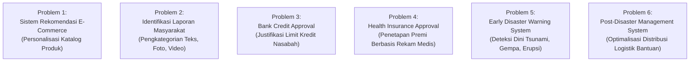

* **Problem 1: Sistem Rekomendasi Otomatis Produk pada E-Commerce**
  - *Deskripsi*: Memberikan rekomendasi katalog produk dinamis yang disesuaikan dengan minat personal, riwayat klik, dan keranjang belanja masing-masing pembeli.
* **Problem 2: Sistem Identifikasi Otomatis Laporan Pengaduan Masyarakat**
  - *Deskripsi*: Menerima laporan warga dalam beragam format multimodal (foto jalan rusak, teks aduan, video banjir), kemudian mengklasifikasikan jenis masalah dan meneruskan tiket ke dinas terkait secara otomatis.
* **Problem 3: Persetujuan Kredit Perbankan (*Bank Credit Approval*)**
  - *Deskripsi*: Menilai kelayakan dan menentukan limit kredit optimal bagi calon nasabah berdasarkan riwayat transaksi mutasi rekening, rasio utang, dan pola gaya hidup belanja.
* **Problem 4: Sistem Penetapan Premi Asuransi Kesehatan (*Health Insurance Approval*)**
  - *Deskripsi*: Menilai tingkat risiko kesehatan calon peserta dan mengestimasi besaran premi asuransi yang adil berdasarkan riwayat rekam medis masa lalu dan faktor gaya hidup.
* **Problem 5: Sistem Peringatan Dini Bencana Alam (*Early Disaster Warning System*)**
  - *Deskripsi*: Mendeteksi anomali seismik sensor gempa bumi, sensor pasang surut air laut untuk peringatan dini tsunami, atau pemantauan aktivitas vulkanik gunung berapi.
* **Problem 6: Sistem Manajemen Pascabencana (*Post-Disaster Management System*)**
  - *Deskripsi*: Mengoptimalkan pendistribusian logistik bahan pangan, obat-obatan, dan alokasi tenda pengungsian secara merata berdasarkan analisis kebutuhan korban bencana di lapangan.

---

## 10. Referensi Literatur & Bacaan Lanjutan

1. **Ari Wibisono, M.Kom (Universitas Indonesia)**. *Bahan Ajar Modul Pelatihan: Business Understanding*. Thematic Academy Digital Talent Scholarship 2021, Kementerian Komunikasi dan Informatika RI.
2. **Andrew Ng**. *Structuring Machine Learning Projects & What is End-to-End Deep Learning*. DeepLearning.AI / Coursera.
3. **Standar Kompetensi Kerja Nasional Indonesia (SKKNI)**. *Keputusan Menteri Ketenagakerjaan RI No. 299 Tahun 2020 tentang Penetapan Standar Kompetensi Kerja Nasional Indonesia Kategori Informasi dan Komunikasi Golongan Pokok Aktivitas Pemrograman, Konsultasi Komputer dan Kegiatan yang Berhubungan dengan Itu Bidang Keahlian Artificial Intelligence Subbidang Data Science*.
4. **U.S. Department of Transportation**. *Automated Driving Systems 2.0: A Vision for Safety*. National Highway Traffic Safety Administration (NHTSA).
5. **World Health Organization (WHO)**. *Global Status Report on Road Safety: Time for Action*.
6. **Analytics Vidhya**. *Stock Price Prediction Using Machine Learning and Deep Learning Techniques in Python*.
