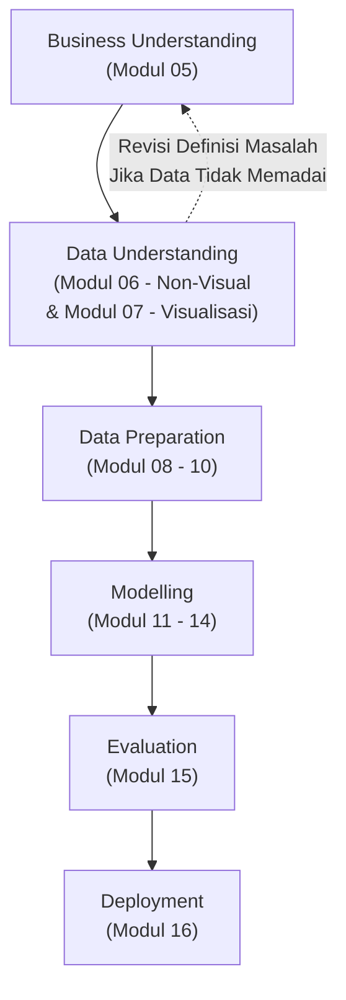
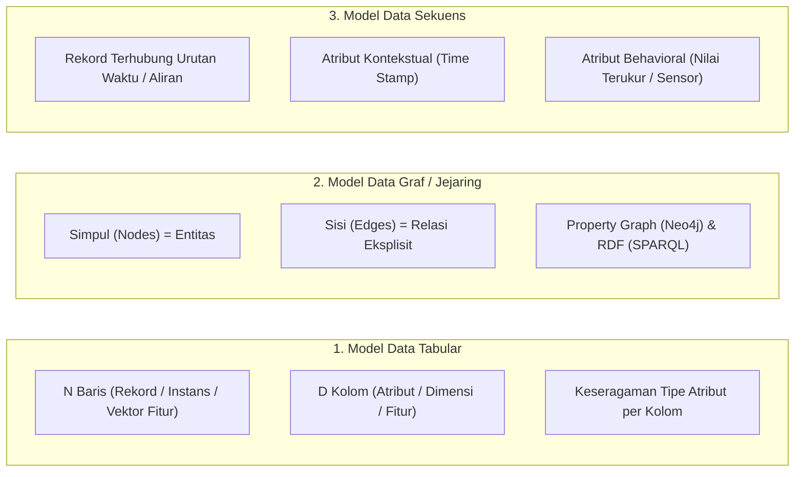
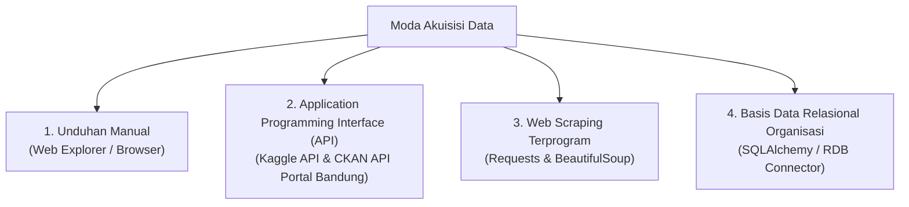
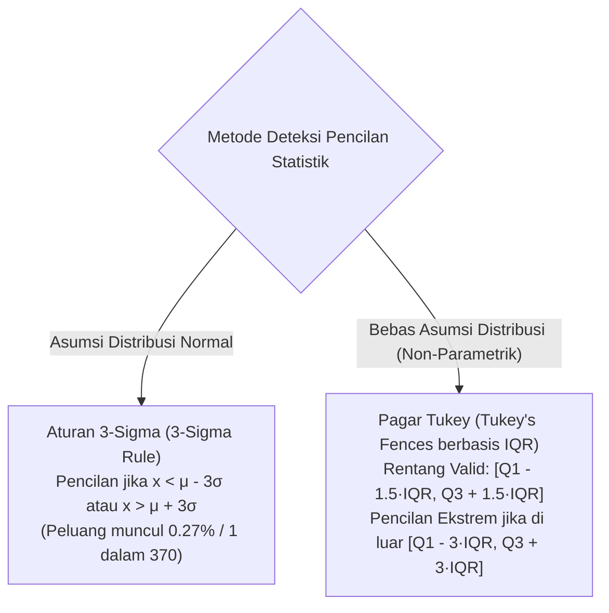

> **Penyusun Modul & Portal:** Mahendar Dwi Payana  
> **Penulis Materi Pelatihan DTS 2021:** Adila Alfa Krisnadhi, Ph.D. (Universitas Indonesia)  
> **Penyelenggara & Kurikulum:** Thematic Academy Digital Talent Scholarship (DTS) 2021, Kementerian Komunikasi dan Informatika RI (Kominfo)  
> **Standar Rujukan:** Standar Kompetensi Kerja Nasional Indonesia (SKKNI) No. 299 Tahun 2020 — Skema *Associate Data Scientist*

---

## 1. Landasan Standar Kompetensi Kerja (SKKNI)

Tahap **Data Understanding** (Pemahaman Data) adalah jembatan kritis yang menghubungkan rumusan masalah bisnis (*Business Understanding*) dengan persiapan teknis (*Data Preparation*). Mengacu pada **SKKNI No. 299 Tahun 2020**, pertemuan ini membekali peserta dengan 2 Unit Kompetensi (UK) inti:

| Kode Unit | Judul Unit Kompetensi | Kriteria Unjuk Kerja (KUK) Inti |
| :--- | :--- | :--- |
| **J.62DMI00.004.1** | Mengumpulkan Data | 1.1 Menentukan kebutuhan data sesuai tujuan analitik.<br/>1.2 Mengambil data dari sumber internal dan terbuka (manual, API, scraping, basis data).<br/>1.3 Mengintegrasikan dan memuat data ke dalam media pemrosesan. |
| **J.62DMI00.005.1** | Menelaah Data dengan Metoda Statistik | 2.1 Menelaah data menggunakan ukuran statistik dasar (pemusatan, penyebaran, bentuk distribusi).<br/>2.2 Menganalisis tipe, struktur, dan keterkaitan relasi data.<br/>2.3 Mengidentifikasi keanehan, anomali, serta pencilan (*outliers*). |

### Metode Penilaian Uji Kompetensi
Penguasaan materi dinilai di Tempat Uji Kompetensi (TUK) melalui:
1. **Tes Tertulis**: Pemahaman teoretis mengenai taksonomi Stevens, perbedaan skala pengukuran, dan formulasi matematis statistik deskriptif.
2. **Demonstrasi Praktik**: Pengambilan data secara programatik (API/SQL) dan penelaahan data non-visual menggunakan pustaka Pandas di Jupyter Notebook.

---

## 2. Konsep & Peran Data Understanding dalam Siklus CRISP-DM

Dalam kerangka metodologi **CRISP-DM (Cross-Industry Standard Process for Data Mining)**, data understanding dilakukan tepat setelah tujuan bisnis terdefinisi dengan jelas.



### Mengapa Perlu Data Understanding?
Data merupakan **bahan mentah** utama bagi solusi AI dan Sains Data. Data dari masing-masing sumber belum tentu dapat langsung diproses karena:
1. **Maksud & Tujuan Berbeda**: Kumpulan data historis sering kali dibuat untuk tujuan transaksional operasional, bukan untuk analitik prediktif.
2. **Keadaan Asal Terfragmentasi**: Data dapat berada dalam silo terpisah (basis data pemasaran, log server, CRM) atau terintegrasi secara rumit.
3. **Variasi Kekayaan (*Richness*) & Keandalan (*Reliability*)**: Tingkat kelengkapan atribut, ketepatan pengukuran, dan kebersihan data sangat beragam.
4. **Ketersediaan & Akses**: Menilai apakah data tersedia secara gratis (*open license*), berbayar, memerlukan izin khusus, atau belum tersedia sehingga memerlukan instrumen survei/pengumpulan mandiri.

### Empat Langkah Inti Proses Telaah Data
1. **Identifikasi "Titik Sentuh" Data dengan Proses Bisnis**: Menelaah bagian-bagian proses bisnis organisasi yang dipengaruhi oleh data serta memetakan keahlian domain pengguna.
2. **Penentuan Sumber Data Utama & Mekanisme Akses**: Memetakan sumber internal/eksternal dan mengevaluasi faktor penghalang aksesibilitas data.
3. **Asesmen Nilai Tambah Bisnis dari Data**: Menilai apakah kualitas dan kuantitas data yang tersedia mampu memberikan impak finansial/operasional yang ditargetkan.
4. **Identifikasi Sumber Data Tambahan untuk Perbaikan**: Mencari data sekunder (*enrichment features*) dari ranah publik atau pihak ketiga yang mampu meningkatkan daya prediksi model.

---

## 3. Sumber, Susunan, Tipe, dan Model Data

### A. Taksonomi Sumber Data
* **Sumber Internal**: Berkas spreadsheet (Excel, CSV, JSON), Basis Data Relasional (PostgreSQL, MySQL, Oracle via SQL), Dokumen teks bebas, dan Berkas multimedia (audio/video).
* **Sumber Eksternal (Open Data Repositories)**:
  - Nasional & Pemerintah Daerah: [Satu Data Indonesia](https://data.go.id), [Open Data Jakarta](https://data.jakarta.go.id), [Open Data Kota Bandung](http://data.bandung.go.id), [Badan Pusat Statistik (BPS)](https://www.bps.go.id), [Badan Informasi Geospasial](https://tanahair.indonesia.go.id/).
  - Global & Akademis: [Kaggle Datasets](https://www.kaggle.com/datasets), [UCI Machine Learning Repository](https://archive.ics.uci.edu/ml/index.php), [Google Dataset Search](https://datasetsearch.research.google.com), [World Bank Open Data](https://data.worldbank.org), [WHO Data](https://www.who.int/data), [UNICEF Data](https://data.unicef.org), [DBPedia](https://www.dbpedia.org), [Wikidata](https://www.wikidata.org).

### B. Susunan Hierarki Data
1. **Butir Data (*Datum*)**: Satuan terkecil dari data; satu nilai tunggal untuk suatu variabel (misal: usia `24` atau nama jalan `"Jl. Sudirman"`). Satu butir data tunggal tidak memiliki makna tanpa konteks penjelas.
2. **Data**: Kumpulan butir data yang membawa satu kesatuan makna mendeskripsikan satu entitas/objek.
3. **Himpunan Data (*Dataset*)**: Kumpulan data yang diorganisasikan bersama.
4. **Metadata**: Data yang menjelaskan data lain (misal: nama atribut, tipe format data, tanggal pembaruan, unit satuan pengukuran).

### C. Klasifikasi Sifat Susunan Data
* **Data Terstruktur (*Structured Data*)**: Mengikuti model data ketat yang telah ditetapkan sebelum data dibuat. Antar-butir data terbedakan dengan jelas dan dapat dikueri langsung (contoh: tabel basis data relasional SQL, spreadsheet CSV).
* **Data Tidak Terstruktur (*Unstructured Data*)**: Tidak memiliki model data terdefinisi sebelumnya, memiliki ketidakteraturan dan ambiguitas semantik (contoh: teks bebas pada email, rekaman suara, video pengawas).
* **Data Semi-Terstruktur (*Semi-Structured Data*)**: Tidak mengikuti struktur tabel relasional formal, namun memiliki *tags*, penanda, atau pasangan kunci-nilai yang memisahkan hierarki semantik (contoh: dokumen JSON, XML, pohon HTML).

---

### D. Taksonomi Skala Pengukuran Data Dasar (Stanley S. Stevens, 1946)

Berdasarkan teori pengukuran Stevens, tipe data elementer diklasifikasikan ke dalam 4 tingkatan skala:

| Karakteristik | Skala Nominal (Kategorikal) | Skala Ordinal | Skala Interval | Skala Rasio |
| :--- | :--- | :--- | :--- | :--- |
| **Sifat Himpunan Asal** | Diskret, tidak memiliki urutan. | Diskret, memiliki urutan intrinsik. | Kontinu / numerik terurut; selisih menunjukkan jarak pasti. | Kontinu / numerik terurut; menyatakan rasio kelipatan kuantitas. |
| **Contoh Riil** | Warna (Merah, Hijau, Biru), Jenis Kelamin, Merek Mobil. | Peringkat kelas, Nilai mutu huruf (A, B, C, D, E), Tingkat kepuasan. | Suhu Celsius (°C), Tahun kalender, Derajat haluan kompas. | Harga mobil (Rp), Berat beban (kg), Panjang jalan (km), Suhu Kelvin (K). |
| **Makna Ukuran Data** | *Membership* (Keanggotaan). | *Membership*, *Comparison* (Perbandingan / Tingkatan). | *Membership*, *Comparison*, *Difference* (Selisih). | *Membership*, *Comparison*, *Difference*, *Magnitude* (Besaran absolut). |
| **Operasi Matematika** | $=, \ne$ | $=, \ne, <, >$ | $=, \ne, <, >, +, -$ | $=, \ne, <, >, +, -, \times, \div$ |
| **Ukuran Pemusatan Tipikal** | **Modus** | **Modus, Median** | **Modus, Median, Rerata Aritmetik** | **Modus, Median, Rerata Aritmetik, Geometrik, Harmonik** |
| **Ukuran Persebaran Tipikal** | Pengelompokan (*Grouping*) | *Grouping*, Rentang (*Range*), Rentang Antarkuartil (IQR) | *Grouping*, *Range*, IQR, Varians, Simpangan Baku | *Grouping*, *Range*, IQR, Varians, Simpangan Baku, Koefisien Variasi |
| **Memiliki Nilai Nol Sejati?** | Tidak | Tidak | **Tidak** (0°C bukan berarti ketiadaan suhu panas) | **Ya** (Rp 0 berarti ketiadaan uang tunai mutlak) |

---

### E. Tiga Model Data Terstruktur Utama



1. **Model Data Tabular**: Format paling lazim dijumpai di industri, tersusun atas $n$ baris (*records*) dan $d$ kolom (*attributes*). Relasi antar-atribut ditekankan pada satu entitas objek yang sama.
2. **Model Data Graf / Jejaring**: Terdiri dari simpul (*nodes*) dan sisi (*edges*) untuk mengekspresikan interkoneksi kompleks (misal: jejaring sosial, struktur molekul, graf transaksi penipuan).
3. **Model Data Sekuens**: Kumpulan data yang struktur dependensinya tersirat dari urutan kemunculan data. Jika atribut kontekstualnya berupa stempel waktu (*timestamp*), maka data sekuens disebut **Deret Waktu (Time Series)**.

---

## 4. Teknik Akuisisi & Pengambilan Data

Terdapat empat moda pengambilan data yang lazim diterapkan oleh seorang *Data Scientist*:



### A. Pengambilan Data via Kaggle API
Kaggle menyediakan API resmi berbasis Python untuk mengotomatisasi pencarian dan pengunduhan dataset:

```bash
# 1. Instalasi library Kaggle
pip install kaggle

# 2. Penempatan token otentikasi kaggle.json
# Diunduh dari Profil Kaggle -> Account -> Create New API Token
# Letakkan di ~/.kaggle/kaggle.json (Linux/macOS) atau C:\Users\<Username>\.kaggle\kaggle.json (Windows)
chmod 600 ~/.kaggle/kaggle.json

# 3. Pencarian dataset berbasis kata kunci
kaggle datasets list -s "goal leagues"

# 4. Pengunduhan dan ekstraksi otomatis
kaggle datasets download shreyanshkhandelwal/goal-dataset-top-5-european-leagues
unzip -o goal-dataset-top-5-european-leagues.zip
```

### B. Pengambilan Data via CKAN API (Portal Satu Data Bandung)
Portal Satu Data Bandung (`data.bandung.go.id`) dibangun menggunakan kerangka kerja terbuka **CKAN (Comprehensive Knowledge Archive Network)**:

```python
import requests
import json
from tqdm import tqdm

# 1. Mendapatkan daftar seluruh paket dataset yang tersedia
url_list = "http://data.bandung.go.id/api/3/action/package_list"
resp_list = requests.get(url_list)
data_packages = json.loads(resp_list.text).get('result', [])
print(f"Total Dataset Terindeks: {len(data_packages)}")

# 2. Pencarian dataset dengan parameter kata kunci 'q'
url_search = "http://data.bandung.go.id/api/3/action/package_search"
resp_search = requests.get(url_search, params=[('q', 'sekolah dasar')])
search_results = json.loads(resp_search.text)['result']
print(f"Hasil Ditemukan: {search_results['count']} dataset")

# 3. Mendapatkan rincian URL unduhan berkas (resources)
package_name = "jumlah-guru-sd-negeri-di-kota-bandung-berdasarkan-sekolah"
url_detail = "http://data.bandung.go.id/api/3/action/package_show"
resp_detail = requests.get(url_detail, params=[('id', package_name)])
resources = json.loads(resp_detail.text)['result']['resources']

# 4. Mengunduh berkas dengan progress bar tqdm
for res in resources:
    download_url = res['url']
    filename = download_url.split('/')[-1]
    response = requests.get(download_url, stream=True)
    with open(filename, "wb") as handle:
        for chunk in tqdm(response.iter_content(chunk_size=1024), desc=filename):
            if chunk:
                handle.write(chunk)
    print(f"Selesai mengunduh: {filename}")
```

### C. Web Scraping & Akses Basis Data SQL
* **Web Scraping**: Mengekstrak data langsung dari halaman HTML menggunakan `requests` dan `BeautifulSoup`. Wajib memperhatikan struktur DOM, batas laju (*rate limiting*), berkas `robots.txt`, dan lisensi hukum situs.
* **Basis Data Relasional (RDB)**: Menarik data menggunakan kueri SQL melalui pustaka `SQLAlchemy` dan `pandas.read_sql()`. Kredensial (host, user, password) wajib dilindungi menggunakan variabel lingkungan (*environment variables*).

---

## 5. Formulasi Matematis Telaah Statistik Deskriptif

Metode penelaahan data statistik non-visual berfokus pada ringkasan karakteristik data numerik dan kategorik tanpa bergantung pada visualisasi grafik.

### A. Ukuran Pemusatan Data (*Measures of Central Tendency*)

#### 1. Rerata Aritmetik (*Arithmetic Mean*)
Diberikan himpunan data sampel $S = \{x_1, x_2, \dots, x_N\}$:

$$
\mu_S = \bar{x} = \frac{1}{N}\sum_{i=1}^{N} x_i = \frac{x_1 + x_2 + \dots + x_N}{N}
$$

* **Sifat Esensial**: Total selisih jarak seluruh butir data terhadap nilai reratanya bernilai nol:
  $$ \sum_{i=1}^{N} (\mu_S - x_i) = 0 $$
* **Kelemahan**: Rerata aritmetik **tidak bersifat robust**; nilainya sangat mudah terdistorsi oleh keberadaan nilai pencilan ekstrim atau distribusi miring (*skewed*).

#### 2. Median (Nilai Tengah)
Nilai data yang membagi sampel terurut menjadi dua bagian sama banyak:
* Jika $N$ ganjil: Nilai pada urutan ke-$\left(\frac{N+1}{2}\right)$.
* Jika $N$ genap: Rerata dari dua nilai tengah pada urutan ke-$\left(\frac{N}{2}\right)$ dan $\left(\frac{N}{2} + 1\right)$.
* **Sifat Esensial**: Bersifat **robust** terhadap pencilan, sehingga sangat ideal untuk mewakili distribusi asimetris (seperti data pendapatan masyarakat).

#### 3. Modus (Nilai Paling Sering Muncul)
Nilai dengan frekuensi kemunculan tertinggi. Digunakan untuk data nominal dan ordinal. Data dapat bersifat *unimodal* (satu puncak) atau *multimodal* (lebih dari satu puncak frekuensi tertinggi).

---

### B. Ukuran Persebaran Data (*Measures of Dispersion*)

#### 1. Rentang (*Range*)
Selisih antara nilai tertinggi dan terendah dalam sampel:

$$
\text{Range} = \max(S) - \min(S)
$$

#### 2. Kuantil, Kuartil, dan Rentang Antarkuartil (IQR)
* **Kuartil 1 ($Q_1$)**: Titik potong persentil ke-25 ($25\%$ data berada di bawahnya).
* **Kuartil 2 ($Q_2$)**: Median atau persentil ke-50.
* **Kuartil 3 ($Q_3$)**: Titik potong persentil ke-75 ($75\%$ data berada di bawahnya).
* **Rentang Antarkuartil (Interquartile Range - IQR)**:
  $$ \text{IQR} = Q_3 - Q_1 $$

#### 3. Varians dan Simpangan Baku Sampel (*Sample Variance & Standard Deviation*)
Dihitung menggunakan **koreksi Bessel ($N-1$)** untuk menghasilkan estimator tak bias bagi varians populasi:

$$
\sigma_S^2 = \frac{1}{N-1}\sum_{i=1}^{N} (x_i - \mu_S)^2
$$

$$
\sigma_S = \sqrt{\sigma_S^2}
$$

Interpretasi: Simpangan baku mencerminkan presisi dan derajat ketidakpastian pengukuran data. Semakin kecil nilainya, semakin rapat butir-butir data mengelilingi nilai pusatnya.

---

### C. Deteksi Pencilan Statistik (*Outlier Detection*)



1. **Aturan 3-Sigma (*3-Sigma Rule*)**:
   - Jika data terdistribusi normal, interval $[\mu - \sigma, \mu + \sigma]$ mencakup $68.27\%$, $[\mu - 2\sigma, \mu + 2\sigma]$ mencakup $95.45\%$, dan $[\mu - 3\sigma, \mu + 3\sigma]$ mencakup $99.73\%$ data.
   - Butir data $x_i$ dikategorikan sebagai pencilan jika:
     $$ x_i < \mu_S - 3\sigma_S \quad \text{atau} \quad x_i > \mu_S + 3\sigma_S $$
   - **Kelemahan**: Mengasumsikan normalitas data, dan nilai $\mu$ serta $\sigma$ sendiri terpengaruh oleh keberadaan pencilan tersebut.
2. **Pagar Tukey (*Tukey's Fences*)**:
   - Tidak memerlukan asumsi distribusi normal:
     $$ \text{Pencilan Biasa: } x_i < Q_1 - 1.5(\text{IQR}) \quad \text{atau} \quad x_i > Q_3 + 1.5(\text{IQR}) $$
     $$ \text{Pencilan Ekstrem: } x_i < Q_1 - 3(\text{IQR}) \quad \text{atau} \quad x_i > Q_3 + 3(\text{IQR}) $$

---

### D. Koefisien Korelasi Linier Pearson (PCC)

Mengukur derajat keterhubungan linier antara dua variabel numerik $X$ dan $Y$:

$$
r_{xy} = \frac{1}{(N-1)s_x s_y} \sum_{i=1}^{N} (x_i - \mu_x)(y_i - \mu_y)
$$

Di mana $s_x$ dan $s_y$ adalah simpangan baku sampel variabel $X$ dan $Y$.
* **Rentang Nilai**: $-1 \le r_{xy} \le +1$.
  - $r_{xy} = +1$: Korelasi linier positif sempurna.
  - $r_{xy} = -1$: Korelasi linier negatif sempurna.
  - $r_{xy} = 0$: Tidak terdapat korelasi linier.
* **Perhatian Fundamental**: $r_{xy} = 0$ **bukan berarti kedua variabel independen**, melainkan hanya membuktikan ketiadaan hubungan linier (variabel masih dapat berhubungan secara kuadratik, sinusoidal, atau non-linier lainnya).

---

## 6. Studi Kasus 1: Eksplorasi Statistik Karakteristik Mobil (`automobileEDA.csv`)

Studi kasus ini menggunakan dataset otomotif komprehensif berdimensi 201 baris dan 29 fitur. Dataset telah disediakan di direktori publik portal: [`automobileEDA.csv`](https://mahendartea.github.io/Learn-AI/data/automobileEDA.csv).

```python
# Studi Kasus 1: Analisis Statistik Deskriptif Non-Visual Dataset Mobil
# Menguji Tipe Variabel, Korelasi Pearson, dan Frekuensi Kategori
# Berdasarkan Kurikulum DTS 2021 & Notebook DA0101EN
# Disusun oleh: Mahendar Dwi Payana

import pandas as pd
import numpy as np

# 1. Memuat Dataset Mobil
url_car = "https://mahendartea.github.io/Learn-AI/data/automobileEDA.csv"
df = pd.read_csv(url_car)

print(f"Dimensi Dataset Mobil: {df.shape[0]} baris, {df.shape[1]} kolom\n")
print(df.head(3))

# 2. Memeriksa Tipe Data Kolom (dtypes)
print("\n=== TIPE DATA VARIABEL ===")
print(df.dtypes)
# Pertanyaan Analitik: Tipe data 'peak-rpm' adalah float64

# 3. Analisis Korelasi Linier Pearson (df.corr)
print("\n=== KORELASI SPESIFIK: BORE, STROKE, COMPRESSION, HORSEPOWER ===")
sub_corr = df[['bore', 'stroke', 'compression-ratio', 'horsepower']].corr()
print(sub_corr.round(3))

# Korelasi terkuat terhadap variabel target 'price'
print("\n=== KORELASI FITUR TERHADAP HARGA (PRICE) ===")
corr_price = df.corr(numeric_only=True)['price'].sort_values(ascending=False)
print(corr_price.round(3))

# 4. Ringkasan Statistik Numerik Kontinu (describe)
print("\n=== RINGKASAN STATISTIK DESKRIPTIF NUMERIK ===")
print(df[['wheel-base', 'curb-weight', 'engine-size', 'horsepower', 'price']].describe().round(2))

# 5. Ringkasan Statistik Kategorik (describe include=['object'])
print("\n=== RINGKASAN STATISTIK KATEGORIK ===")
print(df.describe(include=['object']))

# 6. Analisis Distribusi Frekuensi (value_counts)
print("\n=== FREKUENSI SISTEM PENGGERAK RODA (drive-wheels) ===")
drive_wheels_counts = df['drive-wheels'].value_counts().to_frame()
drive_wheels_counts.rename(columns={'drive-wheels': 'value_counts'}, inplace=True)
drive_wheels_counts.index.name = 'drive-wheels'
print(drive_wheels_counts)

print("\n=== FREKUENSI POSISI MESIN (engine-location) ===")
engine_loc_counts = df['engine-location'].value_counts().to_frame()
engine_loc_counts.rename(columns={'engine-location': 'value_counts'}, inplace=True)
engine_loc_counts.index.name = 'engine-location'
print(engine_loc_counts)
```

### Temuan Analitik Utama Kasus Otomotif:
1. **Korelasi Terkuat terhadap Harga**: Fitur `engine-size` ($r = 0.872$), `curb-weight` ($r = 0.834$), dan `horsepower` ($r = 0.810$) memiliki hubungan linier positif sangat kuat terhadap harga jual mobil.
2. **Efisiensi Bahan Bakar**: `highway-mpg` ($r = -0.705$) dan `city-mpg` ($r = -0.687$) berkorelasi negatif kuat terhadap harga, membuktikan mobil premium berperforma tinggi cenderung lebih boros bahan bakar.
3. **Ketimpangan Kategori**: Sistem penggerak roda didominasi oleh `fwd` (118 unit) dan `rwd` (75 unit), sedangkan `4wd` hanya 8 unit. Posisi mesin hampir seluruhnya berada di depan (`front`: 198 unit), sedangkan di belakang hanya 3 unit (`rear`), mengindikasikan ketidakseimbangan kelas (*class imbalance*) yang sangat tajam pada fitur tersebut.

---

## 7. Studi Kasus 2: Analisis Kinerja Pemain Liga Premier Inggris (`epl-goalScorer(20-21).csv`)

Studi kasus ini menelaah dataset performa 522 pemain English Premier League (EPL) musim 2020/2021 berdasarkan materi pelatihan Adila Alfa Krisnadhi, Ph.D.

```python
# Studi Kasus 2: Telaah Statistik Deskriptif Pemain EPL Musim 2020/2021
# Pemeriksaan Skewness, Deteksi Pencilan Tukey, dan Agregasi Tim
# Disusun oleh: Mahendar Dwi Payana

import pandas as pd
import numpy as np

def analyze_epl_statistics(df_epl):
    # 1. Membersihkan kolom indeks dan identifier numerik
    df_noid = df_epl.iloc[:, 2:] if 'id' in df_epl.columns else df_epl.copy()
    
    # 2. Perbandingan Ukuran Pemusatan: Mean vs Median (Menguji Skewness)
    print("=== PERBANDINGAN TENDENSI SENTRAL ===")
    metrics = ['goals', 'games', 'assists', 'shots']
    mean_vals = df_noid[metrics].mean()
    median_vals = df_noid[metrics].median()
    
    comp_df = pd.DataFrame({
        'Mean (Rata-rata)': mean_vals.round(2),
        'Median (Nilai Tengah)': median_vals.round(2),
        'Distribusi Skew': ['Miring Kanan (Mean > Median)' if m > md else 'Simetris / Kiri' 
                            for m, md in zip(mean_vals, median_vals)]
    })
    print(comp_df)
    
    # 3. Deteksi Pencilan Menggunakan Pagar Tukey (IQR)
    q1 = df_noid['goals'].quantile(0.25)
    q3 = df_noid['goals'].quantile(0.75)
    iqr = q3 - q1
    outlier_threshold = q3 + 1.5 * iqr
    
    outliers_goals = df_noid[df_noid['goals'] > outlier_threshold][['player_name', 'team_title', 'goals']]
    print(f"\n=== PENCILAN PENCETAK GOL (Batas Tukey > {outlier_threshold} Gol) ===")
    print(outliers_goals.sort_values(by='goals', ascending=False).head(10))
    
    # 4. Analisis Modus & Frekuensi Klub
    print("\n=== FREKUENSI KLUB TERATAS (Deteksi Transfer Pemain) ===")
    print(df_noid['team_title'].value_counts().head(8))
    
    # 5. Agregasi Rerata Gol Berkelompok (Groupby)
    print("\n=== KONTRIBUSI RERATA GOL PER PEMAIN MENURUT TIM ===")
    team_goals = df_noid.groupby('team_title')[['goals']].mean().sort_values(by='goals', ascending=False)
    print(team_goals.head(5))
    print("...")
    print(team_goals.tail(3))
```

### Insight Bisnis Sepakbola:
* **Asimetri Gol**: Rata-rata gol adalah 1.86 gol/pemain, sedangkan median bernilai 1.00 gol/pemain. Ini mencerminkan distribusi miring kanan (*right-skewed*), di mana mayoritas pemain jarang mencetak gol, dan hanya segelintir pemain bintang (Harry Kane 23 gol, Mohamed Salah 22 gol, Bruno Fernandes 18 gol) yang menjadi pencilan produktif.
* **Anomali Entitas Klub**: Terdapat 28 kombinasi nilai pada `team_title` padahal EPL hanya diikuti 20 klub. Penelaahan membuktikan ada 8 pemain yang tercatat membela dua klub berbeda dalam semusim akibat skema peminjaman/transfer tengah musim (contoh: label `"Arsenal,Newcastle United"` untuk Joe Willock).

---

## 8. Ringkasan Pustaka Fungsi Statistik Pandas

| Nama Fungsi | Deskripsi Hasil Komputasi | Berlaku untuk Tipe Data |
| :--- | :--- | :--- |
| `df.count()` | Jumlah observasi non-null / bukan `NA`. | Semua tipe data |
| `df.mean()` | Rerata aritmetik sampel. | Interval, Rasio |
| `df.median()` | Nilai tengah data sampel. | Ordinal, Interval, Rasio |
| `df.mode()` | Nilai dengan frekuensi kemunculan tertinggi. | Semua tipe data |
| `df.std()` | Simpangan baku sampel dengan koreksi Bessel ($N-1$). | Interval, Rasio |
| `df.var()` | Varians sampel dengan koreksi Bessel. | Interval, Rasio |
| `df.min()` / `df.max()` | Nilai minimum dan maksimum data. | Ordinal, Interval, Rasio |
| `df.quantile(q)` | Nilai titik potong pada kuantil $q$ ($0 \le q \le 1$). | Ordinal, Interval, Rasio |
| `df.skew()` | Nilai ukuran kemiringan distribusi (*3rd standardized moment*). | Interval, Rasio |
| `df.kurt()` | Nilai ukuran keruncingan ekor distribusi (*4th standardized moment*). | Interval, Rasio |
| `df['col'].value_counts()` | Tabel frekuensi kemunculan setiap kategori unik. | Nominal, Ordinal |
| `df.corr(method='pearson')` | Matriks koefisien korelasi linier Pearson simetrik. | Interval, Rasio |
| `df.describe(include='all')` | Ringkasan statistik gabungan numerik & kategorik. | Semua tipe data |

---

## 9. Penugasan Praktik Mandiri (Tugas Harian)

### Tugas 1: Otomasi Unduhan Dataset Terbuka via Kaggle API
1. Siapkan lingkungan kerja Python dan lakukan konfigurasi token `kaggle.json`.
2. Lakukan pencarian dua dataset terbuka bertema sosial atau ekonomi dengan perintah `kaggle datasets list -s <kata_kunci>`.
3. Unduh dan ekstrak kedua berkas dataset tersebut secara programatik menggunakan Python `subprocess` atau *shell script*.

### Tugas 2: Data Understanding Transaksi SPBU (*Gas Station Transaction Dataset*)
Gunakan dataset transaksi pelanggan perbankan / SPBU (`transaction_1k`) dari repositori Hackathon BI CCS:
1. Susun tabel daftar **Top 5 Customers** yang memiliki akumulasi nominal transaksi terbesar!
2. Susun daftar **Top 5 SPBU (*Gas Stations*)** dengan volume transaksi tertinggi!
3. Susun daftar **Top 5 Jenis Produk BBM/Non-BBM** paling laris!
4. Hitung ringkasan statistik deskriptif harian untuk tanggal 23, 24, 25, dan 26!
5. Identifikasi jam sibuk (*peak hours*) dan hari dengan lonjakan transaksi terbanyak!
6. Dari perspektif *Business Understanding*, jelaskan apa kegunaan strategis hasil analisis profil pelanggan ini bagi manajemen perbankan dan operator ritel bahan bakar!

---

## 10. Referensi Literatur & Bacaan Lanjutan

1. **Adila Alfa Krisnadhi, Ph.D. (Universitas Indonesia)**. *Bahan Ajar Modul Pelatihan: Data Understanding 1*. Thematic Academy Digital Talent Scholarship 2021, Kementerian Komunikasi dan Informatika RI.
2. **Stanley S. Stevens**. *On the Theory of Scales of Measurement*. Science 103 (2684): 677–680, 1946.
3. **Joel Grus**. *Data Science from Scratch: First Principles with Python*, 2nd Edition. O'Reilly Media, 2019.
4. **Charu C. Aggarwal**. *Data Mining: The Textbook*. Springer, 2015.
5. **Matt Taddy**. *Business Data Science: Combining Machine Learning and Economics to Optimize, Automate, and Accelerate Business Decisions*. McGraw-Hill, 2019.
6. **Cognitive Class**. *Data Analysis with Python (Course DA0101EN)*. IBM Developer Skills Network.
