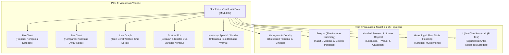
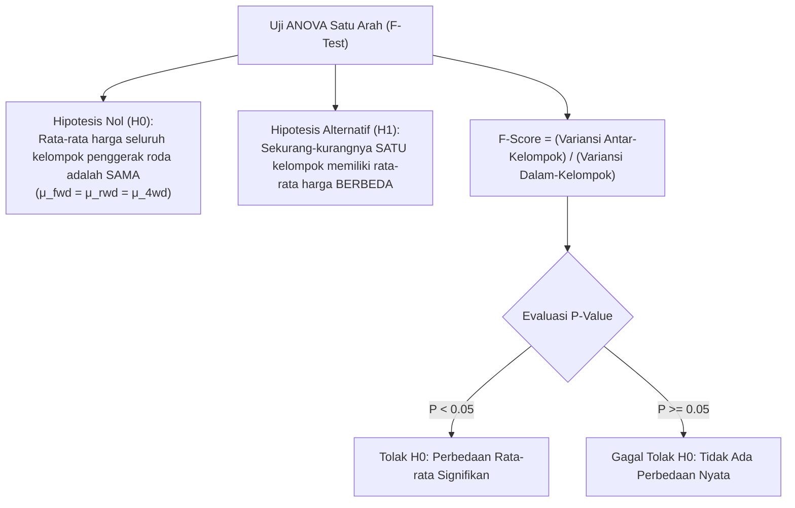

> **Penyusun Modul & Portal:** Mahendar Dwi Payana  
> **Penulis Materi Pelatihan DTS 2021:** Ari Wibisono, M.Kom (Universitas Indonesia)  
> **Penyelenggara & Kurikulum:** Thematic Academy Digital Talent Scholarship (DTS) 2021, Kementerian Komunikasi dan Informatika RI (Kominfo)  
> **Standar Rujukan:** Standar Kompetensi Kerja Nasional Indonesia (SKKNI) No. 299 Tahun 2020 — Skema *Associate Data Scientist*

---

## 1. Landasan Standar Kompetensi Kerja (SKKNI)

Visualisasi data bukan sekadar kegiatan estetika grafis, melainkan instrumen kognitif utama dalam menelaah karakteristik empiris data (*Exploratory Data Analysis / EDA*). Berdasarkan **SKKNI No. 299 Tahun 2020**, pertemuan ini membekali peserta dengan Unit Kompetensi:

| Kode Unit | Judul Unit Kompetensi | Kriteria Unjuk Kerja (KUK) Inti |
| :--- | :--- | :--- |
| **J.62DMI00.005.1** | Menelaah Data dengan Teknik Visualisasi | 1.1 Mengidentifikasi tipe variabel dan memilih bentuk visualisasi yang sesuai.<br/>1.2 Menelaah sebaran, tendensi sentral, dan anomali menggunakan grafik statistik.<br/>1.3 Menganalisis keterkaitan linier dan non-linier antar-variabel menggunakan scatter plot, matriks korelasi, dan heatmap.<br/>1.4 Menguji signifikansi perbedaan kelompok kategori menggunakan teknik pengelompokan (*grouping*) dan Analisis Varians (ANOVA). |

---

## 2. Taksonomi Visualisasi Data: Variabel vs Statistik

Visualisasi data dalam sains data terbagi menjadi dua pilar utama:



---

## 3. Pilar 1: Visualisasi Variabel (Matplotlib & Seaborn)

### A. Pie Chart (Diagram Lingkaran)
Pie chart digunakan untuk menampilkan kontribusi proporsional masing-masing kategori terhadap keseluruhan ($100\%$).
* **Kapan Efektif Digunakan**: Ketika jumlah kategori sedikit ($3$ hingga $7$ kelas).
* **Kapan Harus Dihindari**: Jika jumlah kategori terlalu banyak ($>10$ kelas), irisan menjadi sangat tipis dan membingungkan pembaca (*visual clutter*).

```python
import matplotlib.pyplot as plt

flavors = ('Chocolate', 'Vanilla', 'Pistachio', 'Mango', 'Strawberry')
votes = (12, 11, 4, 8, 7)
colors = ('#8B4513', '#FFF8DC', '#93C572', '#E67F0D', '#D53032')
explode = (0, 0, 0, 0.1, 0)  # Menyorot irisan Mango keluar 10%

plt.figure(figsize=(7, 7))
plt.title('Hasil Survei Rasa Es Krim Favorit', fontsize=14, pad=15)
plt.pie(
    votes,
    labels=flavors,
    autopct='%1.1f%%',
    colors=colors,
    explode=explode,
    shadow=True,
    startangle=140
)
plt.show()
```

---

### B. Bar Chart (Diagram Batang)
Diagram batang merupakan instrumen visual komparatif terbaik untuk membandingkan besaran kuantitatif antar-kategori diskret. Diagram batang mampu menampilkan puluhan kategori jauh lebih jelas dibandingkan diagram lingkaran.

```python
import matplotlib.pyplot as plt
import numpy as np
import pandas as pd

countries = ('Argentina', 'Bolivia', 'Brazil', 'Chile', 'Colombia', 'Ecuador',
             'Falkland Islands', 'French Guiana', 'Guyana', 'Paraguay', 'Peru',
             'Suriname', 'Uruguay', 'Venezuela')
populations = (45076704, 11626410, 212162757, 19109629, 50819826, 17579085,
               3481, 287750, 785409, 7107305, 32880332, 585169, 3470475, 28258770)

# Mengonstruksi DataFrame & mengurutkan populasi
df_pop = pd.DataFrame({'Country': countries, 'Population': populations})
df_pop.sort_values(by='Population', inplace=True)

# Pewarnaan bersyarat: Sorot Kolombia dengan warna merah
colors = ['#0000FF' for _ in range(len(df_pop))]
colors[-2] = '#FF0000'  # Kolombia negara berpenduduk terbanyak ke-2

plt.figure(figsize=(12, 6))
plt.bar(df_pop['Country'], df_pop['Population'] / 1e6, color=colors)
plt.xticks(rotation=90)
plt.ylabel('Populasi (Juta Jiwa)')
plt.title('Populasi Negara-Negara di Amerika Selatan (Highlight: Kolombia)')
plt.grid(axis='y', linestyle='--', alpha=0.7)
plt.tight_layout()
plt.show()
```

---

### C. Line Graph (Diagram Garis)
Diagram garis mengilustrasikan perubahan kontinu variabel terhadap sumbu berurutan (paling sering berupa waktu atau deret proses). Sangat berguna untuk membandingkan kurva nilai aktual vs nilai hasil prediksi model.

```python
import matplotlib.pyplot as plt

hour = [0, 2, 4, 6, 8, 10, 12, 14, 16, 18, 20, 22, 24]
temp_actual = [2, 1, 0, 0, 1, 5, 8, 9, 8, 5, 3, 2, 2]
temp_predicted = [2, 2, 1, 0, 1, 3, 7, 8, 8, 6, 4, 3, 3]

plt.figure(figsize=(9, 5))
plt.plot(hour, temp_actual, marker='o', color='#1f77b4', label='Suhu Aktual (°C)')
plt.plot(hour, temp_predicted, marker='x', linestyle='--', color='#ff7f0e', label='Suhu Prediksi Model (°C)')
plt.title('Fluktuasi Suhu Harian di Kirkland, WA, USA')
plt.xlabel('Jam (0 - 24)')
plt.ylabel('Suhu (°C)')
plt.legend()
plt.grid(True, linestyle=':', alpha=0.6)
plt.show()
```

---

### D. Scatter Plot (Diagram Sebar)
Scatter plot memetakan pasangan dua variabel numerik kontinu $(x_i, y_i)$ untuk mengevaluasi apakah ada hubungan fungsional, pengelompokan alami, atau anomali (*outliers*).

```python
import matplotlib.pyplot as plt

# Data karakteristik fisik Lemon vs Jeruk Nipis (Lime)
lemon_diam = [6.44, 6.87, 7.70, 8.85, 8.15, 9.96, 7.21, 10.04, 10.20, 11.06]
lemon_wt = [112.05, 114.58, 116.71, 117.40, 128.93, 132.93, 138.92, 145.98, 148.44, 152.81]

lime_diam = [6.15, 7.00, 7.00, 7.69, 7.95, 7.51, 10.46, 8.72, 9.53, 10.09]
lime_wt = [112.76, 125.16, 131.36, 132.41, 138.08, 142.55, 156.86, 158.67, 163.28, 166.74]

plt.figure(figsize=(8, 6))
plt.scatter(lemon_diam, lemon_wt, color='gold', edgecolor='black', s=80, label='Lemon (Kuning)')
plt.scatter(lime_diam, lime_wt, color='forestgreen', edgecolor='black', s=80, label='Lime / Jeruk Nipis (Hijau)')
plt.title('Perbandingan Karakteristik Fisiologis: Lemon vs Lime')
plt.xlabel('Diameter Buah (cm)')
plt.ylabel('Berat Buah (gram)')
plt.legend()
plt.grid(True, linestyle='--', alpha=0.5)
plt.show()
```

---

### E. Heatmap (Peta Panas Matriks)
Heatmap memetakan matriks tabel dua dimensi ke dalam gradasi spektrum warna. Sangat efektif untuk menelaah pola temporal siklis dan kepadatan multivariabel.

```python
import seaborn as sns
import matplotlib.pyplot as plt

cities = ['New York', 'Beijing', 'Tokyo', 'Osaka', 'Shanghai', 'Cairo',
          'Delhi', 'Karachi', 'Dhaka', 'Mexico City', 'Mumbai', 'Sao Paulo']
months = ['Jan', 'Feb', 'Mar', 'Apr', 'Mei', 'Jun', 'Jul', 'Agu', 'Sep', 'Okt', 'Nov', 'Des']

temperatures = [
    [4, 6, 11, 18, 22, 27, 29, 29, 25, 18, 13, 7],    # New York
    [2, 5, 12, 21, 27, 30, 31, 30, 26, 19, 10, 4],    # Beijing
    [10, 10, 14, 19, 23, 26, 30, 31, 27, 22, 17, 12], # Tokyo
    [9, 10, 14, 20, 25, 28, 32, 33, 29, 23, 18, 12],  # Osaka
    [8, 10, 14, 20, 24, 28, 32, 32, 27, 23, 17, 11],  # Shanghai
    [19, 21, 24, 29, 33, 35, 35, 35, 34, 30, 25, 21], # Cairo
    [20, 24, 30, 37, 40, 39, 35, 34, 34, 33, 28, 22], # Delhi
    [26, 28, 32, 35, 36, 35, 33, 32, 33, 35, 32, 28], # Karachi
    [25, 29, 32, 33, 33, 32, 32, 32, 32, 31, 29, 26], # Dhaka
    [22, 24, 26, 27, 27, 26, 24, 25, 24, 24, 23, 23], # Mexico City
    [31, 32, 33, 33, 34, 32, 30, 30, 31, 34, 34, 32], # Mumbai
    [29, 29, 28, 27, 23, 23, 23, 25, 25, 26, 27, 28], # Sao Paulo
]

plt.figure(figsize=(10, 7))
sns.heatmap(temperatures, yticklabels=cities, xticklabels=months, cmap='coolwarm', annot=True, fmt='d')
plt.title('Peta Panas Rerata Suhu Bulanan 12 Kota Dunia (°C)')
plt.show()
```

---

## 4. Pilar 2: Visualisasi Statistik & Uji Inferensial

### A. Histogram & Penentuan Lebar Bin (*Binning*)
Histogram membagi rentang variabel kontinu menjadi sejumlah interval diskret (*bins*) dan menghitung frekuensi data yang jatuh di setiap bin.
* **Tradeoff Pemilihan Bins**:
  - Jika `bins` terlalu sedikit (misal: $2$), informasi distribusi hilang (*under-smoothing*).
  - Jika `bins` terlalu banyak (misal: $200$), grafik menjadi bergerigi dan dipenuhi noise (*over-smoothing*).
  - Nilai standar yang seimbang berkisar antara **$20$ hingga $30$ bins**.

```python
# Histogram harga mobil dengan 30 bins
df['price'].hist(bins=30, color='#1f77b4', edgecolor='black', figsize=(9, 5))
plt.title('Distribusi Frekuensi Harga Mobil (automobileEDA.csv)')
plt.xlabel('Harga ($)')
plt.ylabel('Frekuensi')
plt.grid(axis='x', alpha=0.3)
plt.show()
```

---

### B. Korelasi Linier vs Kausalitas (*Correlation vs Causation*)

> [!WARNING]
> **Korelasi Bukan Kausalitas**: Adanya hubungan korelasi linier yang kuat ($r \approx 1$ atau $r \approx -1$) hanya membuktikan bahwa dua variabel bergerak searah atau berlawanan secara bersamaan, tetapi **TIDAK MEMBUKTIKAN** bahwa variabel pertama menyebabkan perubahan pada variabel kedua. Pembuktian kausalitas memerlukan eksperimen terkontrol (*A/B Testing*) atau analisis variabel instrumen (*Econometrics*).

#### Evaluasi Derajat Signifikansi Statistik (P-Value):
* $p < 0.001$: Bukti sangat kuat bahwa korelasi signifikan secara statistik.
* $p < 0.05$: Bukti moderat bahwa korelasi signifikan.
* $p < 0.1$: Bukti lemah.
* $p \ge 0.1$: Tidak ada bukti korelasi signifikan secara statistik.

```python
from scipy import stats
import seaborn as sns
import matplotlib.pyplot as plt

# 1. Korelasi Linier Kuat Positif: engine-size vs price (r = 0.872, p < 0.001)
plt.figure(figsize=(8, 5))
sns.regplot(x="engine-size", y="price", data=df, scatter_kws={'color': '#1f77b4'}, line_kws={'color': 'red'})
plt.title('Korelasi Linier Kuat Positif: Engine Size vs Price (r = 0.87)')
plt.show()

# 2. Korelasi Linier Kuat Negatif: highway-mpg vs price (r = -0.705, p < 0.001)
plt.figure(figsize=(8, 5))
sns.regplot(x="highway-mpg", y="price", data=df, scatter_kws={'color': '#2ca02c'}, line_kws={'color': 'red'})
plt.title('Korelasi Linier Kuat Negatif: Highway MPG vs Price (r = -0.70)')
plt.show()

# 3. Hubungan Linier Lemah: peak-rpm vs price (r = -0.102, p = 0.15)
plt.figure(figsize=(8, 5))
sns.regplot(x="peak-rpm", y="price", data=df, scatter_kws={'color': '#7f7f7f'}, line_kws={'color': 'red'})
plt.title('Hubungan Linier Lemah: Peak RPM vs Price (Garis Mendatar, r = -0.10)')
plt.show()
```

---

### C. Boxplot (Diagram Kotak Garis) untuk Variabel Kategorik
Boxplot memetakan ringkasan lima angka statistik (*Five-Number Summary*): nilai minimum, kuartil pertama ($Q_1$), median ($Q_2$), kuartil ketiga ($Q_3$), nilai maksimum, serta titik-titik pencilan (*outliers*).

```python
plt.figure(figsize=(10, 6))
sns.boxplot(x="body-style", y="price", data=df)
plt.title('Distribusi Harga Berdasarkan Tipe Bodi Mobil (Body Style)')
plt.xlabel('Tipe Bodi')
plt.ylabel('Harga ($)')
plt.show()
```

---

### D. Grouping, Pivot Table, dan Visualisasi Heatmap Agregasi
Agregasi multidimensi memungkinkan data dikelompokkan berdasarkan dua variabel kategorik sekaligus, lalu diubah menjadi matriks tabel pivot:

```python
# 1. Mengelompokkan berdasarkan drive-wheels dan body-style
df_gptest = df[['drive-wheels', 'body-style', 'price']]
grouped_test1 = df_gptest.groupby(['drive-wheels', 'body-style'], as_index=False).mean()

# 2. Transformasi ke Tabel Pivot 2D
grouped_pivot = grouped_test1.pivot(index='drive-wheels', columns='body-style', values='price')
grouped_pivot = grouped_pivot.fillna(0)  # Mengisi kombinasi yang tidak memiliki sampel data

# 3. Visualisasi Heatmap Pivot
plt.figure(figsize=(10, 6))
sns.heatmap(grouped_pivot, cmap='RdBu_r', annot=True, fmt='.0f', cbar_kws={'label': 'Rerata Harga ($)'})
plt.title('Peta Panas Rerata Harga Mobil: Penggerak Roda vs Tipe Bodi')
plt.show()
```

---

### E. Analisis Varians Satu Arah (One-Way ANOVA)

ANOVA (*Analysis of Variance*) adalah metode uji hipotesis parametrik untuk menguji apakah terdapat perbedaan rata-rata yang signifikan secara statistik antara **tiga kelompok kategori atau lebih**.



#### Komputasi ANOVA pada Dataset Mobil:

```python
from scipy import stats

# Mengelompokkan harga berdasarkan sistem penggerak roda
grouped_test2 = df[['drive-wheels', 'price']].groupby(['drive-wheels'])

# 1. Uji ANOVA Gabungan untuk Ketiga Kelompok (fwd, rwd, 4wd)
f_val, p_val = stats.f_oneway(
    grouped_test2.get_group('fwd')['price'],
    grouped_test2.get_group('rwd')['price'],
    grouped_test2.get_group('4wd')['price']
)
print(f"Hasil ANOVA Total (fwd, rwd, 4wd) : F-Score = {f_val:.4f}, P-Value = {p_val:.4e}")
# Output: F = 67.9541, P = 3.3945e-23 (Sangat Signifikan!)

# 2. Uji Berpasangan: fwd vs rwd
f_val_fr, p_val_fr = stats.f_oneway(
    grouped_test2.get_group('fwd')['price'],
    grouped_test2.get_group('rwd')['price']
)
print(f"ANOVA Pasangan (fwd vs rwd)       : F-Score = {f_val_fr:.4f}, P-Value = {p_val_fr:.4e}")
# Output: F = 130.5533, P = 2.2355e-23 (Perbedaan Ekstrem!)

# 3. Uji Berpasangan: 4wd vs fwd
f_val_4f, p_val_4f = stats.f_oneway(
    grouped_test2.get_group('4wd')['price'],
    grouped_test2.get_group('fwd')['price']
)
print(f"ANOVA Pasangan (4wd vs fwd)       : F-Score = {f_val_4f:.4f}, P-Value = {p_val_4f:.4f}")
# Output: F = 0.6655, P = 0.4162 (P >= 0.05 -> TIDAK SIGNIFIKAN!)
```

> [!IMPORTANT]
> **Kesimpulan Analisis Inferensial Otomotif**:
> Walaupun pengujian ANOVA total menunjukkan $F = 67.95$ ($P < 0.001$), uji berpasangan membuktikan bahwa perbedaan harga yang signifikan secara statistik **hanya terjadi antara mobil RWD vs FWD** ($F = 130.55$). Sebaliknya, mobil **4WD dan FWD memiliki harga yang secara statistik tidak berbeda signifikan** ($P = 0.4162 > 0.05$).

---

## 5. Studi Kasus & Solusi Latihan Mandiri Resmi

Berikut adalah implementasi dan pembahasan analitik lengkap untuk 5 latihan praktis yang dirujuk dari berkas notebook [`05124873011-3.ipynb`](https://github.com/mahendartea/Learn-AI/blob/main/05124873011-3.ipynb):

### Latihan 1: Analisis Tren Harga Bitcoin (2018 vs 2019)
* **Permasalahan**: Membandingkan 52 minggu harga penutupan Bitcoin di tahun 2018 dan 2019 untuk menentukan tahun mana yang memberikan pengembalian lebih baik bagi investor.
* **Tipe Visualisasi Terpilih**: **Dual Line Graph (Grafik Garis Ganda)**.
* **Alasan Pemilihan**: Line graph secara optimal menampilkan sekuens pergerakan temporal (*momentum*) dari minggu ke minggu.

```python
import matplotlib.pyplot as plt
import numpy as np

# Data 52 minggu harga Bitcoin 2018 dan 2019
weeks = np.arange(1, 53)
prices_2018 = [14292.2, 12858.9, 11467.5, 9241.1, 8559.6, 11073.5, 9704.3, 11402.3,
               8762.0, 7874.9, 8547.4, 6938.2, 6905.7, 8004.4, 8923.1, 9352.4,
               9853.5, 8459.5, 8245.1, 7361.3, 7646.6, 7515.8, 6505.8, 6167.3,
               6398.9, 6765.5, 6254.8, 7408.7, 8234.1, 7014.3, 6231.6, 6379.1,
               6734.8, 7189.6, 6184.3, 6519.0, 6729.6, 6603.9, 6596.3, 6321.7,
               6572.2, 6494.2, 6386.2, 6427.1, 5621.8, 3920.4, 4196.2, 3430.4,
               3228.7, 3964.4, 3706.8, 3785.4]

prices_2019 = [3597.2, 3677.8, 3570.9, 3502.5, 3661.4, 3616.8, 4120.4, 3823.1,
               3944.3, 4006.4, 4002.5, 4111.8, 5046.2, 5051.8, 5290.2, 5265.9,
               5830.9, 7190.3, 7262.6, 8027.4, 8545.7, 7901.4, 8812.5, 10721.7,
               11906.5, 11268.0, 11364.9, 10826.7, 9492.1, 10815.7, 11314.5, 10218.1,
               10131.0, 9594.4, 10461.1, 10337.3, 9993.0, 8208.5, 8127.3, 8304.4,
               7957.3, 9230.6, 9300.6, 8804.5, 8497.3, 7324.1, 7546.6, 7510.9,
               7080.8, 7156.2, 7321.5, 7376.8]

plt.figure(figsize=(12, 6))
plt.plot(weeks, prices_2018, color='blue', label='Tahun 2018 (Bearish)')
plt.plot(weeks, prices_2019, color='red', alpha=0.8, label='Tahun 2019 (Bullish Recovery)')
plt.title('Perbandingan Kinerja Harga Bitcoin Mingguan (2018 vs 2019)')
plt.xlabel('Minggu ke-')
plt.ylabel('Harga Penutupan ($)')
plt.legend()
plt.grid(True, linestyle='--', alpha=0.5)
plt.show()
```

* **Kesimpulan Analitik**: Tahun **2019 memberikan pengembalian yang jauh lebih baik** bagi investor karena Bitcoin mengalami tren pertumbuhan positif dari kisaran \$3.500 hingga menembus puncaknya di minggu ke-24 (\>\$11.900). Sebaliknya, tahun 2018 adalah periode penurunan berkepanjangan (*bear market*) di mana harga anjlok dari \$14.000 ke \$3.700.

---

### Latihan 2: Distribusi Permen & Peluang Snickers
* **Permasalahan**: Menghitung persentase peluang mengambil permen Snickers secara acak dari kantong berisi 5 merek permen.
* **Tipe Visualisasi Terpilih**: **Pie Chart**.

```python
candy_names = ['Kit Kat', 'Snickers', 'Milky Way', 'Toblerone', 'Twix']
candy_counts = [52, 39, 78, 13, 78]
total_candies = sum(candy_counts)

# Probabilitas Snickers: 39 / 260 = 0.15 (15%)
explode = [0, 0.15, 0, 0, 0]  # Sorot Snickers
colors = ['#FF9999', '#66B2FF', '#99FF99', '#FFCC99', '#D1C4E9']

plt.figure(figsize=(7, 7))
plt.pie(
    candy_counts,
    labels=candy_names,
    autopct='%1.1f%%',
    explode=explode,
    colors=colors,
    shadow=True,
    startangle=90
)
plt.title('Distribusi Pangsa Permen dalam Kantong')
plt.show()
print(f"Peluang terambilnya permen Snickers: {candy_counts[1] / total_candies * 100:.1f}%")
```

---

### Latihan 3: Eliminasi Menu Makanan Penutup Terburuk (Dessert Sales)
* **Permasalahan**: Mengidentifikasi 3 menu makanan penutup yang paling tidak laku dalam seminggu untuk dikeluarkan dari buku menu restoran.
* **Tipe Visualisasi Terpilih**: **Sorted Horizontal Bar Chart**.

```python
dessert_sales = {
    'Lava Cake': 14, 'Mousse': 5, 'Chocolate Cake': 12, 'Ice Cream': 19,
    'Truffles': 6, 'Brownie': 8, 'Chocolate Chip Cookie': 12, 'Chocolate Pudding': 9,
    'Souffle': 10, 'Chocolate Cheesecake': 17, 'Chocolate Chips': 2, 'Fudge': 9, 'Mochi': 13
}

# Mengonversi dan mengurutkan data
s_desserts = pd.Series(dessert_sales).sort_values(ascending=True)

# Berikan warna merah untuk 3 item terendah
colors = ['#D9534F' if i < 3 else '#5BC0DE' for i in range(len(s_desserts))]

plt.figure(figsize=(10, 6))
plt.barh(s_desserts.index, s_desserts.values, color=colors)
plt.title('Peringkat Penjualan Makanan Penutup Mingguan (Eliminasi 3 Terbawah)')
plt.xlabel('Jumlah Terjual (Porsi)')
plt.grid(axis='x', linestyle='--', alpha=0.6)
plt.show()

print("Tiga makanan penutup yang direkomendasikan untuk dihapus dari menu:")
for item, count in s_desserts.head(3).items():
    print(f"- {item}: hanya terjual {count} porsi")
```

* **Rekomendasi Keputusan**: Tiga menu yang wajib dihapus adalah **Chocolate Chips** ($2$ porsi), **Mousse** ($5$ porsi), dan **Truffles** ($6$ porsi).

---

### Latihan 4: Profiling Beban Kerja Komputer Karyawan (CPU Usage)
* **Permasalahan**: Menganalisis matriks beban CPU $7 \times 24$ jam untuk mendeteksi jam istirahat makan siang, kebiasaan lembur malam, dan aktivitas akhir pekan.
* **Tipe Visualisasi Terpilih**: **2D Heatmap**.

```python
import seaborn as sns
import matplotlib.pyplot as plt
import pandas as pd

days = ['Senin', 'Selasa', 'Rabu', 'Kamis', 'Jumat', 'Sabtu', 'Minggu']
cpu_usage = [
    [2, 2, 4, 2, 4, 1, 1, 4, 4, 12, 22, 23, 45, 9, 33, 56, 23, 40, 21, 6, 6, 2, 2, 3],       # Senin
    [1, 2, 3, 2, 3, 2, 3, 2, 7, 22, 45, 44, 33, 9, 23, 19, 33, 56, 12, 2, 3, 1, 2, 2],       # Selasa
    [2, 3, 1, 2, 4, 4, 2, 2, 1, 2, 5, 31, 54, 7, 6, 34, 68, 34, 49, 6, 6, 2, 2, 3],          # Rabu
    [1, 2, 3, 2, 4, 1, 2, 4, 1, 17, 24, 18, 41, 3, 44, 42, 12, 36, 41, 2, 2, 4, 2, 4],       # Kamis
    [4, 1, 2, 2, 3, 2, 5, 1, 2, 12, 33, 27, 43, 8, 38, 53, 29, 45, 39, 3, 1, 1, 3, 4],       # Jumat
    [2, 3, 1, 2, 2, 5, 2, 8, 4, 2, 3, 1, 5, 1, 2, 3, 2, 6, 1, 2, 2, 1, 4, 3],                # Sabtu
    [1, 2, 3, 1, 1, 3, 4, 2, 3, 1, 2, 2, 5, 3, 2, 1, 4, 2, 45, 26, 33, 2, 2, 1]              # Minggu
]

plt.figure(figsize=(14, 6))
sns.heatmap(cpu_usage, yticklabels=days, xticklabels=range(24), cmap='magma', annot=True, fmt='d')
plt.title('Peta Panas Utilisasi Beban CPU Karyawan (7 Hari x 24 Jam)')
plt.xlabel('Jam dalam Sehari (0 - 23)')
plt.ylabel('Hari')
plt.show()
```

* **Jawaban Investigasi**:
  1. **Jam Istirahat Makan Siang**: Terdeteksi pada **pukul 13:00**, di mana utilisasi CPU di seluruh hari kerja (Senin s.d. Jumat) turun drastis ke level $3\% - 9\%$.
  2. **Aktivitas Akhir Pekan**: Pekerja **tidak bekerja pada akhir pekan**; beban CPU hari Sabtu rata-rata hanya $1\% - 8\%$.
  3. **Lembur Malam Hari**: Terjadi pada **hari Rabu malam** (pukul 17:00-19:00 CPU mencapai $49\% - 68\%$), **Selasa malam** (pukul 17:00 mencapai $56\%$), dan ada aktivitas persiapan pada **Minggu malam** pukul 18:00 ($45\%$).

---

### Latihan 5: Estimasi Titik Pusat Cincin Jamur (Fairy Ring)
* **Permasalahan**: Mengestimasi titik koordinat pusat pertumbuhan koloni jamur yang menyebar membentuk cincin dari koordinat spasial observasi.
* **Tipe Visualisasi Terpilih**: **Scatter Plot 2D**.

```python
import matplotlib.pyplot as plt
import numpy as np

x = [4.61, 5.08, 5.18, 7.82, 10.46, 7.66, 7.6, 9.32, 14.04, 9.95, 4.95, 7.23, 
     5.21, 8.64, 10.08, 8.32, 12.83, 7.51, 7.82, 6.29, 0.04, 6.62, 13.16, 6.34, 
     0.09, 10.04, 13.06, 9.54, 11.32, 7.12, -0.67, 10.5, 8.37, 7.24, 9.18, 
     10.12, 12.29, 8.53, 11.11, 9.65, 9.42, 8.61, -0.67, 5.94, 6.49, 7.57, 3.11,
     8.7, 5.28, 8.28, 9.55, 8.33, 13.7, 6.65, 2.4, 3.54, 9.19, 7.51, -0.68,
     8.47, 14.82, 5.31, 14.01, 8.75, -0.57, 5.35, 10.51, 3.11, -0.26, 5.74,
     8.33, 6.5, 13.85, 9.78, 4.91, 4.19, 14.8, 10.04, 13.47, 3.28]

y = [-2.36, -3.41, 13.01, -2.91, -2.28, 12.83, 13.13, 11.94, 0.93, -2.76, 13.31,
     -3.57, -2.33, 12.43, -1.83, 12.32, -0.42, -3.08, -2.98, 12.46, 8.34, -3.19,
     -0.47, 12.78, 2.12, -2.72, 10.64, 11.98, 12.21, 12.52, 5.53, 11.72, 12.91,
     12.56, -2.49, 12.08, -1.09, -2.89, -1.78, -2.47, 12.77, 12.41, 5.33, -3.23,
     13.45, -3.41, 12.46, 12.1, -2.56, 12.51, -2.37, 12.76, 9.69, 12.59, -1.12,
     -2.8, 12.94, -3.55, 7.33, 12.59, 2.92, 12.7, 0.5, 12.57, 6.39, 12.84,
     -1.95, 11.76, 6.82, 12.44, 13.28, -3.46, 0.7, -2.55, -2.37, 12.48, 7.26,
     -2.45, 0.31, -2.51]

# Estimasi pusat lingkaran cincin menggunakan rata-rata koordinat
center_x = np.mean(x)
center_y = np.mean(y)

plt.figure(figsize=(8, 8))
plt.scatter(x, y, color='forestgreen', alpha=0.7, label='Titik Jamur')
plt.scatter([center_x], [center_y], color='red', marker='X', s=200, label=f'Estimasi Pusat ({center_x:.2f}, {center_y:.2f})')
plt.title('Sebaran Spasial Cincin Jamur & Estimasi Pusat Pertumbuhan')
plt.xlabel('Koordinat X')
plt.ylabel('Koordinat Y')
plt.legend()
plt.grid(True, linestyle=':', alpha=0.6)
plt.axis('equal')
plt.show()
```

* **Jawaban Estimasi**: Titik koordinat pusat pertumbuhan jamur berada di sekitar $(\bar{x}, \bar{y}) \approx (7.50, 4.98)$.

---

## 6. Referensi Literatur & Modul DTS Kominfo

1. **Ari Wibisono, M.Kom (Universitas Indonesia)**. *Bahan Ajar Modul Pelatihan: Data Understanding 2 (Visualisasi)*. Thematic Academy Digital Talent Scholarship 2021, Kementerian Komunikasi dan Informatika RI.
2. **Cognitive Class**. *Data Analysis with Python (Course Number: DA0101EN)*. IBM Developer Skills Network.
3. **John W. Tukey**. *Exploratory Data Analysis*. Addison-Wesley, 1977.
4. **Matplotlib Development Team**. *Matplotlib: Visualization with Python*. https://matplotlib.org/
5. **Michael Waskom**. *Seaborn: Statistical Data Visualization*. Journal of Open Source Software, 2021.
6. **Standar Kompetensi Kerja Nasional Indonesia (SKKNI)**. *Keputusan Menteri Ketenagakerjaan RI No. 299 Tahun 2020 tentang Subbidang Keahlian Data Science*.
