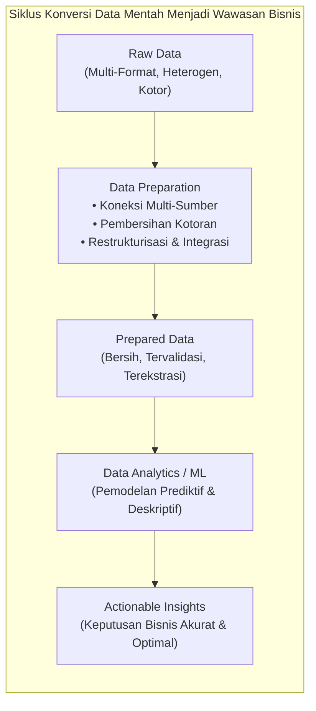
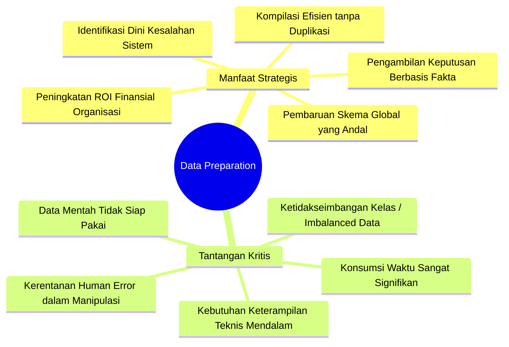
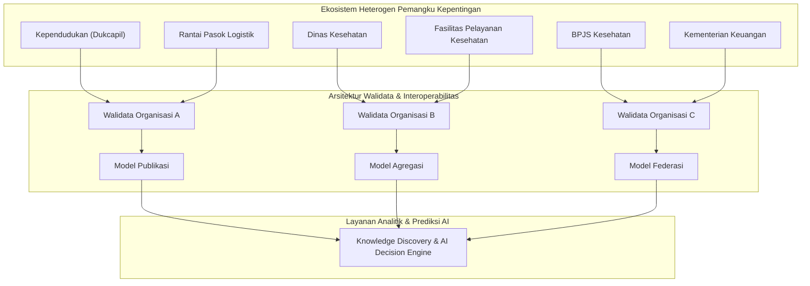
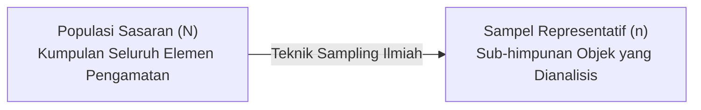
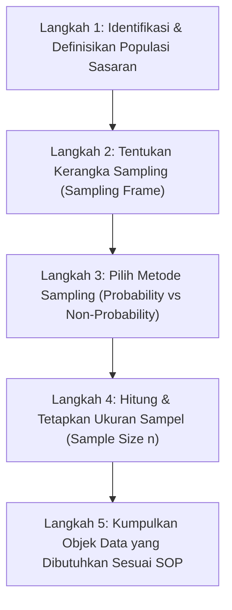
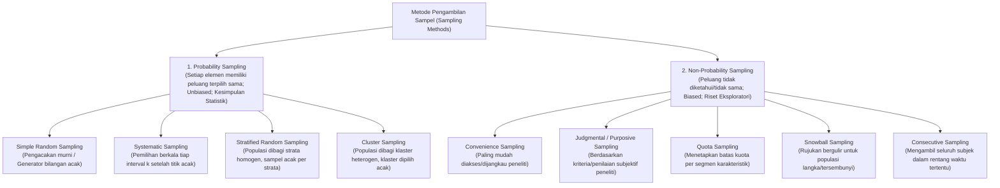
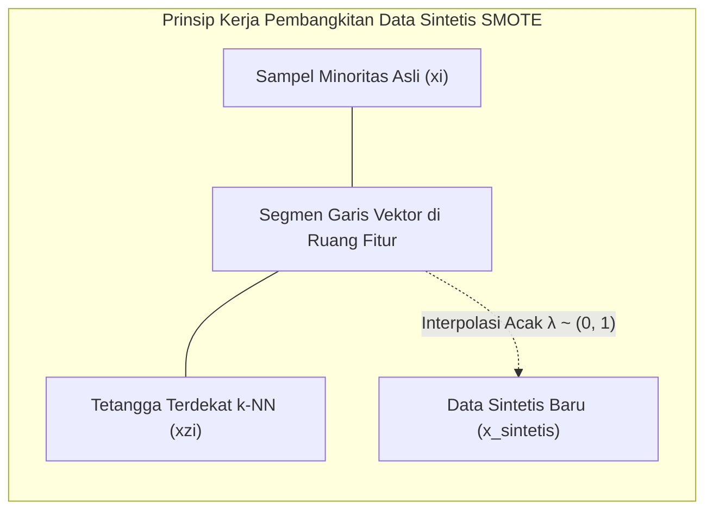

import { Accordion, Accordions } from 'fumadocs-ui/components/accordion';
import { Callout } from 'fumadocs-ui/components/callout';
import { Tab, Tabs } from 'fumadocs-ui/components/tabs';

> **Penyusun Modul & Portal:** Mahendar Dwi Payana  
> **Penulis Materi Pelatihan DTS 2021:** Dr. rer. nat. I Made Wiryana, S.Kom., S.Si., MAppSc, Dr. Miftah Andriansyah, dan Dr. Astie Darmayantie (Universitas Gunadarma)  
> **Penyelenggara & Kurikulum:** Thematic Academy Digital Talent Scholarship (DTS) 2021, Kementerian Komunikasi dan Informatika RI (Kominfo)  
> **Standar Rujukan:** Standar Kompetensi Kerja Nasional Indonesia (SKKNI) No. 299 Tahun 2020 — Skema *Associate Data Scientist*

---

## 1. Landasan Standar Kompetensi Kerja (SKKNI)

Tahap penyiapan data (*Data Preparation*) merupakan fase paling padat karya dalam seluruh siklus proyek sains data. Berdasarkan **SKKNI No. 299 Tahun 2020**, modul ini mengintegrasikan secara simultan **tiga Unit Kompetensi Inti**:

| Kode Unit | Judul Unit Kompetensi | Deskripsi & Kriteria Unjuk Kerja (KUK) Inti |
| :--- | :--- | :--- |
| **J.62DMI00.007.1** | **Menentukan Objek Data** | **1.1** Kriteria pemilihan data diidentifikasi sesuai dengan tujuan teknis dan aturan yang berlaku (volume, kualitas, otorisasi akses).<br/>**1.2** Teknik pemilihan data ditetapkan sesuai kriteria (metode *probability* atau *non-probability sampling*).<br/>**2.1** Atribut (*columns*) data diidentifikasi sesuai kriteria pemilihan data.<br/>**2.2** Rekaman (*records/rows*) data diidentifikasi sesuai kriteria pemilihan data. |
| **J.62DMI00.008.1** | **Membersihkan Data** | **1.1** Strategi pembersihan data ditentukan berdasarkan hasil telaah data (penanganan *missing value*, koreksi data salah, normalisasi *outlier*).<br/>**1.2** Data yang kotor dikoreksi berdasarkan strategi pembersihan data.<br/>**2.1** Masalah dan teknis koreksi data dideskripsikan sesuai kondisi data.<br/>**2.2** Evaluasi dihasilkan berdasarkan analisis koreksi yang telah dilakukan.<br/>**2.3** Evaluasi proses dan hasilnya didokumentasikan secara formal. |
| **J.62DMI00.006.1** | **Memvalidasi Data** | **1.1** Penilaian kualitas data (kebenaran, kelengkapan, konsistensi) dari hasil telaah disajikan sesuai tujuan teknis *data science*.<br/>**1.2** Penilaian tingkat kecukupan data dari hasil telaah disajikan sesuai tujuan teknis.<br/>**2.1** Rekomendasi hasil penilaian kualitas data disusun sesuai tujuan teknis.<br/>**2.2** Rekomendasi hasil penilaian kecukupan data (*resampling* / justifikasi pengambilan data ulang) disusun sesuai tujuan teknis. |

---

## 2. Posisi Data Preparation dalam CRISP-DM & Realitas Industri

### A. Terminologi & Definisi Operasional
Dalam literatur sains data internasional, penyiapan data memiliki beberapa padanan istilah yang saling melengkapi:
* **Data Pre-processing**: Rangkaian langkah awal untuk mentransformasi data mentah (*raw data*) yang belum terstruktur menjadi format terstruktur yang siap dikonsumsi algoritma analitik.
* **Data Manipulation**: Operasi pemfilteran baris, pengurutan, penggabungan (*merge/join*), restrukturisasi hierarki (*pivoting/melting*), serta pembentukan atribut baru.
* **Data Cleansing / Normalization**: Proses identifikasi, koreksi, atau eliminasi data yang korup, tidak akurat, tidak lengkap, atau memiliki format yang bertentangan dengan standar domain.



### B. Fakta Industri: Porsi 60–80% Kerja Data Scientist
Berdasarkan riset pasar global oleh **Forbes & CrowdFlower (2016)** serta studi **Aberdeen Group**:
* Data scientist menghabiskan **60% hingga 80% waktu dan energi mereka** semata-mata untuk mengumpulkan, membersihkan, dan mengorganisasikan data (*cleaning and organizing data*).
* **65% organisasi enterprise** menyatakan bahwa penyederhanaan akses dan penyediaan data berkualitas adalah inisiatif analitik terpenting.
* **Aktivitas persiapan data utama industri**:
  1. *Ensuring quality of data* (68%)
  2. *Extracting data from sources* (63%)
  3. *Establishing governance & security* (61%)
  4. *Accessing data for integration* (51%)
* **Prinsip GIGO (*Garbage In, Garbage Out*)**: Sehebat apa pun arsitektur model *Deep Learning* atau algoritma *Gradient Boosting* yang digunakan, jika data yang dimasukkan cacat (*noisy*, bias, inkonsisten), maka hasil prediksinya pasti menyesatkan dan membahayakan keputusan strategis organisasi.

### C. Manfaat Strategis vs. Tantangan Data Preparation



---

## 3. Tata Kelola & Interoperabilitas Data Multi-Sumber

Dalam implementasi skala nasional maupun korporasi besar, data sains data tidak berasal dari satu berkas tunggal, melainkan tersebar di berbagai instansi atau unit kerja (*stakeholders*).



### A. Tiga Tingkatan Integrasi Data
1. **Integrasi Presentasi**: Penggabungan terjadi pada lapisan antarmuka pengguna (*User Interface*). Tidak ada interkoneksi logis langsung antar-basis data; hanya menampilkan cuplikan dari berbagai aplikasi ke satu layar *dashboard*.
2. **Integrasi Data (Database Level)**: Dilakukan langsung pada skema basis data fisik. Pertukaran data difasilitasi menggunakan metadata standar, skema XML/JSON, dan translator skema (**XSD & XSLT Translation**). Jika model data berubah, maka aturan integrasi harus disesuaikan kembali.
3. **Integrasi Fungsional**: Penggabungan dilakukan pada lapisan logika bisnis (*Business Logic / Service Layer*) melalui antarmuka REST API, Message Queue, atau arsitektur *Microservices*.

### B. Basis Data Relasional vs. Ontologi Pengetahuan
Dalam konteks pertukaran data cerdas, praktisi data membedakan dua paradigma penyimpanan:

| Parameter Komparasi | Basis Data Relasional (RDBMS) | Sistem Berbasis Ontologi (Semantic Web) |
| :--- | :--- | :--- |
| **Asumsi Dunia** | **Closed World Assumption (CWA)**: Informasi yang tidak tercatat dalam tabel dianggap bernilai salah (*false*). | **Open World Assumption (OWA)**: Informasi yang belum tercatat dianggap belum diketahui (*unknown*), bukan salah. |
| **Fokus Utama** | Penyimpanan data tabular, efisiensi transaksi, dan integritas referensial. | Penangkapan makna semantik (*meaning/context*) dan relasi antar-entitas pengetahuan. |
| **Penegakan Integritas** | *Constraints* kaku (*Foreign Key*, *Unique*, *Check Constraints*) yang sering menyembunyikan makna konseptual. | *Ontology Axioms* deklaratif yang mengekspresikan aturan domain secara eksplisit. |
| **Struktur Hierarki** | Jarang menggunakan hierarki taksonomi alami. | Hierarki relasi subsumpsi `is-a` (*ISA Hierarchy*) menjadi tulang punggung utama. |
| **Interoperabilitas** | Skema tabel bersifat lokal; integrasi lintas sistem memerlukan pemetaan manual yang rentan rusak. | Skema berbasis URI/RDF bersifat global, dapat digunakan kembali (*reusable*), dan mendukung inferensi otomatis. |

---

## 4. Penentuan Objek Data & Metodologi Sampling Ilmiah (`J.62DMI00.007.1`)

Sebelum manipulasi kode dijalankan, analis data wajib memutuskan batas populasi dan teknik pengambilan sampel untuk memastikan bahwa objek data yang dipilih benar-benar mewakili fenomena yang sedang diteliti.



### A. Konsep Populasi & Sampel
* **Populasi**: Wilayah generalisasi yang terdiri atas objek/subjek yang mempunyai kuantitas dan karakteristik tertentu yang ditetapkan peneliti untuk dipelajari dan ditarik kesimpulannya (Sugiyono, 2011; Supardi, 1993).
  * *Populasi Finit*: Jumlah anggota populasi dapat dihitung secara pasti (misal: 1.000 karyawan Perusahaan X, 34 provinsi di Indonesia).
  * *Populasi Infinit*: Jumlah anggota tidak terbatas atau tidak dapat dihitung secara eksak (misal: jumlah butiran pasir di pantai, jumlah klik pengguna web di masa mendatang).
* **Sampel**: Bagian dari jumlah dan karakteristik yang dimiliki oleh populasi yang dijadikan wakil representatif dari keseluruhan populasi.

### B. Lima Tahapan Proses Sampling Formal


### C. Taksonomi Metode Sampling



#### Perbandingan Komprehensif Probability vs. Non-Probability Sampling:

| Dimensi Penilaian | Probability Sampling | Non-Probability Sampling |
| :--- | :--- | :--- |
| **Keteracakan (*Randomness*)** | Wajib acak (*Randomized mechanism*). | Tidak acak (*Non-random mechanism*). |
| **Representasi Populasi** | Sangat representatif; estimasi tidak berbias (*Unbiased*). | Cenderung berbias (*Biased*); mencerminkan preferensi aksesibilitas. |
| **Tujuan Analitik** | Inferensi parametrik dan pengujian hipotesis kuantitatif konklusif. | Studi eksploratori, penelitian kualitatif, *Focus Group Discussion* (FGD). |
| **Generalisasi Hasil** | Valid digeneralisasikan ke seluruh populasi target. | Terbatas pada subjek yang diamati; tidak dapat digeneralisasi penuh. |
| **Kebutuhan Informasi** | Membutuhkan *Sampling Frame* lengkap dari seluruh anggota populasi. | Tidak memerlukan kerangka sampel lengkap. |

---

## 5. Penanganan Ketimpangan Kelas (Imbalanced Dataset) & Resampling

Dalam aplikasi dunia nyata, distribusi kelas target sering kali tidak simetris secara ekstrem:
* **Kasus Fraud Deteksi Perbankan**: Transaksi penipuan umumnya kurang dari $0.1\%$ hingga $1\%$ dari total jutaan transaksi harian.
* **Diagnosis Penyakit Kanker Langka**: Kasus positif hanya sebagian kecil dari ribuan pasien skrining.
* **Deteksi Intrusi Jaringan Siber**: Paket data serangan siber merupakan anomali minoritas di tengah lalu lintas normal.

### A. Bahaya Paradoks Akurasi (*Accuracy Paradox*)
Jika sebuah dataset memiliki $99.8\%$ transaksi sah dan $0.2\%$ transaksi penipuan, model naif yang selalu memprediksi "Transaksi Sah" akan menghasilkan akurasi sebesar:

$$
\text{Accuracy} = \frac{998}{1000} = 99.8\%
$$

Meskipun nilai akurasi di atas kertas tampak spektakuler, model tersebut memiliki **efektivitas operasional 0%** karena gagal mendeteksi satupun kasus penipuan.

### B. Metrik Evaluasi yang Tepat untuk Imbalanced Data
Oleh karena itu, evaluasi model pada dataset timpang **wajib** menggunakan metrik asimetris:
1. **Recall / Sensitivitas**: Mengukur proporsi kasus positif riil yang berhasil dideteksi:
   $$
   \text{Recall} = \frac{TP}{TP + FN}
   $$
2. **Precision / Presisi**: Mengukur proporsi prediksi positif yang benar-benar akurat:
   $$
   \text{Precision} = \frac{TP}{TP + FP}
   $$
3. **F1-Score**: Rata-rata harmonik antara Presisi dan Recall:
   $$
   F_1 = 2 \times \frac{\text{Precision} \times \text{Recall}}{\text{Precision} + \text{Recall}} = \frac{2TP}{2TP + FP + FN}
   $$
4. **Matthews Correlation Coefficient (MCC)**: Metrik korelasi paling objektif pada klasifikasi biner timpang:
   $$
   \text{MCC} = \frac{(TP \times TN) - (FP \times FN)}{\sqrt{(TP + FP)(TP + FN)(TN + FP)(TN + FN)}}
   $$
   *Rentang MCC berada pada $[-1, 1]$, di mana $+1$ merepresentasikan prediksi sempurna, $0$ acak, dan $-1$ perbedaan total.*

### C. Tiga Teknik Resampling Data
1. **Undersampling (Bootstrap)**: Mengurangi jumlah sampel pada kelas mayoritas (*majority class*) secara acak hingga proporsinya setara dengan kelas minoritas.
   * *Kelebihan*: Mempercepat waktu pelatihan model.
   * *Kelemahan*: Berisiko membuang informasi berharga dari kelas mayoritas.
2. **Oversampling (Bootstrap / Random)**: Menduplikasi amatan sampel pada kelas minoritas (*minority class*) dengan pengembalian (*with replacement*).
   * *Kelebihan*: Mempertahankan seluruh informasi dataset.
   * *Kelemahan*: Rentan memicu *overfitting* karena model menghafal data duplikat identik.
3. **Synthetic Minority Over-sampling Technique (SMOTE)**:
   Diperkenalkan oleh **Nitesh V. Chawla et al. (2002)**. Bukannya menduplikasi data yang ada, SMOTE membangkitkan **data sintetis baru** di ruang fitur (*feature space*) menggunakan interpolasi antara sampel minoritas $x_i$ dan tetangga terdekatnya ($k$-NN):

$$
x_{\text{sintetis}} = x_i + \lambda \times (x_{zi} - x_i), \quad \lambda \sim U(0, 1)
$$



---

## 6. Seleksi Fitur (Feature Selection) & Tipe Data

Seleksi fitur adalah proses sistematis memilih sub-himpunan variabel prediktor yang paling berkontribusi terhadap variabel target, sekaligus mengeliminasi atribut yang redundan atau berupa *noise*.

### A. Tiga Manfaat Utama Seleksi Fitur
1. **Mereduksi Overfitting**: Semakin sedikit atribut yang tidak relevan, semakin kecil kemungkinan algoritma mempelajari kebisingan (*noise*) acak sebagai pola asli.
2. **Meningkatkan Akurasi & Daya Prediksi**: Menyingkirkan variabel pengecoh (*misleading features*) menghasilkan batas keputusan (*decision boundary*) yang lebih bersih.
3. **Mempersingkat Waktu Pelatihan & Komputasi**: Menurunkan dimensi data mempercepat konvergensi algoritma optimasi dan menghemat alokasi memori RAM.

### B. Taksonomi Pendekatan Seleksi Fitur
* **Unsupervised Feature Selection**: Mengabaikan variabel target; menyaring fitur berdasarkan korelasi internal antar-prediktor atau ambang batas varians rendah.
* **Supervised Feature Selection**: Mengevaluasi keterikatan langsung antara setiap fitur prediktor dengan variabel target:
  1. *Filter Methods*: Memeringkat fitur menggunakan uji statistik univariat (misal: Chi-Square $\chi^2$, ANOVA $F$-test, Mutual Information).
  2. *Embedded Methods*: Fitur diseleksi secara intrinsik saat algoritma pohon keputusan dilatih (misal: *Feature Importance* dari `ExtraTreesClassifier` atau `RandomForestClassifier`).
  3. *Wrapper Methods*: Mengevaluasi kombinasi subset fitur secara rekursif (misal: *Recursive Feature Elimination / RFE*).

---

## 7. Validasi Data vs. Verifikasi Data (`J.62DMI00.006.1`)

Banyak praktisi pemula menyamakan verifikasi dan validasi. Dalam standar keteknikan dan data science, keduanya memiliki orientasi yang sangat berbeda:

| Parameter | Verifikasi Data (*Data Verification*) | Validasi Data (*Data Validation*) |
| :--- | :--- | :--- |
| **Pertanyaan Inti** | *Apakah data dibangun dan dikumpulkan sesuai dengan aturan/prosedur yang ditetapkan?* | *Apakah data yang terkumpul akurat, bermakna, dan mampu menjawab kebutuhan analitik bisnis?* |
| **Kriteria Evaluasi** | **Benar vs. Salah** (*True vs. False*). | **Kuat vs. Lemah** (*Strong vs. Weak*). |
| **Fokus Pekerjaan** | Dokumentasi administratif, kepatuhan format, pengecekan berkas fisik (misal: kelengkapan KTP/akta pendaftaran). | Pengecekan substantif, keandalan instrumen ukur, deteksi bias, representasi sampel di dunia nyata. |
| **Sifat Pengujian** | Mengikuti standar baku operasional internal organisasi. | Menguji kesesuaian empiris terhadap fenomena objektif lapangan. |

### Checklist 8 Aspek Kritis Validasi Kualitas Data
1. **Tipe Data (*Data Type*)**: Memastikan kolom bertipe integer, float, datetime, atau string sesuai kebutuhan (misal: harga dan tahun tidak boleh tertahan sebagai `object`).
2. **Rentang Nilai (*Data Range*)**: Mengidentifikasi nilai mustahil secara biologis/logis (misal: `Usia = 222` atau `Gaji = -10`).
3. **Keunikan (*Uniqueness*)**: Memastikan atribut identitas primer bernilai unik tanpa perulangan (misal: Kode Pos, Nomor Induk Pegawai, ISBN Buku).
4. **Konsistensi Ekspresi (*Expression Consistency*)**: Menyeragamkan singkatan penulisan (misal: `"Jalan"`, `"Jl."`, dan `"Jln."`).
5. **Format Penanggalan (*Date Formatting*)**: Menyelaraskan ambiguitas penulisan hari dan bulan (misal: standar ISO `YYYY-MM-DD` vs `DD-MM-YYYY`).
6. **Nilai Kosong (*Missing Values / Nulls*)**: Mengidentifikasi persentase nilai kosong dan mendokumentasikan alasan serta strategi penanganannya.
7. **Kesalahan Ketik (*Misspelling / Typo*)**: Mendeteksi variasi penulisan string (misal: `"Jakarta Selatn"` vs `"Jakarta Selatan"`).
8. **Validitas Domain (*Domain Validity*)**: Memverifikasi kesesuaian nilai kategorikal dengan aturan resmi (misal: di Indonesia isian agama resmi hanya 6, jenis kelamin KTP hanya 2).

### Parameter Standar Laporan Dokumentasi Data Cleaning (SKKNI KUK 2.1 & 2.3)
Laporan pembersihan dan validasi data formal wajib memuat:
1. *Dataset Description & Source*: Asal-usul, tanggal akuisisi, dan struktur awal data.
2. *Identified Noise & Anomalies*: Rincian jumlah baris duplikat, persentase nilai null per kolom, format inkonsisten, dan data pencilan (*outlier*).
3. *Remediation Techniques Applied*: Metode spesifik yang dipilih (imputasi mean/median, interpolasi string regex, transformasi indeks, pembuangan kolom).
4. *Irrecoverable Attributes / Records*: Justifikasi rasional mengapa rekaman atau kolom tertentu terpaksa dihapus permanen.
5. *Post-Cleansing Data Verification*: Hasil evaluasi komparasi dimensi tabel (*before vs after*), pemeriksaan tipe data baru, dan konfirmasi integritas.

---

## 8. Praktikum Terpadu Python & Implementasi Dataset Riil

<Callout type="info" title="Unduh Dataset Resmi Praktikum Modul 8">
Seluruh berkas dataset resmi yang digunakan dalam modul ini telah tersedia secara lokal pada portal Learn AI dan repositori GitHub:
1. **Dataset Klasifikasi Ponsel:** [`mobile_price_train.csv`](https://mahendartea.github.io/Learn-AI/data/mobile_price_train.csv) *(20 Fitur Spesifikasi & Kelas Harga)*
2. **Dataset British Library:** [`BL-Flickr-Images-Book.csv`](https://mahendartea.github.io/Learn-AI/data/BL-Flickr-Images-Book.csv) *(Koleksi Metadata Buku Abad 19)*
3. **Dataset Kota Kampus US:** [`university_towns.txt`](https://mahendartea.github.io/Learn-AI/data/university_towns.txt) *(Data Teks Bertingkat State-Town)*
4. **Dataset Perolehan Olimpiade:** [`olympics.csv`](https://mahendartea.github.io/Learn-AI/data/olympics.csv) *(Data Medali Musim Dingin & Panas)*
</Callout>

---

### Hands-on Bagian I: Tiga Teknik Seleksi Fitur (`mobile_price_train.csv`)

Menggunakan dataset spesifikasi perangkat bergerak (*Mobile Price Classification*) untuk memprediksi rentang harga `price_range` (skala 0: murah s.d. 3: sangat mahal).

```python
import pandas as pd
import numpy as np
import matplotlib.pyplot as plt
import seaborn as sns
from sklearn.feature_selection import SelectKBest, chi2
from sklearn.ensemble import ExtraTreesClassifier

# 1. Memuat dataset Mobile Price
url_mobile = "https://mahendartea.github.io/Learn-AI/data/mobile_price_train.csv"
data = pd.read_csv(url_mobile)

print(f"Dimensi Dataset Awal: {data.shape[0]} baris, {data.shape[1]} kolom")

# Memisahkan Fitur Independen (X) dan Target Dependen (y)
X = data.iloc[:, 0:20]  # Kolom 0 s.d. 19
y = data.iloc[:, -1]    # Kolom terakhir: price_range

# ==========================================================
# METODE 1: SELEKSI UNIVARIAT (Chi-Square Statistic)
# ==========================================================
# Chi-Square mensyaratkan semua nilai bernilai non-negatif
bestfeatures = SelectKBest(score_func=chi2, k=10)
fit = bestfeatures.fit(X, y)

dfscores = pd.DataFrame(fit.scores_)
dfcolumns = pd.DataFrame(X.columns)

# Menggabungkan skor fitur ke dalam DataFrame rapi
featureScores = pd.concat([dfcolumns, dfscores], axis=1)
featureScores.columns = ['Spesifikasi_Fitur', 'Skor_Chi2']

print("\n=== TOP 10 FITUR TERBAIK (UNIVARIATE CHI-SQUARE) ===")
top_chi2 = featureScores.nlargest(10, 'Skor_Chi2')
print(top_chi2.to_string(index=False))

# ==========================================================
# METODE 2: FEATURE IMPORTANCE (Extra Trees Classifier)
# ==========================================================
model_trees = ExtraTreesClassifier(n_estimators=100, random_state=42)
model_trees.fit(X, y)

feat_importances = pd.Series(model_trees.feature_importances_, index=X.columns)

plt.figure(figsize=(10, 6))
feat_importances.nlargest(10).plot(kind='barh', color='#2563eb', edgecolor='black')
plt.title("Top 10 Fitur Terpenting Berdasarkan Extra Trees Classifier", fontsize=12, fontweight='bold')
plt.xlabel("Skor Kepentingan Relatif (Relative Importance)")
plt.ylabel("Fitur Spesifikasi")
plt.gca().invert_yaxis()
plt.grid(axis='x', linestyle='--', alpha=0.6)
plt.tight_layout()
plt.show()

# ==========================================================
# METODE 3: MATRIKS KORELASI DENGAN HEATMAP SEABORN
# ==========================================================
# Menghitung matriks korelasi Pearson
corrmat = data.corr()
top_corr_features = corrmat.index

plt.figure(figsize=(16, 14))
sns.heatmap(
    data[top_corr_features].corr(),
    annot=True,
    fmt=".2f",
    cmap="RdYlGn",
    linewidths=0.5,
    cbar_kws={'label': 'Koefisien Korelasi Pearson (r)'}
)
plt.title("Peta Panas Korelasi Spesifikasi Ponsel terhadap Rentang Harga", fontsize=14, fontweight='bold')
plt.tight_layout()
plt.show()

# Telaah Khusus Hubungan Fitur dengan price_range:
corr_target = corrmat['price_range'].sort_values(ascending=False)
print("\n=== KORELASI FITUR DENGAN HARGA (price_range) ===")
print(corr_target)
```

> **Temuan Kunci Praktikum Seleksi Fitur:**
> 1. **RAM adalah Determinan Mutlak**: Dari ketiga metode, fitur `ram` secara konsisten menjadi prediktor terkuat (Skor $\chi^2 = 931.267,52$, *Relative Importance* $\approx 40\%$, dan korelasi $r = +0.92$).
> 2. **Dukungan Daya & Layar**: Variabel berikutnya yang berpengaruh signifikan adalah `battery_power` ($r = 0.20$), `px_width` ($r = 0.17$), dan `px_height` ($r = 0.15$).
> 3. **Fitur Lemah/Redundan**: Fitur seperti `clock_speed` ($r = -0.006$), `m_dep` ($r = 0.0008$), dan `n_cores` ($r = 0.004$) memiliki relasi mendekati nol sehingga dapat disingkirkan untuk mempercepat komputasi tanpa mengurangi akurasi model.

---

### Hands-on Bagian II: Pembersihan Data Kompleks (Data Cleaning)

Berikut adalah studi kasus pembersihan tiga format dataset yang berantakan (*messy data*) sesuai modul:

#### Studi Kasus 1: Koleksi Buku British Library (`BL-Flickr-Images-Book.csv`)
Tantangan: Banyak kolom metadata perpustakaan yang kosong, indeks numerik acak, tahun terbit bercampur karakter kurung siku (misal: `1879 [1878]`), serta penulisan nama kota penerbit yang tidak konsisten.

```python
import pandas as pd
import numpy as np

# 1. Membaca dataset buku
url_books = "https://mahendartea.github.io/Learn-AI/data/BL-Flickr-Images-Book.csv"
df = pd.read_csv(url_books)
print("Dimensi Awal British Library:", df.shape)

# 2. Membuang kolom metadata yang tidak penting (Drop Columns)
to_drop = [
    'Edition Statement',
    'Corporate Author',
    'Corporate Contributors',
    'Former owner',
    'Engraver',
    'Contributors',
    'Issuance type',
    'Shelfmarks'
]
df.drop(columns=to_drop, inplace=True)
print("Dimensi Setelah Drop Kolom:", df.shape)

# 3. Mengubah Indeks Menggunakan Pengenal Unik (Identifier)
print("Apakah kolom Identifier unik?", df['Identifier'].is_unique) # True
df.set_index('Identifier', inplace=True)

# Akses baris menggunakan Label-based Indexing (.loc):
print("\nContoh Rekaman Buku ID 206:")
print(df.loc[206][['Place of Publication', 'Date of Publication', 'Title', 'Author']])

# 4. Merapikan Kolom Tanggal (Date of Publication) dengan Regex
# Pola: ^(\d{4}) -> 4 digit angka di awal string
extr = df['Date of Publication'].str.extract(r'^(\d{4})', expand=False)
df['Date of Publication'] = pd.to_numeric(extr)
print("\nPersentase Tanggal Kosong Pasca-Ekstraksi:", df['Date of Publication'].isnull().mean().round(4))

# 5. Merapikan Kolom Tempat Terbit (Place of Publication) dengan np.where
pub = df['Place of Publication']
london = pub.str.contains('London')
oxford = pub.str.contains('Oxford')

# Nested np.where (vektorisasi If-Then bertingkat):
# Jika mengandung 'London' -> 'London', jika 'Oxford' -> 'Oxford', jika lainnya -> ganti strip dengan spasi
df['Place of Publication'] = np.where(
    london, 
    'London',
    np.where(oxford, 'Oxford', pub.str.replace('-', ' '))
)

print("\n=== 5 REKAMAN PERTAMA HASIL PEMBERSIHAN BUKU ===")
print(df[['Place of Publication', 'Date of Publication', 'Publisher', 'Title']].head())
```

---

#### Studi Kasus 2: Ekstraksi Data Teks Kota Kampus US (`university_towns.txt`)
Tantangan: Data disimpan dalam format teks catatan baris semi-terstruktur, di mana nama negara bagian (*State*) ditandai dengan kata `[edit]`, diikuti nama kota (*Region*) dan nama perguruan tinggi yang bercampur dengan sitasi kurung siku `[1]` atau kurung biasa `(University of ...)`.

```python
import pandas as pd
import urllib.request

url_towns = "https://mahendartea.github.io/Learn-AI/data/university_towns.txt"

# 1. Parsing baris demi baris menggunakan pola State vs Town
university_towns = []
req = urllib.request.Request(url_towns, headers={'User-Agent': 'Mozilla/5.0'})
with urllib.request.urlopen(req) as resp:
    lines = [line.decode('utf-8') for line in resp.readlines()]

current_state = ""
for line in lines:
    if '[edit]' in line:
        current_state = line
    else:
        university_towns.append((current_state, line))

# 2. Wrapping ke dalam Pandas DataFrame
towns_df = pd.DataFrame(university_towns, columns=['State', 'RegionName'])

# 3. Fungsi Pembersih Elemen Teks Seluruh DataFrame
def clean_citystate(item):
    if not isinstance(item, str):
        return item
    if ' (' in item:
        item = item[:item.find(' (')]
    if '[' in item:
        item = item[:item.find('[')]
    return item.strip()

# Mengaplikasikan fungsi pembersih ke seluruh elemen DataFrame
# (Di Pandas modern, .map() menggantikan .applymap())
towns_df = towns_df.map(clean_citystate)

print("=== 10 REKAMAN PERTAMA KOTA KAMPUS US BERSIH ===")
print(towns_df.head(10))
```

---

#### Studi Kasus 3: Memperbaiki Header Berantakan Data Olimpiade (`olympics.csv`)
Tantangan: Baris ke-0 pada CSV asli berisikan indeks angka `0, 1, 2...` yang tidak bermakna, sementara baris ke-1 memuat judul kolom yang disingkat secara membingungkan seperti `? Summer`, `01 !`, `02 !`, dan `Unnamed: 0`.

```python
import pandas as pd

url_olympics = "https://mahendartea.github.io/Learn-AI/data/olympics.csv"

# 1. Melewatkan baris kotor dengan parameter header=1
olympics_df = pd.read_csv(url_olympics, header=1)

# 2. Memetakan kamus nama kolom yang deskriptif dan baku
new_names = {
    'Unnamed: 0': 'Country',
    '? Summer': 'Summer_Olympics',
    '01 !': 'Gold_Summer',
    '02 !': 'Silver_Summer',
    '03 !': 'Bronze_Summer',
    'Total': 'Total_Summer',
    '? Winter': 'Winter_Olympics',
    '01 !.1': 'Gold_Winter',
    '02 !.1': 'Silver_Winter',
    '03 !.1': 'Bronze_Winter',
    'Total.1': 'Total_Winter',
    '? Games': 'Total_Games',
    '01 !.2': 'Gold_Total',
    '02 !.2': 'Silver_Total',
    '03 !.2': 'Bronze_Total',
    'Combined total': 'Combined_Total'
}

# 3. Mengganti nama kolom menggunakan rename()
olympics_df.rename(columns=new_names, inplace=True)

print("=== REKAMAN PEROLEHAN MEDALI NEGARA DI OLIMPIADE ===")
cols_display = ['Country', 'Summer_Olympics', 'Gold_Summer', 'Winter_Olympics', 'Gold_Winter', 'Combined_Total']
print(olympics_df[cols_display].head(8).to_string(index=False))
```

---

## 9. Lembar Evaluasi & Tugas Praktikum Mandiri

Berdasarkan silabus dan Kriteria Unjuk Kerja SKKNI:

<Accordions>
  <Accordion title="Tugas 1: Implementasi Penyeimbangan Dataset dengan SMOTE (Praktikum Imbalanced Data)">
    Gunakan library `imbalanced-learn` (`imblearn.over_sampling.SMOTE`) pada kasus biner buatan atau riil. Buat perbandingan matriks evaluasi (Akurasi vs Recall vs F1-Score) sebelum dan sesudah dilakukan SMOTE menggunakan algoritma `RandomForestClassifier`. Tunjukkan secara visual bagaimana distribusi kelas berubah menjadi seimbang 50:50!
  </Accordion>

  <Accordion title="Tugas 2: Ekstraksi Regex Kompleks pada Alamat & Format Telepon">
    Diberikan kolom teks tidak terstruktur yang berisi alamat dan nomor telepon campuran: `"Jl. Jend. Sudirman No. 45, Jakarta Selatan (021-5551234)"`. Buat fungsi ekstraksi berbasis Regular Expression (`re`) untuk memisahkan teks tersebut menjadi 4 kolom bersih: `Nama_Jalan`, `Nomor_Bangunan`, `Kota`, dan `Nomor_Telepon`!
  </Accordion>

  <Accordion title="Tugas 3: Penyusunan Dokumen Laporan Pembersihan & Validasi Data Standar SKKNI">
    Pilihlah salah satu dataset yang Anda gunakan dalam proyek akhir (Capstone). Susun laporan dokumentasi formal berformat tabel yang mencakup 5 parameter standar SKKNI: Deskripsi dataset, jenis noise teridentifikasi, pendekatan perbaikan yang diambil, atribut/baris yang dieksklusikan, serta ringkasan evaluasi kualitas data pasca-pembersihan!
  </Accordion>
</Accordions>

---

## 10. Referensi Pustaka & Tautan Resmi

1. **I Made Wiryana, Miftah Andriansyah, & Astie Darmayantie** (2021). *Modul Pelatihan Data Preparation: Penentuan Objek, Pembersihan dan Validasi Data*. Thematic Academy Digital Talent Scholarship 2021, Kementerian Komunikasi dan Informatika RI & Universitas Gunadarma.
2. **Kementerian Ketenagakerjaan RI** (2020). *Keputusan Menteri Ketenagakerjaan RI No. 299 Tahun 2020 tentang Penetapan SKKNI Bidang Keahlian Artificial Intelligence Subbidang Data Science*.
3. **Nitesh V. Chawla, Kevin W. Bowyer, Lawrence O. Hall, & W. Philip Kegelmeyer** (2002). *SMOTE: Synthetic Minority Over-sampling Technique*. Journal of Artificial Intelligence Research (JAIR), 16, 321-357.
4. **Gil Press** (2016). *Cleaning Big Data: Most Time-Consuming, Least Enjoyable Data Science Task, Survey Says*. Forbes Insights & CrowdFlower.
5. **Ilker Etikan & Kabiru Bala** (2017). *Sampling and Sampling Methods*. Biometrics & Biostatistics International Journal, 5(6), MedCrave Publishing.
6. **Real Python** (2018). *Python Data Cleaning: NumPy, Pandas, and Python's Built-in Methods*. Real Python Tutorials.
