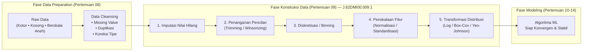
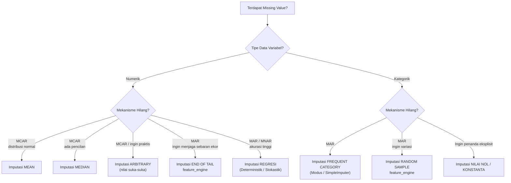

import { Accordion, Accordions } from 'fumadocs-ui/components/accordion';
import { Callout } from 'fumadocs-ui/components/callout';
import { Tab, Tabs } from 'fumadocs-ui/components/tabs';

> **Penyusun Modul & Portal:** Mahendar Dwi Payana  
> **Penulis Materi Pelatihan DTS 2021:** Tim Universitas Gunadarma — Thematic Academy Digital Talent Scholarship 2021  
> **Penyelenggara & Kurikulum:** Kementerian Komunikasi dan Informatika RI (Kominfo) & Sekolah Teknik Elektro dan Informatika (STEI) ITB  
> **Standar Rujukan:** Standar Kompetensi Kerja Nasional Indonesia (SKKNI) No. 299 Tahun 2020 — Skema *Associate Data Scientist*

---

## 1. Landasan Standar Kompetensi Kerja (SKKNI `J.62DMI00.009.1`)

Setelah data dibersihkan dan divalidasi pada pertemuan sebelumnya, data mentah (*raw data*) belum tentu berada dalam representasi numerik yang optimal untuk proses pemodelan. Modul ini menuntaskan **Unit Kompetensi Mengkonstruksi Data (*Data Construction*)** yang mencakup tiga elemen kompetensi formal:

| Kode Unit | Elemen Kompetensi | Kriteria Unjuk Kerja (KUK) Inti |
| :--- | :--- | :--- |
| **J.62DMI00.009.1** | **1. Menganalisis Teknik Transformasi Data** | **1.1** Analisis data untuk menentukan representasi fitur data awal.<br/>**1.2** Analisis representasi fitur data awal untuk menentukan teknik rekayasa fitur (*feature engineering*) yang diperlukan bagi pembangunan model data science. |
| | **2. Melakukan Transformasi Data** | **2.1** Transformasi dilakukan untuk mendapatkan fitur data awal.<br/>**2.2** Rekayasa fitur data dilakukan untuk mendapatkan fitur baru yang diperlukan bagi pembangunan model data science. |
| | **3. Membuat Dokumentasi Konstruksi Data** | **3.1** Teknis transformasi data dijabarkan dalam bentuk tertulis.<br/>**3.2** Hasil transformasi data dan rekomendasi hasil transformasi dituangkan dalam bentuk tertulis. |

> **Catatan Cakupan:** Pertemuan 09 berfokus pada **transformasi representasi nilai** (imputasi, diskretisasi, penskalaan, penormalan distribusi). Adapun **pembentukan fitur baru secara substantif** (encoding kategorikal, fitur siklis, interaksi domain) dibahas pada **Pertemuan 10**, meskipun keduanya berbagi kode unit yang sama.

---

## 2. Posisi Konstruksi Data dalam Siklus CRISP-DM

Dalam metodologi **CRISP-DM**, konstruksi data menjembatani fase *Data Preparation* dengan *Modeling*. Ini merupakan tahap “penerjemahan” data agar dapat dikonsumsi oleh algoritma matematis yang sensitif terhadap skala, distribusi, dan nilai kosong.



### Prinsip Fundamental: *Garbage In, Garbage Out* pada Level Representasi

Bahkan dataset yang “bersih” dari nilai kosong dapat gagal menghasilkan model optimal jika representasinya salah. Tiga masalah representasi paling umum di industri:

1. **Skala Tidak Seragam**: Fitur `Gaji` (rentang puluhan juta) mendominasi fitur `Usia` (rentang puluhan) pada perhitungan jarak Euclidean.
2. **Nilai Kosong Tersamarkan**: Nilai `0` pada kolom medis (misal `Glucose = 0`) sebenarnya adalah *missing value*, bukan pengukuran riil.
3. **Distribusi Menceng (*Skewed*)**: Variabel finansial seperti harga rumah atau saldo rekening menceng ke kanan sehingga melanggar asumsi normalitas model linier.

---

## 3. Strategi Imputasi Nilai Hilang (Missing Value Imputation)

> **Definisi:** **Imputasi** adalah proses menggantikan nilai/data yang hilang (*missing value*, `NaN`, `blank`) dengan nilai pengganti yang dianggap paling masuk akal secara statistik.

Pemilihan teknik imputasi **wajib** mempertimbangkan dua dimensi sekaligus: (a) **tipe data** variabel (numerik vs kategorik), dan (b) **mekanisme kehilangan** data.

### A. Mekanisme Kehilangan Data (Missing Data Mechanism)

Konsep mekanisme kehilangan data diperkenalkan oleh **Rubin (1976)** dan menjadi dasar pemilihan teknik imputasi yang valid:

| Mekanisme | Kepanjangan | Keterangan | Teknik Imputasi yang Sesuai |
| :--- | :--- | :--- | :--- |
| **MCAR** | *Missing Completely At Random* | Kehilangan tidak bergantung pada variabel apa pun. Contoh: sensor rusak acak. | Mean / Median |
| **MAR** | *Missing At Random* | Kehilangan bergantung pada variabel **lain yang teramati**. Contoh: pria lebih enggan mengisi kolom berat badan. | Modus, Random Sample, Regresi |
| **MNAR** | *Missing Not At Random* | Kehilangan bergantung pada **nilai itu sendiri**. Contoh: orang bergaji tinggi menyembunyikan pendapatannya. | Pemodelan khusus / sensitivitas |

### B. Pohon Keputusan Pemilihan Teknik Imputasi



---

### 3.1 Imputasi Mean atau Median

Teknik paling sederhana untuk tipe data **numerik**, dan paling cocok untuk data **MCAR**. Mean digunakan bila distribusi simetris; **Median** digunakan bila terdapat pencilan (*outlier*) karena median resisten terhadap nilai ekstrem.

```python
import pandas as pd
import numpy as np

# -----------------------------------------------------------
# Contoh 1: Imputasi MEAN pada beberapa kolom sekaligus
# -----------------------------------------------------------
kolom = {
    'col1': [2, 9, 19],
    'col2': [5, np.nan, 17],
    'col3': [3, 9, np.nan],
    'col4': [6, 0, 9],
    'col5': [np.nan, 7, np.nan]
}
data = pd.DataFrame(kolom)

# fillna(data.mean()) mengisi setiap kolom NaN dengan rata-rata kolomnya sendiri
data_mean = data.fillna(data.mean())
print(data_mean)

# -----------------------------------------------------------
# Contoh 2: Imputasi MEAN pada kolom tunggal
# -----------------------------------------------------------
umur = pd.DataFrame({'umur': [29, 43, np.nan, 25, 34, np.nan, 50]})

# Median lebih tepat bila ada potensi outlier
print("Rata-rata :", umur['umur'].mean())    # 36.2
print("Median    :", umur['umur'].median())  # 34.0

print(umur.fillna(umur.mean()))    # Imputasi MEAN
print(umur.fillna(umur.median()))  # Imputasi MEDIAN
```

> **Verifikasi Numerik:** Rata-rata $(29 + 43 + 25 + 34 + 50) / 5 = 181/5 = 36.2$, sedangkan median dari $[25, 29, 34, 43, 50]$ adalah **34**. Perhatikan bahwa mean tertarik ke atas oleh nilai 50, sedangkan median tidak.

---

### 3.2 Imputasi Nilai Sukа-suka (Arbitrary)

Imputasi *arbitrary* menggantikan nilai hilang dengan sebuah **konstanta bebas** yang dipilih analis (misal `99`, `-1`, atau `999`). Cocok untuk data numerik ketika kehadiran nilai kosong itu sendiri bermakna dan **harus dapat dilacak** (sebagai penanda / *flag*).

```python
umur = pd.DataFrame({'umur': [29, 43, np.nan, 25, 34, np.nan, 50]})

# Mengganti NaN dengan nilai suka-suka, misal 99
data_arbitrary = umur.fillna(99)
print(data_arbitrary)
```

> [!CAUTION]
> **Bahaya Nilai Arbitrary:** Menggunakan `99` pada kolom `Usia` akan **mendistorsi** mean, varians, dan jarak ketika dihitung. Nilai sentinel seperti `99` atau `-1` hanya aman bila fitur tersebut nantinya di-*encode* sebagai penanda kategorik, bukan dipakai sebagai nilai kontinu.

---

### 3.3 Imputasi End of Tail

Imputasi *end of tail* menggantikan nilai hilang dengan nilai pada **ujung distribusi** (ekor kanan atau kiri). Library `feature_engine` menyediakan `EndTailImputer` dengan beberapa mode:

* `imputation_method='gaussian'` → $\mu + k\sigma$ (default $k=3$) untuk ekor kanan.
* `imputation_method='iqr'` → $Q_3 + k \cdot \text{IQR}$.
* `imputation_method='max'` → langsung nilai maksimum.

```python
# pip install feature_engine
from feature_engine.imputation import EndTailImputer

umur = pd.DataFrame({'umur': [29, 43, np.nan, 25, 34, np.nan, 50]})

# Membuat imputer: gaussian (mean + 3*std) pada ekor kanan
imputer = EndTailImputer(imputation_method='gaussian', tail='right')
imputer.fit(umur)

# Mengubah data (mengembalikan objek DataFrame)
test_t = imputer.transform(umur)
print(test_t)
```

> **Verifikasi Numerik:** Mean dari $[29, 43, 25, 34, 50] = 36.2$, standar deviasi sampel $\approx 9.93$. Nilai ekor kanan $\approx 36.2 + 3(9.93) \approx 66.0$, sehingga kedua `NaN` diisi nilai tersebut.

---

### 3.4 Imputasi Frequent Category / Modus

Untuk tipe data **kategorik**, nilai pengganti terbaik adalah **kategori yang paling sering muncul** (*modus*). `sklearn.impute.SimpleImputer(strategy='most_frequent')` bekerja untuk numerik maupun string.

```python
from sklearn.impute import SimpleImputer

make = pd.DataFrame({
    'make': ['Ford', 'Ford', 'Fiat', 'BMW', 'Ford', 'Kia',
             np.nan, 'Fiat', 'Ford', np.nan, 'Kia']
})

# strategy='most_frequent' -> mengisi dengan MODUS
imp = SimpleImputer(strategy='most_frequent')

# fit_transform: fit menghitung modus, transform mengisi NaN
data_imputed = imp.fit_transform(make)
print(data_imputed.ravel())
```

> **Hasil:** Kategori `'Ford'` muncul 4 kali (terbanyak), sehingga kedua nilai `NaN` diimputasi menjadi `'Ford'`. Perhatikan bahwa `fit_transform` mengembalikan array NumPy 2D, bukan DataFrame.

---

### 3.5 Imputasi Random Sample

Berbeda dari modus yang selalu memberi nilai sama, *random sample imputation* menggantikan nilai hilang dengan **nilai acak yang ditarik dari distribusi nilai teramati** variabel tersebut. Teknik ini menjaga keragaman (*variance*) data asli sehingga lebih cocok untuk MAR.

```python
from feature_engine.imputation import RandomSampleImputer

data = pd.DataFrame({
    'Gender': ['Male', 'Male', np.nan, 'Female', 'Male', np.nan, 'Female'],
    'Age': [29, np.nan, 43, 25, 34, 50, np.nan]
})

# random_state menjaga reproduktifitas hasil acak
imputer = RandomSampleImputer(random_state=29)
imputer.fit(data)

test_t = imputer.transform(data)
print(test_t)
```

> **Konsep Kunci:** Nilai pengganti bukan rata-rata, melainkan salah satu nilai riil yang pernah muncul. Contoh pada kolom `Age`, `NaN` diisi dengan salah satu dari $\{29, 43, 25, 34, 50\}$ secara acak. Bandingkan dengan imputasi mean yang akan selalu menghasilkan `36.2`.

---

### 3.6 Imputasi Nilai Nol / Konstanta

Alternatif paling sederhana untuk variabel kategorik adalah mengisi nilai hilang dengan `0` atau konstanta eksplisit seperti `'Tidak Diketahui'` / `'Unknown'`. Cocok ketika “ketiadaan data” adalah informasi yang bermakna.

```python
umur = pd.DataFrame({'umur': [29, 43, np.nan, 25, 34, np.nan, 50]})

# Mengisi NaN dengan nol
data_konstanta = umur.fillna(0)
print(data_konstanta)
```

---

### 3.7 Imputasi Regresi: Deterministik

Untuk meningkatkan akurasi, nilai hilang dapat **diprediksi** menggunakan model regresi linier dari fitur-fitur lain yang lengkap. Teknik ini menghasilkan imputasi yang **jauh lebih presisi** dibandingkan mean, tetapi mengabaikan variasi acak (*random error*) di sekitar garis regresi.

**Studi Kasus: Dataset `diabetes.csv` (Pima Indians Diabetes)**

Dataset ini memiliki nilai `0` yang secara medis mustahil (misalnya tekanan darah atau BMI tidak mungkin nol). Nilai `0` tersebut direkayasa sebagai *missing value*.

```python
import pandas as pd
import numpy as np
import matplotlib.pyplot as plt
import seaborn as sns
import missingno as mno
from sklearn import linear_model

# %matplotlib inline  (khusus Jupyter)

# 1. Memuat dataset & menandai nilai 0 sebagai NaN
df = pd.read_csv("https://mahendartea.github.io/Learn-AI/data/diabetes.csv")
print(df.head(3))
print(df.info())
print(df.describe())

# 2. Mengubah nilai 0.0 menjadi NaN pada kolom medis
for col in ["Glucose", "BloodPressure", "SkinThickness", "Insulin", "BMI"]:
    df.loc[df[col] == 0.0, col] = np.nan

# 3. Menghitung jumlah nilai kosong per kolom medis
print(df.isnull().sum()[1:6])

# 4. Visualisasi pola nilai hilang dengan missingno
mno.matrix(df, figsize=(20, 6))

# 5. Kolom yang akan diimputasi
missing_columns = ["Glucose", "BloodPressure", "SkinThickness", "Insulin", "BMI"]

# 6. Fungsi imputasi acak untuk mengisi nilai awal estimasi
def random_imputation(df, feature):
    number_missing = df[feature].isnull().sum()
    observed_values = df.loc[df[feature].notnull(), feature]
    df.loc[df[feature].isnull(), feature + '_imp'] = np.random.choice(
        observed_values, number_missing, replace=True
    )
    return df

for feature in missing_columns:
    df[feature + '_imp'] = df[feature]
    df = random_imputation(df, feature)

# 7. Regresi Linier Deterministik
deter_data = pd.DataFrame(columns=["Det" + name for name in missing_columns])

for feature in missing_columns:
    deter_data["Det" + feature] = df[feature + "_imp"]
    parameters = list(set(df.columns) - set(missing_columns) - {feature + '_imp'})

    model = linear_model.LinearRegression()
    model.fit(X=df[parameters], y=df[feature + '_imp'])

    # Isi hanya pada indeks yang semula hilang
    deter_data.loc[df[feature].isnull(), "Det" + feature] = \
        model.predict(df[parameters])[df[feature].isnull()]

print(deter_data.describe().T)
```

> **Karakteristik Deterministik:** Setiap baris dengan kombinasi fitur yang sama akan menerima nilai imputasi yang **identik**. Akibatnya, **variance data mengecil** (*underestimate of variance*) dan korelasi antar-fitur menjadi terlalu kuat. Metrik statistik pasca-imputasi (`describe()`) akan tampak lebih “rapi” daripada kenyataannya.

---

### 3.8 Imputasi Regresi: Stokastik

Imputasi regresi **stokastik** menambahkan *random error* (derau Gaussian) pada prediksi regresi, sehingga reproduksi korelasi antar-variabel menjadi lebih realistis dan variance tidak tertekan.

$$\hat{y}_{\text{stokastik}} = \hat{y}_{\text{regresi}} + \varepsilon, \qquad \varepsilon \sim \mathcal{N}(0, \sigma_{\text{residual}})$$

```python
# Stokastik Regression Imputation
random_data = pd.DataFrame(columns=["Ran" + name for name in missing_columns])

for feature in missing_columns:
    random_data["Ran" + feature] = df[feature + '_imp']
    parameters = list(set(df.columns) - set(missing_columns) - {feature + '_imp'})

    model = linear_model.LinearRegression()
    model.fit(X=df[parameters], y=df[feature + '_imp'])

    predict = model.predict(df[parameters])

    # Standar error = simpangan baku residual pada baris yang teramati
    std_error = (predict[df[feature].notnull()]
                 - df.loc[df[feature].notnull(), feature + '_imp']).std()

    # Prediksi + noise Gaussian
    random_predict = np.random.normal(
        size=df[feature].shape[0], loc=predict, scale=std_error
    )
    random_data.loc[(df[feature].isnull()) & (random_predict > 0), "Ran" + feature] = \
        random_predict[(df[feature].isnull()) & (random_predict > 0)]

print(random_data.describe().T)
```

> **Perbandingan Visual:** Histogram kolom asli (biru) dengan kolom hasil imputasi (merah) dapat dibandingkan untuk melihat seberapa baik imputasi mereplikasi sebaran asli. Deterministik cenderung “terlalu sempit”, sedangkan stokastik lebih menyerupai sebaran asli namun berisiko menghasilkan nilai negatif (diminimalkan oleh filter `> 0`).

---

### 3.9 Ringkasan Komparasi Teknik Imputasi

| No | Teknik | Tipe Data | Library | Mekanisme Ideal | Kelebihan | Keterbatasan |
| :---: | :--- | :--- | :--- | :---: | :--- | :--- |
| 1 | **Mean / Median** | Numerik | Pandas `.fillna()` | MCAR | Cepat, sederhana | Menekan variance; median lebih tahan outlier |
| 2 | **Arbitrary** | Numerik | Pandas `.fillna()` | — | Melacak keberadaan missing sebagai flag | Mendistorsi statistik bila dipakai sebagai kontinu |
| 3 | **End of Tail** | Numerik | `feature_engine` | MAR | Menjaga sebaran ekor distribusi | Nilai ekstrem memperkuat skewness |
| 4 | **Frequent / Modus** | Kategorik | `sklearn` | MAR | Stabil untuk kategori dominan | Mengabaikan keragaman kategori |
| 5 | **Random Sample** | Kategorik/Numerik | `feature_engine` | MAR | Mempertahankan distribusi asli | Non-deterministik (butuh `random_state`) |
| 6 | **Nol / Konstanta** | Kategorik | Pandas `.fillna()` | — | Eksplisit & mudah diaudit | Menciptakan bias bila nol bermakna |
| 7 | **Regresi Deterministik** | Numerik | `sklearn` | MAR | Akurat memanfaatkan korelasi antar-fitur | Menekan variance; risiko *data leakage* |
| 8 | **Regresi Stokastik** | Numerik | `sklearn` | MAR | Realistis menjaga variance & korelasi | Kompleks; berpotensi nilai negatif |

<Callout type="warn" title="Aturan Anti-Kebocoran Data (Data Leakage)">
Statistik imputasi (mean, median, modus, koefisien regresi) **WAJIB dihitung hanya dari data latih (*training set*)** dan kemudian diterapkan ke data uji (*test set*). Jika imputasi di-fit pada seluruh dataset sebelum *train-test split*, informasi dari data uji bocor ke proses pelatihan dan metrik evaluasi menjadi palsu (*falsely optimistic*).
</Callout>

---

## 4. Penanganan Pencilan: Trimming vs. Winsorizing

Setelah nilai hilang ditangani, pencilan (*outlier*) yang tersisa dapat ditangani dengan dua strategi yang berbeda secara fundamental:

| Aspek | **Trimming** | **Winsorizing** |
| :--- | :--- | :--- |
| **Aksi terhadap outlier** | **Menghapus** observasi outlier dari dataset | **Mengganti** nilai outlier dengan nilai persentil batas |
| **Dampak jumlah baris** | Berkurang (data hilang permanen) | Tetap (tidak ada baris yang dibuang) |
| **Dampak pada mean** | Berubah karena baris ekstrem hilang | Tetap terjaga oleh nilai batas |
| **Risiko** | Kehilangan informasi dari observasi ekstrem | Menciptakan penumpukan nilai pada batas (*ties*) |
| **Library** | `scipy.stats.mstats.trima` | `scipy.stats.mstats.winsorize` |

```python
import numpy as np
from scipy.stats.mstats import winsorize, trima

# Array 1 s.d. 10
a = np.array([10, 4, 9, 8, 5, 3, 7, 2, 1, 6])

# -----------------------------------------------------------
# WINSORIZE: ganti 10% nilai terendah & 20% nilai tertinggi
# dengan nilai pada persentil batas tersebut
# -----------------------------------------------------------
wins = winsorize(a, limits=[0.1, 0.2])
print(wins)
# [9 4 9 8 5 3 7 2 2 6]
#  10 -> 9 (batas atas), 1 -> 2 (batas bawah)

# -----------------------------------------------------------
# TRIMA: potong (buang) nilai di luar rentang [2, 8]
# -----------------------------------------------------------
trims = trima(a, limits=(2, 8))
print(trims)
# [4 5 3 7 2 6]  -> hanya nilai dalam rentang yang tersisa
```

> **Kapan Memilih Apa?**
> * Gunakan **Trimming** bila outlier diyakini merupakan *error* pengukuran dan jumlahnya sangat sedikit.
> * Gunakan **Winsorizing** bila ukuran sampel kecil dan membuang baris terlalu berisiko, namun Anda tetap ingin meredam pengaruh ekstrem.

---

## 5. Diskretisasi Data (Binning / Binning Process)

> **Definisi:** **Binning** adalah proses mengubah variabel **kontinu** (diukur / *measured*) menjadi variabel **diskret** (dihitung / *counted*) dengan membaginya ke dalam sejumlah interval (*bin*) atau kategori.

### Mengapa Melakukan Binning?

1. **Mengurangi pengaruh noise** dan pencilan minor.
2. **Menangani relasi non-linier** antara fitur dan target (pohon keputusan dapat memisahkan kategori).
3. **Mempermudah interpretasi bisnis** (misal “Murah”, “Standar”, “Mahal”).
4. **Menstabilkan variabel** yang berubah-ubah (volatil).

### Dataset Praktikum `bins.csv`

| Item | Harga | Item | Harga |
| :--- | ---: | :--- | ---: |
| Item_1 | 1.500 | Item_7 | 39.900 |
| Item_2 | 3.300 | Item_8 | 91.000 |
| Item_3 | 11.000 | Item_9 | 64.700 |
| Item_4 | 87.500 | Item_10 | 6.000 |
| Item_5 | 45.000 | Item_11 | 19.000 |
| Item_6 | 28.600 | Item_12 | 2.700 |

### A. Binning dengan `pd.cut()` dan `np.linspace()` — Lebar Interval Sama

`numpy.linspace(min, max, n)` membagi rentang $[\min, \max]$ menjadi $n-1$ interval dengan **lebar identik**.

```python
import pandas as pd
import numpy as np

df = pd.read_csv('https://mahendartea.github.io/Learn-AI/data/bins.csv')

# Membuat 4 titik potong (3 interval) dengan jarak linier
bins = np.linspace(min(df['Harga']), max(df['Harga']), 4)
print(bins)
# [  1500.        31333.333333   61166.666667   91000.        ]

kategori = ['Murah', 'Standar', 'Mahal']
df['Harga Binned'] = pd.cut(df['Harga'], bins, labels=kategori, include_lowest=True)
print(df)
```

**Hasil pembagian:**

| Bin | Interval (Rp) | Item |
| :--- | :--- | :--- |
| **Murah** | 1.500 – 31.333 | Item_1, Item_2, Item_3, Item_6, Item_10, Item_11, Item_12 |
| **Standar** | 31.333 – 61.167 | Item_5, Item_7 |
| **Mahal** | 61.167 – 91.000 | Item_4, Item_8, Item_9 |

> `include_lowest=True` memastikan nilai minimum (1.500) **ikutserta** pada bin pertama (mencegah batas kiri terbuka `(1500, ...]` yang mengecualikannya).

### B. Binning dengan `pd.interval_range()` — Lebar Interval Eksplisit

Ketika lebar bin harus **ditentukan manual** (misal tiap Rp10.000) tanpa bergantung pada min/max data:

```python
df = pd.read_csv('https://mahendartea.github.io/Learn-AI/data/bins.csv')

# Interval dari 0 s.d. 100.000, lebar 10.000
interval_range = pd.interval_range(start=0, freq=10000, end=100000)
df['Harga Binned 2'] = pd.cut(df['Harga'], bins=interval_range)
print(df)
```

Menghasilkan 10 bin beraturan: `(0,10000]`, `(10000,20000]`, `(20000,30000]`, … , `(90000,100000]`.

### C. Binning dengan `pd.qcut()` — Frekuensi Sama (Quantile Binning)

Berbeda dari `cut()` yang membagi **rentang nilai** sama besar, `qcut()` membagi data sehingga setiap bin berisi **jumlah observasi yang (hampir) sama**. Ini berguna untuk data yang sangat menceng (*skewed*).

```python
df = pd.read_csv('https://mahendartea.github.io/Learn-AI/data/bins.csv')

# Membagi menjadi 3 kelompok (tercile) berfrekuensi seimbang
df['Harga Binned 3'] = pd.qcut(df['Harga'], 3)
print(df)
```

**Titik potong tercile:** `(1.499, 11.000]`, `(11.000, 45.000]`, `(45.000, 91.000]` → masing-masing berisi 4 item.

| Metode | Prinsip Pembagian | Cocok Untuk |
| :--- | :--- | :--- |
| `pd.cut()` + `linspace` | Lebar interval **sama** | Data berdistribusi relatif seragam |
| `pd.interval_range()` + `cut` | Lebar interval **eksplisit/manual** | Kebutuhan domain (kategori harga tetap) |
| `pd.qcut()` | Jumlah anggota **sama** per bin | Data menceng / ingin bin seimbang |

---

## 6. Penskalaan Fitur (Feature Scaling)

### A. Sensitivitas Algoritma terhadap Skala Fitur

| Kategori Algoritma | Terdampak Skala? | Alasan Matematis |
| :--- | :---: | :--- |
| **Berbasis Jarak (Distance-based)**<br />KNN, K-Means, SVM, PCA | **SANGAT TINGGI** | Perhitungan jarak Euclidean $\sqrt{\sum (x_i - y_i)^2}$ akan didominasi 99% oleh fitur berskala puluhan juta (misal: Pendapatan) dibandingkan fitur berskala satuan (misal: Usia). |
| **Berbasis Gradient Descent**<br />Linear Regression, Logistic Regression, Neural Networks (ANN) | **SANGAT TINGGI** | Permukaan kontur *loss function* menjadi lonjong pipih (*oscillatory steps*), memperlambat konvergensi optimizer (SGD/Adam). |
| **Berbasis Pohon (Tree-based)**<br />Decision Tree, Random Forest, XGBoost | **TIDAK TERDAMPAK** | Pohon membelah data (*node splitting*) berbasis pemeringkatan nilai (*rank-based threshold*), bukan jarak absolut. |

> **Ilustrasi Masalah Skala:** Pada `scalling.csv`, kolom `Age` memiliki rentang $[27, 50]$ (lebar 23) sedangkan `Income` memiliki rentang $[48000, 83000]$ (lebar 35000). Tanpa penskalaan, jarak antar-dua orang hampir **sepenuhnya** ditentukan oleh `Income`; perbedaan usia 20 tahun menjadi tidak berarti.

### B. Normalizer — Penskalaan per Baris (Unit Vector / L2 Norm)

`sklearn.preprocessing.Normalizer` menyekalakan **setiap baris** (bukan kolom) sehingga memiliki norma (panjang vektor) = 1. Berguna untuk data yang ingin dibandingkan komposisinya (misal TF-IDF teks).

$$x'_{\text{row}} = \frac{x_{\text{row}}}{\lVert x_{\text{row}} \rVert_2}, \qquad \lVert x \rVert_2 = \sqrt{\sum_i x_i^2}$$

```python
from sklearn.preprocessing import Normalizer
import pandas as pd

data = pd.read_csv("https://mahendartea.github.io/Learn-AI/data/scalling.csv")

# Normalizer L2: setiap BARIS dinormalisasi agar panjang vektornya = 1
max_abs = Normalizer(norm='l2')
max_abs.fit(data)
train_scaled = max_abs.transform(data)
print(train_scaled)
```

> **Catatan Penting:** Karena `Age` dan `Income` memiliki magnitudo yang sangat berbeda, normalisasi L2 pada baris `[44, 72000]` menghasilkan `[0.000611, 0.999999]` — usia praktis “hilang”. `Normalizer` **tidak** cocok untuk kasus fitur heterogen seperti ini; gunakan untuk data dengan satuan sejenis (teks, proporsi).

### C. Normalisasi Min-Max (Rentang Tetap $[0,1]$)

Mentransformasikan seluruh nilai ke dalam interval $[0, 1]$:

$$
X_{\text{norm}} = \frac{X - X_{\text{min}}}{X_{\text{max}} - X_{\text{min}}}
$$

* **Karakter**: Mempertahankan proporsi data, tetapi **sangat rentan** terhadap pencilan ekstrem.

### D. Standardisasi Z-Score (Mean = 0, Std = 1)

Memusatkan data pada rata-rata $\mu = 0$ dan deviasi standar $\sigma = 1$:

$$
Z = \frac{X - \mu}{\sigma}
$$

* **Karakter**: Optimal untuk algoritma yang mengasumsikan data terdistribusi normal (Gaussian) serta untuk PCA dan regresi dengan regularisasi.

```python
import pandas as pd
from sklearn.preprocessing import StandardScaler

data = pd.read_csv("https://mahendartea.github.io/Learn-AI/data/scalling.csv")

scaler = StandardScaler()
scaler.fit(data)                 # belajar mu dan sigma HANYA dari data latih
train_scaled = scaler.transform(data)
print(train_scaled)
```

### E. Robust Scaling (Resisten Outlier)

Menggunakan median dan Interquartile Range (IQR), sehingga tidak terpengaruh pencilan:

$$
X_{\text{robust}} = \frac{X - \text{Median}(X)}{Q_3 - Q_1}
$$

```python
from sklearn.preprocessing import RobustScaler

data = pd.read_csv("https://mahendartea.github.io/Learn-AI/data/scalling.csv")
robust_scaled = RobustScaler().fit_transform(data)
print(robust_scaled)
```

### F. Komparasi Empat Penskala (Dataset `scalling.csv`)

| Scaler | Formula | Rentang Hasil | Mean | Std | Sensitif Outlier? |
| :--- | :--- | :--- | :---: | :---: | :---: |
| **Min-Max** | $(x - \min)/(\max - \min)$ | $[0, 1]$ tepat | ≈ 0,5 | bervariasi | **YA** |
| **Standard (Z-Score)** | $(x - \mu)/\sigma$ | tak terbatas | **0** | **1** | Cukup |
| **Robust** | $(x - \text{median})/\text{IQR}$ | tak terbatas | ≈ median-shift | bervariasi | **TIDAK** |
| **Normalizer (L2)** | $x / \lVert x \rVert_2$ | $[-1, 1]$ per baris | bervariasi | — | Tidak (per baris) |

<Callout type="warn" title="Jebakan Umum: 'Normalisasi' yang Bukan Normalisasi">
Pada banyak tutorial (termasuk notebook asli modul), ditemukan kode berikut:

```python
means = data.mean(axis=0)
max_min = data.max(axis=0) - data.min(axis=0)
train_scaled = (data - means) / max_min
```

Formula ini **BUKAN** Min-Max scaling yang menghasilkan rentang $[0,1]$! Ia memusatkan mean ke 0 (seperti standardisasi) tetapi membagi dengan **rentang** (bukan simpangan baku). Hasilnya bernilai negatif dan tidak terbatas pada $[0,1]$. Untuk Min-Max yang benar, gunakan `MinMaxScaler` atau $(x - \min)/(\max - \min)$.
</Callout>

---

## 7. Transformasi Distribusi Non-Linear (Menormalkan Kemiringan)

Data riil industri (harga rumah, volume penjualan, saldo rekening) hampir selalu menceng ke kanan (*right-skewed*). Transformasi daya (*power transformation*) menstabilkan varians dan mendekatkan distribusi ke Gaussian.

### A. Transformasi Logaritmik (`Log1p`)

$$
y = \ln(x + 1)
$$

Digunakan untuk data non-negatif ($x \ge 0$). Penambahan 1 (`log1p`) mencegah $\ln(0) = -\infty$.

### B. Transformasi Box-Cox

Mencari parameter $\lambda$ optimal secara otomatis untuk memaksimumkan normalitas (hanya untuk $y > 0$):

$$
y^{(\lambda)} = \begin{cases} \dfrac{y^\lambda - 1}{\lambda}, & \lambda \neq 0 \\[6pt] \ln(y), & \lambda = 0 \end{cases}
$$

### C. Transformasi Yeo-Johnson

Penyempurnaan Box-Cox yang **mendukung nilai nol dan bilangan negatif**:

$$
y^{(\lambda)} = \begin{cases} \dfrac{(y+1)^\lambda - 1}{\lambda}, & y \ge 0,\ \lambda \neq 0 \\[6pt] \ln(y+1), & y \ge 0,\ \lambda = 0 \\[6pt] -\dfrac{(-y+1)^{2-\lambda} - 1}{2-\lambda}, & y < 0,\ \lambda \neq 2 \\[6pt] -\ln(-y+1), & y < 0,\ \lambda = 2 \end{cases}
$$

```python
import numpy as np
import pandas as pd
from sklearn.preprocessing import PowerTransformer, MinMaxScaler

def evaluate_transformers(data_series):
    """Membandingkan ekspresi statistik sebelum & sesudah transformasi."""
    X = data_series.values.reshape(-1, 1)
    results = {
        "Original": data_series.values,
        "Log1p": np.log1p(data_series.values),
        "Yeo-Johnson": PowerTransformer(method='yeo-johnson').fit_transform(X).ravel(),
    }
    # Box-Cox mensyaratkan nilai positif murni (> 0)
    if (data_series > 0).all():
        results["Box-Cox"] = PowerTransformer(method='box-cox').fit_transform(X).ravel()

    res_df = pd.DataFrame(results)
    print(res_df.describe().round(3).T[['mean', 'std', 'min', '50%', 'max']])
    return res_df

if __name__ == "__main__":
    np.random.seed(42)
    skewed_data = pd.Series(np.random.exponential(scale=1000, size=500) + 10)
    skewed_data.iloc[0] = 50000  # pencilan buatan
    evaluate_transformers(skewed_data)
```

> **Cara Mengukur Keberhasilan:** Bandingkan *skewness* atau uji normalitas (`scipy.stats.shapiro`, `scipy.stats.normaltest`) sebelum dan sesudah transformasi. Nilai skewness yang mendekati 0 menandakan distribusi semakin simetris.

---

## 8. Praktikum Terpadu Python: Pipeline Konstruksi Data

<Callout type="info" title="Unduh Dataset Resmi Praktikum Modul 9">
Seluruh dataset resmi modul tersedia pada portal Learn AI:
1. **`diabetes.csv`** — [Unduh](https://mahendartea.github.io/Learn-AI/data/diabetes.csv) *(768 rekaman medis Pima Indians; imputasi regresi)*
2. **`bins.csv`** — [Unduh](https://mahendartea.github.io/Learn-AI/data/bins.csv) *(12 item harga; praktikum binning)*
3. **`scalling.csv`** — [Unduh](https://mahendartea.github.io/Learn-AI/data/scalling.csv) *(Age & Income; praktikum scaling)*
</Callout>

Pipeline berikut merangkum seluruh tahapan konstruksi data dalam satu alur yang dapat dijalankan dari awal hingga akhir:

```python
"""
Pipeline Konstruksi & Transformasi Data Numerik
Sumber praktikum: Modul 9 - Transformasi Data (DTS 2021, Universitas Gunadarma)
Disusun ulang oleh: Mahendar Dwi Payana
"""
import numpy as np
import pandas as pd
from sklearn.experimental import enable_iterative_imputer  # noqa: F401
from sklearn.impute import SimpleImputer, IterativeImputer
from sklearn.preprocessing import MinMaxScaler, StandardScaler, RobustScaler
from scipy.stats.mstats import winsorize

np.random.seed(42)
BASE = "https://mahendartea.github.io/Learn-AI/data"

# ============================================================
# TAHAP 1: Imputasi Nilai 0 -> NaN lalu isi dengan Median
# ============================================================
df = pd.read_csv(f"{BASE}/diabetes.csv")
med_cols = ["Glucose", "BloodPressure", "SkinThickness", "Insulin", "BMI"]
for col in med_cols:
    df.loc[df[col] == 0.0, col] = np.nan

print("Nilai kosong sebelum imputasi:")
print(df[med_cols].isnull().sum())

imputer = SimpleImputer(strategy="median")
df[med_cols] = imputer.fit_transform(df[med_cols])
print("\nNilai kosong sesudah imputasi:", df[med_cols].isnull().sum().sum())

# ============================================================
# TAHAP 2: Winsorizing Pencilan Fitur Numerik
# ============================================================
# Batasi 5% nilai terendah dan 5% tertinggi
df["BMI_wins"] = winsorize(df["BMI"], limits=[0.05, 0.05])

# ============================================================
# TAHAP 3: Binning Kolom Harga (bins.csv)
# ============================================================
bins_df = pd.read_csv(f"{BASE}/bins.csv")
edges = np.linspace(bins_df["Harga"].min(), bins_df["Harga"].max(), 4)
bins_df["Kelas_Harga"] = pd.cut(
    bins_df["Harga"], edges, labels=["Murah", "Standar", "Mahal"], include_lowest=True
)
print("\nHasil Binning Harga:")
print(bins_df["Kelas_Harga"].value_counts())

# ============================================================
# TAHAP 4: Standardisasi Fitur (scalling.csv)
# ============================================================
scale_df = pd.read_csv(f"{BASE}/scalling.csv")
scaler = StandardScaler()
scaled = pd.DataFrame(
    scaler.fit_transform(scale_df),
    columns=[c + "_z" for c in scale_df.columns]
)
print("\nStatistik Pasca-Standardisasi (mean ~ 0, std ~ 1):")
print(scaled.describe().round(3).loc[["mean", "std"]])
```

---

## 9. Lembar Evaluasi & Tugas Praktikum Mandiri

Berdasarkan KUK Unit Kompetensi `J.62DMI00.009.1`:

<Accordions>
  <Accordion title="Tugas 1: Perbandingan Tiga Teknik Imputasi pada diabetes.csv (KUK 1.1 & 2.1)">
    Terapkan tiga teknik imputasi berbeda pada kolom `Insulin` yang memiliki **48,70% nilai hilang**: (a) imputasi median, (b) imputasi regresi deterministik, dan (c) imputasi regresi stokastik. Bandingkan **mean, standar deviasi, dan skewness** ketiga hasil, lalu simpulkan teknik mana yang paling menjaga karakteristik distribusi asli. Tampilkan histogram pembanding!
  </Accordion>

  <Accordion title="Tugas 2: Analisis Dampak Binning terhadap Relasi Non-Linier (KUK 1.2)">
    Gunakan dataset `bins.csv`. Bandingkan hasil `pd.cut()` (lebar sama) dengan `pd.qcut()` (frekuensi sama). Jelaskan mengapa `qcut()` lebih tepat untuk data yang sangat menceng, dan kapan `cut()` justru lebih disukai oleh praktisi bisnis. Sertakan tabel jumlah anggota tiap bin!
  </Accordion>

  <Accordion title="Tugas 3: Studi Kasus Trimming vs. Winsorizing (KUK 2.1)">
    Gunakan kolom `SkinThickness` pada `diabetes.csv` (memiliki nilai ekstrem). Terapkan (a) `trima()` untuk memotong pada persentil 5 dan 95, serta (b) `winsorize()` dengan limit `[0.05, 0.05]`. Dokumentasikan perbedaan **jumlah baris**, **mean**, dan **standar deviasi** sebelum dan sesudah kedua perlakukan tersebut!
  </Accordion>

  <Accordion title="Tugas 4: Dokumentasi Konstruksi Data Formal (KUK 3.1 & 3.2)">
    Pilih satu dataset proyek akhir (Capstone) Anda. Susun **laporan dokumentasi konstruksi data** berisi: (1) representasi fitur awal, (2) teknik transformasi yang dipilih beserta justifikasi statistiknya, (3) hasil transformasi dalam bentuk tabel sebelum-sesudah, dan (4) rekomendasi transformasi lanjutan untuk tahap pemodelan!
  </Accordion>
</Accordions>

---

## 10. Referensi Pustaka & Tautan Resmi

1. **Tim Universitas Gunadarma** (2021). *Modul 9 — Transformasi Data*. Thematic Academy Digital Talent Scholarship 2021, Kementerian Komunikasi dan Informatika RI.
2. **Kementerian Ketenagakerjaan RI** (2020). *Keputusan Menteri Ketenagakerjaan RI No. 299 Tahun 2020 tentang Penetapan SKKNI Bidang Keahlian Artificial Intelligence Subbidang Data Science* (Unit `J.62DMI00.009.1` — Mengkonstruksi Data).
3. **Donald B. Rubin** (1976). *Inference and Missing Data*. Biometrika, 63(3), 581–592. *(Konsep MCAR, MAR, MNAR)*.
4. **George E. P. Box & David R. Cox** (1964). *An Analysis of Transformations*. Journal of the Royal Statistical Society, Series B, 26(2), 211–252. *(Transformasi Box-Cox)*.
5. **Ing-Khiong Yeo & Richard A. Johnson** (2000). *A New Family of Power Transformations to Improve Normality or Symmetry*. Biometrika, 87(4), 954–959. *(Transformasi Yeo-Johnson)*.
6. **Felipe Flores** (2021). *Feature-engine: A Python package for feature engineering*. [feature-engine.trainindata.com](https://feature-engine.trainindata.com).
7. **Scikit-learn Developers**. *Preprocessing Data: Standardization, Normalization, and Power Transforms*. [scikit-learn.org](https://scikit-learn.org/stable/modules/preprocessing.html).
