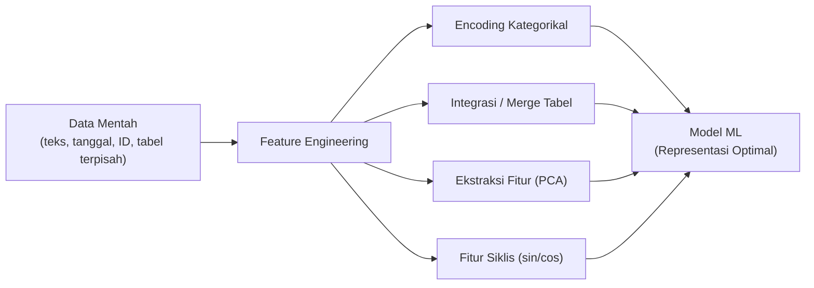
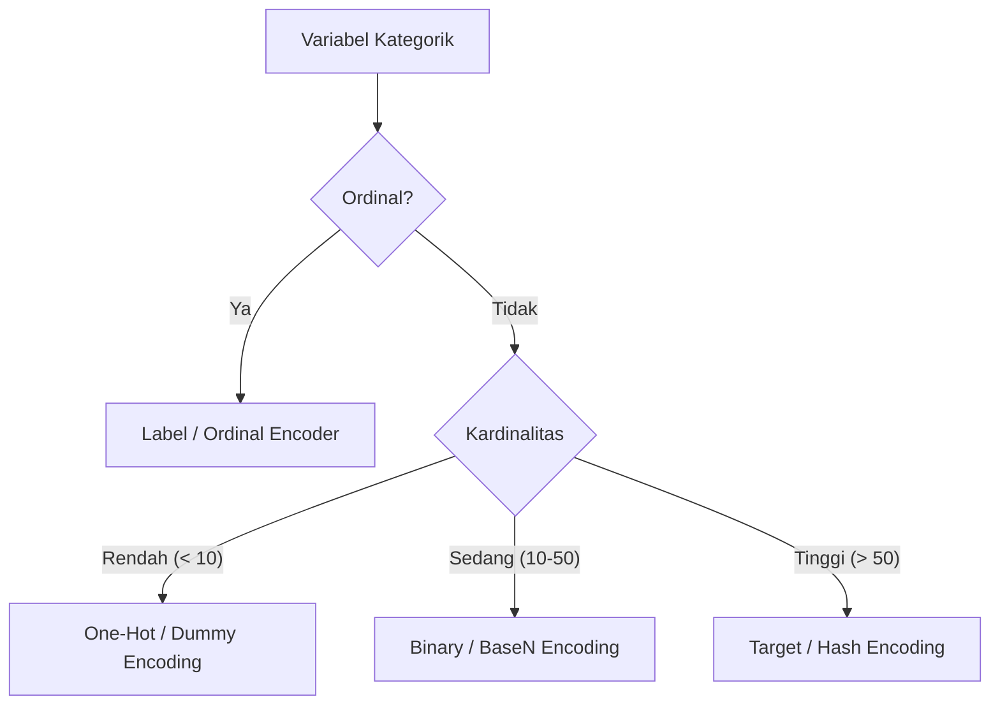
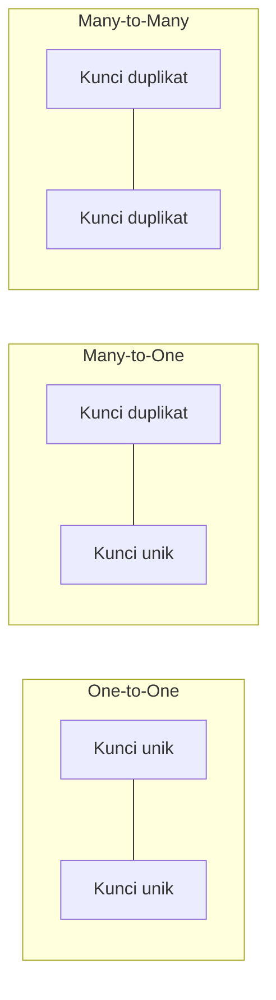
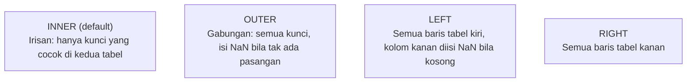
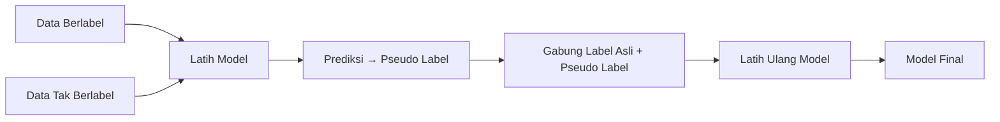

import { Accordion, Accordions } from 'fumadocs-ui/components/accordion';
import { Callout } from 'fumadocs-ui/components/callout';
import { Tab, Tabs } from 'fumadocs-ui/components/tabs';

> **Penyusun Modul & Portal:** Mahendar Dwi Payana  
> **Penulis Materi Pelatihan DTS 2021:** Tim Universitas Gunadarma — Thematic Academy Digital Talent Scholarship 2021  
> **Penyelenggara & Kurikulum:** Kementerian Komunikasi dan Informatika RI (Kominfo) & Sekolah Teknik Elektro dan Informatika (STEI) ITB  
> **Standar Rujukan:** Standar Kompetensi Kerja Nasional Indonesia (SKKNI) No. 299 Tahun 2020 — Skema *Associate Data Scientist*

---

## 1. Landasan Standar Kompetensi Kerja (SKKNI)

Modul ini adalah kelanjutan langsung dari Pertemuan 09. Jika Pertemuan 09 bertransformasi pada **nilai numerik** (imputasi, binning, scaling), maka Pertemuan 10 merekayasa **struktur fitur** dan **integrasi antar-tabel**. Materi menyentuh tiga unit kompetensi:

| Kode Unit | Elemen Kompetensi | Kriteria Unjuk Kerja (KUK) Inti |
| :--- | :--- | :--- |
| **J.62DMI00.009.1**<br />*Mengkonstruksi Data* | **1. Menganalisis teknik transformasi data** | **1.1** Analisis data untuk menentukan representasi fitur data awal.<br/>**1.2** Analisis representasi fitur data awal untuk menentukan teknik rekayasa fitur (*feature engineering*) yang diperlukan bagi pembangunan model. |
| | **2. Melakukan transformasi data** | **2.1** Transformasi dilakukan untuk mendapatkan fitur data awal.<br/>**2.2** Rekayasa fitur data dilakukan untuk mendapatkan fitur baru yang diperlukan bagi pembangunan model. |
| | **3. Membuat dokumentasi konstruksi data** | **3.1** Teknis transformasi data dijabarkan secara tertulis.<br/>**3.2** Hasil transformasi data dan rekomendasinya dituangkan secara tertulis. |
| **J.62DMI00.010.1**<br />*Menentukan Label Data* | **1. Melakukan pelabelan data** | **1.1** Analisis hasil pelabelan data sejenis yang sudah ada diuraikan kesesuaiannya dengan *Standard Operating Procedure* (SOP) pelabelan.<br/>**1.2** Pelabelan data dilakukan sesuai dengan SOP pelabelan. |
| | **2. Membuat laporan hasil pelabelan data** | **2.1** Statistik hasil pelabelan diuraikan pada laporan.<br/>**2.2** Evaluasi proses pelabelan diuraikan pada laporan. |
| **J.62DMI00.011.1**<br />*Mengintegrasikan Data* | *Pelengkap praktik integrasi tabel* | Unit ini mencakup pemetaan sumber ke target data, pemilihan model interaksi antar-data, serta pemeriksaan integritas hasil penggabungan (*join/merge*). |

<Callout type="info" title="Cakupan Praktikum Modul 10">
Modul 10 (Feature Engineering dan Integrasi Data) melatih lima laboratorium:
1. **Lab 10-1** — One-Hot Encoding & pelabelan data (`creditApprovalUCI.csv`)
2. **Lab 10-2** — Pseudo-Labelling semi-supervisi
3. **Lab 10-3** — Segmentasi (threshold & K-Means pada citra)
4. **Lab 10-4** — Merge & Join relasional (Python Data Science Handbook)
5. **Lab 10-5** — Studi kasus aktuaria: PCA, Clustering & XGBoost (*cross-selling* asuransi)
</Callout>

---

## 2. Filosofi: *"Data & Features Determine the Upper Bound"*

Pakar kecerdasan buatan **Andrew Ng** menegaskan:

> *"Menerapkan machine learning pada dasarnya adalah rekayasa fitur (Feature Engineering). Model-model canggih hanya berusaha mendekati batas atas performa yang ditentukan oleh kualitas representasi fitur Anda."*

Implikasinya: menambah data berkualitas dan merekayasa fitur yang tepat jauh lebih berdampak daripada sekadar mengganti algoritma yang lebih kompleks. **Feature engineering** adalah seni mengubah data mentah menjadi representasi yang membuat pola tersembunyi lebih mudah dipelajari model.



---

## 3. Pengkodean Data Kategorikal (Categorical Encoding)

Model matematika (regresi, SVM, neural network) **hanya menerima bilangan numerik**. Data kategorik berupa teks harus dikonversi terlebih dahulu. Kualitas konversi ini sangat menentukan performa model.

### A. Nominal vs. Ordinal

| Jenis | Definisi | Contoh | Urutan? |
| :--- | :--- | :--- | :---: |
| **Nominal** | Kategori tanpa urutan tertentu | Jenis kelamin, Warna, Kota | Tidak |
| **Ordinal** | Kategori dengan urutan/tingkatan jelas | Pendidikan (SD < SMP < SMA < S1), Rating bintang | Ya |

### B. Delapan Teknik Encoding

| No | Teknik | Cara Kerja | Ideal Untuk | Kelemahan |
| :---: | :--- | :--- | :--- | :--- |
| 1 | **Label / Ordinal Encoding** | Setiap label unik → satu integer | Data **ordinal** | Menciptakan urutan palsu pada nominal |
| 2 | **One-Hot Encoding** | Setiap kategori → vektor biner $k$ kolom | Nominal kardinalitas rendah | Ledakan dimensi (*curse of dimensionality*) |
| 3 | **Dummy Encoding** | One-Hot dengan $k-1$ kolom | Model linier (hindari kolinearitas) | Referensi kategori harus konsisten |
| 4 | **Effect Encoding** | Seperti dummy tetapi basis $-1$ (bukan 0) | Analisis ANOVA / kontras | Interpretasi lebih rumit |
| 5 | **Binary Encoding** | Ordinal → biner, lalu dipecah per bit | Kardinalitas tinggi | Kombinasi bit tidak semuanya valid |
| 6 | **BaseN Encoding** | Generalisasi biner dengan basis $N$ | Kardinalitas sangat tinggi | Lebih sulit diinterpretasi |
| 7 | **Hash Encoding** | Kategori → hash tetap, $n$ kolom | Fitur berdimensi sangat besar (streaming) | Potensi **hash collision** |
| 8 | **Target Encoding** | Kategori → rata-rata target (dengan smoothing) | Kardinalitas tinggi | Rawan **Target Leakage** |



---

### 3.1 Label Encoding (Ordinal Encoding)

Setiap kategori diurutkan alfabetis dan dipetakan ke bilangan bulat. Cocok **hanya** untuk data yang benar-benar berurutan.

```python
import pandas as pd

df = pd.DataFrame({
    'country': ['India', 'US', 'Japan', 'US', 'Japan'],
    'age': [44, 34, 46, 35, 23],
    'salary': [72000, 65000, 98000, 45000, 34000]
})

from sklearn.preprocessing import LabelEncoder
label_encoder = LabelEncoder()
df['country'] = label_encoder.fit_transform(df['country'])

print(df)
# country  age  salary
#   0      44   72000    -> India
#   2      34   65000    -> US
#   1      46   98000    -> Japan

# Memeriksa urutan pemetaan hasil pengurutan alfabetis
print(label_encoder.classes_)
# array(['India', 'Japan', 'US'], dtype=object)
# India -> 0, Japan -> 1, US -> 2
```

> [!CAUTION]
> **Bahaya Label Encoding untuk Data Nominal:** Model akan menganggap `US (2) > Japan (1) > India (0)`, seolah-olah ada jarak numerik yang bermakna. Untuk variabel nominal (tanpa urutan), gunakan One-Hot Encoding.

---

### 3.2 One-Hot Encoding

Setiap kategori direpresentasikan sebagai **vektor biner**. Untuk variabel dengan $k$ kategori unik, dihasilkan $k$ kolom biner; nilai 1 menandakan kehadiran kategori tersebut.

**Tiga cara implementasi:**

<Tabs items={['Pandas get_dummies', 'Scikit-learn', 'Feature-engine']}>
  <Tab value="Pandas get_dummies">
```python
import pandas as pd

df = pd.DataFrame({'country': ['India', 'US', 'Japan', 'US', 'Japan']})

# dummy_na=True menyertakan kolom penanda nilai NaN
df_encoded = pd.get_dummies(df, columns=['country'], drop_first=True)
print(df_encoded)
#    country_Japan  country_US
# 0      False        False
# 1      False        True
# 2      True         False
```
  </Tab>
  <Tab value="Scikit-learn">
```python
from sklearn.preprocessing import OneHotEncoder
import numpy as np

X = np.array(['India', 'US', 'Japan', 'US', 'Japan']).reshape(-1, 1)

# sparse=False -> array NumPy biasa; handle_unknown='ignore' -> kategori baru diabaikan
encoder = OneHotEncoder(categories='auto', drop='first', sparse_output=False)
X_enc = encoder.fit_transform(X)
print(encoder.categories_)
# [array(['India', 'Japan', 'US'], dtype=object)]
```
  </Tab>
  <Tab value="Feature-engine">
```python
# pip install feature_engine
from feature_engine.encoding import OneHotEncoder

# top_categories=None -> encode semua kategori; drop_last=True -> bentuk k-1
ohe_enc = OneHotEncoder(top_categories=None, drop_last=True)
ohe_enc.fit(X_train)

# Keunggulan: mengembalikan DataFrame dengan nama kolom jelas
X_train_enc = ohe_enc.transform(X_train)
X_test_enc = ohe_enc.transform(X_test)
```
  </Tab>
</Tabs>

> **Keunggulan `feature_engine`:** (1) dapat memilih variabel yang di-encode langsung di transformator, (2) mengembalikan DataFrame Pandas dengan nama kolom deskriptif, dan (3) menjaga jumlah kolom tetap konsisten antara data latih dan uji — mengatasi keterbatasan `pd.get_dummies()` dan `OneHotEncoder` mentah.

---

### 3.3 Dummy Encoding & *Dummy Variable Trap*

**Dummy Encoding** adalah One-Hot Encoding dengan aturan **$k-1$ kolom** (satu kategori dijadikan referensi/basis dan dibuang). Tujuannya menghindari **multikolinearitas sempurna** pada model linier.

* Jika $k$ kolom one-hot dijumlahkan, hasilnya selalu 1 (redundan) → determinan matriks $X^TX$ menjadi nol → invers tidak terdefinisi.
* Dengan membuang satu kolom (`drop='first'` / `drop_first=True`), informasi tetap utuh dan kolinearitas hilang.

| Encoding | Jumlah Kolom | Multikolinearitas | Cocok Untuk |
| :--- | :---: | :---: | :--- |
| One-Hot ($k$ kolom) | $k$ | Berpotensi | Model berbasis pohon (RF, XGBoost) |
| Dummy ($k-1$ kolom) | $k-1$ | Tidak | Regresi linier, regresi logistik |

```python
# Pandas: drop_first=True membuang kategori referensi pertama
X_train_enc = pd.get_dummies(X_train[vars_categorical], drop_first=True)

# Scikit-learn: drop='first'
encoder = OneHotEncoder(categories='auto', drop='first', sparse_output=False)
encoder.fit(X_train[vars_categorical])
X_train_enc = encoder.transform(X_train[vars_categorical])
X_test_enc = encoder.transform(X_test[vars_categorical])
```

---

### 3.4 Target Encoding dengan Smoothing (M-Estimate)

Untuk kategori berkardinalitas tinggi (kota, kode pos, ID produk), One-Hot Encoding membuang dimensi. **Target Encoding** mengganti kategori dengan statistik target-nya, dihaluskan (*smoothed*) agar tidak menimpa kategori langka:

$$
\hat{S}_i = \frac{n_i \cdot \bar{y}_i + m \cdot \bar{y}_{\text{global}}}{n_i + m}
$$

Di mana $n_i$ = frekuensi kategori $i$, $\bar{y}_i$ = rata-rata target kategori $i$, $\bar{y}_{\text{global}}$ = rata-rata target keseluruhan, dan $m$ = bobot smoothing (*m-estimate*).

<Callout type="warn" title="Anti-Kebocoran pada Target Encoding">
Target Encoding **wajib** dihitung hanya dari data latih dan sebaiknya menggunakan **out-of-fold** (K-Fold) scheme. Jika tidak, fitur akan "melihat" target barisnya sendiri dan menyebabkan *target leakage* yang membuat validasi terlalu optimistis.
</Callout>

---

## 4. Praktikum Lab 10-1: Pembersihan & Encoding `creditApprovalUCI.csv`

Dataset *Credit Approval* (UCI) tidak memiliki judul kolom dan memakai simbol `?` sebagai penanda nilai kosong.

```python
import pandas as pd
import numpy as np

# ============================================================
# TAHAP 1: Pemuatan & Penamaan Kolom (cleaning ala Modul 9)
# ============================================================
data = pd.read_csv('https://mahendartea.github.io/Learn-AI/data/crx.data', header=None)
varnames = ['A' + str(s) for s in range(1, 17)]
data.columns = varnames

# Simbol '?' -> NaN
data = data.replace('?', np.nan)

# Konversi tipe data kolom numerik yang salah tangkap
data['A2'] = data['A2'].astype('float')
data['A14'] = data['A14'].astype('float')

# Mapping target A16: '+' -> 1, '-' -> 0
data['A16'] = data['A16'].map({'+': 1, '-': 0})

# ============================================================
# TAHAP 2: Pemisahan Kolom & Imputasi
# ============================================================
cat_cols = [c for c in data.columns if data[c].dtypes == 'O']
num_cols = [c for c in data.columns if data[c].dtypes != 'O']

# Numerik -> 0, Kategorik -> 'Missing' (strategi imputasi bermakna)
data[num_cols] = data[num_cols].fillna(0)
data[cat_cols] = data[cat_cols].fillna('Missing')

# ============================================================
# TAHAP 3: Train-Test Split & Encoding
# ============================================================
from sklearn.model_selection import train_test_split

X_train, X_test, y_train, y_test = train_test_split(
    data.drop(labels=['A16'], axis=1),
    data['A16'],
    test_size=0.3,
    random_state=0
)

vars_categorical = ['A1', 'A4', 'A5', 'A6', 'A7', 'A9', 'A10', 'A12', 'A13']

X_train_enc = pd.get_dummies(X_train[vars_categorical], drop_first=True)
X_test_enc = pd.get_dummies(X_test[vars_categorical], drop_first=True)

print(X_train_enc.head())
```

> **Pembahasan:** `get_dummies()` menangkap nama variabel (misal `A1`) dan menambahkan garis bawah + nama kategori untuk mengidentifikasi kolom biner hasil. Parameter `drop_first=True` membuang variabel biner pertama sehingga diperoleh representasi **$k-1$** dan menghindari *dummy variable trap*. Untuk Scikit-learn, gunakan `handle_unknown='ignore'` agar kategori baru pada data uji tidak memicu error.

---

## 5. Integrasi Data: Merge & Join Relasional (`J.62DMI00.011.1`)

Fitur terbaik sering kali tidak berada dalam satu tabel, melainkan tersebar di beberapa sumber. **`pd.merge()`** mengimplementasikan operasi **aljabar relasional** — fondasi yang sama yang dipakai basis data SQL.

### A. Tiga Kategori Join



| Tipe Join | Kondisi Kunci | Contoh Dunia Nyata |
| :--- | :--- | :--- |
| **One-to-One** | Unik ↔ Unik | `DataKaryawan` ↔ `DataGaji` (per NIK) |
| **Many-to-One** | Duplikat ↔ Unik | `Transaksi` ↔ `MasterPelanggan` (banyak transaksi satu pelanggan) |
| **Many-to-Many** | Duplikat ↔ Duplikat | `Karyawan` ↔ `Skill` (banyak karyawan, banyak skill) |

### B. Menentukan Kunci Merge

```python
import pandas as pd

df1 = pd.DataFrame({'employee': ['Bob', 'Jake', 'Lisa', 'Sue'],
                    'group': ['Accounting', 'Engineering', 'Engineering', 'HR']})
df2 = pd.DataFrame({'employee': ['Lisa', 'Bob', 'Jake', 'Sue'],
                    'hire_date': [2004, 2008, 2012, 2014]})

# 1. Kunci bernama sama -> pd.merge otomatis mendeteksi
print(pd.merge(df1, df2))

# 2. Kunci eksplisit
print(pd.merge(df1, df2, on='employee'))

# 3. Nama kolom kunci berbeda -> left_on / right_on
df3 = pd.DataFrame({'name': ['Bob', 'Jake', 'Lisa', 'Sue'],
                    'salary': [70000, 80000, 120000, 90000]})
print(pd.merge(df1, df3, left_on='employee', right_on='name').drop('name', axis=1))

# 4. Merge berbasis indeks
df1a = df1.set_index('employee')
df2a = df2.set_index('employee')
print(pd.merge(df1a, df2a, left_index=True, right_index=True))
print(df1a.join(df2a))  # join() = merge default pada indeks
```

### C. Aritmetika Himpunan: Kata Kunci `how`



```python
df6 = pd.DataFrame({'name': ['Peter', 'Paul', 'Mary'],
                    'food': ['fish', 'beans', 'bread']})
df7 = pd.DataFrame({'name': ['Mary', 'Joseph'],
                    'drink': ['wine', 'beer']})

print(pd.merge(df6, df7, how='inner'))  # hanya Mary
print(pd.merge(df6, df7, how='outer'))  # semua, NaN di sisi yang kosong
print(pd.merge(df6, df7, how='left'))   # semua baris df6
print(pd.merge(df6, df7, how='right'))  # semua baris df7
```

### D. Mengatasi Nama Kolom Bertabrakan (`suffixes`)

```python
df8 = pd.DataFrame({'name': ['Bob', 'Jake', 'Lisa', 'Sue'], 'rank': [1, 2, 3, 4]})
df9 = pd.DataFrame({'name': ['Bob', 'Jake', 'Lisa', 'Sue'], 'rank': [3, 1, 4, 2]})

# Default memberi sufiks _x dan _y
print(pd.merge(df8, df9, on="name"))

# Sufiks kustom
print(pd.merge(df8, df9, on="name", suffixes=["_L", "_R"]))
```

### E. Studi Kasus: Menyelaraskan Data Dapodik dengan Data PMP

Pada studi kasus nyata (data sekolah Kabupaten Bogor), data profil sekolah dari **Dapodik** harus diselaraskan dengan data pelaporan **PMP** karena tidak semua sekolah melaporkan PMP. Prosesnya:

```python
# 1. Memuat kedua sumber data
df_sekolah = pd.read_csv("sekolah_smp_kb_bogor.csv")      # profil sekolah (Dapodik)
df_pmp = pd.read_csv("preparasi_tahap_2_data_pmp_smp_2019.csv")  # capaian PMP

# 2. Menyeragamkan tipe kunci join (NPSN harus string!)
df_sekolah['npsn'] = df_sekolah['npsn'].astype(str)
df_pmp['npsn'] = df_pmp['npsn'].astype(str)

# 3. Menambahkan kolom tahun (dibentuk manual)
df_pmp['tahun'] = '2019'

# 4. Merge LEFT: pertahankan semua sekolah PMP, lengkapi dengan profil Dapodik
df_sek_2019_pmp = df_pmp.merge(df_sekolah, on='npsn', how='left')

# 5. Identifikasi nilai kosong pasca-merge (representasi visual)
import missingno as mno
mno.matrix(df_sek_2019_pmp, figsize=(20, 6))

# 6. Drop kolom yang mayoritas kosong (mis. 'yayasan')
df_sek_2019_pmp.drop('yayasan', axis=1, inplace=True)
```

> **Pelajaran Kunci Integrasi Data:**
> 1. **Samakan tipe kunci** sebelum merge — NPSN `12345` (integer) ≠ `"12345"` (string) akan menghasilkan join gagal.
> 2. **Pilih `how` yang tepat** — gunakan `left` bila tabel referensi utama adalah tabel kiri, `outer` bila ingin mendeteksi semua ketidakcocokan.
> 3. **Periksa integritas pasca-merge** dengan memeriksa nilai `NaN` per kolom; gunakan `pd.merge(..., validate='one_to_one'|'many_to_one')` untuk memverifikasi kardinalitas.

<Callout type="info" title="Validasi Kardinalitas Merge">
Pandas menyediakan parameter `validate` untuk mendeteksi pelanggaran relasi:
```python
# Akan error jika relasi bukan one-to-one
pd.merge(df1, df2, on='id', validate='one_to_one')
```
Gunakan ini untuk mencegah ledakan baris tak terduga (*Cartesian explosion*) pada join many-to-many yang tidak disengaja.
</Callout>

---

## 6. Ekstraksi Fitur & Reduksi Dimensi dengan PCA

**Principal Component Analysis (PCA)** memproyeksikan data ke sumbu baru (komponen utama) yang saling **ortogonal** dan memaksimalkan varians terjelaskan. PCA membuat **fitur baru** yang tidak berkorelasi, berguna saat fitur asli redundant.

### A. Varians Terjelaskan Kumulatif (*Cumulative Explained Variance*)

Jumlah komponen yang dipertahankan ditentukan dengan mencari titik ketika varians kumulatif melewati ambang (umumnya 90%).

```python
import numpy as np
import matplotlib.pyplot as plt
from sklearn.decomposition import PCA

# Fit PCA pada fitur (tanpa target)
pca = PCA().fit(df_final[VariablesNoTarget])

fig, axes = plt.subplots(nrows=1, ncols=2, figsize=(12, 5))
ax0, ax1 = axes.flatten()

ax0.plot(np.cumsum(pca.explained_variance_ratio_), marker='o')
ax0.set_xlabel('Number of components')
ax0.set_ylabel('Cumulative explained variance')

ax1.bar(range(df_final[VariablesNoTarget].shape[1]), pca.explained_variance_)
ax1.set_xlabel('Number of components')
ax1.set_ylabel('Explained variance')
plt.tight_layout()
plt.show()

# Menghitung jumlah komponen untuk menutup 90% varians
cum = np.cumsum(pca.explained_variance_ratio_)
n_PCA_90 = np.size(cum) - np.count_nonzero(cum > 0.9)
print("Komponen yang menutup 90% varians:", n_PCA_90)
```

### B. Interpretasi Komponen

Setelah jumlah komponen ditetapkan (misal 4), `pca.components_` menunjukkan **bobot kontribusi** setiap fitur asli terhadap tiap komponen utama. Fitur dengan bobot absolut besar (misal $|w| > 0.4$) adalah kontributor dominan dan dapat digunakan untuk menamai komponen secara bisnis.

| Fitur Asli | Kontribusi Komponen | Interpretasi |
| :--- | :--- | :--- |
| `Age` & `Vehicle_Age` | Komponen 1 & 2 | Semakin muda pemegang polis, semakin muda usia mobil |
| `Previously_Insured` | 3 komponen | Riwayat pernah diasuransikan |
| `Vintage` | Komponen 4 | Loyalitas/usia keanggotaan (pola unik) |

> **Kelebihan & Kekurangan PCA:**
> * **Kelebihan**: menghilangkan multikolinearitas, mereduksi dimensi, mempercepat pelatihan.
> * **Kekurangan**: mengasumsikan relasi **linier** dan interpretasi komponen sulit. Untuk relasi non-linier, gunakan **Kernel PCA** (transformasi ruang Hilbert) atau autoencoder.

---

## 7. Pseudo-Labelling: Pelabelan Semisupervisi (`J.62DMI00.010.1`)

**Pseudo-Labelling** adalah teknik semi-supervisi: model dilatih pada data berlabel, lalu **memprediksi label data tak berlabel (samar)** dan menggabungkannya kembali sebagai data latih tambahan. Berguna ketika data berlabel mahal tetapi data mentah melimpah.



```python
from sklearn.utils import shuffle
from sklearn.base import BaseEstimator, RegressorMixin

class PseudoLabeler(BaseEstimator, RegressorMixin):
    """Wrapper scikit-learn untuk pelabelan semu."""
    def __init__(self, model, unlabled_data, features, target,
                 sample_rate=0.2, seed=42):
        self.sample_rate = sample_rate
        self.seed = seed
        self.model = model
        self.model.seed = seed
        self.unlabled_data = unlabled_data
        self.features = features
        self.target = target

    def fit(self, X, y):
        self.model.fit(X, y)

        # Prediksi data tak berlabel sebagai label semu
        pseudo_labels = self.model.predict(self.unlabled_data[self.features])
        temp = self.unlabled_data.copy()
        temp[self.target] = pseudo_labels

        # Ambil sebagian (sample_rate) untuk mencegah overfitting
        temp = shuffle(temp, random_state=self.seed)
        temp = temp.sample(frac=self.sample_rate, random_state=self.seed)

        X_aug = pd.concat([X, temp[self.features]])
        y_aug = pd.concat([y, temp[self.target]])
        self.model.fit(X_aug, y_aug)
        return self

    def predict(self, X):
        return self.model.predict(X)
```

> **Hasil pada Kasus *Big Mart Sales*:** RMSE turun dari **1152,73** (XGBoost biasa) menjadi **1151,38** (XGBoost + Pseudo-Labelling pada `sample_rate=0.3`). Perbaikan tipikal bersifat marginal, tetapi konsisten: teknik ini efektif ketika data tak berlabel berasal dari **distribusi yang sama** dengan data latih.
>
> [!CAUTION]
> **Risiko Confirmation Bias:** Jika model awal salah memprediksi, galat tersebut akan diperkuat (*reinforced*) saat dilatih ulang. Batasi `sample_rate` (mis. 0.2–0.3) dan hanya pakai bila prediksi model awal cukup andal.

---

## 8. Rekayasa Fitur Berbasis Siklus Waktu (Cyclical Feature Encoding)

Variabel waktu seperti jam (`0-23`) atau bulan (`1-12`) bersifat melingkar. Jam 23:59 berjarak sangat dekat dengan jam 00:01, namun secara numerik $23 - 0 = 23$. Untuk mempertahankan sifat siklis, fitur dipetakan ke koordinat trigonometri:

$$
x_{\sin} = \sin\left(\frac{2\pi \cdot x}{\max(x)}\right), \qquad x_{\cos} = \cos\left(\frac{2\pi \cdot x}{\max(x)}\right)
$$

```python
import numpy as np
import pandas as pd

df = pd.DataFrame({'jam': [0, 6, 12, 18, 23]})

df['jam_sin'] = np.sin(2 * np.pi * df['jam'] / 24)
df['jam_cos'] = np.cos(2 * np.pi * df['jam'] / 24)
print(df)
# pasangan (sin, cos) merepresentasikan satu titik pada lingkaran unit
```

---

## 9. Teknik Seleksi Fitur (Feature Selection)

Mengeliminasi fitur tidak relevan (*noise*) untuk mencegah *Curse of Dimensionality* dan mempercepat inferensi model:

1. **Filter Methods**:
   - `VarianceThreshold`: menghapus fitur dengan variasi konstan atau mendekati nol.
   - `SelectKBest` dengan uji statistik: **ANOVA F-Test** (fitur kontinu vs target kategori), **Chi-Square** (kategorik vs kategorik), atau **Mutual Information** (relasi non-linier umum).
2. **Wrapper Methods**:
   - `RFE (Recursive Feature Elimination)`: melatih model berulang dan mengeliminasi fitur berbobot terlemah secara berkala.
3. **Embedded Methods**:
   - Penalti $L_1$ (**Lasso**): memaksa koefisien fitur tidak signifikan menjadi nol.
   - *Feature Importance* bawaan algoritma pohon (**Random Forest / LightGBM**).

```python
from sklearn.feature_selection import SelectKBest, mutual_info_classif
from sklearn.ensemble import ExtraTreesClassifier
import pandas as pd

# Embedded: Feature Importance dari Extra Trees
model = ExtraTreesClassifier(n_estimators=100, random_state=42).fit(X, y)
importances = pd.Series(model.feature_importances_, index=X.columns)
print(importances.nlargest(10).plot(kind='barh'))

# Filter: Mutual Information
selector = SelectKBest(score_func=mutual_info_classif, k=5).fit(X, y)
print("Fitur terpilih:", X.columns[selector.get_support()])
```

---

## 10. Menentukan Label Data & Penanganan Ketimpangan Kelas (`J.62DMI00.010.1`)

Penentuan label target harus memenuhi prinsip objektivitas tanpa ambiguitas, dengan mempertimbangkan SOP pelabelan yang berlaku.

### A. Tantangan Ketimpangan Kelas (Class Imbalance)

Pada kasus *fraud*, diagnosis penyakit langka, atau respon *cross-selling* asuransi, kelas positif sering hanya `1%–5%` dari dataset. Model yang dilatih langsung akan bias menebak seluruh data sebagai kelas mayoritas (*Majority Guessing Paradox*).

### B. Solusi Modern

1. **Algorithmic Weighting**: parameter `class_weight='balanced'` pada Scikit-learn memberi penalti lebih tinggi saat salah memprediksi kelas minoritas.
2. **Resampling**: `RandomOverSampler`, `RandomUnderSampler`, atau **SMOTE** (interpolasi tetangga terdekat).
3. **Metrik evaluasi asimetris**: gunakan **Recall**, **Precision**, **F1-Score**, atau **ROC-AUC** — bukan akurasi.

```python
from sklearn.utils import resample
import pandas as pd

# Oversampling manual kelas minoritas
df_majority = df_final[df_final['Response'] == 0]
df_minority = df_final[df_final['Response'] == 1]

df_minority_upsampled = resample(
    df_minority, replace=True, n_samples=len(df_majority), random_state=0
)
balanced_df = pd.concat([df_minority_upsampled, df_majority]).sample(
    frac=1, random_state=0
)
print(balanced_df['Response'].value_counts())  # seimbang 50:50
```

> **Catatan:** Implementasi SMOTE secara matematis telah dibahas tuntas pada **Pertemuan 08 (§5)**. Aturan emas tetap berlaku: **SMOTE hanya diterapkan pada data latih setelah *train-test split***.

---

## 11. Praktikum Terpadu: Pipeline Feature Engineering

<Callout type="info" title="Unduh Dataset Resmi Praktikum Modul 10">
Tersedia pada portal Learn AI:
1. **`creditApprovalUCI.csv`** — [Unduh](https://mahendartea.github.io/Learn-AI/data/creditApprovalUCI.csv) *(hasil cleansing Lab 10-1)*
2. **`crx.data`** — [Unduh](https://mahendartea.github.io/Learn-AI/data/crx.data) *(data mentah Credit Approval UCI)*
3. **`mountain.jpeg`** — [Unduh](https://mahendartea.github.io/Learn-AI/data/mountain.jpeg) *(citra Lab 10-3 segmentasi)*
4. **Health Insurance Cross Sell** *(Lab 10-5)* — [Kaggle](https://www.kaggle.com/anmolkumar/health-insurance-cross-sell-prediction)
</Callout>

```python
"""
Pipeline Feature Engineering End-to-End
Sumber praktikum: Modul 10 - Feature Engineering & Integrasi Data (DTS 2021)
Disusun ulang oleh: Mahendar Dwi Payana
"""
import pandas as pd
import numpy as np
from sklearn.compose import ColumnTransformer
from sklearn.pipeline import Pipeline
from sklearn.preprocessing import OneHotEncoder, StandardScaler
from sklearn.feature_selection import SelectKBest, mutual_info_classif
from sklearn.ensemble import RandomForestClassifier

BASE = "https://mahendartea.github.io/Learn-AI/data"

# 1. Pemuatan & Pembersihan
data = pd.read_csv(f"{BASE}/crx.data", header=None)
data.columns = ['A' + str(s) for s in range(1, 17)]
data = data.replace('?', np.nan)
data['A2'] = data['A2'].astype(float)
data['A14'] = data['A14'].astype(float)
data['A16'] = data['A16'].map({'+': 1, '-': 0})

cat_cols = [c for c in data.columns if data[c].dtypes == 'O']
num_cols = [c for c in data.columns if data[c].dtypes != 'O']
data[num_cols] = data[num_cols].fillna(0)
data[cat_cols] = data[cat_cols].fillna('Missing')

X = data.drop('A16', axis=1)
y = data['A16']

# 2. Pipeline Encoding + Scaling + Selection + Model
numeric_pipe = Pipeline([('scaler', StandardScaler())])
categorical_pipe = Pipeline([
    ('onehot', OneHotEncoder(handle_unknown='ignore', drop='first'))
])

preprocessor = ColumnTransformer([
    ('num', numeric_pipe, num_cols[:-1] if 'A16' in num_cols else num_cols),
    ('cat', categorical_pipe, cat_cols)
])

pipeline = Pipeline([
    ('preprocessor', preprocessor),
    ('selector', SelectKBest(score_func=mutual_info_classif, k=10)),
    ('classifier', RandomForestClassifier(
        n_estimators=100, class_weight='balanced', random_state=42))
])

pipeline.fit(X, y)
print("Pipeline Feature Engineering berhasil dilatih tanpa kebocoran data!")
```

---

## 12. Lembar Evaluasi & Tugas Praktikum Mandiri

<Accordions>
  <Accordion title="Tugas 1: Komparasi Tiga Teknik Encoding pada creditApprovalUCI.csv (KUK 1.1 & 2.1)">
    Bandingkan performa model `LogisticRegression` menggunakan tiga strategi encoding pada kolom kategorikal: (a) Label Encoding, (b) One-Hot penuh ($k$ kolom), dan (c) Dummy Encoding ($k-1$ kolom). Laporkan metrik **akurasi, F1-Score, dan jumlah fitur** yang dihasilkan. Jelaskan mengapa One-Hot penuh dapat menyebabkan masalah pada regresi logistik!
  </Accordion>

  <Accordion title="Tugas 2: Integrasi Data & Validasi Kardinalitas (KUK Integrasi 011.1)">
    Diberikan dua tabel: `orders` (order_id, customer_id, amount) dan `customers` (customer_id, city, segment). Lakukan: (a) inner join, (b) left join, dan (c) outer join. Untuk masing-masing, laporkan jumlah baris hasil dan jumlah nilai `NaN`. Lalu gunakan parameter `validate='many_to_one'` dan jelaskan pelanggaran kardinalitas yang terdeteksi!
  </Accordion>

  <Accordion title="Tugas 3: Ekstraksi Fitur dengan PCA (KUK 1.2)">
    Gunakan dataset numerik (misal `diabetes.csv` dari Pertemuan 09). Terapkan `StandardScaler` lalu `PCA`. Tentukan jumlah komponen minimum yang menutup **90% varians**. Bandingkan akurasi `RandomForestClassifier` menggunakan (a) seluruh fitur asli dan (b) komponen PCA terpilih. Sertakan grafik *scree plot*!
  </Accordion>

  <Accordion title="Tugas 4: Pseudo-Labelling & Pemanfaatan Data Tak Berlabel (KUK 010.1)">
    Bagi dataset menjadi tiga bagian: latih berlabel (60%), tak berlabel (20%), dan uji (20%). Latih model XGBoost/Random Forest tanpa pseudo-label, lalu kombinasikan dengan pseudo-label pada `sample_rate` 0.1 hingga 0.5. Plot kurva RMSE terhadap `sample_rate` dan simpulkan *sample rate* optimum serta risikonya!
  </Accordion>

  <Accordion title="Tugas 5: Dokumentasi Feature Engineering Formal (KUK 3.1 & 3.2)">
    Susun laporan konstruksi fitur untuk dataset Capstone Anda yang memuat: (1) representasi fitur awal, (2) teknik encoding & integrasi yang dipilih beserta justifikasinya, (3) tabel hasil transformasi (jumlah fitur & tipe), dan (4) evaluasi dampak terhadap performa model baseline. Dokumentasikan sesuai standar SKKNI!
  </Accordion>
</Accordions>

---

## 13. Referensi Pustaka & Tautan Resmi

1. **Tim Universitas Gunadarma** (2021). *Modul 10 — Feature Engineering dan Integrasi Data*. Thematic Academy Digital Talent Scholarship 2021, Kementerian Komunikasi dan Informatika RI.
2. **Kementerian Ketenagakerjaan RI** (2020). *SKKNI No. 299 Tahun 2020 Bidang Artificial Intelligence Subbidang Data Science* (Unit `J.62DMI00.009.1` Mengkonstruksi Data, `J.62DMI00.010.1` Menentukan Label Data, `J.62DMI00.011.1` Mengintegrasikan Data).
3. **Alice Zheng & Amanda Casari** (2018). *Feature Engineering for Machine Learning: Principles and Techniques for Data Scientists*. O'Reilly Media.
4. **Jake VanderPlas** (2016). *Python Data Science Handbook: Combining Datasets — Merge and Join*. O'Reilly Media. [jakevdp.github.io](https://jakevdp.github.io/PythonDataScienceHandbook/).
5. **Sinno Jialin Pan & Qiang Yang** (2010). *A Survey on Transfer Learning*. IEEE Transactions on Knowledge and Data Engineering, 22(10). *(Konsep pseudo-labelling / self-training)*.
6. **Scikit-learn Developers**. *Preprocessing: Encoding Categorical Features & Principal Component Analysis*. [scikit-learn.org](https://scikit-learn.org/stable/modules/preprocessing.html).
7. **Feature-engine Documentation**. *Categorical Encoders*. [feature-engine.trainindata.com](https://feature-engine.trainindata.com).
8. **Analytics Vidhya** (2020). *Types of Categorical Data Encoding*. [analyticsvidhya.com](https://www.analyticsvidhya.com/blog/2020/08/types-of-categorical-data-encoding/).
