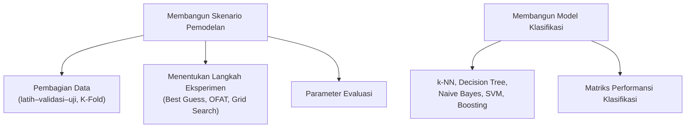
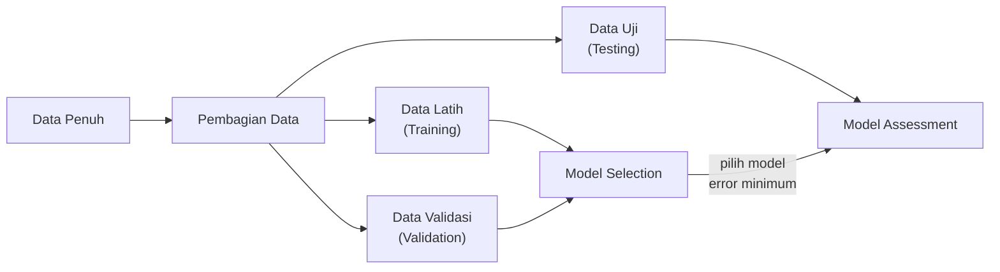
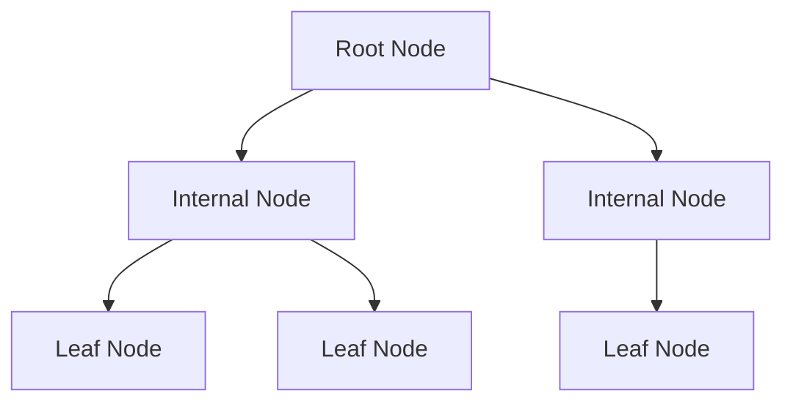
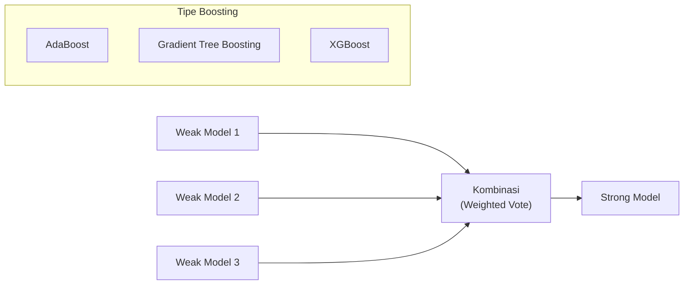

import { Accordion, Accordions } from 'fumadocs-ui/components/accordion';
import { Callout } from 'fumadocs-ui/components/callout';
import { Tab, Tabs } from 'fumadocs-ui/components/tabs';

> **Penyusun Modul & Portal:** Mahendar Dwi Payana  
> **Penulis Materi Pelatihan DTS 2021:** Afiahayati, S.Kom., M.Cs., Ph.D. — Thematic Academy Digital Talent Scholarship 2021  
> **Penyelenggara & Kurikulum:** Kementerian Komunikasi dan Informatika RI (Kominfo) & Sekolah Teknik Elektro dan Informatika (STEI) ITB  
> **Standar Rujukan:** Standar Kompetensi Kerja Nasional Indonesia (SKKNI) No. 299 Tahun 2020 — Skema *Associate Data Scientist*

---

## 1. Landasan Standar Kompetensi Kerja (SKKNI)

Modul ini adalah **bagian pertama dari pemodelan**. Materi mencakup **merancang skenario model** dan **membangun model klasifikasi** (pemodelan regresi menyusul pada Pertemuan 12).

| Kode Unit | Elemen Kompetensi | Kriteria Unjuk Kerja (KUK) Inti |
| :--- | :--- | :--- |
| **J.62DMI00.012.1**<br />*Membangun Skenario Model* | **1. Mengidentifikasi teknik pemodelan** | **1.1** Asumsi spesifik mengenai data diidentifikasi sesuai karakteristik data.<br/>**1.2** Teknik-teknik pemodelan data diidentifikasi sesuai karakteristik data dan tujuan teknis. |
| | **2. Menentukan teknik pemodelan** | **2.1** Teknik pemodelan yang sesuai karakteristik data ditentukan.<br/>**2.2** Deskripsi teknik pemodelan yang dipilih didokumentasikan sesuai SOP. |
| | **3. Menyiapkan skenario pengujian** | **3.1** Skenario uji yang mungkin diterapkan ditentukan sesuai tujuan teknis.<br/>**3.2** Metrik evaluasi pengujian diidentifikasi sesuai skenario uji.<br/>**3.3** Skenario uji yang dipilih didokumentasikan sesuai standar. |
| **J.62DMI00.013.1**<br />*Membangun Model* | **1. Menyiapkan parameter model** | **1.1** Parameter yang sesuai dengan model diidentifikasi.<br/>**1.2** Nilai toleransi parameter evaluasi pengujian ditetapkan sesuai tujuan teknis. |
| | **2. Menggunakan tools pemodelan** | **2.1** Tools untuk membuat model diidentifikasi.<br/>**2.2** Algoritma pemodelan dibangun menggunakan tools yang dipilih.<br/>**2.3** Algoritma pemodelan dieksekusi sesuai skenario pengujian.<br/>**2.4** Parameter model dioptimasi untuk menghasilkan nilai evaluasi yang sesuai skenario. |

### Tujuan Pembelajaran Modul

Setelah mempelajari modul ini, peserta diharapkan mampu:

1. **Membangun Skenario Model** — mengidentifikasi teknik pemodelan, menentukan teknik yang sesuai karakteristik data & tujuan teknis, serta menyiapkan skenario pengujian.
2. **Membangun Model Klasifikasi** — menyiapkan parameter model dan menggunakan tools pemodelan.

**Pokok Bahasan:**



<Callout type="info" title="Cakupan Praktikum Modul 11">
Modul 11 (Membangun Model dan Studi Kasus) menggunakan **dataset Iris** dengan pembagian data latih 70% dan uji 30%, menerapkan berbagai metode klasifikasi dengan *parameter tuning*, lalu membandingkannya terhadap **algoritma AdaBoost**. Studi kasus kelompok memodelkan **mutu pendidikan (SNP)** sekolah Kabupaten Bogor dengan klasifikasi dan regresi.
</Callout>

---

## 2. Membangun Skenario Pemodelan (`J.62DMI00.012.1`)

Perancangan skenario eksperimen dilakukan **sebelum** model dibangun, dan terdiri atas tiga keputusan penting: pembagian data, langkah eksperimen, dan parameter evaluasi.

### A. Pembagian Data (Data Splitting)

Data dibagi menjadi dua bagian utama: **data latih** (mengembangkan model) dan **data uji** (mengukur performansi). Praktik yang lebih lengkap menambahkan **data validasi** di antaranya.



**Peran tiap bagian data:**

| Bagian | Peran | Keterkaitan |
| :--- | :--- | :--- |
| **Data Latih** | Melatih parameter model | — |
| **Data Validasi** | Membandingkan model dengan hyperparameter berbeda; mendeteksi *underfitting*/*overfitting* | **Model Selection** (estimasi performa model berbeda → pilih error minimum) |
| **Data Uji** | Menguji performa algoritma yang satu terhadap yang lain | **Model Assessment** (estimasi error untuk data baru) |

**Rasional & proporsi umum:**

* Jika data sedikit, model dilatih pada data yang terlalu sedikit dan generalisasi menjadi terlalu "optimis" (bias tinggi).
* Proporsi train:validation yang lazim: **66,6%:33,3%**, **75%:25%**, dan **80%:20%**. Modul ini memakai **70% latih : 30% uji**.

```python
from sklearn import datasets
from sklearn.model_selection import train_test_split

# Dataset Iris: 150 sampel, 4 fitur, 3 kelas
iris = datasets.load_iris()
X, y = iris.data, iris.target

# Proporsi 70% latih : 30% uji
X_train, X_test, y_train, y_test = train_test_split(
    X, y, train_size=0.7, random_state=42
)
print("Data latih:", len(X_train), "| Data uji:", len(X_test))
```

### B. Validasi Silang K-Fold (Cross-Validation)

Dilakukan **pada data latih**, terutama bila jumlah data relatif sedikit. Data latih dibagi menjadi $K$ bagian; secara iteratif, 1 bagian menjadi data validasi dan $K-1$ bagian melatih model. Rata-rata skor menjadi estimasi performa yang lebih stabil daripada satu kali split.

$$
\text{CV}_{(K)} = \frac{1}{K}\sum_{k=1}^{K} \text{Skor}_k
$$

```python
from sklearn.model_selection import cross_val_score
from sklearn.svm import SVC

model = SVC(kernel='linear', C=1)

# 5-Fold Cross Validation
scores = cross_val_score(model, X, y, cv=5)
print("Akurasi tiap fold  :", scores)
print("Akurasi rata-rata  :", scores.mean())
```

* **Stratified K-Fold**: menjaga proporsi setiap kelas pada tiap lipatan — **wajib** untuk data timpang.
* **Time-Series Split**: untuk data runtun waktu guna mencegah kebocoran masa depan (*future leakage*).

### C. Bahaya Fatal Kebocoran Data (Data Leakage)

> [!CAUTION]
> **Data Leakage**: kondisi di mana informasi dari luar data latih (khususnya data uji atau masa depan) bocor ke dalam proses pelatihan.
>
> *Penyebab umum*: `StandardScaler.fit()`, `SimpleImputer.fit()`, atau SMOTE yang diterapkan pada **seluruh** dataset sebelum pemisahan train/test.
>
> *Solusi*: bungkus pra-pemrosesan dan model ke dalam **Scikit-learn Pipeline** sehingga `fit` hanya terjadi pada data latih.

```python
from sklearn.pipeline import Pipeline
from sklearn.preprocessing import StandardScaler
from sklearn.linear_model import LogisticRegression

# Salah: scaler di-fit pada seluruh data sebelum split -> LEAKAGE!

# Benar: semua tahap dalam Pipeline
pipe = Pipeline([
    ('scaler', StandardScaler()),
    ('clf', LogisticRegression(max_iter=1000, random_state=42))
])
pipe.fit(X_train, y_train)
print("Akurasi Pipeline:", pipe.score(X_test, y_test))
```

### D. Menentukan Langkah Eksperimen (Strategi Pencarian Parameter)

Setiap algoritma punya **parameter** tertentu. Eksperimen dilakukan dengan beberapa variasi parameter; kombinasi dengan performa terbaik dipakai selanjutnya. Tiga strategi pencarian:

| Strategi | Cara Kerja | Kelebihan | Kekurangan |
| :--- | :--- | :--- | :--- |
| **Best Guess** | Menebak satu kombinasi berdasarkan pengalaman | Sangat cepat | Tidak sistematis; bisa melewatkan kombinasi terbaik |
| **One Factor at a Time (OFAT)** | Mengubah satu parameter sambil menahan yang lain | Sederhana | Mengabaikan interaksi antar-parameter |
| **Grid Search** | Menguji seluruh kombinasi pada grid yang didefinisikan | Sistematis & menyeluruh | Mahal secara komputasi |

### E. Parameter Evaluasi per Tipe Tugas

| Tipe Tugas | Metrik Evaluasi |
| :--- | :--- |
| **Klasifikasi** | Akurasi, Presisi, Recall/Sensitivity, Specificity, F1-measure |
| **Regresi** | MSE (*Mean Squared Error*), MAPE (*Mean Absolute Percentage Error*) |
| **Klastering** | Silhouette Score, Davies-Bouldin Index |

Untuk klasifikasi biner, keempat metrik dasar diturunkan dari **Confusion Matrix**:

$$
\text{Accuracy} = \frac{TP+TN}{TP+TN+FP+FN}, \quad
\text{Precision} = \frac{TP}{TP+FP}, \quad
\text{Recall} = \frac{TP}{TP+FN}
$$

$$
\text{Specificity} = \frac{TN}{TN+FP}, \qquad
F_1 = 2 \cdot \frac{P \cdot R}{P + R}
$$

> Pembahasan mendalam Confusion Matrix, ROC/PR-Curve, dan SHAP ada pada **Pertemuan 15**.

---

## 3. Membangun Model Klasifikasi (`J.62DMI00.013.1`)

### 3.1 Logistic Regression (Baseline Linier)

Model linier yang memetakan kombinasi fitur ke probabilitas kelas melalui **Fungsi Sigmoid**:

$$
P(Y=1 \mid X) = \sigma(z) = \frac{1}{1 + e^{-z}}, \qquad z = \beta_0 + \sum_{j=1}^{p} \beta_j X_j
$$

```python
from sklearn.linear_model import LogisticRegression
from sklearn import metrics

lr = LogisticRegression(max_iter=1000, random_state=42)
lr.fit(X_train, y_train)
print("Akurasi Logistic Regression:", metrics.accuracy_score(y_test, lr.predict(X_test)))
```

---

### 3.2 k-Nearest Neighbor (k-NN) Classifier

**Algoritma k-NN:**

1. Menentukan nilai $k$ (jumlah tetangga).
2. Menghitung **jarak** data baru terhadap semua data latih.
3. Mengidentifikasi $k$ tetangga terdekat.
4. Menentukan label data baru berdasarkan kelas tetangga (umumnya *voting*).

$$
d(x, x') = \sqrt{\sum_{j=1}^{p} (x_j - x'_j)^2}
$$

**Contoh kasus:** 4 data latih (P1–P4) dengan 2 atribut ($x_1, x_2$) dan 2 kelas (BAD, GOOD); tentukan kelas data uji P5 berdasarkan $k$ tetangga terdekatnya.

**Kelebihan & Kekurangan:**

| Kelebihan | Kekurangan |
| :--- | :--- |
| Cocok untuk data numerik | *Lazy learner* — tidak membangun model eksplisit |
| Mudah dipahami & diimplementasikan | Biaya komputasi prediksi tinggi |
| Non-parametrik | Perlu memilih $k$ yang tepat |

> **Memilih $k$:** Jika $k$ terlalu kecil → sensitif terhadap *noise*. Jika $k$ terlalu besar → tetangga bisa mencakup kelas lain.

| Parameter | Keterangan | Contoh Nilai |
| :--- | :--- | :--- |
| `n_neighbors` | Jumlah neighbor | Bilangan integer $(1, 2, 3, \dots)$ |

```python
from sklearn.neighbors import KNeighborsClassifier

knn = KNeighborsClassifier()   # sklearn default: n_neighbors=5
knn.fit(X_train, y_train)
print("KNN:", knn.score(X_test, y_test))
```

> **Penting:** KNN **sangat sensitif skala** → wajib standardisasi fitur (lihat Pertemuan 09).

---

### 3.3 Decision Tree Classifier

Membangun pohon keputusan dari data latih; outputnya berupa **rule** yang dipakai untuk klasifikasi. Struktur pohon:



**Prosedur pembangunan (Gini Index/Impurity):**

1. Hitung **Gini Index (GI)** untuk setiap atribut.
2. Tentukan **root** = atribut dengan **GI terkecil**.
3. Ulangi langkah 1–2 pada level berikutnya hingga semua leaf bernilai **GI = 0**.

$$
I_G(p) = 1 - \sum_{i=1}^{C} p_i^2
$$

**Contoh Perhitungan Gini (studi kasus "Beli"):**

Data latih 7 rekaman, 3 atribut (Kebutuhan Primer, Sudah Gajian, Harga Barang), target Beli/Tidak. **Total GI** dihitung sebagai *weighted average* GI kedua anak node.

| Atribut | Gini Index | Keputusan |
| :--- | :---: | :--- |
| Kebutuhan Primer | 0,40 | — |
| **Sudah Gajian** | **0,22** | ✅ **Root** (GI terkecil) |
| Harga Barang | 0,34 | — |

> **Penanganan atribut kontinu:** untuk `Harga Barang`, GI dihitung pada titik tengah dua data berdekatan (mis. `> 9500`, `> 15000`, `> 26500`, `> 36500`, `> 44000`, `> 66500`), lalu ambil GI terkecil. Pada contoh, GI `Harga Barang > 15000` lebih kecil sehingga dipakai untuk memecah *leaf* kiri. Karena *leaf* kanan GI = 0, ia tidak dipecah lagi.

**Kelebihan & Kekurangan:**

| Kelebihan | Kekurangan |
| :--- | :--- |
| Memberikan penjelasan berupa **rule** yang dapat dibaca | Pembangunan pada data numerik lebih rumit; berpotensi kehilangan informasi |
| Tidak butuh asumsi distribusi | Pohon dapat tumbuh sangat kompleks (overfitting) |

| Parameter | Keterangan | Default |
| :--- | :--- | :--- |
| `max_depth` | Kedalaman maksimum pohon | `None` (tumbuh sampai GI = 0) |
| `min_samples_split` | Minimum sampel agar node dapat *split* | `2` |

```python
from sklearn.tree import DecisionTreeClassifier, plot_tree
import matplotlib.pyplot as plt

dt = DecisionTreeClassifier(max_depth=None, min_samples_split=2, random_state=42)
dt.fit(X_train, y_train)
print("Decision Tree:", dt.score(X_test, y_test))

plt.figure(figsize=(12, 8))
plot_tree(dt, feature_names=iris.feature_names, class_names=iris.target_names, filled=True)
plt.show()
```

> Untuk mencegah **overfitting**, batasi `max_depth` dan/atau naikkan `min_samples_split`.

---

### 3.4 Naive Bayes Classifier

Membangun **model probabilistik** untuk klasifikasi. Dua pendekatan model:

* **Discriminative Model** — memodelkan $P(y \mid x)$ secara langsung.
* **Generative Model** — memodelkan $P(x \mid y)$ dan $P(y)$, lalu menurunkan $P(y \mid x)$. Naive Bayes termasuk generative.

**MAP Classification Rule** (*Maximum A Posteriori*) dengan aturan Bayes:

$$
\hat{y} = \arg\max_{y}\; P(y \mid x_1,\dots,x_n) \;\propto\; \arg\max_{y}\; P(y)\prod_{i=1}^{n} P(x_i \mid y)
$$

**Contoh kasus:** 14 data latih bermain tenis dengan 4 atribut (Outlook, Temperature, Humidity, Wind) dan 2 kelas (YES/NO). Klasifikasi data uji menggunakan probabilitas kondisi tiap atribut per kelas.

**Kelebihan & Kekurangan:**

| Kelebihan | Kekurangan |
| :--- | :--- |
| Bekerja baik pada **data latih kecil** | Pembangunan pada data numerik lebih rumit |
| Sangat cepat | Asumsi **independensi fitur** sering tidak berlaku di dunia nyata |

```python
from sklearn.naive_bayes import GaussianNB, BernoulliNB

# GaussianNB lebih tepat untuk fitur kontinu; BernoulliNB untuk fitur biner
nb = GaussianNB()
nb.fit(X_train, y_train)
print("Naive Bayes:", nb.score(X_test, y_test))
```

---

### 3.5 Support Vector Machine (SVM)

Ide utama SVM: menemukan **hyperplane terbaik** yang memisahkan dua daerah keputusan dengan baik. Hyperplane terbaik diperoleh dengan **memaksimalkan jarak** (margin) terhadap titik data terdekat (*support vectors*).

$$
\min_{w,b} \frac{1}{2}\lVert w \rVert^2 \quad \text{dengan kendala} \quad y_i(w^T x_i + b) \ge 1
$$

**Algoritma:** fitur dipetakan ke ruang dimensi lebih tinggi memakai **fungsi kernel**, lalu dicari hyperplane pemisah terbaik.

**Jenis Kernel:**

* **Linear**: $K(x_i, x_j) = x_i^T x_j$.
* **Polynomial**: $K(x_i, x_j) = (x_i^T x_j + c)^d$.
* **Radial Basis Function (RBF)**: $K(x_i, x_j) = \exp(-\gamma \lVert x_i - x_j \rVert^2)$.
* **Sigmoid**.

**Interpretasi Hyperparameter:**

* **Parameter $C$** (regularisasi): keseimbangan antara jarak maksimal dan kesalahan klasifikasi minimal.
  * $C$ **tinggi** → penalti besar saat salah klasifikasi (cocok untuk data ber-*noise* rendah).
  * $C$ **rendah** → lebih toleran terhadap kesalahan (cocok untuk data ber-*noise* tinggi).
* **Parameter $\gamma$**: $\gamma$ besar → kelengkungan tajam; $\gamma$ kecil → batas keputusan lebih landai.

| Parameter | Keterangan | Default |
| :--- | :--- | :--- |
| `kernel` | `linear`, `poly`, `rbf`, `sigmoid` | `rbf` |
| `C` | Regularisasi untuk semua kernel | `1.0` |
| `gamma` | Koefisien kernel untuk `poly` & `rbf` | `scale` |
| `degree` | Derajat polinomial (kernel `poly`) | `3` |

<Tabs items={['Linear', 'Polynomial', 'RBF']}>
  <Tab value="Linear">
```python
from sklearn.svm import SVC

svm_linear = SVC(kernel='linear', C=1)
svm_linear.fit(X_train, y_train)
print("SVM Linear:", svm_linear.score(X_test, y_test))
```
  </Tab>
  <Tab value="Polynomial">
```python
svm_poly = SVC(kernel='poly', C=1, gamma=0.01, degree=2)
svm_poly.fit(X_train, y_train)
print("SVM Polynomial:", svm_poly.score(X_test, y_test))
```
  </Tab>
  <Tab value="RBF">
```python
svm_rbf = SVC(kernel='rbf', C=1, gamma=0.01)
svm_rbf.fit(X_train, y_train)
print("SVM RBF:", svm_rbf.score(X_test, y_test))
```
  </Tab>
</Tabs>

**Kelebihan & Kekurangan:**

| Kelebihan | Kekurangan |
| :--- | :--- |
| Strategi kernel mengatasi data kompleks | Hyperparameter & kernel perlu di-tuning |
| Outlier dapat diatasi via *soft margin* $C$ | Waktu training lama untuk dataset besar |

---

### 3.6 Random Forest (Ensemble Bagging)

Menggabungkan ratusan pohon keputusan independen. Setiap pohon dilatih pada sampel *bootstrap* dan memilih subset acak fitur pada setiap pemisahan (*feature subspace sampling*). Prediksi akhir = **mayoritas suara**:

$$
\hat{y} = \text{mode}\left(T_1(x), T_2(x), \dots, T_B(x)\right)
$$

---

### 3.7 Boosting Algorithm

**Boosting** adalah strategi ensemble yang mengubah *weak model* menjadi *strong model* dengan mengombinasikan prediksi tiap model melalui *average/weighted average* atau *higher voting*. Tiga tipe utama:



#### Adaptive Boosting (AdaBoost)

AdaBoost mengidentifikasi data yang **salah klasifikasi** dan memberikan **bobot lebih** pada data tersebut, sehingga classifier berikutnya lebih fokus. Secara default di Scikit-learn, *base estimator* yang di-boost adalah **Decision Tree** (stump).

**Formulasi matematis:**

1. **Error tertimbang** model ke-$t$:
$$
\varepsilon_t = \sum_{i:\, h_t(x_i) \neq y_i} w_i^{(t)}
$$

2. **Bobot kepercayaan** model (semakin kecil error, semakin besar pengaruhnya):
$$
\alpha_t = \frac{1}{2}\ln\left(\frac{1 - \varepsilon_t}{\varepsilon_t}\right)
$$

3. **Pembaruan bobot sampel** (sampel salah → bobot naik):
$$
w_i^{(t+1)} = w_i^{(t)} \cdot \exp\left(-\alpha_t\, y_i\, h_t(x_i)\right), \quad \text{lalu dinormalisasi}
$$

4. **Prediksi akhir**:
$$
H(x) = \text{sign}\left(\sum_{t=1}^{T} \alpha_t\, h_t(x)\right)
$$

| Parameter | Keterangan | Default |
| :--- | :--- | :--- |
| `n_estimators` | Jumlah *weak learner* yang digunakan | `50` |
| `learning_rate` | Bobot tiap classifier per iterasi boosting | `1.0` |

```python
from sklearn.ensemble import AdaBoostClassifier
from sklearn import metrics

ab = AdaBoostClassifier(n_estimators=50, learning_rate=1, random_state=42)
ab.fit(X_train, y_train)

y_pred_ab = ab.predict(X_test)
akurasi_ab = metrics.accuracy_score(y_test, y_pred_ab) * 100
print(f"Akurasi Adaboost: {round(akurasi_ab, 2)}%")
```

> `learning_rate` lebih besar meningkatkan kontribusi tiap estimator; nilai lebih kecil butuh lebih banyak estimator.

---

### 3.8 Gradient Boosting & XGBoost

Gradient Boosting juga sekuensial, tetapi setiap pohon baru dilatih memprediksi **pseudo-residual** (gradien kerugian) dari model sebelumnya:

$$
F_m(x) = F_{m-1}(x) + \gamma_m h_m(x)
$$

XGBoost menambahkan regularisasi dan optimasi orde-dua (Hessian) sehingga sering menjadi *state-of-the-art* pada data tabular.

---

## 4. Hyperparameter Tuning dengan GridSearchCV

**Grid Search** menguji seluruh kombinasi hyperparameter secara sistematis dengan validasi silang, lalu memilih kombinasi terbaik.

$$
\text{Best Params} = \arg\max_{\theta \in \Theta} \; \text{CV}_{(K)}(\theta)
$$

```python
from sklearn.model_selection import GridSearchCV
from sklearn.neighbors import KNeighborsClassifier

# Ruang pencarian: k = 1..49 dan strategi bobot
param_grid = dict(
    n_neighbors=list(range(1, 50)),
    weights=["uniform", "distance"]
)

knn = KNeighborsClassifier()
grid = GridSearchCV(knn, param_grid, cv=10, scoring='accuracy')
grid.fit(X_train, y_train)

print("Akurasi terbaik KNN :", grid.best_score_)
print("Parameter terbaik   :", grid.best_params_)
print("Estimator terbaik   :", grid.best_estimator_)
```

> **Alternatif**: `RandomizedSearchCV` (sampling acak ruang parameter, lebih cepat) dan `HalvingGridSearchCV` (eliminasi progresif).

---

## 5. Praktikum Lab 11-1: Komparasi Algoritma pada Dataset Iris

Dataset Iris: 150 sampel, 3 kelas (Setosa, Versicolor, Virginica), 4 fitur (panjang/lebar sepal & petal dalam cm).

```python
"""
Komparasi Algoritma Klasifikasi & Eksekusi Skenario Pengujian
Sumber praktikum: Modul 11 - Membangun Model (DTS 2021)
Disusun ulang oleh: Mahendar Dwi Payana
"""
from sklearn import datasets, metrics
from sklearn.model_selection import train_test_split, cross_val_score
from sklearn.pipeline import Pipeline
from sklearn.preprocessing import StandardScaler
from sklearn.linear_model import LogisticRegression
from sklearn.svm import SVC
from sklearn.tree import DecisionTreeClassifier
from sklearn.naive_bayes import GaussianNB
from sklearn.neighbors import KNeighborsClassifier

iris = datasets.load_iris()
X, y = iris.data, iris.target

X_train, X_test, y_train, y_test = train_test_split(
    X, y, train_size=0.7, random_state=42
)

models = {
    "Logistic Regression": LogisticRegression(max_iter=1000, random_state=42),
    "k-NN":                KNeighborsClassifier(),
    "Decision Tree":       DecisionTreeClassifier(max_depth=None, min_samples_split=2, random_state=42),
    "Naive Bayes":         GaussianNB(),
    "SVM Linear":          SVC(kernel='linear', C=1),
    "SVM Polynomial":      SVC(kernel='poly', C=1, gamma=0.01, degree=2),
    "SVM RBF":             SVC(kernel='rbf', C=1, gamma=0.01),
}

for nama, model in models.items():
    pipe = Pipeline([('scaler', StandardScaler()), ('clf', model)])
    pipe.fit(X_train, y_train)
    acc = metrics.accuracy_score(y_test, pipe.predict(X_test))
    cv = cross_val_score(pipe, X, y, cv=5).mean()
    print(f"{nama:<20} : Akurasi = {acc:.4f} | CV-5 = {cv:.4f}")
```

> **Catatan Praktikum:** Selalu bandingkan model pada **data uji yang sama** agar perbandingan adil. Untuk data kontinu, `GaussianNB` biasanya lebih tepat daripada `BernoulliNB`.

---

## 6. Praktikum Lab 11-2: AdaBoost vs. Baseline (Tugas Modul 11)

Sesuai **Tugas Harian Modul 11**: gunakan dataset Iris, bagi 70% latih / 30% uji, lakukan parameter tuning untuk akurasi terbaik, lalu bandingkan dengan **AdaBoost**.

```python
from sklearn.ensemble import AdaBoostClassifier
from sklearn import metrics

# Baseline terbaik dari Lab 11-1 (mis. SVM RBF)
svm = SVC(kernel='rbf', C=1, gamma=0.01)
svm.fit(X_train, y_train)
acc_svm = metrics.accuracy_score(y_test, svm.predict(X_test))
print(f"Akurasi SVM RBF : {acc_svm:.4f}")

# AdaBoost
abc = AdaBoostClassifier(n_estimators=50, learning_rate=1, random_state=42)
abc.fit(X_train, y_train)
acc_ab = metrics.accuracy_score(y_test, abc.predict(X_test))
print(f"Akurasi AdaBoost: {acc_ab:.4f}")
```

> **Hasil Referensi (Notebook Tugas Modul 11):** SVM dengan hyperparameter tepat mencapai akurasi **97,78%**, sedangkan AdaBoost **95,56%**. Temuan ini menegaskan bahwa **boosting tidak otomatis mengalahkan model tunggal** — performa bergantung pada karakteristik data. Pada dataset kecil yang relatif mudah dipisahkan seperti Iris, SVM kernel RBF sangat kuat, sedangkan AdaBoost unggul ketika *weak learner* dapat mengeksploitasi struktur non-linier kompleks.
>
> **Catatan Metodologis:** Karena Iris hanya 150 baris, selisih 1–2 sampel dapat menggeser akurasi beberapa persen. Gunakan **K-Fold Cross-Validation** untuk perbandingan yang lebih andal.

---

## 7. Studi Kasus: Klasifikasi & Regresi Mutu Pendidikan (SNP)

Studi kasus kelompok (UGM03) memodelkan **Standar Nasional Pendidikan (SNP)** sekolah SMP di Kabupaten Bogor dari data Dapodik (hasil integrasi Pertemuan 10). Delapan standar (S1–S8) dianalisis untuk memprediksi level SNP.

### A. Pelabelan Target (Labeling, SKKNI `010.1`)

Nilai SNP = rata-rata delapan standar, lalu dikelompokkan menjadi level ordinal:

```python
# SNP = rata-rata S1..S8
dt_pmp['SNP'] = dt_pmp[['S1','S2','S3','S4','S5','S6','S7','S8']].mean(axis=1)

def level_snp(hitung):
    rerata = round(hitung, 2)
    if   1.00 <= rerata <= 2.04: return 'SNP_1'
    elif 2.05 <= rerata <= 3.70: return 'SNP_2'
    elif 3.71 <= rerata <= 5.06: return 'SNP_3'
    elif 5.07 <= rerata <= 6.66: return 'SNP_4'
    else:                        return 'SNP'

dt_pmp['level'] = dt_pmp.apply(lambda x: level_snp(x['SNP']), axis=1)
```

### B. Penanganan Ketimpangan Kelas

Kelas `SNP_3` dan `SNP_4` jauh lebih sedikit. Solusi: menambahkan data PMP tahun sebelumnya **hanya untuk kelas minoritas** (`SNP_3`), lalu menyelaraskan label menjadi biner (`SNP_3` → 0, `SNP_4` → 1).

```python
def label_snp(level):
    if level == 'SNP_3':   return 0
    elif level == 'SNP_4': return 1

dt_pmp = dt_pmp.append(
    dt_pmp_2018[dt_pmp_2018['level'] == 'SNP_3'], ignore_index=True
)
dt_pmp['level'] = dt_pmp.apply(lambda x: label_snp(x['level']), axis=1)
```

### C. Seleksi Fitur via Korelasi & Density Plot

Korelasi (kriteria **Guilford, 1956**) dan *density plot* per kelas menentukan fitur paling diskriminatif:

| Kriteria Guilford | Koefisien $r$ |
| :--- | :--- |
| Hubungan sangat kuat | 0,80 – 1,00 |
| Hubungan kuat | 0,60 – 0,79 |
| Cukup berarti | 0,40 – 0,59 |
| Rendah | 0,20 – 0,39 |
| Rendah sekali | 0,00 – 0,19 |

```python
import seaborn as sn
import matplotlib.pyplot as plt
from pylab import rcParams

def plot_correlation(data):
    rcParams['figure.figsize'] = 15, 20
    sn.heatmap(data[['S1','S2','S3','S4','S5','S6','S7','S8','level']].corr(),
               annot=True, fmt=".2f")
    plt.show()

plot_correlation(dt_pmp)
```

> **Temuan:** Fitur paling prediktif adalah **S5 (Standar PTK, $r=0.95$)** dan **S6 (Standar Sarpras, $r=0.94$)**, disusul S3 (0,60) dan S7 (0,69). Interpretasi itu dikonfirmasi *density plot*: kurva kelas 0 dan 1 hampir berhimpit pada S2, tetapi terpisah jelas pada S5.

### D. Pemodelan Klasifikasi & Evaluasi

```python
from sklearn.model_selection import GridSearchCV
from sklearn.neighbors import KNeighborsClassifier
from sklearn.metrics import accuracy_score
from sklearn.ensemble import AdaBoostClassifier

# Hanya 4 fitur terpilih
X = dt_pmp[['S3', 'S5', 'S6', 'S7']]
y = dt_pmp['level']

X_train, X_test, y_train, y_test = train_test_split(X, y, train_size=0.7, random_state=42)
scaler = StandardScaler()
X_train = scaler.fit_transform(X_train)
X_test = scaler.transform(X_test)

# KNN + GridSearchCV (parameter tuning)
grid = GridSearchCV(KNeighborsClassifier(),
                    dict(n_neighbors=list(range(1, 50)),
                         weights=["uniform", "distance"]),
                    cv=10, scoring='accuracy')
grid.fit(X_train, y_train)
print("KNN terbaik:", grid.best_score_, grid.best_params_)

# AdaBoost sebagai pembanding
ab = AdaBoostClassifier(n_estimators=50, learning_rate=1, random_state=42)
ab.fit(X_train, y_train)
print("Akurasi AdaBoost:", accuracy_score(y_test, ab.predict(X_test)))
```

> **Kesimpulan Studi Kasus:** Model **KNN** terbaik memperoleh akurasi tertinggi untuk mengklasifikasikan level SNP berdasarkan fitur S3, S5, S6, dan S7.

### E. Pemodelan Regresi (Pelengkap — dibahas tuntas di Pertemuan 12)

Studi kasus juga memodelkan nilai kontinu **SNP** sebagai target regresi berganda:

```python
import numpy as np
from sklearn import linear_model
from sklearn.metrics import r2_score

msk = np.random.rand(len(dt_pmp)) < 0.8
train_reg, test_reg = dt_pmp[msk], dt_pmp[~msk]

regr = linear_model.LinearRegression()
regr.fit(np.asanyarray(train_reg[['S3','S5','S6','S7']]),
         np.asanyarray(train_reg[['SNP']]))

print("Coefficients:", regr.coef_, "| Intercept:", regr.intercept_)

test_y = np.asanyarray(test_reg[['SNP']])
test_y_ = regr.predict(np.asanyarray(test_reg[['S3','S5','S6','S7']]))
print("MAE   : %.2f" % np.mean(np.absolute(test_y_ - test_y)))
print("MSE   : %.2f" % np.mean((test_y_ - test_y) ** 2))
print("R2    : %.2f" % r2_score(test_y_, test_y))
```

Persamaan regresi jamak yang diperoleh:
$$
\text{SNP} = 1.000 + 0.158\,S_3 + 0.146\,S_5 + 0.225\,S_6 + \dots
$$

---

## 8. Ringkasan Komparasi Model

| Algoritma | Asumsi Kunci | Sensitif Skala? | Kelebihan | Kekurangan |
| :--- | :--- | :---: | :--- | :--- |
| **Logistic Regression** | Relasi linier log-odds | Ya | Cepat, koefisien interpretabel | Kurang menangkap non-linier |
| **k-NN** | Kedekatan lokal | **Sangat** | Sederhana, non-parametrik | Lazy learner; biaya prediksi tinggi |
| **Decision Tree** | Rekursif pemisahan Gini | Tidak | Menghasilkan **rule**; tanpa asumsi | Mudah overfitting; kompleks |
| **Naive Bayes** | Independensi fitur | Tidak | Baik pada data kecil; sangat cepat | Asumsi independensi sering dilanggar |
| **SVM** | Margin maksimum | Ya | Efektif dimensi tinggi (kernel) | Lambat data besar; tuning $C$, $\gamma$ |
| **Random Forest** | Bagging pohon | Tidak | Robust, akurasi tinggi | Kurang interpretabel |
| **AdaBoost** | Boosting sekuensial | Tidak | Fokus sampel sulit; *weak → strong* | Sensitif outlier & noise |
| **Gradient Boosting / XGBoost** | Boosting + regularisasi | Tidak | SOTA tabular | Banyak hyperparameter |

> **Kesimpulan Modul:** Perancangan skenario eksperimen (pembagian data, strategi langkah, parameter evaluasi) adalah langkah wajib **sebelum** membangun model. Setiap algoritma memiliki kelebihan dan kekurangan, sehingga diperlukan **eksperimen komprehensif** untuk mendapatkan model terbaik bagi suatu kasus/dataset.

---

## 9. Lembar Evaluasi & Tugas Praktikum Mandiri

<Accordions>
  <Accordion title="Tugas 1: Komparasi Algoritma & Parameter Tuning (KUK 013.1)">
    Gunakan dataset Iris dengan split 70:30. Latih minimal **lima** algoritma klasifikasi (k-NN, Decision Tree, Naive Bayes, SVM, Logistic Regression) dengan `Pipeline` + `StandardScaler`. Lakukan `GridSearchCV` untuk masing-masing. Sajikan tabel akurasi uji, akurasi CV-5, dan hyperparameter terbaik. Simpulkan algoritma terbaik dan mengapa!
  </Accordion>

  <Accordion title="Tugas 2: Implementasi & Analisis AdaBoost (Tugas Harian Resmi Modul 11)">
    Terapkan `AdaBoostClassifier` pada dataset Iris dan bandingkan terhadap metode klasifikasi terbaik dari Tugas 1. Eksperimen dengan `n_estimators` (10, 50, 100) dan `learning_rate` (0,1; 0,5; 1,0). Plot kurva akurasi terhadap jumlah estimator dan jelaskan mengapa boosting tidak selalu mengalahkan model tunggal pada dataset kecil!
  </Accordion>

  <Accordion title="Tugas 3: Demonstrasi Bahaya Data Leakage (KUK 012.1)">
    Buat dua skenario: (a) `StandardScaler` di-fit pada **seluruh** dataset sebelum `train_test_split`, dan (b) scaler di dalam `Pipeline`. Bandingkan akurasi keduanya pada data uji yang sama. Jelaskan mengapa skenario (a) menghasilkan estimasi yang terlalu optimistis (*falsely optimistic*)!
  </Accordion>

  <Accordion title="Tugas 4: Simulasi Perhitungan Gini Index Manual">
    Diberikan data latih kecil dengan 3 atribut dan target biner. Hitung Gini Index masing-masing atribut secara manual (weighted average GI anak node), tentukan atribut root, lalu verifikasi hasilnya dengan `DecisionTreeClassifier` + `plot_tree`. Jelaskan mengapa atribut dengan GI terkecil dipilih sebagai root!
  </Accordion>

  <Accordion title="Tugas 5: Perancangan Skenario Pengujian Formal (KUK 012.1 Elemen 3)">
    Untuk dataset proyek akhir (Capstone) Anda, susun dokumen skenario pengujian yang memuat: (1) asumsi spesifik data, (2) teknik pemodelan yang dipilih beserta justifikasi, (3) strategi validasi (Stratified K-Fold vs Time-Series Split), (4) metrik evaluasi utama dan ambang toleransinya, serta (5) protokol pencegahan kebocoran data. Dokumentasikan sesuai SOP!
  </Accordion>
</Accordions>

---

## 10. Referensi Pustaka & Tautan Resmi

1. **Afiahayati, S.Kom., M.Cs., Ph.D.** (2021). *Modul 11 — Membangun Model dan Studi Kasus*. Thematic Academy Digital Talent Scholarship 2021, Kementerian Komunikasi dan Informatika RI.
2. **Kementerian Ketenagakerjaan RI** (2020). *SKKNI No. 299 Tahun 2020 Bidang Artificial Intelligence Subbidang Data Science* (Unit `J.62DMI00.012.1` Membangun Skenario Model & `J.62DMI00.013.1` Membangun Model).
3. **Christopher M. Bishop** (2006). *Pattern Recognition and Machine Learning*. Springer.
4. **Ronald A. Fisher** (1936). *The Use of Multiple Measurements in Taxonomic Problems*. Annals of Eugenics, 7(2), 179–188. *(Dataset Iris)*.
5. **Corinna Cortes & Vladimir Vapnik** (1995). *Support-Vector Networks*. Machine Learning, 20(3), 273–297. *(SVM & Kernel Trick)*.
6. **Yoav Freund & Robert E. Schapire** (1997). *A Decision-Theoretic Generalization of On-Line Learning and an Application to Boosting*. Journal of Computer and System Sciences, 55(1), 119–139. *(Algoritma AdaBoost)*.
7. **J. P. Guilford** (1956). *Fundamental Statistics in Psychology and Education* (3rd ed.). McGraw-Hill. *(Kriteria interpretasi koefisien korelasi)*.
8. **F. Pedregosa et al.** (2011). *Scikit-learn: Machine Learning in Python*. Journal of Machine Learning Research, 12, 2825–2830.
