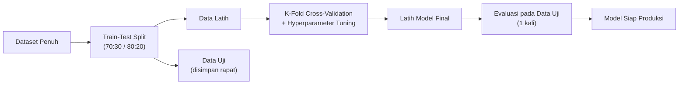
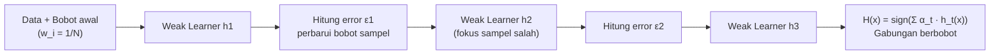

import { Accordion, Accordions } from 'fumadocs-ui/components/accordion';
import { Callout } from 'fumadocs-ui/components/callout';
import { Tab, Tabs } from 'fumadocs-ui/components/tabs';

> **Penyusun Modul & Portal:** Mahendar Dwi Payana  
> **Penulis Materi Pelatihan DTS 2021:** Tim Universitas Gunadarma — Thematic Academy Digital Talent Scholarship 2021  
> **Penyelenggara & Kurikulum:** Kementerian Komunikasi dan Informatika RI (Kominfo) & Sekolah Teknik Elektro dan Informatika (STEI) ITB  
> **Standar Rujukan:** Standar Kompetensi Kerja Nasional Indonesia (SKKNI) No. 299 Tahun 2020 — Skema *Associate Data Scientist*

---

## 1. Landasan Standar Kompetensi Kerja (SKKNI)

Setelah data direkayasa pada Pertemuan 09–10, tibalah tahap **pemodelan** — inti dari sains data. Modul ini menyentuh dua unit kompetensi yang saling melengkapi:

| Kode Unit | Elemen Kompetensi | Kriteria Unjuk Kerja (KUK) Inti |
| :--- | :--- | :--- |
| **J.62DMI00.012.1**<br />*Membangun Skenario Model* | **1. Mengidentifikasi teknik pemodelan** | **1.1** Asumsi-asumsi spesifik mengenai data diidentifikasi sesuai karakteristik data.<br/>**1.2** Teknik-teknik pemodelan data diidentifikasi sesuai karakteristik data dan tujuan teknis. |
| | **2. Menentukan teknik pemodelan** | **2.1** Teknik pemodelan yang sesuai karakteristik data ditentukan.<br/>**2.2** Deskripsi teknik pemodelan yang dipilih didokumentasikan sesuai SOP. |
| | **3. Menyiapkan skenario pengujian** | **3.1** Skenario uji yang mungkin diterapkan ditentukan sesuai tujuan teknis.<br/>**3.2** Metrik evaluasi pengujian diidentifikasi sesuai skenario uji.<br/>**3.3** Skenario uji yang dipilih didokumentasikan sesuai standar. |
| **J.62DMI00.013.1**<br />*Membangun Model* | **1. Menyiapkan parameter model** | **1.1** Parameter yang sesuai dengan model diidentifikasi.<br/>**1.2** Nilai toleransi parameter evaluasi pengujian ditetapkan sesuai tujuan teknis. |
| | **2. Menggunakan tools pemodelan** | **2.1** Tools untuk membuat model diidentifikasi.<br/>**2.2** Algoritma pemodelan dibangun menggunakan tools yang dipilih.<br/>**2.3** Algoritma pemodelan dieksekusi sesuai skenario pengujian.<br/>**2.4** Parameter model dioptimasi untuk menghasilkan nilai evaluasi yang sesuai skenario. |

<Callout type="info" title="Cakupan Praktikum Modul 11">
Modul 11 (Membangun Model dan Studi Kasus) menggunakan **dataset Iris** dengan pembagian data latih 70% dan uji 30%, menerapkan berbagai metode klasifikasi dengan *parameter tuning*, lalu membandingkannya terhadap **algoritma AdaBoost**. Studi kasus kelompok memodelkan **mutu pendidikan (SNP)** sekolah Kabupaten Bogor dengan klasifikasi **dan** regresi.
</Callout>

---

## 2. Skenario Pemodelan (`J.62DMI00.012.1`)

Alur pemodelan yang benar memisahkan data **sebelum** transformasi apa pun, memvalidasi secara silang, lalu menguji satu kali di akhir.



### A. Strategi Pemisahan Data (Data Splitting)

* **Train-Validation–Test Split**:
  * *Train Set*: mempelajari bobot & parameter model.
  * *Validation Set*: memilih model dan mengatur hyperparameter (*tuning*).
  * *Test Set*: disimpan rapat, dievaluasi **satu kali** di akhir sebagai simulasi produksi.
* **Rasio umum**: 70:30, 80:20, atau 60:20:20. Pembagian harus **acak** (`shuffle`) dan **reproduktif** (`random_state`).

```python
from sklearn import datasets
from sklearn.model_selection import train_test_split

# Dataset Iris: 150 sampel, 4 fitur, 3 kelas
iris = datasets.load_iris()
X, y = iris.data, iris.target

# Proporsi 70% latih : 30% uji
X_train, X_test, y_train, y_test = train_test_split(
    X, y, train_size=0.7, random_state=42
)
print("Data latih:", len(X_train), "| Data uji:", len(X_test))
```

### B. Validasi Silang K-Fold (Cross-Validation)

Pada data yang terbatas, satu kali split dapat memberi estimasi performa yang *noisy*. **K-Fold Cross-Validation** membagi data menjadi $K$ lipatan; model dilatih pada $K-1$ lipatan dan diuji pada lipatan tersisa, diulang $K$ kali. Rata-rata skornya menjadi estimasi performa yang lebih stabil.

$$
\text{CV}_{(K)} = \frac{1}{K}\sum_{k=1}^{K} \text{Skor}_k
$$

```python
from sklearn.model_selection import cross_val_score
from sklearn.svm import SVC

model = SVC(kernel='linear', C=1)

# 5-Fold Cross Validation
scores = cross_val_score(model, X, y, cv=5)
print("Akurasi tiap fold  :", scores)
print("Akurasi rata-rata  :", scores.mean())
```

* **Stratified K-Fold**: menjaga proporsi setiap kelas pada tiap lipatan — **wajib** untuk data timpang.
* **Time-Series Split**: untuk data runtun waktu guna mencegah kebocoran masa depan (*future leakage*).

### C. Bahaya Fatal Kebocoran Data (Data Leakage)

> [!CAUTION]
> **Data Leakage**: kondisi di mana informasi dari luar data latih (khususnya data uji atau masa depan) bocor ke dalam proses pelatihan.
>
> *Penyebab umum*: `StandardScaler.fit()`, `SimpleImputer.fit()`, atau SMOTE yang diterapkan pada **seluruh** dataset sebelum pemisahan train/test.
>
> *Solusi*: bungkus pra-pemrosesan dan model ke dalam **Scikit-learn Pipeline** sehingga `fit` hanya terjadi pada data latih.

```python
from sklearn.pipeline import Pipeline
from sklearn.preprocessing import StandardScaler
from sklearn.linear_model import LogisticRegression

# Salah: scaler di-fit pada seluruh data
# scaler = StandardScaler().fit(X)
# X_scaled = scaler.transform(X); lalu split -> LEAKAGE!

# Benar: semua tahap dalam Pipeline
pipe = Pipeline([
    ('scaler', StandardScaler()),
    ('clf', LogisticRegression(max_iter=1000, random_state=42))
])
pipe.fit(X_train, y_train)
print("Akurasi Pipeline:", pipe.score(X_test, y_test))
```

### D. Metrik Evaluasi Skenario Klasifikasi

| Metrik | Formula | Kapan Digunakan |
| :--- | :--- | :--- |
| **Accuracy** | $\frac{TP+TN}{TP+TN+FP+FN}$ | Kelas seimbang |
| **Precision** | $\frac{TP}{TP+FP}$ | Biaya *False Positive* mahal (mis. spam) |
| **Recall** | $\frac{TP}{TP+FN}$ | Biaya *False Negative* mahal (mis. diagnosis penyakit) |
| **F1-Score** | $\frac{2 \cdot P \cdot R}{P + R}$ | Trade-off presisi–recall, data timpang |
| **ROC-AUC** | Area di bawah kurva TPR vs FPR | Perbandingan model lintas ambang |

> Pembahasan mendalam Confusion Matrix, ROC/PR-Curve, dan SHAP ada pada **Pertemuan 15**.

---

## 3. Pembedahan Algoritma Klasifikasi Terawasi (`J.62DMI00.013.1`)

### 3.1 Regresi Logistik (Logistic Regression)

Model linier yang memetakan kombinasi fitur ke probabilitas kelas melalui **Fungsi Sigmoid**:

$$
P(Y=1 \mid X) = \sigma(z) = \frac{1}{1 + e^{-z}}, \qquad z = \beta_0 + \sum_{j=1}^{p} \beta_j X_j
$$

```python
from sklearn.linear_model import LogisticRegression
from sklearn import metrics

lr = LogisticRegression(max_iter=1000, random_state=42)
lr.fit(X_train, y_train)
y_pred = lr.predict(X_test)
print("Akurasi Logistic Regression:", metrics.accuracy_score(y_test, y_pred))
```

### 3.2 Support Vector Machine (SVM)

SVM mencari *hyperplane* optimal yang memaksimalkan **margin** antar-kelas:

$$
\min_{w,b} \frac{1}{2}\lVert w \rVert^2 \quad \text{dengan kendala} \quad y_i(w^T x_i + b) \ge 1
$$

* **Kernel Trick** memproyeksikan data ke ruang berdimensi lebih tinggi agar terpisah linier tanpa menghitung transformasi eksplisit:
  * **Linear**: $K(x_i, x_j) = x_i^T x_j$ — data terpisah linier.
  * **Polynomial**: $K(x_i, x_j) = (x_i^T x_j + c)^d$ — batas keputusan polinomial.
  * **RBF (Gaussian)**: $K(x_i, x_j) = \exp(-\gamma \lVert x_i - x_j \rVert^2)$ — batas non-linier fleksibel.
* **Hyperparameter**: `C` (penalti margin vs galat), `gamma` (jari-jari pengaruh RBF), `degree` (derajat polinomial).

<Tabs items={['Linear', 'Polynomial', 'RBF']}>
  <Tab value="Linear">
```python
from sklearn.svm import SVC

svm_linear = SVC(kernel='linear', C=1)
svm_linear.fit(X_train, y_train)
print("SVM Linear:", svm_linear.score(X_test, y_test))
```
  </Tab>
  <Tab value="Polynomial">
```python
svm_poly = SVC(kernel='poly', C=1, gamma=0.01, degree=2)
svm_poly.fit(X_train, y_train)
print("SVM Polynomial:", svm_poly.score(X_test, y_test))
```
  </Tab>
  <Tab value="RBF">
```python
svm_rbf = SVC(kernel='rbf', C=1, gamma=0.01)
svm_rbf.fit(X_train, y_train)
print("SVM RBF:", svm_rbf.score(X_test, y_test))
```
  </Tab>
</Tabs>

### 3.3 Decision Tree (Pohon Keputusan)

Membelah ruang fitur secara rekursif berbasis kriteria kemurnian (*impurity*):

* **Gini Impurity**:

$$
I_G(p) = 1 - \sum_{i=1}^{C} p_i^2
$$

* **Entropi (Information Gain)**:

$$
H(S) = -\sum_{i=1}^{C} p_i \log_2(p_i)
$$

* **Hyperparameter**: `max_depth` (kedalaman maksimum), `min_samples_split` (minimum sampel untuk membelah node), `min_samples_leaf`.

```python
from sklearn.tree import DecisionTreeClassifier, plot_tree
import matplotlib.pyplot as plt

dt = DecisionTreeClassifier(max_depth=None, min_samples_split=2, random_state=42)
dt.fit(X_train, y_train)
print("Decision Tree:", dt.score(X_test, y_test))

# Visualisasi struktur pohon
plt.figure(figsize=(12, 8))
plot_tree(dt, feature_names=iris.feature_names, class_names=iris.target_names, filled=True)
plt.show()
```

### 3.4 Naive Bayes

Mengasumsikan fitur **saling independen** (naif) dan menerapkan Teorema Bayes:

$$
P(y \mid x_1, \dots, x_n) \propto P(y) \prod_{i=1}^{n} P(x_i \mid y)
$$

Sangat cepat, menjadi *baseline* kuat untuk klasifikasi teks. Varian: `GaussianNB` (fitur kontinu), `MultinomialNB` (hitungan/frekuensi), `BernoulliNB` (biner).

```python
from sklearn.naive_bayes import BernoulliNB

nb = BernoulliNB()
nb.fit(X_train, y_train)
print("Naive Bayes:", nb.score(X_test, y_test))
```

### 3.5 K-Nearest Neighbors (KNN)

Mengklasifikasikan sampel berdasarkan mayoritas $k$ tetangga terdekat (jarak Euclidean):

$$
d(x, x') = \sqrt{\sum_{j=1}^{p} (x_j - x'_j)^2}
$$

* **Hyperparameter**: `n_neighbors` ($k$), `weights` (`uniform` atau `distance`).
* **Penting**: KNN **sangat sensitif skala** → wajib standardisasi (lihat Pertemuan 09).

```python
from sklearn.neighbors import KNeighborsClassifier

knn = KNeighborsClassifier()
knn.fit(X_train, y_train)
print("KNN:", knn.score(X_test, y_test))
```

### 3.6 Random Forest (Ensemble Bagging)

Menggabungkan ratusan pohon keputusan independen. Setiap pohon dilatih pada sampel *bootstrap* dan memilih subset acak fitur pada setiap pemisahan (*feature subspace sampling*). Prediksi akhir = **mayoritas suara**:

$$
\hat{y} = \text{mode}\left(T_1(x), T_2(x), \dots, T_B(x)\right)
$$

### 3.7 Adaptive Boosting (AdaBoost) — Ensemble Boosting

Berbeda dengan Random Forest yang paralel, **Boosting** melatih model **secara sekuensial**. Setiap model lemah (*weak learner*, umumnya *decision stump* berkedalaman 1) berfokus pada sampel yang **salah diklasifikasikan** model sebelumnya.



**Formulasi matematis:**

1. **Error tertimbang** model ke-$t$:
$$
\varepsilon_t = \sum_{i:\, h_t(x_i) \neq y_i} w_i^{(t)}
$$

2. **Bobot kepercayaan** model (semakin kecil error, semakin besar pengaruhnya):
$$
\alpha_t = \frac{1}{2}\ln\left(\frac{1 - \varepsilon_t}{\varepsilon_t}\right)
$$

3. **Pembaruan bobot sampel** (sampel salah → bobot naik):
$$
w_i^{(t+1)} = w_i^{(t)} \cdot \exp\left(-\alpha_t\, y_i\, h_t(x_i)\right), \quad \text{lalu dinormalisasi}
$$

4. **Prediksi akhir**:
$$
H(x) = \text{sign}\left(\sum_{t=1}^{T} \alpha_t\, h_t(x)\right)
$$

```python
from sklearn.ensemble import AdaBoostClassifier
from sklearn import metrics

# n_estimators: jumlah maksimum estimator boosting
# learning_rate: kontribusi tiap classifier per iterasi
ab = AdaBoostClassifier(n_estimators=50, learning_rate=1, random_state=42)
ab.fit(X_train, y_train)

y_pred_ab = ab.predict(X_test)
akurasi_ab = metrics.accuracy_score(y_test, y_pred_ab) * 100
print(f"Akurasi Adaboost: {round(akurasi_ab, 2)}%")
```

> **Parameter Kunci AdaBoost:**
> * `n_estimators` (default 50): jumlah maksimum estimator boosting.
> * `learning_rate` (default 1): bobot yang diterapkan pada setiap classifier tiap iterasi. Nilai lebih besar meningkatkan kontribusi tiap estimator; nilai lebih kecil butuh lebih banyak estimator.

### 3.8 Gradient Boosting & XGBoost

Gradient Boosting juga sekuensial, tetapi setiap pohon baru dilatih memprediksi **pseudo-residual** (gradien kerugian) dari model sebelumnya:

$$
F_m(x) = F_{m-1}(x) + \gamma_m h_m(x)
$$

XGBoost menambahkan regularisasi dan optimasi orde-dua (Hessian) sehingga sering menjadi *state-of-the-art* pada data tabular.

---

## 4. Hyperparameter Tuning dengan GridSearchCV

**GridSearchCV** menguji seluruh kombinasi hyperparameter secara sistematis dengan validasi silang, lalu memilih kombinasi terbaik.

$$
\text{Best Params} = \arg\max_{\theta \in \Theta} \; \text{CV}_{(K)}(\theta)
$$

```python
from sklearn.model_selection import GridSearchCV
from sklearn.neighbors import KNeighborsClassifier

# Ruang pencarian: k = 1..49 dan strategi bobot
k_range = list(range(1, 50))
weight_options = ["uniform", "distance"]
param_grid = dict(n_neighbors=k_range, weights=weight_options)

knn = KNeighborsClassifier()
grid = GridSearchCV(knn, param_grid, cv=10, scoring='accuracy')
grid.fit(X_train, y_train)

print("Akurasi terbaik KNN :", grid.best_score_)
print("Parameter terbaik   :", grid.best_params_)
print("Estimator terbaik   :", grid.best_estimator_)
```

> **Alternatif**: `RandomizedSearchCV` (sampling acak ruang parameter, lebih cepat) dan `HalvingGridSearchCV` (eliminasi progresif).

---

## 5. Praktikum Lab 11-1: Komparasi 5 Algoritma pada Dataset Iris

Dataset Iris: 150 sampel, 3 kelas (Setosa, Versicolor, Virginica), 4 fitur (panjang/lebar sepal & petal dalam cm).

```python
"""
Komparasi Algoritma Klasifikasi & Eksekusi Skenario Pengujian
Sumber praktikum: Modul 11 - Membangun Model (DTS 2021)
Disusun ulang oleh: Mahendar Dwi Payana
"""
from sklearn import datasets, metrics
from sklearn.model_selection import train_test_split, cross_val_score
from sklearn.pipeline import Pipeline
from sklearn.preprocessing import StandardScaler
from sklearn.linear_model import LogisticRegression
from sklearn.svm import SVC
from sklearn.tree import DecisionTreeClassifier
from sklearn.naive_bayes import BernoulliNB
from sklearn.neighbors import KNeighborsClassifier

iris = datasets.load_iris()
X, y = iris.data, iris.target

X_train, X_test, y_train, y_test = train_test_split(
    X, y, train_size=0.7, random_state=42
)

models = {
    "Logistic Regression": LogisticRegression(max_iter=1000, random_state=42),
    "SVM Linear":          SVC(kernel='linear', C=1),
    "SVM Polynomial":      SVC(kernel='poly', C=1, gamma=0.01, degree=2),
    "SVM RBF":             SVC(kernel='rbf', C=1, gamma=0.01),
    "Decision Tree":       DecisionTreeClassifier(max_depth=None, min_samples_split=2, random_state=42),
    "Naive Bayes":         BernoulliNB(),
    "KNN":                 KNeighborsClassifier(),
}

hasil = []
for nama, model in models.items():
    pipe = Pipeline([('scaler', StandardScaler()), ('clf', model)])
    pipe.fit(X_train, y_train)
    y_pred = pipe.predict(X_test)
    acc = metrics.accuracy_score(y_test, y_pred)
    cv = cross_val_score(pipe, X, y, cv=5).mean()
    hasil.append({"Algoritma": nama, "Akurasi Uji": round(acc, 4), "CV-5": round(cv, 4)})
    print(f"{nama:<20} : Akurasi = {acc:.4f} | CV-5 = {cv:.4f}")
```

> **Catatan Praktikum:** `BernoulliNB` pada Iris awalnya cocok untuk fitur biner; pada fitur kontinu hasilnya bisa lebih rendah dibanding model lain. Untuk data kontinu, `GaussianNB` biasanya lebih tepat. Selalu bandingkan pada **data uji yang sama** agar perbandingan adil.

---

## 6. Praktikum Lab 11-2: AdaBoost vs. Baseline (Tugas Modul 11)

Sesuai **Rincian Tugas Modul 11**: gunakan dataset Iris, bagi 70% latih / 30% uji, lakukan parameter tuning, lalu bandingkan performa dengan **AdaBoost**.

```python
from sklearn.ensemble import AdaBoostClassifier
from sklearn import metrics

# Baseline terbaik dari Lab 11-1 (mis. SVM)
svm = SVC(kernel='rbf', C=1, gamma=0.01)
svm.fit(X_train, y_train)
acc_svm = metrics.accuracy_score(y_test, svm.predict(X_test))
print(f"Akurasi SVM RBF : {acc_svm:.4f}")

# AdaBoost
abc = AdaBoostClassifier(n_estimators=50, learning_rate=1, random_state=42)
abc.fit(X_train, y_train)
acc_ab = metrics.accuracy_score(y_test, abc.predict(X_test))
print(f"Akurasi AdaBoost: {acc_ab:.4f}")
```

> **Hasil Referensi (Notebook Tugas Modul 11):** SVM dengan hyperparameter yang tepat mencapai akurasi **97,78%**, sedangkan AdaBoost mencapai **95,56%**. Temuan ini menegaskan bahwa **boosting tidak otomatis mengalahkan model tunggal** — performa bergantung pada karakteristik data. Pada dataset kecil yang relatif mudah dipisahkan seperti Iris, SVM kernel RBF sangat kuat, sedangkan AdaBoost unggul ketika *weak learner* (stump) dapat mengeksploitasi struktur non-linier yang kompleks.
>
> **Catatan Metodologis:** Karena dataset Iris sangat kecil (150 baris), selisih 1–2 sampel dapat menggeser akurasi beberapa persen. Gunakan **K-Fold Cross-Validation** daripada satu kali split untuk perbandingan yang lebih andal.

---

## 7. Studi Kasus: Klasifikasi & Regresi Mutu Pendidikan (SNP)

Studi kasus kelompok (UGM03) memodelkan **Standar Nasional Pendidikan (SNP)** sekolah SMP di Kabupaten Bogor dari data Dapodik (hasil integrasi Pertemuan 10). Delapan standar (S1–S8) dianalisis untuk memprediksi level SNP.

### A. Pelabelan Target (Labeling, SKKNI `010.1`)

Nilai SNP = rata-rata delapan standar, lalu dikelompokkan menjadi level ordinal:

```python
# SNP = rata-rata S1..S8
dt_pmp['SNP'] = dt_pmp[['S1','S2','S3','S4','S5','S6','S7','S8']].mean(axis=1)

def level_snp(hitung):
    rerata = round(hitung, 2)
    if   1.00 <= rerata <= 2.04: return 'SNP_1'
    elif 2.05 <= rerata <= 3.70: return 'SNP_2'
    elif 3.71 <= rerata <= 5.06: return 'SNP_3'
    elif 5.07 <= rerata <= 6.66: return 'SNP_4'
    else:                        return 'SNP'

dt_pmp['level'] = dt_pmp.apply(lambda x: level_snp(x['SNP']), axis=1)
```

### B. Penanganan Ketimpangan Kelas

Kelas `SNP_3` dan `SNP_4` jauh lebih sedikit. Solusi: menambahkan data PMP tahun sebelumnya **hanya untuk kelas minoritas** (`SNP_3`), lalu menyelaraskan label menjadi biner (`SNP_3` → 0, `SNP_4` → 1).

```python
def label_snp(level):
    if level == 'SNP_3':   return 0
    elif level == 'SNP_4': return 1

dt_pmp = dt_pmp.append(
    dt_pmp_2018[dt_pmp_2018['level'] == 'SNP_3'], ignore_index=True
)
dt_pmp['level'] = dt_pmp.apply(lambda x: label_snp(x['level']), axis=1)
```

### C. Seleksi Fitur via Korelasi & Density Plot

Korelasi (kriteria **Guilford, 1956**) dan *density plot* per kelas menentukan fitur paling diskriminatif:

| Kriteria Guilford | Koefisien $r$ |
| :--- | :--- |
| Hubungan sangat kuat | 0,80 – 1,00 |
| Hubungan kuat | 0,60 – 0,79 |
| Cukup berarti | 0,40 – 0,59 |
| Rendah | 0,20 – 0,39 |
| Rendah sekali | 0,00 – 0,19 |

```python
import seaborn as sn
import matplotlib.pyplot as plt
from pylab import rcParams

def plot_correlation(data):
    rcParams['figure.figsize'] = 15, 20
    sn.heatmap(data[['S1','S2','S3','S4','S5','S6','S7','S8','level']].corr(),
               annot=True, fmt=".2f")
    plt.show()

plot_correlation(dt_pmp)
```

> **Temuan:** Fitur paling prediktif adalah **S5 (Standar PTK, $r=0.95$)** dan **S6 (Standar Sarpras, $r=0.94$)**, disusul S3 (0,60) dan S7 (0,69). Interpretasi itu dikonfirmasi *density plot*: kurva kelas 0 dan 1 hampir berhimpit pada S2, tetapi terpisah jelas pada S5.

### D. Pemodelan Klasifikasi & Evaluasi

```python
from sklearn.model_selection import train_test_split
from sklearn.preprocessing import StandardScaler
from sklearn.neighbors import KNeighborsClassifier
from sklearn.metrics import accuracy_score
from sklearn.ensemble import AdaBoostClassifier
from sklearn import metrics

# Hanya 4 fitur terpilih
X = dt_pmp[['S3', 'S5', 'S6', 'S7']]
y = dt_pmp['level']

X_train, X_test, y_train, y_test = train_test_split(X, y, train_size=0.7, random_state=42)
scaler = StandardScaler()
X_train = scaler.fit_transform(X_train)
X_test = scaler.transform(X_test)

# KNN + GridSearchCV (parameter tuning)
knn = KNeighborsClassifier()
grid = GridSearchCV(knn, dict(n_neighbors=list(range(1, 50)),
                              weights=["uniform", "distance"]),
                    cv=10, scoring='accuracy')
grid.fit(X_train, y_train)
print("KNN terbaik:", grid.best_score_, grid.best_params_)

# AdaBoost sebagai pembanding
ab = AdaBoostClassifier(n_estimators=50, learning_rate=1, random_state=42)
ab.fit(X_train, y_train)
print("Akurasi AdaBoost:", accuracy_score(y_test, ab.predict(X_test)))
```

> **Kesimpulan Studi Kasus:** Model **KNN** terbaik memperoleh akurasi tertinggi untuk mengklasifikasikan level SNP berdasarkan fitur S3, S5, S6, dan S7.

### E. Pemodelan Regresi (Pelengkap — dibahas tuntas di Pertemuan 12)

Studi kasus juga memodelkan nilai kontinu **SNP** sebagai target regresi berganda:

```python
import numpy as np
from sklearn import linear_model
from sklearn.metrics import r2_score

msk = np.random.rand(len(dt_pmp)) < 0.8
train_reg, test_reg = dt_pmp[msk], dt_pmp[~msk]

regr = linear_model.LinearRegression()
regr.fit(np.asanyarray(train_reg[['S3','S5','S6','S7']]),
         np.asanyarray(train_reg[['SNP']]))

print("Coefficients:", regr.coef_, "| Intercept:", regr.intercept_)

test_y = np.asanyarray(test_reg[['SNP']])
test_y_ = regr.predict(np.asanyarray(test_reg[['S3','S5','S6','S7']]))
print("MAE   : %.2f" % np.mean(np.absolute(test_y_ - test_y)))
print("MSE   : %.2f" % np.mean((test_y_ - test_y) ** 2))
print("R2    : %.2f" % r2_score(test_y_, test_y))
```

Persamaan regresi jamak yang diperoleh:
$$
\text{SNP} = 1.000 + 0.158\,S_3 + 0.146\,S_5 + 0.225\,S_6 + \dots
$$

---

## 8. Ringkasan Komparasi Model

| Algoritma | Asumsi Kunci | Sensitif Skala? | Kekuatan | Kelemahan |
| :--- | :--- | :---: | :--- | :--- |
| **Logistic Regression** | Relasi linier log-odds | Ya | Cepat, koefisien interpretabel | Kurang menangkap non-linier |
| **SVM** | Margin maksimum | Ya | Efektif dimensi tinggi (kernel) | Lambat pada data besar; tuning `C`,`gamma` penting |
| **Decision Tree** | Rekursif pemisahan | Tidak | Interpretabel, tanpa asumsi | Mudah overfitting |
| **Naive Bayes** | Independensi fitur | Tidak | Sangat cepat, baseline teks | Asumsi independensi sering dilanggar |
| **KNN** | Kedekatan lokal | **Sangat** | Sederhana, non-parametrik | Lambat prediksi; kutukan dimensi |
| **Random Forest** | Bagging pohon | Tidak | Robust, akurasi tinggi | Kurang interpretabel |
| **AdaBoost** | Boosting sekuensial | Tidak | Fokus pada sampel sulit | Sensitif outlier & noise |
| **XGBoost** | Boosting + regularisasi | Tidak | SOTA tabular | Banyak hyperparameter |

---

## 9. Lembar Evaluasi & Tugas Praktikum Mandiri

<Accordions>
  <Accordion title="Tugas 1: Komparasi Algoritma & Parameter Tuning (KUK 013.1)">
    Gunakan dataset Iris dengan split 70:30. Latih minimal **lima** algoritma klasifikasi (Logistic Regression, SVM, Decision Tree, Naive Bayes, KNN) dengan `Pipeline` + `StandardScaler`. Lakukan `GridSearchCV` untuk masing-masing. Sajikan tabel akurasi uji, akurasi CV-5, dan hyperparameter terbaik. Simpulkan algoritma mana yang terbaik dan mengapa!
  </Accordion>

  <Accordion title="Tugas 2: Implementasi & Analisis AdaBoost (Tugas Resmi Modul 11)">
    Terapkan `AdaBoostClassifier` pada dataset Iris dan bandingkan terhadap metode klasifikasi terbaik dari Tugas 1. Eksperimen dengan `n_estimators` (10, 50, 100) dan `learning_rate` (0,1; 0,5; 1,0). Plot kurva akurasi terhadap jumlah estimator dan jelaskan mengapa boosting tidak selalu mengalahkan model tunggal pada dataset kecil!
  </Accordion>

  <Accordion title="Tugas 3: Demonstrasi Bahaya Data Leakage (KUK 012.1)">
    Buat dua skenario: (a) `StandardScaler` di-fit pada **seluruh** dataset sebelum `train_test_split`, dan (b) scaler di dalam `Pipeline`. Bandingkan akurasi keduanya pada data uji yang sama. Jelaskan mengapa skenario (a) menghasilkan estimasi yang terlalu optimistis (*falsely optimistic*)!
  </Accordion>

  <Accordion title="Tugas 4: Perancangan Skenario Pengujian Formal (KUK 012.1 Elemen 3)">
    Untuk dataset proyek akhir (Capstone) Anda, susun dokumen skenario pengujian yang memuat: (1) asumsi spesifik data, (2) teknik pemodelan yang dipilih beserta justifikasi, (3) strategi validasi (Stratified K-Fold vs Time-Series Split), (4) metrik evaluasi utama dan ambang toleransinya, serta (5) protokol pencegahan kebocoran data. Dokumentasikan sesuai SOP!
  </Accordion>
</Accordions>

---

## 10. Referensi Pustaka & Tautan Resmi

1. **Tim Universitas Gunadarma** (2021). *Modul 11 — Membangun Model dan Studi Kasus*. Thematic Academy Digital Talent Scholarship 2021, Kementerian Komunikasi dan Informatika RI.
2. **Kementerian Ketenagakerjaan RI** (2020). *SKKNI No. 299 Tahun 2020 Bidang Artificial Intelligence Subbidang Data Science* (Unit `J.62DMI00.012.1` Membangun Skenario Model & `J.62DMI00.013.1` Membangun Model).
3. **Ronald A. Fisher** (1936). *The Use of Multiple Measurements in Taxonomic Problems*. Annals of Eugenics, 7(2), 179–188. *(Dataset Iris)*.
4. **Corinna Cortes & Vladimir Vapnik** (1995). *Support-Vector Networks*. Machine Learning, 20(3), 273–297. *(SVM & Kernel Trick)*.
5. **Yoav Freund & Robert E. Schapire** (1997). *A Decision-Theoretic Generalization of On-Line Learning and an Application to Boosting*. Journal of Computer and System Sciences, 55(1), 119–139. *(Algoritma AdaBoost)*.
6. **J. P. Guilford** (1956). *Fundamental Statistics in Psychology and Education* (3rd ed.). McGraw-Hill. *(Kriteria interpretasi koefisien korelasi)*.
7. **F. Pedregosa et al.** (2011). *Scikit-learn: Machine Learning in Python*. Journal of Machine Learning Research, 12, 2825–2830.
8. **Scikit-learn Developers**. *Supervised Learning & Model Selection*. [scikit-learn.org](https://scikit-learn.org/stable/supervised_learning.html).
