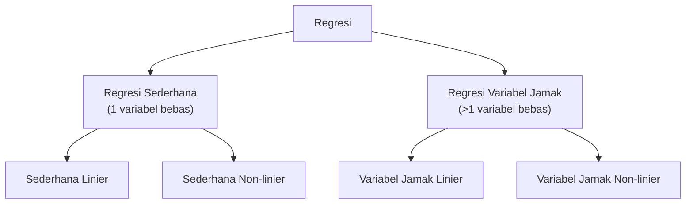

import { Accordion, Accordions } from 'fumadocs-ui/components/accordion';
import { Callout } from 'fumadocs-ui/components/callout';
import { Tab, Tabs } from 'fumadocs-ui/components/tabs';

> **Penyusun Modul & Portal:** Mahendar Dwi Payana  
> **Penulis Materi Pelatihan DTS 2021:** Noor Akhmad Setiawan, S.T., M.T., Ph.D. — Thematic Academy Digital Talent Scholarship 2021  
> **Penyelenggara & Kurikulum:** Kementerian Komunikasi dan Informatika RI (Kominfo) & Sekolah Teknik Elektro dan Informatika (STEI) ITB  
> **Standar Rujukan:** Standar Kompetensi Kerja Nasional Indonesia (SKKNI) No. 299 Tahun 2020 — Skema *Associate Data Scientist*

---

## 1. Landasan Standar Kompetensi Kerja (SKKNI)

Modul ini adalah **bagian kedua dari pemodelan** (lanjutan Pertemuan 11) yang berfokus pada target **kontinu** (regresi). Unit yang dinilai:

| Kode Unit | Elemen Kompetensi | Kriteria Unjuk Kerja (KUK) Inti |
| :--- | :--- | :--- |
| **J.62DMI00.013.1**<br />*Membangun Model* | **1. Menyiapkan parameter model** | **1.1** Parameter yang sesuai dengan model diidentifikasi.<br/>**1.2** Nilai toleransi parameter evaluasi pengujian ditetapkan sesuai tujuan teknis. |
| | **2. Menggunakan tools pemodelan** | **2.1** Tools untuk membuat model diidentifikasi.<br/>**2.2** Algoritma pemodelan dibangun menggunakan tools yang dipilih.<br/>**2.3** Algoritma pemodelan dieksekusi sesuai skenario pengujian.<br/>**2.4** Parameter model dioptimasi untuk menghasilkan nilai evaluasi yang sesuai skenario. |

**Tujuan Pembelajaran** — peserta mampu menjelaskan, menyiapkan, dan mengimplementasikan model regresi dengan algoritma:

1. Regresi Linier sederhana dan variabel jamak
2. Regresi Polinomial dan Non-linier
3. Support Vector Regression (SVR)
4. Decision Tree Regression (DTR)
5. Random Forest Regression (RFR)

Beserta pengukuran performansinya menggunakan **Python** dan **Scikit-learn**.

<Callout type="info" title="Dataset Praktikum Modul 12">
Seluruh lab modul memakai dua dataset yang tersedia di portal:
1. **`FuelConsumption.csv`** — [Unduh](https://mahendartea.github.io/Learn-AI/data/FuelConsumption.csv) *(1067 mobil ringan Kanada; EngineSize → CO₂ Emission)*
2. **`china_gdp.csv`** — [Unduh](https://mahendartea.github.io/Learn-AI/data/china_gdp.csv) *(PDB Tiongkok 1960–2014; regresi non-linier)*
</Callout>

---

## 2. Pengertian & Tipologi Regresi

### A. Definisi

> **Regresi** adalah proses **memprediksi nilai kontinu** dari variabel tak bebas (*dependent*) berdasarkan nilai-nilai variabel bebas (*predictor*).

Contoh: memprediksi nilai kontinu `CO2EMISSIONS` berdasarkan `ENGINESIZE`, `CYLINDERS`, dan `FUELCONSUMPTION`. **Model regresi** adalah hasil proses penentuan parameter yang mampu memprediksi variabel tak bebas secara akurat.

### B. Tipe Model Regresi



### C. Aplikasi Regresi

* Prakiraan penjualan produk
* Analisis kepuasan
* Estimasi harga
* Pendapatan pekerjaan, dan lain-lain

### D. Algoritma-Algoritma Regresi

Linier Regression, Polynomial Regression, Support Vector Regression, Decision Tree Regression, Random Forest Regression, LASSO Regression, ANN Regression, K-NN Regression, dan lain-lain.

---

## 3. Regresi Linier Sederhana

Model dengan satu variabel bebas:

$$
y = \theta_0 + \theta_1 x
$$

Di mana $\theta_0$ = *intercept* dan $\theta_1$ = *slope* (gradien). Garis regresi disesuaikan untuk **meminimalkan jumlah kuadrat sisa (residu)** antara nilai prediksi dan nilai aktual.

### A. MSE Sebagai Fungsi Kerugian (*Loss Function*)

Untuk menghindari saling menegasikan antara error positif dan negatif, digunakan **Mean Squared Error (MSE)**:

$$
\text{MSE}(\theta_0, \theta_1) = \frac{1}{n}\sum_{i=1}^{n} \left(y_i - \hat{y}_i\right)^2
$$

### B. Estimasi Parameter (Least Squares)

Parameter terbaik dicari dengan metode **Least Squares**, yang menghasilkan solusi analitik (*persamaan normal*):

$$
\hat{\boldsymbol{\theta}} = (\mathbf{X}^T \mathbf{X})^{-1} \mathbf{X}^T \mathbf{y}
$$

### C. Kelebihan Regresi Linier

| Keunggulan | Penjelasan |
| :--- | :--- |
| **Ringan** | Komputasi sederhana |
| **Tanpa tuning parameter** | Parameter langsung dihitung dari data |
| **Mudah diinterpretasikan** | Pengaruh tiap variabel bebas tampak jelas dari koefisien |

### D. Lab: `EngineSize` → `CO2EMISSIONS`

```python
import numpy as np
import pandas as pd
import matplotlib.pyplot as plt
from sklearn import linear_model
from sklearn.metrics import r2_score

BASE = "https://mahendartea.github.io/Learn-AI/data"
df = pd.read_csv(f"{BASE}/FuelConsumption.csv")

# Eksplorasi
cdf = df[['ENGINESIZE', 'CYLINDERS', 'FUELCONSUMPTION_COMB', 'CO2EMISSIONS']]
cdf.hist()
plt.show()

plt.scatter(cdf.ENGINESIZE, cdf.CO2EMISSIONS, color='blue')
plt.xlabel("Engine size")
plt.ylabel("Emission")
plt.show()

# Split data latih/uji (80:20)
msk = np.random.rand(len(df)) < 0.8
train, test = cdf[msk], cdf[~msk]

# Pemodelan
regr = linear_model.LinearRegression()
train_x = np.asanyarray(train[['ENGINESIZE']])
train_y = np.asanyarray(train[['CO2EMISSIONS']])
regr.fit(train_x, train_y)

print("Coefficients:", regr.coef_)
print("Intercept   :", regr.intercept_)

# Plot garis regresi
plt.scatter(train.ENGINESIZE, train.CO2EMISSIONS, color='blue')
plt.plot(train_x, regr.coef_[0][0] * train_x + regr.intercept_[0], '-r')
plt.xlabel("Engine size")
plt.ylabel("Emission")
plt.show()

# Evaluasi
test_x = np.asanyarray(test[['ENGINESIZE']])
test_y = np.asanyarray(test[['CO2EMISSIONS']])
test_y_ = regr.predict(test_x)
print("MAE     : %.2f" % np.mean(np.absolute(test_y_ - test_y)))
print("MSE     : %.2f" % np.mean((test_y_ - test_y) ** 2))
print("R2-score: %.2f" % r2_score(test_y_, test_y))
```

---

## 4. Regresi Linier Variabel Jamak (Multiple Linear Regression)

Sesuai namanya, model menggunakan **lebih dari satu** variabel bebas:

$$
y_i = \beta_0 + \beta_1 x_{i1} + \beta_2 x_{i2} + \dots + \beta_p x_{ip} + \epsilon_i
$$

Dalam notasi matriks:

$$
\mathbf{y} = \mathbf{X}\boldsymbol{\beta} + \boldsymbol{\epsilon}
$$

**Contoh penerapan:**

* **Efektivitas variabel bebas:** Apakah kegelisahan, kehadiran dosen, dan jenis kelamin berpengaruh pada kinerja ujian mahasiswa?
* **Prediksi dampak perubahan:** Seberapa besar kenaikan tekanan darah terhadap kenaikan BMI pasien?

### A. Estimasi Parameter: Least Squares vs. Gradient Descent

| Metode | Karakteristik | Cocok Untuk |
| :--- | :--- | :--- |
| **Least Squares** | Operasi aljabar linier (persamaan normal) | Dataset kecil–sedang |
| **Algoritma Optimisasi** | Gradient Descent | Dataset **sangat besar** (> 10.000 baris) |

> **Mengapa?** Menghitung $(X^TX)^{-1}$ secara langsung memerlukan waktu lama untuk dataset besar, sehingga Gradient Descent lebih efisien.

### B. Lab: Tiga Prediktor → `CO2EMISSIONS`

```python
from sklearn import linear_model
import numpy as np

msk = np.random.rand(len(df)) < 0.8
train, test = cdf[msk], cdf[~msk]

regr = linear_model.LinearRegression()
train_x = np.asanyarray(train[['ENGINESIZE', 'CYLINDERS', 'FUELCONSUMPTION_COMB']])
train_y = np.asanyarray(train[['CO2EMISSIONS']])
regr.fit(train_x, train_y)

print("Coefficients:", regr.coef_)
print("Intercept   :", regr.intercept_)

# Prediksi EngineSize=2.4, Cylinders=4, FuelConsumption=9.2
pred = regr.predict(np.array([[2.4, 4, 9.2]]))
print("Prediksi CO2:", pred)
```

---

## 5. Asumsi Klasik Gauss-Markov (Diagnostik Kelayakan Model)

Agar estimator OLS menjadi **BLUE (*Best Linear Unbiased Estimator*)**, model linier wajib memenuhi lima asumsi klasik:

1. **Linearitas**: hubungan fitur dan target bersifat linier.
2. **Bebas Multikolinearitas**: antar-prediktor tidak berkorelasi sempurna. Diuji via **VIF**:

$$
\text{VIF}_j = \frac{1}{1 - R_j^2} \qquad (\text{VIF} > 5 \text{ atau } 10 = \text{multikolinearitas parah})
$$

3. **Homoskedastisitas**: varians residual konstan: $\text{Var}(\epsilon_i \mid \mathbf{X}) = \sigma^2$. Pola corong pada plot residual menandakan heteroskedastisitas.
4. **Independensi Galat**: $\text{Cov}(\epsilon_i, \epsilon_j) = 0$, diuji via **Durbin-Watson** ($1.5 \le d \le 2.5$).
5. **Normalitas Residual**: distribusi residual mendekati Gaussian (periksa *Q-Q Plot*).

```python
# Contoh diagnostik residual sederhana
y_pred = regr.predict(train_x)
residual = train_y.ravel() - y_pred.ravel()

import matplotlib.pyplot as plt
plt.scatter(y_pred, residual, color='blue')
plt.axhline(y=0, color='r', linestyle='--')
plt.xlabel("Nilai Prediksi")
plt.ylabel("Residual")
plt.title("Plot Residual (cek Homoskedastisitas)")
plt.show()
```

---

## 6. Regresi Polinomial & Non-Linier

### A. Mengapa Regresi Non-Linier Diperlukan?

Tidak setiap data menunjukkan hubungan linier. Jika dipaksakan dengan model linier, **error menjadi besar**; model non-linier memberi error lebih kecil. Tipe kurva dasar: **linier**, **kuadratik/parabolik**, dan **kubik**.

### B. Regresi Polinomial

Data berbentuk kurva dapat dimodelkan dengan polinomial derajat $k$:

$$
y = a x^3 + b x^2 + c x + d
$$

Model polinomial dapat **ditransformasikan** menjadi model regresi linier variabel jamak (dengan mendefinisikan $x_2 = x^2$, $x_3 = x^3$, dst.) sehingga tetap dapat diselesaikan dengan **Least Squares**.

### C. Bentuk Fungsi Non-Linier

| Jenis | Bentuk | Persamaan |
| :--- | :--- | :--- |
| **Kuadratik** | parabola | $Y = X^2$ |
| **Eksponensial** | pertumbuhan cepat | $Y = a + b\,c^{X}$ |
| **Logaritmik** | pertumbuhan melambat | $Y = \log(X)$ |
| **Sigmoid/Logistik** | kurva-S | $Y = a + \dfrac{b}{1 + c^{(X-d)}}$ |

Regresi non-linier memodelkan hubungan di mana $\hat{y}$ adalah **fungsi non-linier dari parameter $\theta$ dan fitur $x$** (mis. $y = \log(a x^3 + b x^2 + c x + d)$).

### D. Linier atau Non-Linier?

* **Penentuan:** pengamatan visual data (visualisasi) dan akurasi hasil pemodelan.
* **Bila indikasi non-linier:** gunakan regresi polinomial, regresi non-linier, atau transformasi data non-linier menjadi linier.

### E. Lab: Regresi Non-Linier PDB Tiongkok (`china_gdp.csv`)

Data PDB Tiongkok 1960–2014 berbentuk kurva-S → didekati dengan **fungsi logistik** memakai `curve_fit` (least squares non-linier):

$$
\hat{Y} = \frac{1}{1 + e^{\beta_1(X - \beta_2)}}
$$

$\beta_1$ mengontrol kecuraman kurva; $\beta_2$ menggeser kurva pada sumbu $X$.

```python
import numpy as np
import pandas as pd
import matplotlib.pyplot as plt
from scipy.optimize import curve_fit
from sklearn.metrics import r2_score

df = pd.read_csv("https://mahendartea.github.io/Learn-AI/data/china_gdp.csv")
x_data, y_data = df["Year"].values, df["Value"].values

# Normalisasi
xdata = x_data / max(x_data)
ydata = y_data / max(y_data)

def sigmoid(x, Beta_1, Beta_2):
    return 1 / (1 + np.exp(-Beta_1 * (x - Beta_2)))

# Optimasi parameter dengan least squares non-linier
popt, pcov = curve_fit(sigmoid, xdata, ydata)
print("beta_1 = %f, beta_2 = %f" % (popt[0], popt[1]))

# Visualisasi
x = np.linspace(1960, 2015, 55) / max(x_data)
plt.figure(figsize=(8, 5))
plt.plot(xdata, ydata, 'ro', label='data')
plt.plot(x, sigmoid(x, *popt), linewidth=3.0, label='fit')
plt.legend(loc='best')
plt.ylabel('GDP')
plt.xlabel('Year')
plt.show()
```

---

## 7. Support Vector Regression (SVR)

SVR memberi fleksibilitas menentukan **seberapa besar kesalahan yang dapat diterima** (*ε-tube*) dan menemukan garis/hyperplane yang sesuai. Berbeda dengan Least Squares, fungsi tujuan SVR adalah **meminimalkan koefisien** (khususnya $l_2$-norm vektor koefisien), **bukan** squared error.

**Masalah optimasi SVR:**

$$
\text{Minimize} \quad \frac{1}{2}\lVert w \rVert^2 \qquad \text{subject to} \quad |y_i - (w^T x_i + b)| \le \epsilon
$$

**Dengan *slack variable*** (untuk toleransi error di luar ε-tube):

$$
\text{Minimize} \quad \frac{1}{2}\lVert w \rVert^2 + C\sum_{i=1}^{n}(\xi_i + \xi_i^*)
$$

**Efek parameter C:** $C$ mengontrol trade-off antara margin yang lebar dan kesalahan yang kecil. Contoh pada *Boston Housing* ($\epsilon=5$): $C=1.0$ vs $C=6.13$ (hasil pencarian **GridSearch for C**) menghasilkan kurva fitting berbeda.

```python
from sklearn.svm import SVR
from sklearn.preprocessing import StandardScaler
from sklearn.model_selection import train_test_split

X = cdf.iloc[:, 0].values.reshape(-1, 1)   # EngineSize
y = cdf.iloc[:, 3].values.reshape(-1, 1)   # CO2EMISSIONS

X_train, X_test, y_train, y_test = train_test_split(X, y, test_size=0.2, random_state=0)

sc_X, sc_y = StandardScaler(), StandardScaler()
X_train = sc_X.fit_transform(X_train)
y_train = sc_y.fit_transform(y_train)

regressor = SVR(kernel='linear')
regressor.fit(X_train, y_train)

# Prediksi EngineSize = 5.4
y_pred = sc_y.inverse_transform(regressor.predict(sc_X.transform(np.array([[5.4]]))))
print(y_pred)
```

> **Catatan:** Skalakan fitur & target sebelum SVR — SVR sangat sensitif terhadap skala.

---

## 8. Decision Tree Regression (DTR)

DTR membangun model regresi berbentuk **struktur pohon**: dataset dipecah menjadi subset yang makin kecil sambil pohon keputusan dikembangkan bertahap. Titik data melewati seluruh pohon dengan menjawab pertanyaan Benar/Salah hingga mencapai **simpul daun (*leaf*)**. Prediksi akhir = **rata-rata nilai variabel dependen** pada leaf tersebut.

```python
from sklearn.tree import DecisionTreeRegressor
from sklearn.tree import export_graphviz

regressor = DecisionTreeRegressor()
regressor.fit(X_train, y_train)

# Visualisasi hasil (nilai terskala)
import numpy as np, matplotlib.pyplot as plt
X_grid = np.arange(min(X_train), max(X_train), 0.01).reshape(-1, 1)
plt.scatter(X_train, y_train, color='blue')
plt.plot(X_grid, regressor.predict(X_grid), color='red')
plt.title('Emission Dataset')
plt.show()

# Visualisasi struktur pohon (butuh graphviz)
dot_data = export_graphviz(regressor, out_file=None, feature_names=['Engine Size'], filled=True)
# graphviz.Source(dot_data, format="png")
```

> **Karakter DTR:** mendukung non-linearitas, menangani kolinearitas lebih baik daripada regresi linier, dan cocok untuk variabel kategorikal. Namun **rawan overfitting** bila kedalaman dibiarkan tak terbatas.

---

## 9. Random Forest Regression (RFR)

Satu pohon sering tidak cukup mempelajari fitur. **Random Forest** adalah kumpulan (*forest*) pohon keputusan yang **dibuat secara acak**, lalu keputusan diambil melalui **rata-rata** (regresi) atau **voting** (klasifikasi). RFR mengatasi kelemahan utama DTR, yaitu *overfitting*, dan lebih **robust serta akurat**.

```python
from sklearn.ensemble import RandomForestRegressor

regressor = RandomForestRegressor(n_estimators=100, random_state=42)
regressor.fit(X_train, y_train)

y_pred = sc_y.inverse_transform(regressor.predict(sc_X.transform(np.array([[5.4]]))))
print(y_pred)
```

---

## 10. Metrik Evaluasi Regresi

**Error** mengukur sejauh mana data aktual menyimpang dari garis regresi yang dicocokkan. Berbagai metrik error dan kecocokan:

| Metrik | Formula | Interpretasi |
| :--- | :--- | :--- |
| **MAE** | $\frac{1}{n}\sum_{i=1}^{n} \lvert y_i - \hat{y}_i \rvert$ | Rata-rata error absolut; paling mudah dipahami |
| **MSE** | $\frac{1}{n}\sum_{i=1}^{n} (y_i - \hat{y}_i)^2$ | Memberi penalti lebih pada error besar |
| **RMSE** | $\sqrt{\text{MSE}}$ | MSE dalam satuan variabel target |
| **RAE / RSE** | — | Error relatif terhadap baseline |
| **R²** | $1 - \dfrac{SS_{\text{res}}}{SS_{\text{tot}}}$ | Proporsi varians yang dijelaskan model; terbaik = 1,0 (dapat negatif) |

```python
from sklearn.metrics import r2_score

test_x = np.asanyarray(cdf[['ENGINESIZE']])
test_y = np.asanyarray(cdf[['CO2EMISSIONS']])
test_y_ = sc_y.inverse_transform(regressor.predict(sc_X.transform(test_x)))

print("MAE     : %.2f" % np.mean(np.absolute(test_y_ - test_y)))
print("MSE     : %.2f" % np.mean((test_y_ - test_y) ** 2))
print("R2-score: %.2f" % r2_score(test_y_, test_y))
```

---

## 11. Perbandingan Algoritma Regresi

### A. Regresi Linier (RL) vs. DTR

* DTR mendukung **non-linearitas**, sedangkan RL hanya solusi linier.
* Banyak fitur + data sedikit (noise rendah) → **RL dapat mengungguli** DTR/RFR.
* Untuk variabel bebas **kategorikal**, DTR lebih baik daripada RL.
* DTR menangani **kolinearitas** lebih baik daripada RL.

### B. Regresi Linier vs. SVR

* SVR mendukung solusi **linier dan non-linier** melalui *kernel trick*.
* SVR menangani **outlier** lebih baik daripada RL.
* Keduanya berkinerja baik saat data latih sedikit dan fitur banyak.

### C. DTR vs. RFR

* RFR adalah kumpulan DTR; keluaran = rata-rata/voting dari forest.
* RFR **kurang rentan overfitting** dan lebih general.
* RFR lebih **robust dan akurat** daripada satu pohon keputusan.

### D. Regularisasi sebagai Alternatif (Ekstensi)

Ketika fitur banyak dan saling berkorelasi, matriks $\mathbf{X}^T\mathbf{X}$ mendekati singular. Regularisasi menambah penalti pada *loss function*:

| Metode | Penalti | Karakter |
| :--- | :--- | :--- |
| **Ridge** | $L_2$: $\alpha\sum \beta_j^2$ | Menciutkan koefisien mendekati nol |
| **Lasso** | $L_1$: $\alpha\sum \lvert \beta_j \rvert$ | Memaksa koefisien tak penting = 0 (*feature selection*) |
| **ElasticNet** | Kombinasi $L_1 + L_2$ | Menyeimbangkan keduanya |

```python
from sklearn.linear_model import LinearRegression, Ridge, Lasso
from sklearn.ensemble import RandomForestRegressor
from sklearn.metrics import mean_squared_error, r2_score

models = {
    "OLS": LinearRegression(),
    "Ridge (L2)": Ridge(alpha=10.0),
    "Lasso (L1)": Lasso(alpha=0.5),
    "Random Forest": RandomForestRegressor(n_estimators=100, random_state=42),
}
for name, reg in models.items():
    reg.fit(train_x, train_y)
    pred = reg.predict(test_x)
    print(f"{name:<14} RMSE={np.sqrt(mean_squared_error(test_y, pred)):.2f} | R2={r2_score(test_y, pred):.4f}")
```

---

## 12. Ringkasan Modul

* **Regresi** = prediksi nilai kontinu variabel tak bebas berdasarkan variabel bebas (*predictor*).
* Regresi terdiri atas dua tipe: **sederhana** (satu variabel) dan **variabel jamak** (banyak variabel).
* Masing-masing memiliki pendekatan **linier** dan **non-linier**.
* Evaluasi regresi memakai metrik berbasis error (**MAE, MSE, RMSE**) maupun kecocokan model (**R²**).
* Banyak algoritma regresi tersedia, masing-masing dengan kelebihan dan kekurangan.

---

## 13. Lembar Evaluasi & Tugas Praktikum Mandiri

<Accordions>
  <Accordion title="Tugas 1: Regresi Linier Sederhana vs Variabel Jamak (KUK 013.1)">
    Gunakan `FuelConsumption.csv`. Bangun (a) regresi linier sederhana dengan `ENGINESIZE` dan (b) regresi variabel jamak dengan `ENGINESIZE`, `CYLINDERS`, dan `FUELCONSUMPTION_COMB` untuk memprediksi `CO2EMISSIONS`. Bandingkan MAE, MSE, dan R² kedua model pada data uji yang sama. Apakah penambahan fitur selalu meningkatkan R²? Jelaskan!
  </Accordion>

  <Accordion title="Tugas 2: Regresi Non-Linier PDB Tiongkok (KUK 013.1)">
    Reproduksi lab `china_gdp.csv` dengan fungsi logistik dan `curve_fit`. Bandingkan performa (MAE, R²) model sigmoid terhadap model regresi **linier** sederhana pada data yang sama. Jelaskan mengapa model non-linier lebih tepat berdasarkan visualisasi scatter!
  </Accordion>

  <Accordion title="Tugas 3: Komparasi SVR, DTR, dan RFR">
    Pada `FuelConsumption.csv`, bandingkan **SVR** (kernel `linear` dan `rbf`), **Decision Tree Regression**, dan **Random Forest Regression** (`n_estimators` = 10, 100, 500). Lakukan `GridSearchCV` untuk mencari parameter `C`, `gamma`, `max_depth`, dan `n_estimators` terbaik. Sajikan tabel RMSE dan R², lalu simpulkan algoritma terbaik beserta alasannya.
  </Accordion>

  <Accordion title="Tugas 4: Uji Asumsi Klasik Gauss-Markov">
    Untuk model regresi variabel jamak pada Tugas 1, lakukan uji asumsi: (a) hitung VIF antar-prediktor, (b) plot residual vs nilai prediksi untuk memeriksa homoskedastisitas, (c) hitung statistik Durbin-Watson, dan (d) buat Q-Q Plot residual. Simpulkan apakah model memenuhi asumsi BLUE!
  </Accordion>

  <Accordion title="Tugas 5: Dokumentasi Pemodelan Regresi Formal (KUK 013.1)">
    Susun laporan pemodelan regresi untuk proyek akhir (Capstone) Anda: (1) karakteristik data & tipe target, (2) algoritma yang dipilih beserta justifikasi, (3) parameter dan nilai toleransi evaluasi, (4) tabel perbandingan metrik MAE/MSE/RMSE/R², serta (5) rekomendasi model final. Dokumentasikan sesuai SOP SKKNI!
  </Accordion>
</Accordions>

---

## 14. Referensi Pustaka & Tautan Resmi

1. **Noor Akhmad Setiawan, S.T., M.T., Ph.D.** (2021). *Modul 12 — Regresi*. Thematic Academy Digital Talent Scholarship 2021, Kementerian Komunikasi dan Informatika RI.
2. **Kementerian Ketenagakerjaan RI** (2020). *SKKNI No. 299 Tahun 2020 Bidang Artificial Intelligence Subbidang Data Science* (Unit `J.62DMI00.013.1` — Membangun Model).
3. **F. Pedregosa, G. Varoquaux, A. Gramfort, et al.** (2011). *Scikit-learn: Machine Learning in Python*. Journal of Machine Learning Research, 12, 2825–2830.
4. **G. Varoquaux, L. Buitinck, G. Louppe, O. Grisel, F. Pedregosa, & A. Mueller** (2015). *Scikit-learn: Machine Learning Without Learning the Machinery*. GetMobile: Mobile Computing and Communications, 19(1), 29–33.
5. **Christopher M. Bishop** (2006). *Pattern Recognition and Machine Learning*. Springer. *(Dasar teoretis SVR & regresi)*.
6. **Alex J. Smola & Bernhard Schölkopf** (2004). *A Tutorial on Support Vector Regression*. Statistics and Computing, 14(3), 199–222.
7. **Scikit-learn Developers**. *Supervised Learning — Linear Models & Support Vector Machines*. [scikit-learn.org](https://scikit-learn.org/stable/supervised_learning.html).
