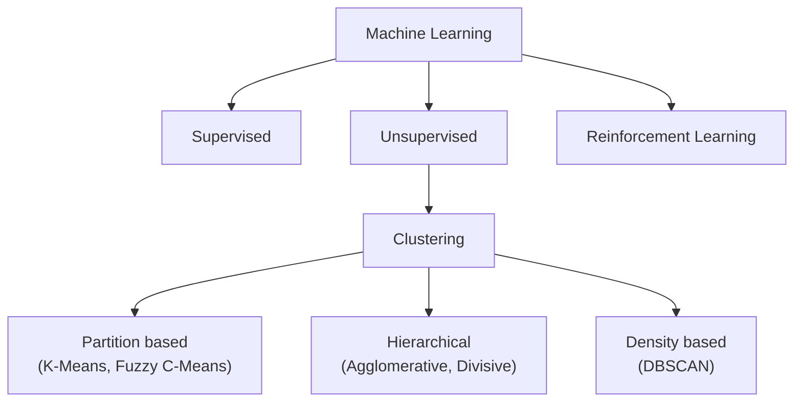
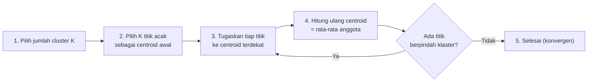
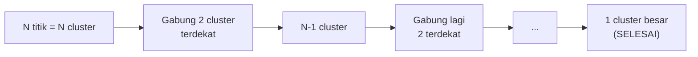
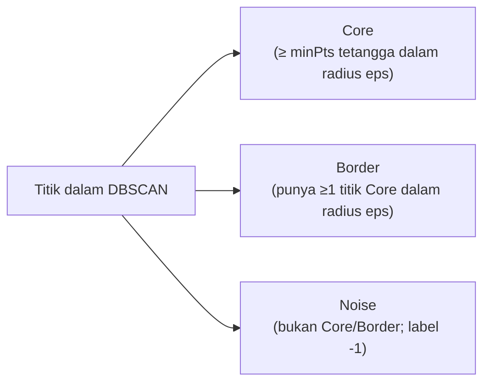

import { Accordion, Accordions } from 'fumadocs-ui/components/accordion';
import { Callout } from 'fumadocs-ui/components/callout';
import { Tab, Tabs } from 'fumadocs-ui/components/tabs';

> **Penyusun Modul & Portal:** Mahendar Dwi Payana  
> **Penulis Materi Pelatihan DTS 2021:** Dr. Berlian Al Kindhi, S.ST., MT. — Thematic Academy Digital Talent Scholarship 2021  
> **Penyelenggara & Kurikulum:** Kementerian Komunikasi dan Informatika RI (Kominfo) & Sekolah Teknik Elektro dan Informatika (STEI) ITB  
> **Standar Rujukan:** Standar Kompetensi Kerja Nasional Indonesia (SKKNI) No. 299 Tahun 2020 — Skema *Associate Data Scientist*

---

## 1. Landasan Standar Kompetensi Kerja (SKKNI)

Modul ini melanjutkan pemodelan ke ranah **pembelajaran tak terawasi (*unsupervised learning*)** dengan unit kompetensi yang sama seperti pertemuan pemodelan sebelumnya:

| Kode Unit | Elemen Kompetensi | Kriteria Unjuk Kerja (KUK) Inti |
| :--- | :--- | :--- |
| **J.62DMI00.013.1**<br />*Membangun Model* | **1. Menyiapkan parameter model** | **1.1** Parameter yang sesuai dengan model diidentifikasi.<br/>**1.2** Nilai toleransi parameter evaluasi pengujian ditetapkan sesuai tujuan teknis. |
| | **2. Menggunakan tools pemodelan** | **2.1** Tools untuk membuat model diidentifikasi.<br/>**2.2** Algoritma pemodelan dibangun menggunakan tools yang dipilih.<br/>**2.3** Algoritma pemodelan dieksekusi sesuai skenario pengujian.<br/>**2.4** Parameter model dioptimasi untuk menghasilkan nilai evaluasi yang sesuai skenario. |

**Tujuan Pembelajaran:**

1. Melakukan pemilahan data untuk digunakan sebagai *input feature*.
2. Mempelajari algoritma **K-Means**, **Hierarchical Clustering**, dan **DBSCAN**.
3. Optimasi K-Means dengan **Elbow Method** (menentukan $K$ yang tepat).
4. Optimasi Hierarchical Clustering dengan **Dendrogram**.
5. Optimasi clustering berbasis **density** dengan DBSCAN.
6. Praktik coding dengan Python.

---

## 2. Klastering & Taksonominya

> **Klastering** adalah teknik *machine learning* **tanpa supervisi** (tanpa label target). Tujuannya mengelompokkan data sehingga titik dalam satu klaster (**intra-cluster**) sangat mirip, sedangkan titik antar-klaster (**inter-cluster**) sangat berbeda. Ukuran kemiripan ditentukan oleh posisi **centroid** dan **jarak** antar titik.



**Kasus penggunaan klastering:**

* **Segmentasi pelanggan** (*customer profiling*) untuk strategi pemasaran.
* **Deteksi anomali jaringan** (paket data yang tidak termasuk kelompok normal).
* **Kompresi citra** (kuantisasi warna berbasis centroid).

<Callout type="info" title="Dataset Praktikum Modul 13">
Lab modul memakai **`Customer.csv`** (200 pelanggan *department store*): `IDPelanggan, Kelamin, Usia, Rating_belanja (1-100), Pendapatan (juta Rp)`.
[Unduh di sini](https://mahendartea.github.io/Learn-AI/data/Customer.csv)
</Callout>

---

## 3. K-Means Clustering (Partition-based)

K-Means adalah algoritma **iteratif** yang mempartisi dataset menjadi $K$ subkelompok **non-overlapping**; setiap titik data hanya milik satu klaster. K-Means menempatkan titik ke klaster sedemikian sehingga **jumlah kuadrat jarak** titik ke pusat massanya minimal.

### A. Fungsi Objektif (WCSS / Inertia)

$$
\text{WCSS} = \sum_{k=1}^{K} \sum_{x \in C_k} \lVert x - \mu_k \rVert^2
$$

Semakin kecil variasi di dalam klaster, semakin homogen (serupa) titik-titiknya. Tujuan K-Means adalah **meminimalkan WCSS**.

### B. Langkah-Langkah K-Means



1. **Pilih jumlah klaster $K$** yang diinginkan.
2. **Pilih $K$ titik acak** sebagai *centroid* awal (posisi bebas; akan diperbaiki iteratif).
3. **Tugaskan tiap titik** ke centroid terdekat, membentuk $K$ klaster.
4. **Hitung ulang centroid** tiap klaster = rata-rata anggotanya (jarak umumnya **Euclidean**).
5. **Ulangi langkah 3–4** hingga tidak ada lagi perpindahan klaster (*konvergen*).

### C. Optimasi Jumlah Klaster: Metode Elbow

Memilih $K$ adalah faktor paling krusial:
* $K$ **terlalu sedikit** (mis. 2) → informasi tersembunyi tidak terungkap.
* $K$ **terlalu banyak** (mis. 8) → sulit diinterpretasi dan dijadikan dasar keputusan.

**Elbow Method** memplot **WCSS** terhadap jumlah klaster. Nilai $K$ yang dipilih adalah titik ketika penurunan WCSS mulai melambat signifikan — membentuk **siku (*elbow*)**.

### D. K-Means++

Inisialisasi centroid murni acak dapat menjebak algoritma pada **optimum lokal** yang buruk. **K-Means++** memilih centroid awal yang tersebar sejauh mungkin satu sama lain menggunakan distribusi probabilitas sebanding kuadrat jarak $D(x)^2$.

### E. Lab: Studi Kasus Pelanggan `Customer.csv`

```python
import numpy as np
import matplotlib.pyplot as plt
import pandas as pd
from sklearn.cluster import KMeans

BASE = "https://mahendartea.github.io/Learn-AI/data"
dataset = pd.read_csv(f"{BASE}/Customer.csv")

# Input features: Rating_belanja (kolom 4) & Pendapatan (kolom 5)
X = dataset.iloc[:, [3, 4]].values

# ---- Optimasi K-Means dengan metode Elbow (WCSS) ----
wcss = []
for i in range(1, 11):
    kmeans = KMeans(n_clusters=i, init='k-means++', random_state=42)
    kmeans.fit(X)
    wcss.append(kmeans.inertia_)

plt.plot(range(1, 11), wcss, marker='o')
plt.title('Elbow Method')
plt.xlabel('Cluster Number')
plt.ylabel('WCSS')
plt.show()

# ---- Menjalankan K-Means ----
kmeans = KMeans(n_clusters=5, init='k-means++', random_state=42)
y_kmeans = kmeans.fit_predict(X)

plt.scatter(X[y_kmeans == 0, 0], X[y_kmeans == 0, 1], s=100, c='blue', label='Cluster 1')
plt.scatter(X[y_kmeans == 1, 0], X[y_kmeans == 1, 1], s=100, c='red', label='Cluster 2')
plt.scatter(X[y_kmeans == 2, 0], X[y_kmeans == 2, 1], s=100, c='magenta', label='Cluster 3')
plt.scatter(X[y_kmeans == 3, 0], X[y_kmeans == 3, 1], s=100, c='cyan', label='Cluster 4')
plt.scatter(X[y_kmeans == 4, 0], X[y_kmeans == 4, 1], s=100, c='green', label='Cluster 5')
plt.scatter(kmeans.cluster_centers_[:, 0], kmeans.cluster_centers_[:, 1],
            s=300, c='yellow', label='Centroids')
plt.title('Consumers Cluster')
plt.xlabel('Yearly expense rating (1-100)')
plt.ylabel('Yearly Salary')
plt.legend()
plt.show()
```

> **Temuan:** Grafik siku WCSS muncul pada klaster **3 dan 5**, sehingga jumlah klaster paling optimum adalah **3 atau 5**. Hasil pengelompokan dapat menjadi dasar strategi pemasaran toko terhadap tiap segmen pelanggan.

---

## 4. Hierarchical Clustering

**Pengelompokan hierarki** memisahkan data ke dalam kelompok berdasarkan ukuran kesamaan, lalu mempersempitnya bertahap. Ilustrasi: dari beberapa mobil, kelompokkan menjadi *sedan* dan *SUV*, lalu gabungkan keduanya, hingga akhirnya semua berada dalam satu klaster.

### A. Dua Pendekatan

| Pendekatan | Arah | Cara Kerja |
| :--- | :--- | :--- |
| **Divisive** | *Top-down* | Mulai dari satu klaster besar, dipecah menjadi dua, tiga, empat, … |
| **Agglomerative** | *Bottom-up* | Mulai dari klaster kecil (tiap titik = 1 klaster), digabung hingga satu klaster besar |

### B. Langkah Agglomerative



1. Setiap titik data menjadi satu klaster → $N$ data = $N$ klaster.
2. Cari 2 titik/klaster **terdekat** (jarak Euclidean) dan gabungkan.
3. Ulangi pencarian 2 klaster terdekat (boleh melibatkan klaster hasil gabungan).
4. Ulangi hingga tersisa **satu klaster besar**. Ukuran klaster tidak harus sama.

### C. Optimasi dengan Dendrogram

Untuk K-Means kita memakai *Elbow*; untuk Hierarchical Clustering kita memakai **Dendrogram** — diagram yang menunjukkan proses penggabungan klaster. Sumbu-$x$ = data/klaster, sumbu-$y$ = **jarak Euclidean**.

Cara menentukan $K$: pilih **garis vertikal terpanjang yang tidak terpotong** oleh garis *threshold*, atau tentukan nilai *threshold* pada sumbu jarak.

### D. Lab: Hierarchical pada `Customer.csv`

```python
import scipy.cluster.hierarchy as sch
from sklearn.cluster import AgglomerativeClustering

# ---- Dendrogram untuk menentukan jumlah cluster ----
dendrogram = sch.dendrogram(sch.linkage(X, method='ward'))
plt.title('Dendrogram')
plt.xlabel('Consumer')
plt.ylabel('Euclidean Distance')
plt.show()

# ---- Menjalankan Hierarchical Clustering ----
hc = AgglomerativeClustering(n_clusters=5, linkage='ward')
y_hc = hc.fit_predict(X)

plt.scatter(X[y_hc == 0, 0], X[y_hc == 0, 1], s=100, c='red', label='Cluster 1')
plt.scatter(X[y_hc == 1, 0], X[y_hc == 1, 1], s=100, c='blue', label='Cluster 2')
plt.scatter(X[y_hc == 2, 0], X[y_hc == 2, 1], s=100, c='green', label='Cluster 3')
plt.scatter(X[y_hc == 3, 0], X[y_hc == 3, 1], s=100, c='cyan', label='Cluster 4')
plt.scatter(X[y_hc == 4, 0], X[y_hc == 4, 1], s=100, c='magenta', label='Cluster 5')
plt.title('Consumers Cluster')
plt.xlabel('Yearly expense rating (1-100)')
plt.ylabel('Yearly Salary')
plt.legend()
plt.show()
```

> **Temuan:** Jumlah klaster paling sesuai adalah **5** (dari jumlah garis vertikal yang terpotong *threshold*). Hasil hierarchical clustering **hampir sama** dengan K-Means — keduanya efektif untuk data yang menyerupai bentuk normal/sferis.

---

## 5. DBSCAN (Density-based)

K-Means dan Hierarchical efisien bila klaster **berbentuk normal/sferis**. Namun bila klaster berbentuk **arbitrer** (cincin, bulan sabit) atau ingin **mendeteksi outlier**, gunakan DBSCAN.

> **DBSCAN (*Density-Based Spatial Clustering of Applications with Noise*)** adalah algoritma pengelompokan berbasis **kerapatan** yang dapat menemukan klaster dengan berbagai bentuk/ukuran dari data besar yang mengandung *noise* dan *outlier*.

### A. Dua Parameter Utama

| Parameter | Keterangan |
| :--- | :--- |
| **`minPts`** | Jumlah minimum titik (ambang) dalam suatu wilayah agar dianggap padat (*dense*) |
| **`eps` ($\varepsilon$)** | Ukuran radius jarak untuk menemukan titik-titik di sekitar suatu titik |

**Dua konsep pendukung:**

* **Density Reachability** — titik $p$ dapat "dijangkau" dari $q$ jika $p$ berada dalam jarak `eps` dari $q$.
* **Density Connectivity** — pendekatan *chaining* berbasis transitivitas: $p$ dan $q$ terhubung jika $p \to r \to s \to t \to q$ (relasi *neighborhood*).

### B. Langkah-Langkah DBSCAN

1. Ambil titik dalam dataset secara acak (sampai semua titik dikunjungi).
2. Jika terdapat setidaknya `minPts` titik dalam radius `eps` dari titik tersebut, semua titik itu dianggap satu klaster.
3. Perluas klaster dengan mengulang perhitungan lingkungan secara **rekursif** untuk setiap titik tetangga.

### C. Tiga Jenis Titik



### D. Lab 1: DBSCAN pada Data Spherical (`make_blobs`)

```python
import numpy as np
from sklearn.cluster import DBSCAN
from sklearn import metrics
from sklearn.datasets import make_blobs
from sklearn.preprocessing import StandardScaler
import matplotlib.pyplot as plt

# Generate data spherical (3 pusat)
centers = [[1, 1], [-1, -1], [1, -1]]
X, labels_true = make_blobs(n_samples=750, centers=centers, cluster_std=0.4, random_state=0)
X = StandardScaler().fit_transform(X)

# DBSCAN
db = DBSCAN(eps=0.3, min_samples=10).fit(X)
core_samples_mask = np.zeros_like(db.labels_, dtype=bool)
core_samples_mask[db.core_sample_indices_] = True
labels = db.labels_

n_clusters_ = len(set(labels)) - (1 if -1 in labels else 0)
n_noise_ = list(labels).count(-1)
print('Estimated number of clusters: %d' % n_clusters_)
print('Estimated number of noise points: %d' % n_noise_)
print("Homogeneity: %0.3f" % metrics.homogeneity_score(labels_true, labels))
print("Completeness: %0.3f" % metrics.completeness_score(labels_true, labels))
print("V-measure: %0.3f" % metrics.v_measure_score(labels_true, labels))
print("Adjusted Rand Index: %0.3f" % metrics.adjusted_rand_score(labels_true, labels))
print("Adjusted Mutual Information: %0.3f" % metrics.adjusted_mutual_info_score(labels_true, labels))
print("Silhouette Coefficient: %0.3f" % metrics.silhouette_score(X, labels))
```

> **Hasil referensi (data spherical):** `clusters = 3`, `noise = 18`, Homogeneity = **0.953**, Completeness = **0.883**, V-measure = **0.917**, ARI = **0.952**, AMI = **0.916**, Silhouette = **0.626**.

### E. Lab 2: DBSCAN pada Data Non-Spherical (`make_circles`)

```python
from sklearn.datasets import make_circles
from sklearn.cluster import KMeans

# Data non-spherical: dua cincin konsentris
X, y = make_circles(n_samples=750, factor=0.3, noise=0.1)
X = StandardScaler().fit_transform(X)

# DBSCAN
y_pred = DBSCAN(eps=0.3, min_samples=10).fit_predict(X)
plt.scatter(X[:, 0], X[:, 1], c=y_pred)
print('Number of clusters: {}'.format(len(set(y_pred[np.where(y_pred != -1)]))))
print('Homogeneity: {}'.format(metrics.homogeneity_score(y, y_pred)))
print('Completeness: {}'.format(metrics.completeness_score(y, y_pred)))
print("Silhouette Coefficient: %0.3f" % metrics.silhouette_score(X, y_pred))
```

> **Perbandingan DBSCAN vs K-Means (non-spherical):**
>
> | Metrik | DBSCAN | K-Means |
> | :--- | :---: | :---: |
> | Jumlah klaster | 2 | 2 |
> | Homogeneity | **1.000** | 0.0017 |
> | Completeness | **0.937** | 0.0016 |
> | Silhouette | -0.061 | -0.057 |
>
> DBSCAN **berhasil memisahkan** dua cincin dengan sempurna (Homogeneity ≈ 1.0), sedangkan K-Means gagal karena mempartisi berdasarkan jarak ke centroid — titik pada cincin dalam dan luar yang berdekatan secara spasial justru dimasukkan ke klaster yang sama.

---

## 6. Metrik Evaluasi Klastering

Karena klastering tak terawasi, evaluasi membandingkan struktur klaster yang dihasilkan dengan **label asli** (*external*) atau mengukur kohesi/pemisahan (*internal*).

### A. Koefisien Siluet (Silhouette Coefficient — internal)

$$
s(i) = \frac{b(i) - a(i)}{\max(a(i), b(i))}, \qquad -1 \le s(i) \le 1
$$

* $a(i)$: rata-rata jarak titik $i$ ke titik lain dalam klaster yang sama (**kohesi**).
* $b(i)$: rata-rata jarak titik $i$ ke titik klaster terdekat lain (**pemisahan**).
* $s(i) \approx +1$: klaster rapat dan terpisah sempurna; $s(i) \le 0$: kemungkinan salah klaster.

### B. Metrik Eksternal (bila label asli tersedia)

| Metrik | Makna |
| :--- | :--- |
| **Homogeneity** | Setiap klaster hanya memuat anggota dari satu kelas |
| **Completeness** | Semua anggota satu kelas berada dalam satu klaster |
| **V-measure** | Rata-rata harmonik Homogeneity & Completeness |
| **Adjusted Rand Index (ARI)** | Kesamaan pasangan titik, disesuaikan terhadap peluang acak |
| **Adjusted Mutual Information (AMI)** | Informasi bersama, disesuaikan terhadap peluang acak |
| **Davies-Bouldin Index** | Rasio sebaran dalam-klaster terhadap pemisahan antar-klaster (semakin kecil semakin baik) |

```python
from sklearn import metrics

# Contoh penggunaan berbagai metrik eksternal
print("Homogeneity        :", metrics.homogeneity_score(y, y_pred))
print("Completeness       :", metrics.completeness_score(y, y_pred))
print("V-measure          :", metrics.v_measure_score(y, y_pred))
print("Adjusted Rand Index:", metrics.adjusted_rand_score(y, y_pred))
print("AMI                :", metrics.adjusted_mutual_info_score(y, y_pred))
```

---

## 7. Ringkasan Komparasi Algoritma Klastering

| Aspek | K-Means | Hierarchical (Agglomerative) | DBSCAN |
| :--- | :--- | :--- | :--- |
| **Basis** | Partisi (centroid) | Hirarki jarak | Kerapatan (*density*) |
| **Jumlah $K$** | Harus ditentukan *a priori* | Ditentukan dari Dendrogram | Otomatis dari `eps` & `minPts` |
| **Bentuk klaster** | Sferis / konveks | Beragam (tergantung *linkage*) | Arbitrer (cincin, sabit) |
| **Menangani noise** | Tidak | Tidak | **Ya** (label -1) |
| **Skalabilitas** | Tinggi (cepat) | Rendah ($O(N^2)$) | Sedang (bergantung indeks) |
| **Sensitivitas skala** | Tinggi | Tinggi | Tinggi |

---

## 8. Lembar Evaluasi & Tugas Praktikum Mandiri

<Accordions>
  <Accordion title="Tugas 1: K-Means + Elbow Method (Tugas Resmi Modul 13)">
    Sebuah *department store* ingin menganalisis kelompok perilaku belanja pelanggannya menggunakan `Customer.csv`. Gunakan kolom ke-2 hingga ke-4 sebagai *input features*. Dengan metode **elbow**, analisis jumlah cluster yang tepat (plot WCSS untuk $K=1..10$), lalu jalankan **K-Means** dan analisis hasilnya (interpretasi tiap segmen pelanggan)!
  </Accordion>

  <Accordion title="Tugas 2: Hierarchical + Dendrogram vs K-Means (Tugas Resmi Modul 13)">
    Dengan dataset & fitur yang sama, buat **dendrogram** untuk menentukan jumlah cluster yang tepat, lalu jalankan **Hierarchical Clustering**. Bandingkan hasilnya dengan **K-Means** dari Tugas 1 (misal via tabel kontingensi atau metrik Adjusted Rand Index). Apakah kedua metode menghasilkan segmentasi yang konsisten? Jelaskan!
  </Accordion>

  <Accordion title="Tugas 3: DBSCAN Spherical vs Non-Spherical (Tugas Resmi Modul 13)">
    Bangkitkan dataset pelatihan sebanyak **500 titik** dengan label yang sesuai. Lakukan **normalisasi fitur**, lalu terapkan **DBSCAN** dari `sklearn`. Buat dua kasus: **spherical** (`make_blobs`) dan **non-spherical** (`make_circles`). Pada kasus non-spherical, uji juga dengan **K-Means** dan bandingkan hasilnya. Sertakan metrik Homogeneity, Completeness, dan Silhouette!
  </Accordion>

  <Accordion title="Tugas 4: Eksperimen Parameter DBSCAN">
    Pada dataset non-spherical, lakukan *grid* nilai `eps` (0,1; 0,2; 0,3; 0,5) dan `min_samples` (3, 5, 10, 15). Catat jumlah klaster, jumlah noise, dan Silhouette Score tiap kombinasi. Simpulkan pengaruh `eps` dan `min_samples` terhadap pembentukan klaster dan deteksi noise!
  </Accordion>
</Accordions>

---

## 9. Referensi Pustaka & Tautan Resmi

1. **Dr. Berlian Al Kindhi, S.ST., MT.** (2021). *Modul 13 — Clustering*. Thematic Academy Digital Talent Scholarship 2021, Kementerian Komunikasi dan Informatika RI.
2. **Kementerian Ketenagakerjaan RI** (2020). *SKKNI No. 299 Tahun 2020 Bidang Artificial Intelligence Subbidang Data Science* (Unit `J.62DMI00.013.1` — Membangun Model).
3. **Ethem Alpaydin** (2020). *Introduction to Machine Learning* (4th ed.). MIT Press.
4. **Zhi-Hua Zhou** (2021). *Machine Learning*. Springer.
5. **Charu C. Aggarwal & Chandan K. Reddy** (2013). *Data Clustering: Algorithms and Applications*. Chapman and Hall/CRC.
6. **Anil K. Jain & Richard C. Dubes** (1988). *Algorithms for Clustering Data*. Prentice Hall.
7. **Martin Ester, Hans-Peter Kriegel, Jörg Sander, & Xiaowei Xu** (1996). *A Density-Based Algorithm for Discovering Clusters in Large Spatial Databases with Noise*. Proceedings of KDD-96. *(Algoritma DBSCAN)*.
8. **Scikit-learn Developers**. *Clustering & Clustering Performance Evaluation*. [scikit-learn.org](https://scikit-learn.org/stable/modules/clustering.html).
