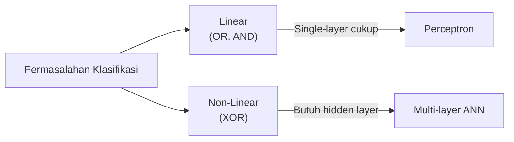
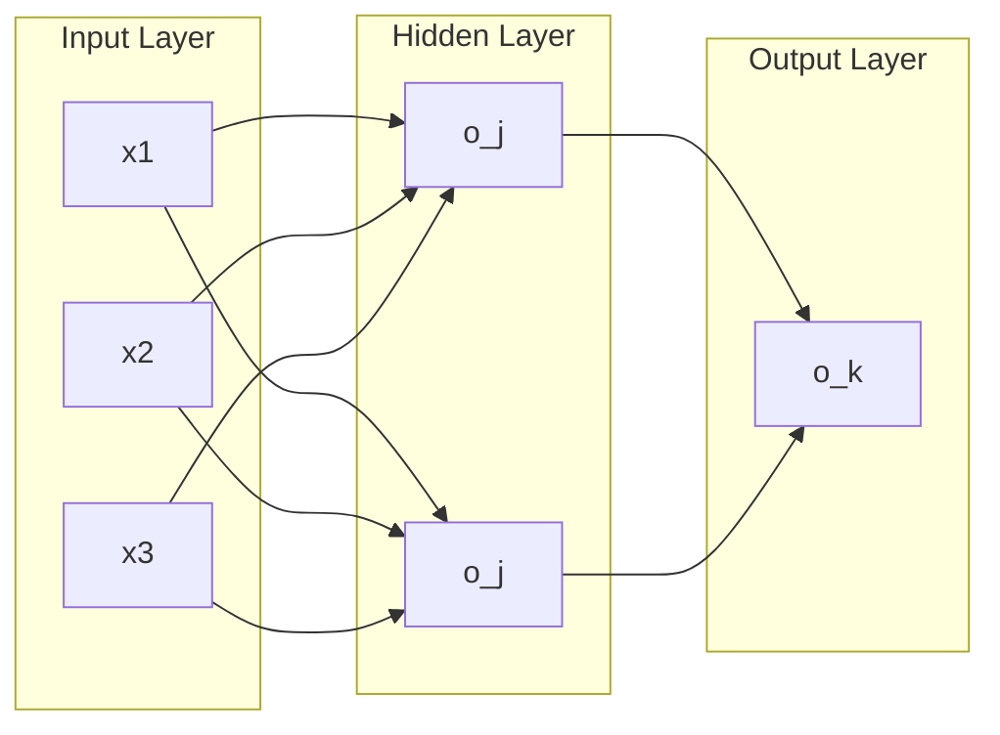
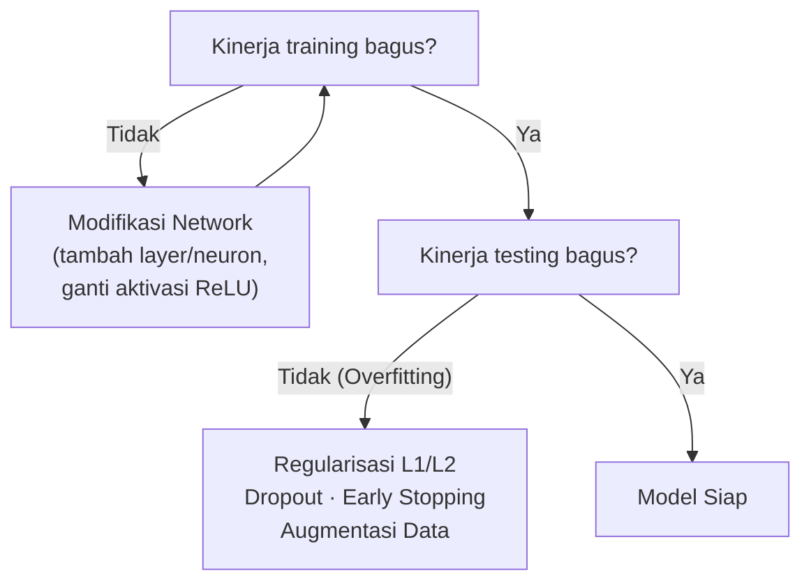
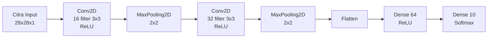

import { Accordion, Accordions } from 'fumadocs-ui/components/accordion';
import { Callout } from 'fumadocs-ui/components/callout';
import { Tab, Tabs } from 'fumadocs-ui/components/tabs';

> **Penyusun Modul & Portal:** Mahendar Dwi Payana  
> **Penulis Materi Pelatihan DTS 2021:** Dr. Eng. Chastine Fatichah, S.Kom, M.Kom — Institut Teknologi Sepuluh Nopember (ITS)  
> **Penyelenggara & Kurikulum:** Kementerian Komunikasi dan Informatika RI (Kominfo) & Sekolah Teknik Elektro dan Informatika (STEI) ITB  
> **Standar Rujukan:** Standar Kompetensi Kerja Nasional Indonesia (SKKNI) No. 299 Tahun 2020 — Skema *Associate Data Scientist*

---

## 1. Landasan Standar Kompetensi Kerja (SKKNI)

Modul ini memasuki ranah **Deep Learning** dengan unit yang sama seperti pertemuan pemodelan (Membangun Model). Cakupannya: *fully connected network* (FCN/MLP), **CNN**, dan **RNN**, serta penggunaan library **Scikit-learn** dan **Keras/TensorFlow**.

| Kode Unit | Elemen Kompetensi | Kriteria Unjuk Kerja (KUK) Inti |
| :--- | :--- | :--- |
| **J.62DMI00.013.1**<br />*Membangun Model* | **1. Menyiapkan parameter model** | **1.1** Parameter yang sesuai dengan model diidentifikasi.<br/>**1.2** Nilai toleransi parameter evaluasi pengujian ditetapkan sesuai tujuan teknis. |
| | **2. Menggunakan tools pemodelan** | **2.1** Tools untuk membuat model diidentifikasi.<br/>**2.2** Algoritma pemodelan dibangun menggunakan tools yang dipilih.<br/>**2.3** Algoritma pemodelan dieksekusi sesuai skenario pengujian.<br/>**2.4** Parameter model dioptimasi untuk menghasilkan nilai evaluasi yang sesuai skenario. |

**Tujuan Pembelajaran:** peserta mampu melakukan proses pemodelan **Artificial Neural Network (ANN)**.

---

## 2. Pengantar Artificial Neural Network

> **ANN** adalah metode *machine learning* yang terinspirasi cara kerja **jaringan saraf biologis** di otak manusia — jaringan unit pemroses kecil yang saling terhubung.

| Sistem Saraf Biologis | ANNs |
| :--- | :--- |
| Soma | Neuron |
| Dendrite | Input |
| Axon | Output |
| Synapse | Weight |

Konsep ANN bermula dari artikel **Waffen McCulloch & Walter Pitts (1943)** yang memformulasikan model matematis sel-sel otak manusia.

### A. Arsitektur Single-Layer Perceptron

Single-layer ANN hanya terdiri dari **input layer** dan **output layer**. Unit pemrosesan informasinya:

$$
f = \sum_{i=1}^{m} w_i x_i + b, \qquad y = a(f)
$$

* Satu set link berupa neuron dan bobot $w$.
* Fungsi penambah (*penggabung linier*) untuk menghitung jumlah perkalian bobot terhadap input.
* Fungsi aktivasi $a(\cdot)$.

### B. Apa yang Bisa Dilakukan Sebuah Neuron?

Sebuah neuron dapat menyelesaikan **klasifikasi biner** sebagai:
* **Fungsi pemisah** (*hyperspace separation*).
* **Binary threshold**:

$$
y = \begin{cases} 1, & f(x) \ge 0 \\ 0, & \text{lainnya} \end{cases}
$$

### C. Permasalahan Linear vs. Non-Linear



---

## 3. Fungsi Aktivasi

Fungsi aktivasi **mengubah neuron menjadi non-linear**. Tanpa fungsi aktivasi, jaringan multi-lapis sedalam apa pun hanya setara dengan satu model linier.

| Fungsi | Formulasi | Karakter & Rekomendasi |
| :--- | :--- | :--- |
| **Sigmoid** | $a(f) = \dfrac{1}{1 + e^{-f}}$ | Rentang $(0,1)$; baik untuk output klasifikasi biner; rentan *vanishing gradient* |
| **Tanh** | $\tanh(x) = 2\sigma(2x) - 1$ | Rentang $(-1,1)$; *zero-centered* |
| **Gaussian** | $a(f) = \dfrac{1}{\sqrt{2\pi}\,\sigma}\exp\!\left(-\dfrac{(f-\mu)^2}{2\sigma^2}\right)$ | Berbasis fungsi Gaussian |
| **ReLU** | $f(x) = \max(0, x)$ | **Standar hidden layer modern**; efisien; bebas saturasi untuk $x>0$ |
| **Softmax** | $\dfrac{e^{z_i}}{\sum_{j=1}^{C} e^{z_j}}$ | Output multi-kelas; mengubah logit menjadi distribusi probabilitas |

---

## 4. Arsitektur Multi-Layer ANN

Untuk permasalahan non-linear dan kompleks, digunakan **Multi-layer ANN** yang terdiri dari:

* **Input layer** — jumlah neuron = jumlah fitur input.
* **Hidden layer** — satu atau lebih; hubungan antar neuron **fully connected**.
* **Output layer** — jumlah neuron sesuai permasalahan:
  * Klasifikasi biner / regresi → 1 neuron.
  * Klasifikasi multi-kelas → jumlah neuron = jumlah kelas (mis. 10 untuk angka 0–9).

**Panduan desain:**

* Jumlah **hidden layer** disesuaikan dengan kompleksitas masalah; semakin banyak layer → komputasi lebih lama.
* Jumlah **neuron hidden** umumnya lebih banyak daripada neuron output; tambah bertahap untuk mencegah *overfitting*.



---

## 5. Tahapan ANN

### A. Feed Forward (Propagasi Maju)

1. Masukkan vektor $X$ ke input layer.
2. Hitung output setiap neuron di hidden & output layer:

$$
o_j = \sum_{i=1}^{n} w_{ji} x_i + b, \qquad o_k = \sum_{j=1}^{m} w_{kj} o_j + b
$$

3. Hitung fungsi aktivasi pada output: $\hat{y} = a(o_k)$.

### B. Pembelajaran (Learning)

1. **Inisialisasi bobot** $W$ secara acak.
2. **Update bobot** agar output konsisten dengan label kelas. Fungsi objektif (loss):

$$
J(W) = \frac{1}{n}\sum_{i=1}^{n}\left(y^{(i)} - f(x^{(i)}; W)\right)^2
$$

Bobot baru dicari dengan **meminimalkan** fungsi objektif memakai **backpropagation**:

$$
W^{*} = \arg\min_{W} J(W)
$$

**Tiga hal penting dalam merancang algoritma pembelajaran:**

| Aspek | Jawaban |
| :--- | :--- |
| Kapan berhenti? | Konvergen atau batas iterasi (*epoch*) |
| Ke arah mana? | *Gradient descent* |
| Seberapa besar langkah? | *Learning rate* ($\eta$) |

**Backpropagation Gradient Descent:**

* Inisialisasi bobot acak.
* Iterasi sampai konvergen / maksimum iterasi:
  * Hitung gradien $\dfrac{\partial J(W)}{\partial W}$.
  * Update bobot: $W \leftarrow W - \eta \dfrac{\partial J(W)}{\partial W}$.

> **Pentingnya Learning Rate:** $\eta$ terlalu kecil → konvergensi lama; $\eta$ terlalu besar → model tidak stabil.

### C. Stochastic Gradient Descent (SGD) & Mini-Batch SGD

| Varian | Cara Kerja |
| :--- | :--- |
| **Full-batch GD** | Hitung gradien dari seluruh dataset tiap iterasi |
| **SGD** | Update bobot per **satu** data poin |
| **Mini-batch SGD** | Update per **batch** $B$ data: $\dfrac{\partial J(W)}{\partial W} = \dfrac{1}{B}\sum_{k=1}^{B}\dfrac{\partial J_k(W)}{\partial W}$ |

### D. Langkah Pembelajaran MLP

0. Inisialisasi bobot, *learning rate*, maksimum iterasi.
1. Baca vektor input $X$.
2. Lakukan iterasi (*epoch*).
3. Hitung luaran neuron di hidden & output layer.
4. Hitung *backpropagate error* (output & hidden layer).
5. Perbarui semua bobot (output & hidden layer).
6. Ulangi langkah 3–5 hingga bobot konvergen / maksimum iterasi.
7. Luaran berupa **matriks bobot** (output & hidden layer).

---

## 6. Strategi Proses Pembelajaran & Pencegahan Overfitting



### A. Optimasi Parameter: Adaptive Learning Rate

Learning rate yang menyesuaikan nilai gradien umumnya memberi kinerja lebih baik:

* **Adagrad** (John Duchi, JMLR 2011)
* **Adadelta** (Matthew D. Zeiler, arXiv 2012)
* **Adam** (Diederik P. Kingma, ICLR 2015)
* **AdaSecant** (Caglar Gulcehre, arXiv 2014)
* **RMSprop**

### B. Regularisasi

Menambahkan *regularization term* (bobot) ke fungsi objektif untuk mengurangi *generalization error*:

* **L1 norm**: menambahkan *sum of absolute weights* sebagai penalti.
* **L2 norm (weight decay)**: menambahkan *sum of squared weights* sebagai penalti.

### C. Dropout & Early Stopping

* **Dropout**: menonaktifkan sebagian neuron sesuai persentase $p\%$ secara acak selama training.
* **Early Stopping**: menghentikan iterasi training ketika *generalization error* mulai naik.

### D. Augmentasi Data

Memperbanyak variasi data latih agar model lebih general. Metode bergantung jenis data:
* Data numerik → **SMOTE**, **ADASYN**, dll.
* Data citra → **rotasi, translasi, flip, zoom**.

---

## 7. Tahapan Implementasi & Tools

**Alur implementasi (load → split → define → compile → fit → evaluate → save → predict):**

1. **Load data** — membaca file data input.
2. **Split data** — membagi menjadi data latih, validasi, uji.
3. **Define model** — merancang arsitektur ANN.
4. **Compile model** — menetapkan optimizer, loss, metrik.
5. **Fit model** — melatih model pada data latih.
6. **Evaluate model** — evaluasi pada data validasi/uji.
7. **Save model** — menyimpan model terbaik.
8. **Prediction** — memprediksi output data uji.

Beberapa tahap dapat digabung menjadi satu.

### Parameter `MLPClassifier` (Scikit-learn)

| Parameter | Keterangan |
| :--- | :--- |
| `hidden_layer_sizes` | Jumlah neuron di hidden layer |
| `activation` | Fungsi aktivasi hidden layer |
| `solver` | Metode adaptive learning rate |
| `batch_size` | Ukuran batch |
| `learning_rate_init` | Inisialisasi learning rate |
| `max_iter` | Maksimum iterasi |
| `early_stopping` | `False` bila tidak menerapkan early stopping |

---

## 8. Lab 1: ANN Klasifikasi Iris

### A. Implementasi dengan Scikit-learn

```python
from sklearn import datasets
from sklearn.model_selection import train_test_split
from sklearn.neural_network import MLPClassifier
from sklearn.metrics import accuracy_score, plot_confusion_matrix
import matplotlib.pyplot as plt

# Load data
iris = datasets.load_iris()
X, y = iris.data, iris.target

# Split: train / validation / test
X_train, X_test, Y_train, Y_test = train_test_split(X, y, test_size=.10, random_state=42)
X_train, X_val, Y_train, Y_val = train_test_split(X_train, Y_train, test_size=.15, random_state=42)
print('X_train', X_train.shape)
print('X_val', X_val.shape)
print('X_test', X_test.shape)

# Define & compile model
mlp = MLPClassifier(hidden_layer_sizes=(64,), activation='relu', max_iter=1000, epsilon=1e-08)

# Fit + evaluasi validasi
mlp.fit(X_train, Y_train)
acc_val = accuracy_score(Y_val, mlp.predict(X_val))
print('Akurasi Validasi ANN:', acc_val)

# Evaluasi data uji
acc_test = accuracy_score(Y_test, mlp.predict(X_test))
print('Akurasi Testing ANN:', acc_test)
plot_confusion_matrix(mlp, X_test, Y_test)
plt.show()
```

### B. Implementasi dengan Keras

```python
from keras.utils import to_categorical
from keras.models import Sequential
from keras.layers import Flatten, Dense

# One-hot encoding label (3 kelas)
Y_train = to_categorical(Y_train, 3)
Y_val = to_categorical(Y_val, 3)
Y_test = to_categorical(Y_test, 3)

model = Sequential()
model.add(Flatten())
model.add(Dense(64, activation='relu'))
model.add(Dense(3, activation='softmax'))

model.compile(optimizer='adam', loss='categorical_crossentropy', metrics=['acc'])

history = model.fit(X_train, Y_train, epochs=100, batch_size=5,
                    validation_data=(X_val, Y_val))
model.summary()

loss, accuracy = model.evaluate(X_test, Y_test)
print('Akurasi Testing ANN:', accuracy)
```

---

## 9. Lab 2: Fully Connected Network pada MNIST

Dataset **MNIST** (angka tulisan tangan) dibagi menjadi **55.000 training**, **10.000 test**, dan **5.000 validation**. Setiap citra berukuran $28 \times 28$ piksel, label diubah menjadi *one-hot encoding*.

**Arsitektur FCN:** input 784 ($28\times28$) → 1 hidden layer (Dense, 64 neuron, ReLU) → output 10 neuron (Softmax).

```python
import keras
from keras.datasets import mnist
from keras.models import Sequential
from keras.layers import Flatten, Dense
import matplotlib.pyplot as plt

# 1. Load data
(X_train, y_train), (X_test, y_test) = mnist.load_data()
X_train = X_train.reshape(-1, 28, 28, 1).astype('float32') / 255
X_test = X_test.reshape(-1, 28, 28, 1).astype('float32') / 255
y_train = keras.utils.to_categorical(y_train, 10)
y_test = keras.utils.to_categorical(y_test, 10)

# 2. Define model (Multilayer Neural Network)
model1 = Sequential()
model1.add(Flatten())
model1.add(Dense(64, activation='relu'))
model1.add(Dense(10, activation='softmax'))

# 3. Compile, Fit, Evaluate
model1.compile(optimizer='adam', loss='categorical_crossentropy', metrics=['acc'])
history1 = model1.fit(X_train, y_train, epochs=10, batch_size=100,
                      validation_data=(X_test, y_test))
model1.summary()
model1.evaluate(X_test, y_test)

# 4. Grafik loss training vs validasi
epochs = range(10)
plt.plot(epochs, history1.history['loss'], 'r', label='training loss ANN')
plt.plot(epochs, history1.history['val_loss'], 'b', label='validasi loss ANN')
plt.legend()
plt.show()
```

---

## 10. Pengantar Deep Learning

| Pendekatan | Alur |
| :--- | :--- |
| **Machine Learning konvensional** | Input → **Ekstraksi fitur manual** → Klasifikasi → Output |
| **Deep Learning** | Input → **Ekstraksi fitur + Klasifikasi otomatis** → Output |

**Kelemahan pendekatan konvensional:**

* Memerlukan waktu dan pengetahuan lebih untuk ekstraksi fitur.
* Sangat bergantung pada satu domain masalah (kurang general).

**Deep Learning** mempelajari representasi hirarki (pola fitur) secara otomatis melalui beberapa tahapan *feature learning*.

---

## 11. Convolutional Neural Network (CNN)

CNN adalah metode Deep Learning yang merupakan salah satu jenis arsitektur ANN. Terdiri dari **tiga layer utama**: *convolutional layer*, *pooling layer*, dan *fully connected layer*.

### A. Convolutional Layer

Proses **konvolusi** citra input dengan *filter* menghasilkan **feature map**. Filter digeser (*sliding*) dari kiri atas hingga kanan bawah matriks citra:

$$
(I * K)(i, j) = \sum_m \sum_n I(m, n)\, K(i+m, j+n)
$$

Ukuran matriks citra dan filter memengaruhi ukuran *feature map*.

### B. Pooling Layer

Mengurangi ukuran gambar (*down-sample*) dan mengekstrak *salient features*. Jenis umum: **Maximum pooling** dan **Average pooling**.

### C. Fully Connected Layer

Feature map hasil konvolusi & pooling di-**flatten** (matrix → vektor) menjadi input *fully connected layer* (arsitektur Multi-layer ANN).



### D. Lab 3: CNN pada MNIST

```python
from keras.layers import Conv2D, MaxPooling2D

model2 = Sequential()
model2.add(Conv2D(16, (3, 3), activation='relu', input_shape=(28, 28, 1), padding='same'))
model2.add(MaxPooling2D(2, 2))
model2.add(Conv2D(32, (3, 3), activation='relu', padding='same'))
model2.add(MaxPooling2D(2, 2))
model2.add(Flatten())
model2.add(Dense(64, activation='relu'))
model2.add(Dense(10, activation='softmax'))

model2.compile(optimizer='adam', loss='categorical_crossentropy', metrics=['acc'])
history2 = model2.fit(X_train, y_train, epochs=10, batch_size=100,
                      validation_data=(X_test, y_test))
model2.evaluate(X_test, y_test)
```

**CNN dengan Dropout** (mencegah overfitting):

```python
from keras.layers import Dropout

model3 = Sequential()
model3.add(Conv2D(16, (3, 3), activation='relu', input_shape=(28, 28, 1), padding='same'))
model3.add(MaxPooling2D(2, 2))
model3.add(Conv2D(32, (3, 3), activation='relu', padding='same'))
model3.add(MaxPooling2D(2, 2))
model3.add(Flatten())
model3.add(Dense(64, activation='relu'))
model3.add(Dropout(0.5))
model3.add(Dense(10, activation='softmax'))

model3.compile(optimizer='adam', loss='categorical_crossentropy', metrics=['acc'])
history3 = model3.fit(X_train, y_train, epochs=10, batch_size=100,
                      validation_data=(X_test, y_test))
```

> **Perbandingan:** Bandingkan kurva loss/akurasi `model1` (ANN) vs `model2` (CNN) vs `model3` (CNN + Dropout). CNN umumnya mengungguli FCN pada data citra karena memanfaatkan struktur spasial lokal.

### E. Varian Arsitektur CNN

| Aplikasi | Arsitektur |
| :--- | :--- |
| **Image Classification** | LeNet-5 (1998), AlexNet (2012), GoogLeNet/Inception (2014), VGGNet (2014), ResNet (2015) |
| **Object Detection** | R-CNN (2013), Fast R-CNN (2014), Faster R-CNN (2015), SSD (2016), YOLO (2016) |
| **Semantic/Instance Segmentation** | FCN (2015), U-Net (2015), FPN (2016), Mask R-CNN (2017), DeepLab |
| **Generative Model** | Autoencoder, VAE, GAN |

---

## 12. Recurrent Neural Network (RNN)

RNN adalah arsitektur ANN yang mampu merepresentasikan **data sekuensial** (teks, DNA, suara, *time series*):

$$
H_t = \phi\!\left(X_t W_{xh} + H_{t-1} W_{hh} + b_h\right), \qquad \hat{y}_t = H_t W_{hy} + b_y
$$

### A. Tipe Arsitektur RNN

| Tipe | Aplikasi |
| :--- | :--- |
| **Many to One** | Klasifikasi sentimen, *opinion mining*, *speech recognition*, *automated answer scoring* |
| **One to Many** | *Image captioning*, *text generation* |
| **Many to Many** | Terjemahan, peramalan (*forecasting*), chatbot, generasi musik |

### B. Varian Arsitektur RNN

* **LSTM (*Long Short-Term Memory*)**: terdiri dari *input gate*, *output gate*, dan *forget gate*.
* **GRU (*Gated Recurrent Unit*)**: simplifikasi LSTM dengan menggabungkan input & forget gate → parameter lebih sedikit.
* **IndRNN (*Independently RNN*)**: setiap neuron dalam satu layer independen.
* **Bi-directional RNN**: dua hidden layer dari arah berlawanan menuju output yang sama.
* **Echo State Network (ESN)**: jaringan berulang yang terhubung acak (*reservoir*).

---

## 13. Ringkasan: FCN vs. CNN vs. RNN

| Aspek | FCN (MLP) | CNN | RNN |
| :--- | :--- | :--- | :--- |
| **Jenis Data** | Data numerik / tabular | Citra, video | Teks, sinyal, suara, time-series |
| **Struktur Kunci** | Jumlah hidden layer sesuai kompleksitas | Convolution & Pooling layer | Konsep *recurrent* & urutan input |
| **Aplikasi** | Klasifikasi & regresi | Klasifikasi, deteksi objek, segmentasi, generate citra | Klasifikasi, regresi, generate text, translation |

---

## 14. Lembar Evaluasi & Tugas Praktikum Mandiri

<Accordions>
  <Accordion title="Tugas 1: ANN pada Dataset Hepatitis C (Tugas Resmi Modul 14)">
    Unduh dataset HCV dari [UCI ML Repository](https://archive.ics.uci.edu/ml/datasets/HCV+data). Bagi dataset menjadi **data train, validasi, dan uji**. Rancang dan bangun model **ANN**, lakukan **tuning parameter** (jumlah hidden layer/neuron, aktivasi, learning rate, batch size) untuk hasil terbaik. Tampilkan **grafik loss train vs validasi** serta **confusion matrix & akurasi** pada data uji!
  </Accordion>

  <Accordion title="Tugas 2: CNN untuk Klasifikasi Bahasa Isyarat (Tugas Resmi Modul 14)">
    Unduh dataset Bahasa Isyarat (ASL) dari [Kaggle](https://www.kaggle.com/ayuraj/asl-dataset). Bagi data menjadi train/validasi/uji dengan proporsi **70% / 20% / 10%**. Rancang dan bangun model **CNN**, lakukan **tuning parameter**, tampilkan **grafik loss train & validasi**, serta **confusion matrix dan akurasi** pada data uji!
  </Accordion>

  <Accordion title="Tugas 3: Studi Mekanisme Anti-Overfitting">
    Pada model MNIST (FCN atau CNN), bandingkan tiga konfigurasi: (a) tanpa regularisasi, (b) dengan `Dropout`, dan (c) dengan `EarlyStopping`. Plot kurva *loss* training vs validasi untuk masing-masing. Jelaskan secara kuantitatif bagaimana masing-masing teknik menekan *gap* antara loss training dan validasi!
  </Accordion>

  <Accordion title="Tugas 4: Eksperimen Adaptive Learning Rate">
    Latih model ANN yang sama dengan optimizer berbeda: **SGD, Adagrad, RMSprop, Adam**. Gunakan dataset Iris/MNIST. Bandingkan kecepatan konvergensi (epoch hingga loss stabil) dan akurasi akhir. Jelaskan mengapa *adaptive learning rate* umumnya lebih cepat konvergen daripada SGD murni!
  </Accordion>
</Accordions>

---

## 15. Referensi Pustaka & Tautan Resmi

1. **Dr. Eng. Chastine Fatichah, S.Kom, M.Kom** (2021). *Modul 14 — Membangun Model Artificial Neural Network (ANN)*. Thematic Academy Digital Talent Scholarship 2021, Kementerian Komunikasi dan Informatika RI.
2. **Kementerian Ketenagakerjaan RI** (2020). *SKKNI No. 299 Tahun 2020 Bidang Artificial Intelligence Subbidang Data Science* (Unit `J.62DMI00.013.1` — Membangun Model).
3. **Warren S. McCulloch & Walter Pitts** (1943). *A Logical Calculus of the Ideas Immanent in Nervous Activity*. Bulletin of Mathematical Biophysics, 5(4), 115–133.
4. **Michael Negnevitsky** (2005). *Artificial Intelligence: A Guide to Intelligent Systems* (2nd ed.). Addison Wesley.
5. **Diederik P. Kingma & Jimmy Ba** (2015). *Adam: A Method for Stochastic Optimization*. ICLR 2015.
6. **Yann LeCun, Léon Bottou, Yoshua Bengio, & Patrick Haffner** (1998). *Gradient-Based Learning Applied to Document Recognition*. Proceedings of the IEEE, 86(11), 2278–2324. *(LeNet-5 & MNIST)*.
7. **Alexander Amini & Ava Amini** (2021). *Intro to Deep Learning (MIT 6.S191)*. MIT.
8. **TensorFlow/Keras Documentation**. [tensorflow.org](https://www.tensorflow.org/overview/), [keras.io](https://keras.io/).
9. **TensorFlow Playground** — simulasi arsitektur ANN interaktif: [playground.tensorflow.org](https://playground.tensorflow.org/).
