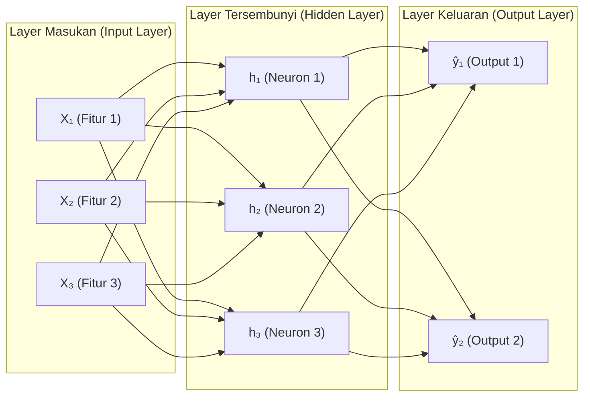

> **Penyusun Modul:** Mahendar Dwi Payana  
> **Acuan Silabus:** DTS Kominfo - STEI ITB (Ir. Windy Gambetta, MBA) & SKKNI No. 299 Tahun 2020

---

## 1. Dari Neuron Biologis ke Perceptron Komputasional

Jaringan Saraf Tiruan (*Artificial Neural Network - ANN*) terinspirasi oleh mekanisme transmisi sinyal elektrokimia pada sel saraf biologis otak manusia.

Pada tahun 1957, **Frank Rosenblatt** merumuskan model matematis **Perceptron**:

$$
y = f\left(\sum_{i=1}^{m} w_i x_i + b\right)
$$

- $x_1, x_2, \dots, x_m$: Sinyal masukan (*input features*).
- $w_1, w_2, \dots, w_m$: Bobot sinaptik (*weights*) yang dipelajari.
- $b$: Bias penyeimbang ambang batas pengaktifan.
- $f$: Fungsi aktivasi (*activation function*).

Perceptron tunggal hanya mampu menyelesaikan masalah yang terpisahkan secara linier (*linearly separable*). Untuk menyelesaikan pola non-linier kompleks (seperti masalah gerbang logika XOR), dibangun **Multilayer Perceptron (MLP)**.

---

## 2. Arsitektur Multilayer Perceptron (MLP)



Untuk setiap lapisan $l$, propagasi maju (*forward propagation*) dihitung secara vektor matriks:

$$
z^{[l]} = \mathbf{W}^{[l]} a^{[l-1]} + \mathbf{b}^{[l]}
$$

$$
a^{[l]} = g^{[l]}(z^{[l]})
$$

Di mana $a^{[l-1]}$ adalah vektor aktivasi dari lapisan sebelumnya ($a^{[0]} = \mathbf{X}$), $\mathbf{W}^{[l]}$ adalah matriks bobot sinaptik, $\mathbf{b}^{[l]}$ adalah vektor bias, dan $g^{[l]}$ adalah fungsi aktivasi non-linier.

---

## 3. Komparasi Fungsi Aktivasi Modern

Tanpa fungsi aktivasi non-linier, jaringan multi-lapis sedalam apa pun hanya akan setara dengan sebuah model regresi linier tunggal (`W_3(W_2(W_1 X)) = W_{\text{gabungan}} X`).

| Fungsi Aktivasi | Formulasi Matematis | Rentang Output | Karakteristik & Rekomendasi |
| :--- | :--- | :---: | :--- |
| **Sigmoid** | $\sigma(z) = \frac{1}{1 + e^{-z}}$ | $(0, 1)$ | Rentan terhadap *Vanishing Gradient*. Hanya direkomendasikan pada lapisan output klasifikasi biner. |
| **Tanh** | $\tanh(z) = \frac{e^z - e^{-z}}{e^z + e^{-z}}$ | $(-1, 1)$ | Berpusat di nol (*zero-centered*), namun tetap rentan saturasi gradien. |
| **ReLU** | $f(z) = \max(0, z)$ | $[0, \infty)$ | **Standar industri untuk hidden layers**. Bebas vanishing gradient pada $z > 0$, sangat efisien dihitung. |
| **Softmax** | $\frac{e^{z_i}}{\sum_{j=1}^{C} e^{z_j}}$ | $(0, 1), \ \sum = 1$ | Mengubah vektor logit menjadi distribusi probabilitas kelas pada lapisan keluaran multi-kelas. |

---

## 4. Mekanisme Pembelajaran: Propagasi Balik (Backpropagation)

Jaringan belajar dengan meminimalkan fungsi kerugian (*Loss Function*, misalnya *Binary Cross-Entropy*):

$$
\mathcal{L}(y, \hat{y}) = - \left[ y \log(\hat{y}) + (1 - y) \log(1 - \hat{y}) \right]
$$

Melalui **Aturan Rantai Kalkulus (Chain Rule)**, galat dari lapisan keluaran dipropagasikan mundur untuk menghitung gradien parsial terhadap setiap bobot:

$$
\frac{\partial \mathcal{L}}{\partial \mathbf{W}^{[l]}} = \frac{\partial \mathcal{L}}{\partial a^{[l]}} \cdot \frac{\partial a^{[l]}}{\partial z^{[l]}} \cdot \frac{\partial z^{[l]}}{\partial \mathbf{W}^{[l]}}
$$

### Algoritma Optimasi (Optimizer)
Bobot diperbarui secara iteratif menggunakan **Adam (Adaptive Moment Estimation)**, yang mengombinasikan momentum gradien dengan penskalaan laju pembelajaran adaptif berbasis kuadrat gradien (*RMSProp + Momentum*):

$$
\mathbf{W} \leftarrow \mathbf{W} - \frac{\alpha}{\sqrt{\hat{v}_t} + \epsilon} \hat{m}_t
$$


---

## 5. Implementasi Python: Membangun Arsitektur MLP dengan PyTorch

Berikut adalah implementasi jaringan saraf tiruan modern menggunakan pustaka **PyTorch**:

```python
"""
Pembangunan Model Deep Learning MLP Menggunakan PyTorch
Disusun oleh: Mahendar Dwi Payana
"""

import torch
import torch.nn as nn
import torch.optim as optim
from sklearn.datasets import make_classification
from sklearn.model_selection import train_test_split
from sklearn.preprocessing import StandardScaler

# 1. Definisi Arsitektur Model Jaringan Saraf
class DeepNeuralNetwork(nn.Module):
    def __init__(self, input_dim, hidden_dim, output_dim):
        super(DeepNeuralNetwork, self).__init__()
        self.network = nn.Sequential(
            nn.Linear(input_dim, hidden_dim),
            nn.BatchNorm1d(hidden_dim),
            nn.ReLU(),
            nn.Dropout(0.3), # Mencegah overfitting
            
            nn.Linear(hidden_dim, hidden_dim // 2),
            nn.BatchNorm1d(hidden_dim // 2),
            nn.ReLU(),
            nn.Dropout(0.2),
            
            nn.Linear(hidden_dim // 2, output_dim),
            nn.Sigmoid() # Probabilitas biner [0, 1]
        )
        
    def forward(self, x):
        return self.network(x)

# 2. Prosedur Pelatihan Model
def train_neural_network(X_train, y_train, epochs=40, batch_size=32):
    model = DeepNeuralNetwork(input_dim=X_train.shape[1], hidden_dim=64, output_dim=1)
    criterion = nn.BCELoss() # Binary Cross-Entropy
    optimizer = optim.Adam(model.parameters(), lr=0.005, weight_decay=1e-4)
    
    # Konversi ke PyTorch Tensor
    X_tensor = torch.FloatTensor(X_train)
    y_tensor = torch.FloatTensor(y_train).unsqueeze(1)
    
    model.train()
    for epoch in range(1, epochs + 1):
        optimizer.zero_grad()
        predictions = model(X_tensor)
        loss = criterion(predictions, y_tensor)
        loss.backward()
        optimizer.step()
        
        if epoch % 10 == 0 or epoch == 1:
            acc = ((predictions >= 0.5) == y_tensor).float().mean()
            print(f"Epoch [{epoch:02d}/{epochs}] | Loss: {loss.item():.4f} | Akurasi: {acc.item() * 100:.2f}%")
            
    return model

if __name__ == "__main__":
    # Buat data uji
    X, y = make_classification(n_samples=1500, n_features=16, random_state=42)
    scaler = StandardScaler()
    X_scaled = scaler.fit_transform(X)
    
    trained_model = train_neural_network(X_scaled, y)
```

---

## 6. Latihan Mandiri & Evaluasi

1. Jelaskan mengapa *Dropout* efektif mereduksi fenomena *overfitting* pada arsitektur Deep Learning.
2. Tambahkan mekanisme *Early Stopping* pada skrip pelatihan di atas agar proses belajar berhenti otomatis jika loss validasi tidak membaik selama 5 epoch berturut-turut.
