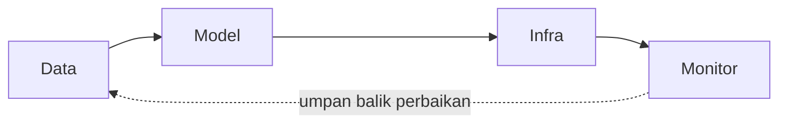

import { Accordion, Accordions } from 'fumadocs-ui/components/accordion';
import { Callout } from 'fumadocs-ui/components/callout';
import { Tab, Tabs } from 'fumadocs-ui/components/tabs';

> **Penyusun Modul & Portal:** Mahendar Dwi Payana  
> **Penulis Materi Pelatihan DTS 2021:** Ir. Agus Pratondo, S.T., M.T., Ph.D. — Thematic Academy Digital Talent Scholarship 2021  
> **Penyelenggara & Kurikulum:** Kementerian Komunikasi dan Informatika RI (Kominfo) & Sekolah Teknik Elektro dan Informatika (STEI) ITB  
> **Standar Rujukan:** Standar Kompetensi Kerja Nasional Indonesia (SKKNI) No. 299 Tahun 2020 — Skema *Associate Data Scientist*

---

## 1. Landasan Standar Kompetensi Kerja (SKKNI)

Evaluasi menentukan apakah model **layak digunakan atau tidak**. Sesi ini mengintegrasikan dua unit kompetensi:

| Kode Unit | Elemen Kompetensi | Kriteria Unjuk Kerja (KUK) Inti |
| :--- | :--- | :--- |
| **J.62DMI00.014.1**<br />*Mengevaluasi Hasil Pemodelan* | **1. Menggunakan model dengan data riil** | **1.1** Data baru untuk evaluasi dikumpulkan sesuai parameter evaluasi.<br/>**1.2** Model diuji dengan data riil yang telah dikumpulkan. |
| | **2. Menilai hasil pemodelan** | **2.1** Keluaran pengujian model dinilai berdasarkan metrik kesuksesan.<br/>**2.2** Hasil penilaian didokumentasikan sesuai standar. |
| **J.62DMI00.015.1**<br />*Melakukan Proses Review Pemodelan* | **1. Menilai kesesuaian proses** | **1.1** Proses pemodelan diperiksa kesesuaiannya dengan tahapan yang ditentukan.<br/>**1.2** Tindak lanjut ditentukan berdasarkan hasil pemeriksaan. |
| | **2. Menilai kualitas proses** | **2.1** Proses pemodelan dinilai berdasarkan rencana pelaksanaan.<br/>**2.2** Hasil penilaian didokumentasikan sesuai standar. |

**Tujuan Pembelajaran:** peserta mampu menghitung berbagai pengukuran performansi model *machine learning* dan mengimplementasikannya pada bahasa pemrograman.

**Model yang diukur:**

| Jenis | Tipe |
| :--- | :--- |
| **Supervised Learning** | Klasifikasi, Regresi |
| **Unsupervised Learning** | Clustering |

> **Prinsip Dasar:** Evaluasi dilakukan **setelah** training selesai, memakai data evaluasi yang **tidak boleh sama** dengan data training.

---

## 2. Akurasi & Keterbatasannya

Akurasi menunjukkan persentase klasifikasi valid terhadap total klasifikasi:

$$
a = \frac{t}{n} \times 100\%
$$

Di mana $a$ = akurasi (%), $t$ = jumlah percobaan valid, $n$ = jumlah percobaan.

**Contoh sederhana:** Dari 5 percobaan, hanya 2 yang valid → akurasi = $2/5 \times 100\% = 40\%$.

> [!CAUTION]
> **Akurasi Sering Menipu.** Contoh kasus detektor **Covid-19 X**: dari 100 sampel (90 negatif, 10 positif), detektor mendeteksi 90 negatif dengan benar, tetapi hanya 5 dari 10 positif yang terdeteksi. Akurasi = $(90+5)/(90+10) = 95\%$. Angka ini tampak tinggi, namun **5 kesalahan False Negative** pada penyakit menular bisa berakibat fatal. Akurasi saja **tidak cukup** — perlu metrik yang menghitung performa per kelas.

---

## 3. Confusion Matrix

> **Confusion Matrix bukan metrik**, melainkan tabulasi yang memetakan hasil prediksi terhadap data aktual per kelas.

**Karakteristik:**

* Memiliki sumbu **data aktual** dan sumbu **data prediksi** (ikut konvensi).
* Setiap kelas terpetakan satu sama lain.
* Percobaan **valid berada pada diagonal utama**.
* Matriks berbentuk **bujur sangkar**.

**Contoh klasifikasi 4 kelas buah** (25 citra uji per kelas, total 100):

| Kelas Aktual \ Prediksi | mangga | apel | jambu | pear |
| :--- | :---: | :---: | :---: | :---: |
| **mangga** | **19** | 3 | 2 | 1 |
| **apel** | 1 | **22** | 1 | 1 |
| **jambu** | 2 | 2 | **21** | 0 |
| **pear** | 0 | 1 | 1 | **23** |

* **Akurasi kelas mangga** = $19/25 \times 100\% = 76\%$.
* **Akurasi total** = $(19+22+21+23)/(25\times4) \times 100\% = 85\%$.

> Visualisasi *heat map* confusion matrix memudahkan perbandingan antar-*epoch* training secara cepat (sebelum membaca angkanya).

---

## 4. Klasifikasi Biner

Klasifikasi biner hanya memiliki **dua kelas** — satu ditetapkan sebagai **positif** (fokus) dan lainnya **negatif**. Contoh: Covid/non-Covid, spam/bukan spam, hoax/bukan hoax, tsunami/bukan tsunami.

**Empat parameter dasar:**

| Parameter | Definisi |
| :--- | :--- |
| **True Positive (TP)** | Aktual positif, diprediksi positif |
| **False Positive (FP)** | Aktual negatif, diprediksi positif |
| **True Negative (TN)** | Aktual negatif, diprediksi negatif |
| **False Negative (FN)** | Aktual positif, diprediksi negatif |

| Nilai Aktual \ Prediksi | Positive | Negative |
| :--- | :---: | :---: |
| **Positive** | True Positive (TP) | False Negative (FN) |
| **Negative** | False Positive (FP) | True Negative (TN) |

### FN vs. FP: Bergantung Kasus

| Domain | Kasus | Yang Paling Berbahaya |
| :--- | :--- | :--- |
| **Kebencanaan** (tsunami) | FN: diprediksi tidak tsunami, ternyata tsunami | **FN** (korban jiwa) |
| **Filter spam** | FP: email penting masuk folder spam | **FP** (gagal kerja/proyek) |
| **Medis** (penyakit menular) | FN: pasien sakit dinyatakan negatif | **FN** (penularan/fatal) |

> **Setiap permasalahan memiliki titik tekan parameter berbeda.** Tidak ada satu metrik terbaik untuk semua kasus.

---

## 5. Metrik Klasifikasi Biner

Berdasarkan confusion matrix, dapat diturunkan berbagai metrik:

| Metrik | Formula | Makna |
| :--- | :--- | :--- |
| **Accuracy** | $\dfrac{TP + TN}{TP + TN + FP + FN}$ | Proporsi prediksi benar keseluruhan |
| **Precision** | $\dfrac{TP}{TP + FP}$ | Dari yang diprediksi positif, berapa yang benar positif |
| **Recall / Sensitivity / TPR** | $\dfrac{TP}{TP + FN}$ | Dari aktual positif, berapa yang berhasil dikenali |
| **Specificity / TNR** | $\dfrac{TN}{FP + TN}$ | Dari aktual negatif, berapa yang benar dikenali negatif |
| **False Positive Rate** | $\dfrac{FP}{FP + TN}$ | Kebalikan dari Specificity |
| **Negative Predictive Value** | $\dfrac{TN}{TN + FN}$ | Dari yang diprediksi negatif, berapa yang benar negatif |
| **F1-Score** | $2 \cdot \dfrac{\text{Precision} \cdot \text{Recall}}{\text{Precision} + \text{Recall}}$ | Keseimbangan Precision–Recall |

**F-$\beta$ Score** (bila Recall $k\times$ lebih diutamakan):

$$
F_\beta = (1 + \beta^2) \cdot \frac{\text{Precision} \cdot \text{Recall}}{\beta^2 \cdot \text{Precision} + \text{Recall}}
$$

### Interpretasi Kombinasi Recall–Precision

| Kondisi | FALSE Negatif | FALSE Positif | Kinerja |
| :--- | :---: | :---: | :--- |
| **Low Recall, Low Precision** | Besar | Besar | ❌ Buruk |
| **High Recall, Low Precision** | Rendah | Tinggi | Positif dikenali baik, tapi banyak negatif salah jadi positif |
| **Low Recall, High Precision** | Tinggi | Rendah | Yang diprediksi positif hampir selalu benar, tapi banyak positif terlewat |
| **High Recall, High Precision** | Rendah | Rendah | ✅ Kinerja terbaik |

---

## 6. Evaluasi Model Probabilistik

Model dapat menghasilkan **nilai probabilitas** $[0,1]$ untuk tiap label sebelum dipetakan ke kelas melalui *threshold*. Evaluasi probabilistik mempertimbangkan **semua threshold** yang mungkin.

### A. ROC-AUC

**ROC (Receiver Operating Characteristic)** mem-plot **Recall (TPR)** pada sumbu-$y$ melawan **False Positive Rate** pada sumbu-$x$ untuk setiap threshold $[0,1]$. Luas area di bawah kurva = **AUC**.

* AUC = 1,0 → pemilah sempurna.
* AUC = 0,5 (garis putus-putus) → setara menebak acak (*random guess*).

> **Mengapa ROC-AUC, bukan hanya akurasi?** Akurasi hanya merepresentasikan performa pada **satu nilai threshold**, sedangkan ROC-AUC menggambarkan performa pada **semua threshold**.

### B. Precision-Recall Curve (PR-AUC)

Mem-plot **Precision** (sumbu-$y$) vs **Recall** (sumbu-$x$). Lebih tepat untuk **kelas minoritas** pada data sangat timpang (*imbalanced*), karena tidak terpengaruh dominasi True Negative yang masif.

### C. Logarithmic Loss (Log Loss)

Menunjukkan seberapa **yakin** pemberian label terhadap data yang diuji:

$$
\text{LogLoss} = -\frac{1}{N}\sum_{i=1}^{N}\sum_{j=1}^{M} y_{ij} \log(p_{ij})
$$

Dengan $N$ = jumlah sampel, $M$ = jumlah kelas, $y_{ij}$ = indikator sampel $i$ kelas $j$, dan $p_{ij}$ = probabilitas sampel $i$ kelas $j$. Nilai berada pada $[0, \infty)$ — **semakin kecil semakin baik**.

---

## 7. Evaluasi Segmentasi Citra

Untuk klasifikasi **per piksel** (segmentasi *foreground* vs *background*), dengan $A$ = hasil segmentasi dan $B$ = *ground truth*:

$$
\text{Jaccard Index (JI)} = \frac{|A \cap B|}{|A \cup B|}
$$

$$
\text{Dice / Similarity Index (SI)} = \frac{2\,|A \cap B|}{|A| + |B|}
$$

Dengan $|.|$ menyatakan jumlah elemen (piksel).

---

## 8. Evaluasi Model Regresi

Model regresi memprediksi nilai **kontinu** (bilangan real), misalnya harga rumah, suhu, kekuatan gempa, harga saham. **Error** = selisih nilai aktual dengan nilai prediksi.

| Metrik | Formula | Catatan |
| :--- | :--- | :--- |
| **MAE** | $\dfrac{1}{n}\sum_{j=1}^{n} \lvert y_j - \hat{y}_j \rvert$ | Rata-rata error absolut (mudah dipahami) |
| **MSE** | $\dfrac{1}{n}\sum_{j=1}^{n} (y_j - \hat{y}_j)^2$ | Memberi penalti lebih pada error besar |
| **RMSE** | $\sqrt{\dfrac{1}{n}\sum_{j=1}^{n} (y_j - \hat{y}_j)^2}$ | MSE dalam satuan variabel target |
| **RAE / RSE** | — | Error relatif terhadap baseline |
| **MAPE / MPE** | — | Error dalam persentase |
| **R-squared** | $1 - \dfrac{SS_{\text{res}}}{SS_{\text{tot}}}$ | Kecocokan model; terbaik = 1,0 |

> **Mengapa nilai mutlak pada MAE?** Agar error positif dan negatif tidak saling menegasikan.
>
> **Mengapa RMSE lebih sensitif terhadap outlier?** Karena error dikuadratkan, error besar berdampak jauh lebih besar. Fungsi kuadratik RMSE juga **kontinu dan dapat diturunkan** (*differensiable*) sehingga menguntungkan untuk optimasi gradient-based.

---

## 9. Evaluasi Clustering (Unsupervised)

Clustering tidak memiliki label kelas. Tujuannya: **mengelompokkan data mirip sedekat mungkin** dan **memisahkan data tidak mirip sejauh mungkin**. Metrik yang umum:

1. **Silhouette Coefficient**
2. **Rand Index**
3. **Mutual Information**
4. **Calinski-Harabasz Index (C-H Index)**
5. **Davies-Bouldin Index**
6. **Dunn Index**

### Silhouette Coefficient

$$
s = \frac{b - a}{\max(a, b)}, \qquad -1 \le s \le 1
$$

* $a$: rata-rata jarak sampel ke sampel lain **dalam cluster yang sama**.
* $b$: rata-rata jarak sampel ke sampel lain di **cluster tetangga terdekat**.
* $s \to +1$: cluster padat & terpisah baik; $s \approx 0$: *overlapping*; $s \to -1$: clustering tidak tepat.

---

## 10. Membandingkan Dua Model: McNemar's Test

Akurasi lebih tinggi **belum cukup** untuk mengklaim satu model lebih baik secara statistik. Perlu uji hipotesis:

* **H₀**: Kedua model memiliki akurasi (peluang error) yang sama.
* **H₁**: Kedua model berbeda secara signifikan.

**McNemar's Test** memakai tabel kontingensi pasangan prediksi kedua model:

| | Model 2 benar | Model 2 salah |
| :--- | :---: | :---: |
| **Model 1 benar** | 4 | 2 |
| **Model 1 salah** | 1 | 3 |

Statistik uji:

$$
S = \frac{(b - c)^2}{b + c}
$$

Dengan $b, c$ = sel-sel yang **berbeda** antar-model. Untuk tabel bernilai kecil digunakan distribusi **Binomial** (koreksi *exact*). Contoh Python:

```python
from statsmodels.stats.contingency_tables import mcnemar

conti = [[4, 2],
         [1, 3]]
retVal = mcnemar(conti, exact=True)
print('Nilai statistic =%.3f, \nNilai p-value =%.3f' % (retVal.statistic, retVal.pvalue))

alpha = 0.01
if retVal.pvalue > alpha:
    print('H0 gagal ditolak: kedua model memiliki peluang error yang sama')
else:
    print('H0 ditolak: kedua model memiliki peluang error yang berbeda')
# Output: Nilai statistic =1.000, Nilai p-value =1.000 -> H0 gagal ditolak
```

**Kaidah keputusan:**

* $p > \alpha$ → H₀ **gagal ditolak** (tidak ada perbedaan signifikan).
* $p < \alpha$ → H₀ **ditolak** (ada perbedaan signifikan).

> McNemar's Test adalah pengujian sederhana; pengembangan lebih lanjut mencakup **5×2cv paired t-test** (Dietterich, 1998).

---

## 11. Review Pemodelan & Explainable AI (SHAP)

Unit `J.62DMI00.015.1` menuntut penilaian **kesesuaian** dan **kualitas** proses pemodelan. Model modern (XGBoost, Deep Neural Networks) sering dianggap **kotak hitam (*black box*)**; regulator menuntut transparansi: *"Mengapa model menolak pengajuan kredit nasabah ini?"*

**SHAP (*SHapley Additive exPlanations*)** — berbasis teori permainan kooperatif (Shapley) — mengalokasikan kontribusi adil tiap fitur terhadap deviasi prediksi dari nilai dasar:

$$
f(x) = \phi_0 + \sum_{j=1}^{M} \phi_j(x)
$$

* $f(x)$: prediksi aktual untuk observasi $x$.
* $\phi_0 = \mathbb{E}[f(z)]$: nilai ekspektasi dasar (*base value*).
* $\phi_j(x)$: nilai **Shapley** fitur ke-$j$ (kontribusi terhadap prediksi); positif menaikkan, negatif menurunkan.

```python
import shap
from sklearn.linear_model import LogisticRegression

clf = LogisticRegression(max_iter=1000).fit(X, Y)
explainer = shap.LinearExplainer(clf, data=X)
shap_values = explainer.shap_values(X)

# Bar plot: kepentingan fitur global
shap.summary_plot(shap_values, X, plot_type="bar")

# Beeswarm: arah & sebaran pengaruh tiap fitur
shap.summary_plot(shap_values, X)
```

---

## 12. Implementasi Python: Evaluasi Komprehensif

```python
"""
Evaluasi Diagnostik Klasifikasi (Akurasi, Confusion Matrix, ROC, Metrik Biner)
Disusun ulang oleh: Mahendar Dwi Payana
"""
import numpy as np
from sklearn.datasets import make_classification
from sklearn.model_selection import train_test_split
from sklearn.ensemble import RandomForestClassifier
from sklearn.metrics import (
    accuracy_score, precision_score, recall_score, f1_score,
    confusion_matrix, classification_report, roc_auc_score, roc_curve, log_loss
)

X, y = make_classification(n_samples=2000, n_features=12, weights=[0.9, 0.1], random_state=42)
X_tr, X_te, y_tr, y_te = train_test_split(X, y, test_size=0.25, random_state=42, stratify=y)

clf = RandomForestClassifier(n_estimators=100, random_state=42).fit(X_tr, y_tr)
y_pred = clf.predict(X_te)
y_prob = clf.predict_proba(X_te)[:, 1]

print("Accuracy :", round(accuracy_score(y_te, y_pred), 4))
print("Precision:", round(precision_score(y_te, y_pred), 4))
print("Recall   :", round(recall_score(y_te, y_pred), 4))
print("F1-Score :", round(f1_score(y_te, y_pred), 4))
print("ROC-AUC  :", round(roc_auc_score(y_te, y_prob), 4))
print("Log Loss :", round(log_loss(y_te, y_prob), 4))
print("\nConfusion Matrix:\n", confusion_matrix(y_te, y_pred))
print("\n", classification_report(y_te, y_pred, digits=4))
```

---

## 13. Google ML Test Score (Kesiapan Produksi)

Untuk menilai **kualitas proses** pemodelan secara menyeluruh, Google mengusulkan **ML Test Score** melalui 28 kriteria yang dikelompokkan menjadi 4 aspek:

| Aspek | Fokus | Contoh Kriteria |
| :--- | :--- | :--- |
| **Data** | Fitur & pipeline data | Semua fitur tercatat dalam skema; fitur penting & tidak rumit; kode fitur diuji; kontrol privasi |
| **Model** | Spesifikasi & tuning model | Setiap spesifikasi model di-*code review*; metrik offline berkorelasi dengan dampak online; hyperparameter di-tuning; model lebih sederhana tidak lebih baik |
| **Infra** | Keandalan pipeline | Training reprodusibel; pipeline terintegrasi diuji; kualitas model divalidasi sebelum dilayani; rollback cepat |
| **Monitor** | Pemantauan produksi | Perubahan dependency dinotifikasi; invarian data terjaga; fitur training & serving identik; model tidak usang; stabilitas numerik |



> **Keunikan sistem berbasis ML:** dipengaruhi **data dinamis** dan **konfigurasi model**, sehingga pemantauan berkelanjutan (MLOps) merupakan kewajiban.

---

## 14. Lembar Evaluasi & Tugas Praktikum Mandiri

<Accordions>
  <Accordion title="Tugas 1: Evaluasi Confusion Matrix Multi-Kelas">
    Latih model klasifikasi 4 kelas (mis. dataset Iris atau buah-buahan). Buat confusion matrix *heat map* dengan `seaborn`. Hitung **akurasi per kelas** dan **akurasi total**. Identifikasi kelas mana yang paling sering tertukar dan jelaskan kemungkinan penyebabnya!
  </Accordion>

  <Accordion title="Tugas 2: Analisis Trade-off Precision–Recall pada Data Timpang">
    Gunakan dataset dengan ketimpangan kelas (mis. fraud/diagnosis). Latih model, lalu buat kurva **ROC-AUC** dan **PR-AUC**. Bandingkan kedua kurva dan simpulkan mana yang lebih informatif. Tunjukkan bagaimana perubahan threshold menggeser nilai Precision dan Recall!
  </Accordion>

  <Accordion title="Tugas 3: Perbandingan Dua Model dengan McNemar's Test">
    Latih dua model berbeda (mis. Logistic Regression vs Random Forest) pada dataset yang sama. Susun tabel kontingensi pasangan prediksi, lalu jalankan `mcnemar(T, exact=True)`. Simpulkan apakah perbedaan performa kedua model signifikan secara statistik pada $\alpha = 0.05$!
  </Accordion>

  <Accordion title="Tugas 4: Evaluasi Regresi & Clustering">
    (a) Pada dataset regresi (mis. `FuelConsumption.csv`), hitung MAE, MSE, RMSE, dan R² lalu bandingkan dua model. (b) Pada dataset clustering (mis. `Customer.csv`), hitung **Silhouette Coefficient**, **Davies-Bouldin**, dan **Calinski-Harabasz Index** untuk $K=2..10$, lalu tentukan $K$ terbaik berdasarkan ketiga metrik!
  </Accordion>

  <Accordion title="Tugas 5: Review Pemodelan & Explainable AI (SHAP)">
    Pilih model terbaik dari proyek akhir (Capstone) Anda. Buat **SHAP Summary Plot** dan **SHAP Waterfall Plot** untuk satu prediksi individu. Susun laporan review pemodelan yang memuat: (1) kesesuaian tahapan proses, (2) metrik evaluasi kunci, (3) interpretasi fitur terpenting, dan (4) rekomendasi tindak lanjut. Dokumentasikan sesuai standar SKKNI `J.62DMI00.015.1`!
  </Accordion>
</Accordions>

---

## 15. Referensi Pustaka & Tautan Resmi

1. **Ir. Agus Pratondo, S.T., M.T., Ph.D.** (2021). *Modul Model Evaluasi (Pertemuan 15)*. Thematic Academy Digital Talent Scholarship 2021, Kementerian Komunikasi dan Informatika RI.
2. **Kementerian Ketenagakerjaan RI** (2020). *SKKNI No. 299 Tahun 2020 Bidang Artificial Intelligence Subbidang Data Science* (Unit `J.62DMI00.014.1` Mengevaluasi Hasil Pemodelan & `J.62DMI00.015.1` Melakukan Proses Review Pemodelan).
3. **Thomas G. Dietterich** (1998). *Approximate Statistical Tests for Comparing Supervised Classification Learning Algorithms*. Neural Computation, 10(7), 1895–1923. *(McNemar's Test & 5×2cv)*.
4. **Scott M. Lundberg & Su-In Lee** (2017). *A Unified Approach to Interpreting Model Predictions*. NeurIPS 2017. *(SHAP)*.
5. **Alberto Fernández, Salvador García, Mikel Galar, Ronaldo C. Prati, Bartosz Krawczyk, & Francisco Herrera** (2018). *Learning from Imbalanced Data Sets*. Springer.
6. **E. T. Whittaker, G. F. R. Ellis, et al.** — Jaccard Index & Dice Coefficient (metrik kesamaan himpunan).
7. **Google Research** (2019). *The ML Test Score: A Rubric for ML Production Readiness and Technical Debt Reduction*. Google.
8. **Scikit-learn Developers**. *Model Evaluation & Metrics*. [scikit-learn.org](https://scikit-learn.org/stable/modules/model_evaluation.html).
9. **Analytics Vidhya** (2020). *Quick Guide to Evaluation Metrics for Supervised and Unsupervised Machine Learning*.
