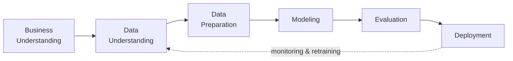
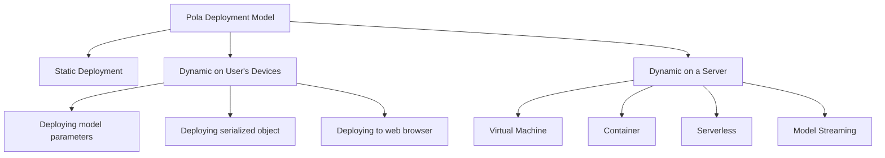
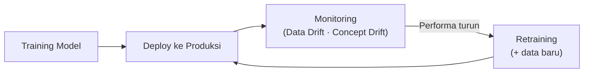

import { Accordion, Accordions } from 'fumadocs-ui/components/accordion';
import { Callout } from 'fumadocs-ui/components/callout';
import { Tab, Tabs } from 'fumadocs-ui/components/tabs';

> **Penyusun Modul & Portal:** Mahendar Dwi Payana  
> **Tim Penyusun Materi Pelatihan DTS 2021:** Suryo Adhi Wibowo, Citra Yasin Ahmad Fadhlika, & Ahmad Alfan — Thematic Academy Digital Talent Scholarship 2021  
> **Penyelenggara & Kurikulum:** Kementerian Komunikasi dan Informatika RI (Kominfo) & Sekolah Teknik Elektro dan Informatika (STEI) ITB  
> **Standar Rujukan:** Standar Kompetensi Kerja Nasional Indonesia (SKKNI) No. 299 Tahun 2020 — Skema *Associate Data Scientist*

---

## 1. Landasan Standar Kompetensi Kerja (SKKNI)

Model yang hanya tersimpan di dalam Jupyter Notebook tidak memiliki nilai bisnis. Puncak dari seluruh rangkaian pembelajaran adalah **merilis model menjadi layanan operasional** (website) yang dapat diakses banyak orang.

| Kode Unit | Elemen Kompetensi |
| :--- | :--- |
| **J.62DMI00.016.1**<br />*Membuat Rencana Deployment Model* | **1.** Melakukan strategi deployment<br />**2.** Menyusun instruksi deployment |
| **J.62DMI00.017.1**<br />*Melakukan Deployment Model* | **1.** Melakukan langkah deployment sesuai instruksi<br />**2.** Membuat laporan hasil deployment |

**Tujuan Pembelajaran:** peserta mampu mengimplementasikan model AI (Neural Network maupun Regresi) ke dalam **website sederhana**, memahami konsep & tipe deployment, strategi, instalasi environment, hingga implementasi.

**Subtopik:** Pendahuluan → Penerapan model berbasis pola → Strategi deployment → Deployment Regresi Linier → Deployment ANN.

---

## 2. Konsep Dasar Deployment Model

> **Deployment model** adalah proses membuat model AI **tersedia pada lingkungan produksi** agar dapat memberikan prediksi ke sistem perangkat lunak lain. Ini adalah **tahapan terakhir** sekaligus **paling menantang** dalam *machine learning lifecycle*.

**Mengapa penting?**

* Agar model dapat diterapkan efektif di lingkungan produksi dan melayani sistem lain.
* Untuk mengekstraksi prediksi secara andal dan membagikannya → memaksimalkan nilai model.



### A. Tantangan Implementasi

| Kategori | Tantangan |
| :--- | :--- |
| **Perangkat lunak umum** | Reliability, Reusability, Maintainability, Flexibility |
| **Spesifik Machine Learning** | **Reproducibility** |

**Hal yang perlu diperhatikan:**

1. **Koordinasi** antara Data Scientists, IT Team, Software Developer, dan profesional bisnis → memastikan model bekerja *reliable* dan mendeliver keluaran yang dimaksudkan.
2. **Perbedaan bahasa pemrograman** antara lingkungan pengembangan model dan sistem produksi → *coding ulang* memperpanjang durasi proyek dan menurunkan reproduktifitas.

---

## 3. Penerapan Model Berbasis Pola



### A. Static Deployment

Mirip deployment perangkat lunak biasa: file *binary* yang dapat diinstal, model dikemas sebagai *resources* saat runtime (`.dll` Windows, `*.so` Linux, Java, .Net).

| Keuntungan |
| :--- |
| Eksekusi cepat (akses langsung ke model) |
| Efisien waktu & privasi (data pengguna tidak diunggah ke server) |
| Model dapat dipanggil saat **offline** |
| Operasional model menjadi tanggung jawab pengguna, bukan vendor |

### B. Dynamic Deployment on User's Devices

Model **bukan** bagian dari binary aplikasi → pembaruan model tanpa memperbarui seluruh aplikasi. Tiga skenario:

| Skenario | Karakter |
| :--- | :--- |
| **Deploying model parameters** | File berisi parameter terlatih; pengguna memasang runtime (TensorFlow, Core ML, Scikit-learn, Keras, XGBoost) |
| **Deploying serialized object** | File object serial yang di-*deserialize* aplikasi; tanpa runtime di perangkat, tapi update berat bila pengguna jutaan |
| **Deploying to web browser** | Model dilatih di Python, dideploy & berjalan di browser via JavaScript runtime (mis. TensorFlow.js, bisa memakai GPU) |

**Kelebihan:** komputasi sebagian di perangkat (cepat); infrastruktur cukup menyajikan halaman web; model mudah dianalisis pihak ketiga.  
**Kekurangan:** bandwidth meningkat (browser); update model (serial); performa susah dimonitor.

### C. Dynamic Deployment on a Server

Model ditempatkan di server, diakses melalui **REST API** atau **gRPC**:

| Bentuk | Ringkasan | Catatan |
| :--- | :--- | :--- |
| **Virtual Machine (VM)** | Prediksi sebagai respons HTTP; VM berjalan paralel; REST API via Flask/FastAPI; TensorFlow Serving (gRPC) | Sederhana secara konseptual; tapi perlu pemeliharaan server, latensi jaringan, biaya relatif tinggi |
| **Container** | Runtime terisolasi (filesystem, CPU, memori) namun berbagi OS; Docker; orkestrasi Kubernetes/AWS Fargate/GKE | Hemat resource & fleksibel; dianggap kompleks butuh ahli |
| **Serverless** | Arsip ZIP berisi model + feature extractor + scoring code diunggah ke cloud (AWS Lambda, GCP, Azure Functions) | Tanpa server/VM, scalable, bayar per komputasi; limit waktu eksekusi, ukuran ZIP, RAM, tanpa GPU |
| **Model Streaming** | Kebalikan REST API; model & code didaftarkan ke *Stream Processing Engine* (Apache Storm/Spark/Flink/Samza/Kafka Streams) | REST: request satu-per-satu sinkronus; Streaming: koneksi terbuka & update event |

### D. AI Infrastructure & Platform

Penyedia infrastruktur AI antara lain: **NVIDIA**, **Huawei** (full-stack AI), **Google AI Platform**, dan **Microsoft AI services & tools**.

---

## 4. Deployment Strategy

| Strategi | Cara Kerja | Kelebihan | Kekurangan |
| :--- | :--- | :--- | :--- |
| **Single Deployment** | Model diserialkan; file lama diganti file baru (termasuk ekstraktor fitur bila perlu) | Sederhana | Jika ada bug, **semua** pengguna terdampak |
| **Silent Deployment** | Versi model **baru & lama dijalankan paralel** | Waktu cukup untuk validasi model baru | Menghabiskan banyak resource (dua model bersamaan) |
| **Canary Deployment** | Versi baru didorong ke **sebagian kecil** pengguna; mayoritas tetap versi lama | Validasi model & efek prediksi tanpa memengaruhi banyak user | Lebih rumit & kompleks |

**Contoh Single Deployment:**

* *Cloud*: siapkan VM/container baru → replace image lama → autoscaler memulai yang baru.
* *Server*: upload file model baru → replace yang lama → restart web service.

### Reproducibility

> **Reproducibility** adalah kemampuan **menduplikasi model secara tepat**, sehingga input yang sama menghasilkan output yang sama. Ini merupakan akuntabilitas bisnis untuk mempercayai penerapan ML.

**Tantangan:** fitur tidak tersedia di *live environment*; perbedaan bahasa pemrograman; perbedaan perangkat lunak; kondisi riil tidak cocok dengan kondisi training.

**Solusi:**

* Versi perangkat lunak sama persis + cantumkan semua dependensi library pihak ketiga beserta versinya.
* Gunakan **container** dan perangkat lunak pelacak spesifikasi.
* Research, develop, dan deploy dengan **bahasa yang sama** (mis. Python).
* Pahami cara model diintegrasikan dengan sistem lain **sebelum** membangun model.

---

## 5. Menyimpan Model (Serialization)

```python
# Model Keras / ANN
from keras.models import load_model
model.save('model.h5')
model = load_model('model.h5')

# Model Scikit-learn (Regresi Linier)
import pickle
pickle.dump(regressor, open('model.pkl', 'wb'))
model = pickle.load(open('model.pkl', 'rb'), encoding='bytes')
```

---

## 6. Persiapan Deployment

| Perangkat | Fungsi |
| :--- | :--- |
| **Anaconda** | Membuat *virtual environment* Python yang menampung seluruh dependency/library model |
| **Visual Studio Code (VSCode)** | Membuka source code aplikasi Python & model ML yang akan dideploy |
| **Heroku** | Platform cloud penyedia server untuk deployment (mendukung Python, Java, Node.js, dsb.) |

**Alur singkat Anaconda:**

```bash
conda create --name deploy-model-linreg python=3.9
conda activate deploy-model-linreg
pip install -r requirements.txt
```

**Alur singkat Heroku CLI:**

```bash
heroku login
git init
heroku git:remote -a deploy-model-linreg
git add .
git commit -am "deployment pertama"
git push heroku master
```

---

## 7. Deployment Model Regresi Linier (Flask)

**Struktur proyek:**

```text
├── templates/
│   └── index.html        # Template website (form input + hasil prediksi)
├── app.py                # Konfigurasi route API Flask
├── model.pkl             # Model Regresi Linier terlatih
├── Procfile              # Konfigurasi Dyno formation Heroku
└── requirements.txt      # Daftar dependency Python
```

### A. `app.py` — Route API

```python
from flask import Flask, request, render_template
import pickle

app = Flask(__name__)

# Memuat model Regresi Linier yang tersimpan (pickle)
model_file = open('model.pkl', 'rb')
model = pickle.load(model_file, encoding='bytes')

@app.route('/')
def index():
    # Kirim insurance_cost=0 saat halaman pertama dibuka
    return render_template('index.html', insurance_cost=0)

@app.route('/predict', methods=['POST'])
def predict():
    # Ambil nilai dari form: usia, jenis kelamin, status perokok
    age, sex, smoker = [x for x in request.form.values()]

    data = [int(age)]
    # One-hot encoding jenis kelamin: [Perempuan, Laki-laki]
    data.extend([0, 1] if sex == 'Laki-laki' else [1, 0])
    # One-hot encoding perokok: [Tidak, Ya]
    data.extend([0, 1] if smoker == 'Ya' else [1, 0])

    prediction = model.predict([data])
    output = round(prediction[0], 2)
    return render_template('index.html', insurance_cost=output,
                           age=age, sex=sex, smoker=smoker)

if __name__ == '__main__':
    app.run(debug=True)
```

### B. `index.html` — Template (potongan penting)

```html
<!-- action memanggil endpoint /predict dengan method POST -->
<form action="{{ url_for('predict') }}" method="post" class="flex flex-col">
  <input type="text" name="Usia" placeholder="Usia" required />

  <select name="Jenis Kelamin">
    <option value="Laki-laki">Laki-laki</option>
    <option value="Perempuan">Perempuan</option>
  </select>

  <select name="Perokok">
    <option value="Ya">Ya</option>
    <option value="Tidak">Tidak</option>
  </select>

  <button type="submit">PREDIKSI SEKARANG</button>
</form>

<!-- Menampilkan hasil prediksi dari variabel insurance_cost -->
<h2>USD {{ insurance_cost }}</h2>
```

### C. Menjalankan & Deploy

```bash
# 1. Jalankan server lokal
python app.py
# -> http://localhost:5000/ atau http://127.0.0.1:5000/

# 2. Hentikan server
# Ctrl + C

# 3. Deploy ke Heroku (lihat perintah Heroku CLI di §6)
```

> **Tugas Harian Modul 16:** (1) jalankan local server di `http://127.0.0.1:5000`, (2) deploy App ke Heroku.

---

## 8. Deployment Model ANN (Cat vs Dog)

Prosedurnya sama dengan Regresi Linier; yang berbeda hanya struktur direktori dan kode program.

**Struktur proyek:**

```text
├── static/
│   └── uploads/          # Gambar yang diunggah untuk diprediksi
├── templates/
│   └── index.html
├── app.py
├── model.h5              # Model ANN Image Classification terlatih
├── Procfile
└── requirements.txt
```

```python
from flask import Flask, render_template, request, send_from_directory
from tensorflow.keras.models import load_model
from tensorflow.keras.preprocessing.image import img_to_array, load_img
from tensorflow import expand_dims
import numpy as np, os

app = Flask(__name__)
app.config['UPLOAD_FOLDER'] = './static/uploads/'
model = load_model('model.h5')
class_dict = {0: 'Cat (Kucing)', 1: 'Dog (Anjing)'}

def predict_label(img_path):
    loaded_img = load_img(img_path, target_size=(256, 256))
    img_array = img_to_array(loaded_img) / 255.0          # Normalisasi piksel
    img_array = expand_dims(img_array, 0)                 # (1, 256, 256, 3)
    predicted_bit = np.round(model.predict(img_array)[0][0]).astype('int')
    return class_dict[predicted_bit]

@app.route('/', methods=['GET', 'POST'])
def index():
    if request.method == 'POST':
        if request.files:
            image = request.files['image']
            img_path = os.path.join(app.config['UPLOAD_FOLDER'], image.filename)
            image.save(img_path)
            prediction = predict_label(img_path)
            return render_template('index.html', uploaded_image=image.filename,
                                   prediction=prediction)
    return render_template('index.html')

@app.route('/display/<filename>')
def send_uploaded_image(filename=''):
    return send_from_directory(app.config['UPLOAD_FOLDER'], filename)

if __name__ == '__main__':
    app.run(debug=True)
```

> **Perbedaan dari Regresi Linier:** input berupa **gambar** (bukan teks), model `.h5` (Keras) bukan `.pkl`, dan ada endpoint `/display/<filename>` untuk menampilkan gambar terunggah.

---

## 9. Alternatif Modern: FastAPI + Streamlit

Selain Flask + Heroku, praktik industri saat ini sering memakai **FastAPI** (backend) dan **Streamlit** (UI) dengan format model **joblib/ONNX**.

### A. Serialisasi Modern

```python
import joblib

# Menyimpan pipeline (cepat & teroptimasi untuk larik NumPy besar)
joblib.dump(best_pipeline, "model_pipeline.joblib", compress=3)

# Memuat di server
loaded_model = joblib.load("model_pipeline.joblib")
```

* **`joblib`**: andal untuk model Scikit-learn.
* **`ONNX`**: format universal independen bahasa (latih di PyTorch/Python, inferensi di C++/Go/JS).

### B. REST API FastAPI

```python
from fastapi import FastAPI, HTTPException
from pydantic import BaseModel, Field
import joblib, numpy as np

app = FastAPI(title="Layanan Inferensi AI Produksi", version="1.0.0")

class PredictionInput(BaseModel):
    usia: int = Field(..., ge=18, le=100)
    pendapatan: float = Field(..., gt=0)
    skor_kredit: float = Field(..., ge=300, le=850)

@app.get("/")
def health_check():
    return {"status": "Sehat", "layanan": "Aktif"}

@app.post("/predict")
def predict(input_data: PredictionInput):
    try:
        features = np.array([[input_data.usia, input_data.pendapatan, input_data.skor_kredit]])
        prob = float(loaded_model.predict_proba(features)[0, 1])
        return {"status": "DISETUJUI" if prob >= 0.5 else "DITOLAK",
                "probabilitas": round(prob, 4)}
    except Exception as e:
        raise HTTPException(status_code=500, detail=str(e))
```

### C. Antarmuka Streamlit

```python
import streamlit as st, requests

st.set_page_config(page_title="AI Dashboard", layout="centered")
st.title("Portal Prediksi Cerdas")

with st.form("form_prediksi"):
    usia = st.slider("Usia Pelanggan", 18, 80, 30)
    pendapatan = st.number_input("Pendapatan Bulanan (Rp)", min_value=1_000_000,
                                 value=10_000_000, step=500_000)
    skor_kredit = st.slider("Skor Kredit", 300, 850, 700)
    submit_btn = st.form_submit_button("Evaluasi Kelayakan")

if submit_btn:
    res = requests.post("http://localhost:8000/predict",
                        json={"usia": usia, "pendapatan": pendapatan, "skor_kredit": skor_kredit},
                        timeout=5).json()
    st.write(res)
```

---

## 10. Fondasi MLOps: Pemantauan Drift Model

Setelah dirilis ke produksi, model mengalami **degradasi kinerja alami** seiring waktu:

* **Data Drift**: distribusi fitur masukan berubah ($P(X) \neq P_{\text{latih}}(X)$). Contoh: inflasi nilai mata uang.
* **Concept Drift**: relasi masukan–label berubah ($P(Y \mid X) \neq P_{\text{latih}}(Y \mid X)$). Contoh: pola belanja berubah pasca pandemi.



Praktisi wajib menyiapkan prosedur **audit berkala** dan pipeline **retraining otomatis**.

---

## 11. Lembar Evaluasi & Tugas Praktikum Mandiri

<Accordions>
  <Accordion title="Tugas 1: Deployment Model Regresi Linier (Tugas Resmi Modul 16)">
    Ikuti langkah modul untuk men-deploy **model Regresi Linier** (prediksi biaya asuransi) berbasis **Flask**. Siapkan virtual environment Anaconda, jalankan **local server** di `http://127.0.0.1:5000`, lalu deploy ke **Heroku**. Sertakan screenshot hasil prediksi lokal dan URL aplikasi Heroku!
  </Accordion>

  <Accordion title="Tugas 2: Deployment Model ANN Image Classification">
    Deploy model **ANN klasifikasi gambar kucing/anjing** (Cat vs Dog) berbasis Flask dengan model Keras `.h5`. Perhatikan penanganan upload gambar, normalisasi piksel ($\times 1/255$), dan endpoint `/display/<filename>`. Uji dengan beberapa gambar berbeda dan laporkan akurasinya!
  </Accordion>

  <Accordion title="Tugas 3: Desain Rencana Deployment (SKKNI J.62DMI00.016.1)">
    Untuk proyek akhir (Capstone) Anda, susun **rencana deployment** yang memuat: (1) pilihan pola deployment (static/dynamic on-device/on-server) beserta justifikasinya, (2) strategi deployment (Single/Silent/Canary), (3) kebutuhan resource & estimasi latensi, (4) daftar dependency & penanganan reproducibility, dan (5) instruksi deployment langkah demi langkah. Dokumentasikan sesuai SKKNI!
  </Accordion>

  <Accordion title="Tugas 4: Perbandingan Flask vs FastAPI">
    Bangun endpoint prediksi yang sama menggunakan **Flask** dan **FastAPI**. Bandingkan: kecepatan respons (benchmark sederhana), kemudahan validasi input, dokumentasi otomatis (Swagger), dan kemudahan deployment. Simpulkan kapan sebaiknya memilih masing-masing framework!
  </Accordion>

  <Accordion title="Tugas 5: Simulasi Monitoring Model Drift">
    Bangun model klasifikasi, lalu simulasikan **data drift** dengan menggeser/merubah distribusi fitur pada data baru. Amati penurunan metrik (akurasi/F1). Usulkan ambang batas kapan retraining perlu dilakukan dan rancang alur retraining otomatisnya!
  </Accordion>
</Accordions>

---

## 12. Referensi Pustaka & Tautan Resmi

1. **Suryo Adhi Wibowo, Citra Yasin Ahmad Fadhlika, & Ahmad Alfan** (2021). *Modul Melakukan Deployment Model*. Thematic Academy Digital Talent Scholarship 2021, Kementerian Komunikasi dan Informatika RI.
2. **Kementerian Ketenagakerjaan RI** (2020). *SKKNI No. 299 Tahun 2020 Bidang Artificial Intelligence Subbidang Data Science* (Unit `J.62DMI00.016.1` Membuat Rencana Deployment Model & `J.62DMI00.017.1` Melakukan Deployment Model).
3. **Andriy Burkov** (2020). *Machine Learning Engineering*. True Positive Inc.
4. **Martin Fowler** (2016). *Continuous Delivery for Machine Learning (CD4ML)*. ThoughtWorks.
5. **Google Developers**. *MLOps: Continuous Delivery and Automation Pipelines in Machine Learning*. [developers.google.com](https://developers.google.com/machine-learning/crash-course/production-ml-systems).
6. **Heroku Dev Center**. *Deploying Python Applications*. [devcenter.heroku.com](https://devcenter.heroku.com/).
7. **FastAPI Documentation**. [fastapi.tiangolo.com](https://fastapi.tiangolo.com/).
8. **Streamlit Documentation**. [docs.streamlit.io](https://docs.streamlit.io/).
