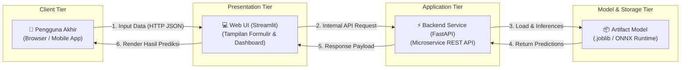

> **Penyusun Modul:** Mahendar Dwi Payana  
> **Acuan Silabus:** DTS Kominfo - STEI ITB (Ir. Windy Gambetta, MBA) & SKKNI No. 299 Tahun 2020

---

## 1. Landasan Standar Kompetensi Kerja (SKKNI)

Model yang hanya tersimpan di dalam Jupyter Notebook tidak memiliki nilai bisnis. Puncak dari seluruh rangkaian pembelajaran adalah merilis model menjadi layanan operasional:
1. **J.62DMI00.016.1**: Membuat Rencana Deployment Model
2. **J.62DMI00.017.1**: Melakukan Deployment Model

---

## 2. Membuat Rencana Deployment Model (`J.62DMI00.016.1`)

Sebelum mengunggah kode ke server, susun cetak biru arsitektur (*Architecture Blueprint*) yang mencakup:



### Pertimbangan Kunci Rencana Deployment:
- **Pola Prediksi**:
  - *Real-time Streaming*: Prediksi instan via REST/gRPC API per transaksi (`< 100` ms).
  - *Batch Scoring*: Prediksi terjadwal (cron job) setiap malam untuk jutaan nasabah.
- **Kapasitas & Latensi**: Menentukan batas ambang Service Level Agreement (SLA).
- **Target Lingkungan**: Cloud Serverless (GCP Cloud Run, AWS Lambda), VM Cloud, atau Hugging Face Spaces.

---

## 3. Serialisasi Model Pembelajaran Mesin

Proses pembekuan struktur model dan parameter bobot terlatih ke dalam berkas biner:
- **`joblib`**: Sangat cepat dan teroptimasi untuk model Scikit-learn yang memuat larik NumPy berukuran besar.
- **`ONNX` (Open Neural Network Exchange)**: Format universal independen bahasa yang memungkinkan model dilatih di PyTorch/Python namun di-inferensikan di C++, Go, atau JavaScript.

```python
import joblib

# Menyimpan model
joblib.dump(best_pipeline, "model_pipeline.joblib", compress=3)

# Memuat model di lingkungan server
loaded_model = joblib.load("model_pipeline.joblib")
```

---

## 4. Implementasi Python: Membangun REST API Menggunakan FastAPI

FastAPI merupakan kerangka kerja mikro modern berkecepatan tinggi dengan validasi tipe data otomatis berbasis **Pydantic**:

```python
"""
Layanan REST API Inferensi Machine Learning dengan FastAPI
Disusun oleh: Mahendar Dwi Payana
"""

from fastapi import FastAPI, HTTPException
from pydantic import BaseModel, Field
import joblib
import numpy as np

# Inisialisasi aplikasi FastAPI
app = FastAPI(
    title="Layanan Inferensi AI Produksi",
    description="API Prediksi Cerdas oleh Mahendar Dwi Payana",
    version="1.0.0"
)

# Definisi skema data masukan dengan validasi ketat
class PredictionInput(BaseModel):
    usia: int = Field(..., ge=18, le=100, description="Usia pelanggan dalam tahun")
    pendapatan: float = Field(..., gt=0, description="Pendapatan bulanan dalam Rupiah")
    skor_kredit: float = Field(..., ge=300, le=850, description="Skor riwayat kredit")

class PredictionResponse(BaseModel):
    status_persetujuan: str
    probabilitas: float
    pesan: str

# Memuat model saat inisialisasi server
@app.on_event("startup")
def load_artifacts():
    global model
    # Simulasi dummy pipeline
    from sklearn.ensemble import RandomForestClassifier
    model = RandomForestClassifier()
    # Dummy fitting agar model siap
    model.fit(np.array([[25, 5e6, 650], [50, 20e6, 750]]), np.array([0, 1]))

@app.get("/")
def health_check():
    return {"status": "Sehat", "layanan": "Aktif", "pemilik": "Mahendar Dwi Payana"}

@app.post("/predict", response_model=PredictionResponse)
def predict(input_data: PredictionInput):
    try:
        features = np.array([[input_data.usia, input_data.pendapatan, input_data.skor_kredit]])
        prob = float(model.predict_proba(features)[0, 1])
        decision = "DISETUJUI" if prob >= 0.5 else "DITOLAK"
        
        return PredictionResponse(
            status_persetujuan=decision,
            probabilitas=round(prob, 4),
            pesan="Analisis risiko kredit selesai dievaluasi."
        )
    except Exception as e:
        raise HTTPException(status_code=500, detail=str(e))
```

---

## 5. Antarmuka Web Interaktif dengan Streamlit

File `app_ui.py`:
```python
import streamlit as st
import requests

st.set_page_config(page_title="AI Dashboard", page_icon="🤖", layout="centered")

st.title("🤖 Portal Prediksi Cerdas")
st.caption("Aplikasi Web Operasional AI oleh Mahendar Dwi Payana")

with st.form("form_prediksi"):
    usia = st.slider("Usia Pelanggan", 18, 80, 30)
    pendapatan = st.number_input("Pendapatan Bulanan (Rp)", min_value=1_000_000, value=10_000_000, step=500_000)
    skor_kredit = st.slider("Skor Kredit", 300, 850, 700)
    
    submit_btn = st.form_submit_button("Evaluasi Kelayakan")

if submit_btn:
    payload = {"usia": usia, "pendapatan": pendapatan, "skor_kredit": skor_kredit}
    try:
        res = requests.post("http://localhost:8000/predict", json=payload, timeout=5)
        hasil = res.json()
        
        if hasil["status_persetujuan"] == "DISETUJUI":
            st.success(f"Hasil: **{hasil['status_persetujuan']}** (Keyakinan: {hasil['probabilitas']*100:.1f}%)")
        else:
            st.error(f"Hasil: **{hasil['status_persetujuan']}** (Keyakinan: {hasil['probabilitas']*100:.1f}%)")
        st.info(hasil["pesan"])
    except Exception as err:
        st.warning("Gagal terhubung ke API backend lokal.")
```

---

## 6. Fondasi MLOps: Pemantauan Drift Model (Model Drift Monitoring)

Setelah dirilis ke produksi, model akan mengalami degradasi kinerja alami seiring berjalannya waktu:
- **Data Drift**: Distribusi fitur masukan berubah (`P(X) \neq P_{\text{latih}}(X)`). Contoh: Nilai mata uang mengalami inflasi drastis.
- **Concept Drift**: Relasi antara masukan dan label berubah (`P(Y|X) \neq P_{\text{latih}}(Y|X)`). Contoh: Pola belanja masyarakat berubah total pasca masa pandemi.

Praktisi wajib menyiapkan prosedur audit bulanan dan pipeline *retraining* otomatis.
